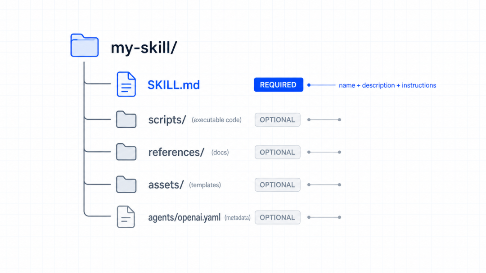
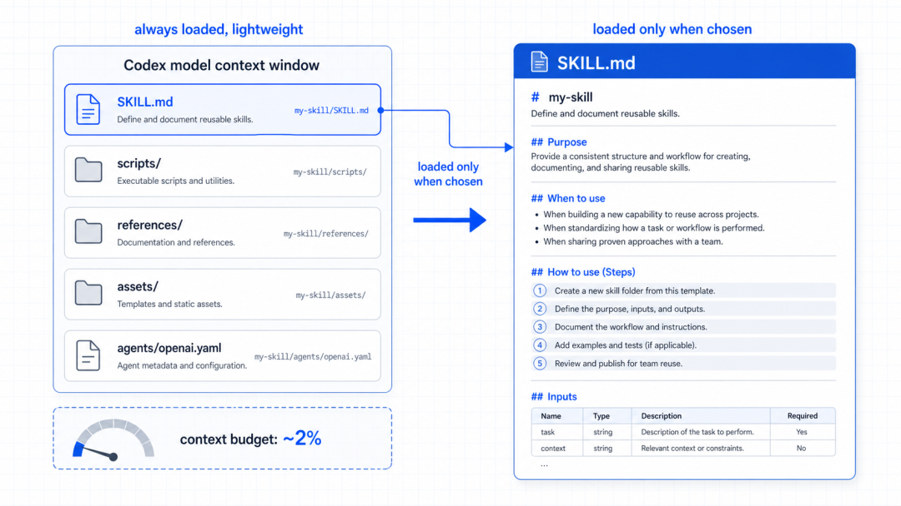
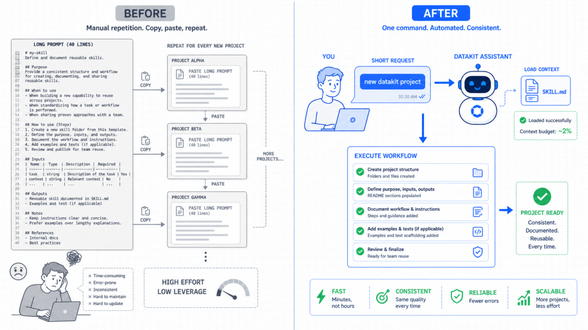

# 给 Codex 写一个专属 Skill：从重复提示词到可复用工作流

用 Codex 久了，发现自己攒了一堆万能咒语。

比如每次让它建新 Python 项目，都得复制粘贴同一大段话，用 uv 管理依赖、目录按 src 布局、必须配 ruff 和 pytest、README
要带徽章……

几十行，存在备忘录里，每次开新项目翻出来贴一遍，改需求了还得回去改那段话。

时间一长，这些咒语散落在各种地方，自己都记不清最新版在哪。

后来才知道，这件事 Codex 官方早有正规解法，叫  ** Skill  ** 。

把这套流程写成一个文件，Codex 就永久记住了，之后不用再贴那一长串，一句帮我建个新项目它就照着自己定的规范来。

更妙的是它的加载方式，Codex 平时不会把所有 Skill 的完整内容都塞进上下文，它只记住每个 Skill 的名字和一句描述，  ** 只有真要用到某个
Skill 时，才去读它的完整内容  ** ，所以你哪怕写了几十个 Skill，也不占用平时的对话空间。

这篇就手把手带你写一个自己的 Skill，从最简单的纯文字版，到进阶带脚本的版本。跟着敲，十分钟你就有了第一个专属技能。

##  Skill 到底是什么

一句话：  ** Skill 就是一个文件夹，里面放一份告诉 Codex遇到某类活该怎么干的说明书。  **

这个文件夹里，唯一必须有的东西是一个叫  ` SKILL.md  ` 的文件。

它开头有一小段元数据（名字和描述），下面是给 Codex 看的具体步骤。

就这么简单，一个纯文字的  ` SKILL.md  ` 就是一个能用的 Skill 了。

如果需求复杂点，文件夹里还可以放这些可选的东西：

•  ` scripts/  ` ：可执行脚本，需要确定性结果时用（比如一段必须精确执行的构建逻辑）

•  ` references/  ` ：参考文档，给 Codex 补充背景知识

•  ` assets/  ` ：模板、资源文件，比如项目脚手架的模板

但记住，这些都是可选的。

官方也建议：  ** 能用文字说清楚的，就别写脚本  ** ，只有当你需要精确、可重复的行为，或者要调外部工具时，才上脚本。

##  先搞清楚它放在哪、怎么被触发

在动手前，得先明白两件事，不然写完了不知道 Codex 能不能找到、会不会用。

** 第一，放哪。  ** Codex 会从几个位置扫描 Skill，最常用的是这两个：

•  ** 项目级  ** ：放在项目里的  ` .agents/skills/  ` 目录下。适合团队协作，把 Skill 提交进 Git，所有人
clone 下来就都有了。

•  ** 用户级  ** ：放在你个人目录的  ` ~/.agents/skills/  ` 下。适合自己的通用技能，不管在哪个项目都能用。

这篇的例子放用户级，因为建新项目这种事跟具体某个仓库无关。

** 第二，怎么触发。  ** 有两种方式：

•  ** 显式调用  ** ：在对话里用  ` $技能名  ` 直接点名，或者输入  ` /skills  ` 从列表里选，想精确控制用哪个时用这个。

•  ** 隐式调用  ** ：正常描述任务，Codex 发现内容跟某个 Skill 的描述对上了，自动就用了。

这里藏着一个关键点，  ** 隐式触发全靠写的那句  ` description  ` 。  ** 描述写得准，Codex 才知道什么时候该拿出这个技能。

所以描述里要把什么时候用、什么时候不用讲清楚，并且把关键触发词放前面。

##  写第一个 Skill

做一个真实例子：一个按我的规范新建 Python 项目的 Skill。

** 第一步，建目录。  **

    mkdir -p ~/.agents/skills/new-python-project  
    

** 第二步，在里面建一个  ` SKILL.md  ` ，内容如下：  **

    ---  
    name: new-python-project  
    description: 当用户要新建、初始化一个 Python 项目或搭项目脚手架时使用。按团队规范生成目录结构、依赖管理和基础配置。不用于给已有项目加功能。  
    ---  
      
    按以下规范初始化一个新的 Python 项目：  
      
    1. 用 `uv` 初始化项目，不要用 pip + venv。  
    2. 采用 src 布局：源码放在 `src/包名/` 下。  
    3. 必备开发依赖：`ruff`（lint + format）、`pytest`（测试）。  
    4. 生成 `pyproject.toml`，配置好 ruff 和 pytest 的基础规则。  
    5. 建一个 `tests/` 目录，放一个能通过的占位测试。  
    6. 生成 `README.md`，包含项目名、安装步骤、运行测试的命令。  
    7. 建好后运行一次 `uv run pytest` 确认能跑通，把结果告诉我。  
    

注意看那段元数据里的  ` description  `
，特意写清了什么时候用（新建/初始化项目）和什么时候不用（不用于给已有项目加功能），这就是让隐式触发准确的关键。

** 第三步，就没了。  ** Codex 会自动检测到新 Skill，如果它没出现，重启一下 Codex 就行。

##  试一下效果

现在打开 Codex，随便找个空目录，直接说一句大白话：

> 帮我在这里新建一个叫 datakit 的 Python 项目

因为这句话正好撞上了 Skill 描述里的新建 Python 项目，Codex 会自动加载  ` new-python-project  ` 这个
Skill，然后严格按写的七步来：用 uv 初始化、建 src 布局、配好 ruff 和 pytest、写 README、最后跑一遍测试给你看。

也可以不靠它自己猜，直接显式点名：

> $new-python-project 项目名叫 datakit

效果一样，只是更精确，整个过程一个字的规范都没重复写，全在那份  ` SKILL.md  ` 里了。

以后规范变了，改那一个文件就行，不用再翻备忘录。

##  什么时候该加脚本

上面的纯文字 Skill 已经能覆盖大多数场景了，但有些活，需要它每次都分毫不差地执行，这时候就轮到  ` scripts/  ` 上场。

举个例子。假设建项目这步里，有一段生成配置文件的逻辑，希望它完全固定、不受模型自由发挥影响，可以把这段逻辑写成脚本：

    mkdir -p ~/.agents/skills/new-python-project/scripts  
    

在  ` scripts/  ` 里放一个  ` init_config.py  ` （或 shell 脚本），把那段确定性的逻辑固化进去。然后在  `
SKILL.md  ` 里，把对应那步改成「运行  ` scripts/init_config.py  ` 生成配置」。

判断标准很简单：

•  ** 步骤描述清楚、允许模型灵活处理  ** → 用文字就够了。

•  ** 必须精确、可重复，或要调外部工具  ** → 写成脚本。

别一上来就写脚本。文字版好维护、好读、改起来快，脚本是给非它不可的场景准备的。

##  几个让 Skill 更好用的习惯

** 一个 Skill 只干一件事。  ** 别把建项目 + 发布 + 写文档塞进一个 Skill，拆成三个，职责单一，Codex 才好精准匹配。

** 描述里带上触发词。  ** 因为 Codex 装了很多 Skill
时，会自动把描述缩短显示，所以要把最关键的使用场景和触发词放在描述开头，缩短了也不影响匹配。

** 用祈使句写步骤，输入输出写明确。  ** 生成 pyproject.toml，包含 ruff 配置比处理一下配置强得多，你写得越具体，它执行得越稳。

** 写完拿几种说法测一下。  ** 用不同的大白话去触发，确认该出现的时候出现、不该出现的时候不乱触发，再微调描述。

##  写在最后

Skill 这东西，本质是把你脑子里那套这活儿该怎么干的经验，从一次性的口头指令，变成了一份可以反复调用、持续迭代的资产。

以前我们用 AI，靠的是当场把要求讲清楚，讲一次用一次。有了
Skill，你讲清楚一次，它就永久记住，而且团队里每个人都能共享同一套标准。这中间的差别，用久了会越来越明显——会写 Skill
的人，等于给自己配了一队随叫随到、还从不忘事的专属助手。

今天这个「新建 Python 项目」只是最基础的例子。你完全可以照着这个套路，把自己天天重复的活——生成周报、按规范提
PR、跑固定的检查流程——一个个都教给 Codex。写第一个的时候花十分钟，之后每次都省十分钟。

延伸阅读：

•  Codex Skills 官方文档：https://developers.openai.com/codex/skills

•  开放 Agent Skills 标准：https://agentskills.io

* * *
