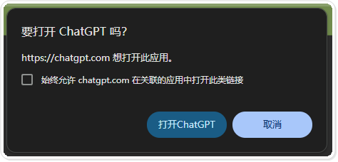
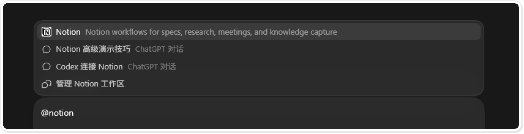
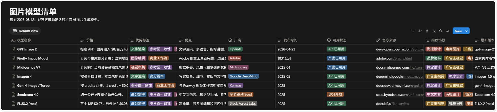

# 在 Codex 中连接 Notion：把调研结果写入数据库

这篇教程适合已经能在 Codex 桌面端创建任务，并希望把调研结果直接整理到 Notion 的读者。完成后，你会连接 Notion 插件、验证页面读取权限，并把一组结构化资料写入两个数据库。

示例只使用测试工作区。不要用客户资料、内部知识库或个人页面做第一次连接测试。

## 本教程环境

以下环境核验于 2026 年 8 月 13 日。Notion 插件运行在 Codex 桌面端的 Plugins 界面中，不要求通过 IDE 或 Codex CLI 操作。

| 项目 | 本教程使用版本 | 获取方式 | 备注 |
|---|---|---|---|
| 操作系统 | Windows 11 专业版 64 位，构建 `26100` | Windows 系统信息 | 本机实测环境 |
| Codex 桌面端 | `26.803.10989.0` | Windows 应用包信息 | 本教程的插件宿主 |
| Notion 插件 | 目录托管版本，界面未展示独立版本号 | Codex Plugins 目录 | 以当前插件详情为准 |
| Notion Connector | Web 托管版本，界面未展示独立版本号 | Notion 授权界面 | 可用权限受工作区设置影响 |
| Codex CLI | `0.146.1` | `codex --version` | 本教程不在 CLI 中执行 |

界面、插件入口和授权范围可能随 Codex、Notion 或工作区策略调整。操作时以当前页面为准。

## 先说结论

这套流程分成四步：安装插件、限制授权范围、用测试页面验证读取、确认字段后再写入数据库。

真正需要谨慎的是授权和写入。第一次连接时只开放测试页面；批量创建或更新内容前，先让 Codex 列出准备执行的操作。


## 1. 安装 Notion 插件

启动 Codex 桌面端，在左侧导航栏打开“插件”。如果没有这个入口，先确认当前版本和工作区支持 Plugins，再检查组织管理员是否限制了插件安装。


进入插件目录，在搜索框输入 `Notion`。核对名称和说明后点击安装。


安装过程中，Windows 可能询问是否允许网页打开 ChatGPT。确认地址和来源无误后再继续。不希望系统以后自动跳转，就不要勾选“始终允许”。



## 2. 限制 Notion 授权范围

连接窗口会列出 ChatGPT 与 Notion 之间共享的数据。先检查申请的权限，再确认选中的 Notion 工作区。

本教程没有保留工作区选择页，因为原画面包含个人空间名称。制作自己的操作记录时，也应隐藏邮箱、成员名单、内部页面名称和授权令牌。


建议新建一个只含公开示例内容的测试页面，并只把这个页面开放给连接。等读取和写入都验证完成，再根据实际任务扩大范围。

## 3. 用测试页面验证连接

新建 Codex 任务，在输入框键入 `@notion`，从候选列表中选择 Notion 插件，然后写清楚要读取的测试页面。插件必须加入当前任务，Codex 才能在这轮对话中调用它。



第一次只做只读验证。可以使用下面的任务描述：

```text
请读取 Notion 中的测试页面“Notion-Codex demo”，只返回页面标题、正文是否为空和当前可见的属性。不要创建、修改或删除任何内容。
```

本次示例返回的页面只有标题，没有正文。这说明连接已经建立，Codex 也能访问指定页面。


如果提示找不到页面，先检查页面是否属于已授权工作区、当前账号是否有访问权限，以及授权时是否选中了正确页面。不要为了绕过错误直接开放整个工作区。

## 4. 调研资料并确认字段

连接验证通过后，再提交正式调研任务。本次示例整理主流 AI 图片与视频生成模型，要求优先使用官网、官方文档、公告和定价页，并记录：

- 模型名称、厂商、发布时间和版本。
- 核心参数、可用状态和价格。
- 优点、限制、推荐场景和官方来源。
- 官网没有公开的字段标为“暂未公开”，不补猜测值。

Codex 完成检索后，先在任务中检查结构化结果，不要立刻写入 Notion。截图中的调研基准日是 2026 年 8 月 12 日；模型状态和价格变化较快，复用这套表格时需要重新核对。


检查时重点看字段是否一致、每条记录是否有来源、未知信息是否被明确标出。发现无来源的价格或参数，先删除或补证据。

## 5. 写入 Notion 数据库

确认内容后，再让 Codex 创建一个总览页，并把图片模型和视频模型分别放进两个子数据库。总览页保留调研日期、使用说明和数据库入口。


图片模型数据库使用厂商、可用状态、计费方式、优势标签、推荐场景和官方来源等字段。标签适合筛选，官方来源用于后续复核。



视频模型数据库沿用同一套字段。图片和视频分开后，各自的版本、状态和价格更容易维护。


## 如何验收

写入完成后，不要只看 Codex 的完成提示。回到 Notion 逐项检查：

1. 总览页和两个数据库位于预期的测试页面下。
2. 数据库字段名称、类型和选项一致。
3. 每条记录都有可打开的官方来源，未知字段没有被猜测值填满。
4. 没有覆盖同名页面，也没有修改授权范围之外的内容。
5. 测试结束后，Notion 连接设置中的访问范围仍符合预期。

如果结果不对，先停止后续写入。记录出错的字段或页面，再让 Codex 只修正这一小部分。

## 权限与限制

- 插件能看到什么，取决于 Notion 账号、工作区策略和授权页面范围。
- 批量写入前先要求 Codex 列出目标页面、数据库和字段，不要把确认步骤省掉。
- 价格、地区可用性和 Preview 状态会变化，资料库应保留来源与核验日期。
- 不再使用的测试连接可以撤销；测试页面应与正式知识库分开。
- 本教程只验证了页面读取、页面创建和数据库写入，没有验证团队级权限管理或大批量更新。

## 参考资料

- [Notion 官方网站](https://www.notion.com/)
- [OpenAI Codex 文档](https://developers.openai.com/codex/)
