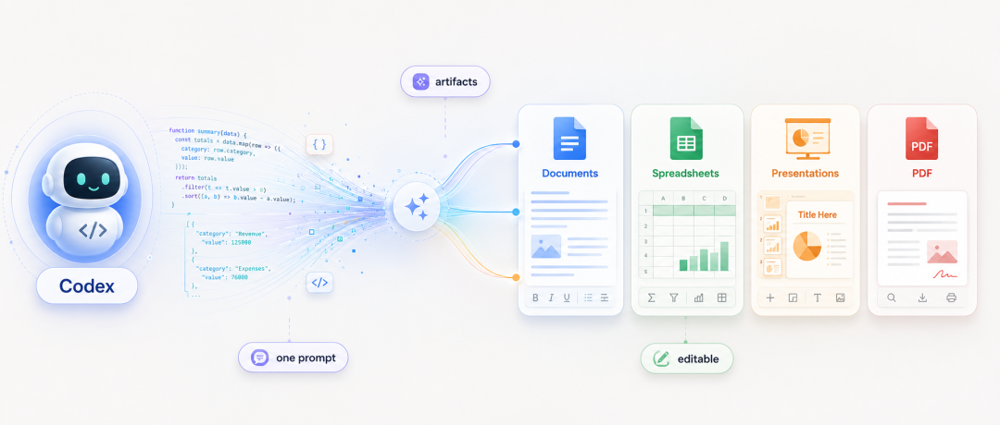
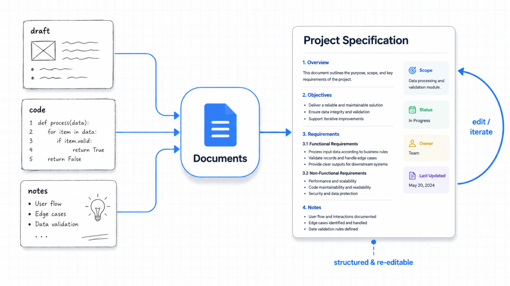
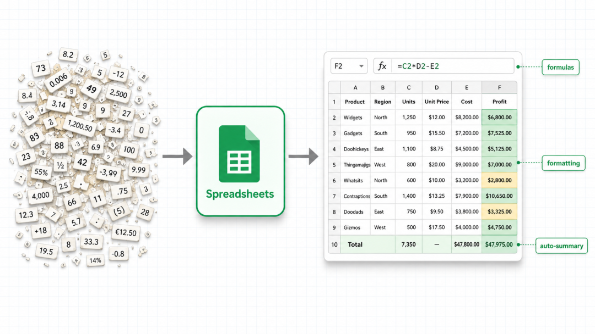
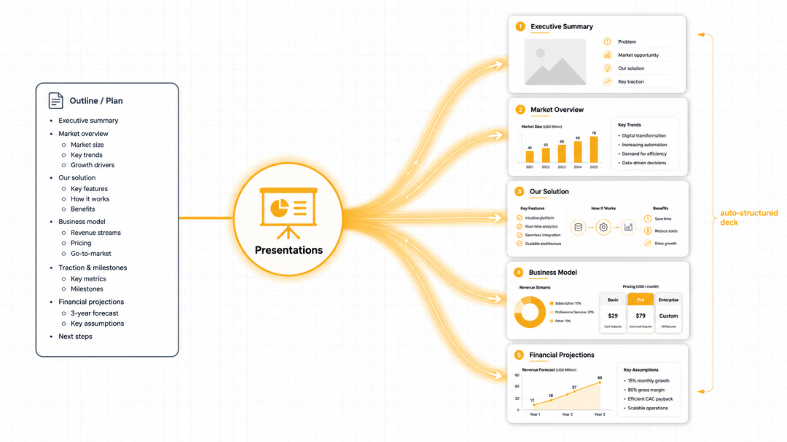
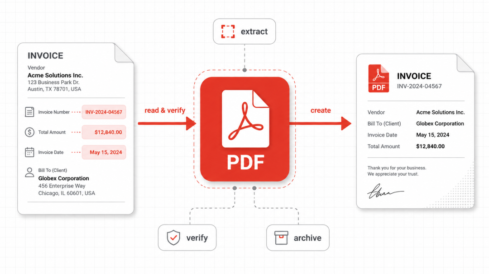
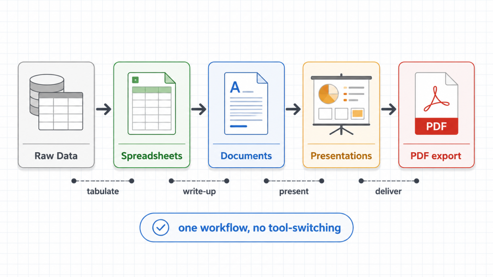

# Codex 处理文档、表格、幻灯片和 PDF 的完整工作流

> 难度 | 进阶
>
> 类型 | 插件工作流

Codex 的文档类工具可以把同一批材料整理成文档、电子表格、幻灯片和 PDF。稳定的做法是先确定事实与数据，再依次生成各类交付物，最后检查内容是否一致。



## 准备材料和验收标准

先把原始材料放进一个项目目录。代码、会议记录、CSV、品牌模板和参考文件应分开保存。涉及客户数据、合同和财务信息时，先确认当前工具的上传范围和组织策略。

给 Codex 的第一条指令应说明交付对象、事实来源和文件要求。

```text
读取 materials 目录中的项目说明、测试结果和 CSV 数据。
先列出可确认的事实、缺失信息和相互冲突的数据，不要生成交付文件。
我确认后，再制作一份技术报告、一张指标表、一套汇报幻灯片和最终 PDF。
所有数字必须能回链到原始文件。
```

## 用 Documents 整理正式文档

Documents 适合把零散材料整理成有标题层级、段落和列表的正式文档。技术方案、接口说明和事故复盘都可以从已有材料起步。



先让 Codex 生成结构，再补正文。审阅时重点看事实是否有来源，章节是否重复，命令和代码有没有被改错。文档的排版完成不等于内容已经通过验收。

## 用 Spreadsheets 整理数据

Spreadsheets 可以生成带公式和格式的工作簿。输入数据要保留原始表，计算结果放在新表中，并让 Codex 说明每个关键公式来自哪里。



检查时抽取几行手算，确认求和范围、日期格式、空值和百分比口径。图表使用的区域也要单独核对，避免新增数据后图表没有更新。

## 用 Presentations 生成汇报稿

Presentations 适合把已经确认的文档和表格改成可演示的结构。让 Codex 先列出每页要回答的问题，再生成幻灯片，能减少一页塞入太多信息的情况。



幻灯片中的数字应直接来自已核验的表格。演讲者备注可以补充上下文，页面正文只保留现场需要看到的信息。生成后逐页检查字体、裁切、对比度和图表标签。

## 用 PDF 完成固定版式交付

PDF 工具可以读取、创建和检查 PDF。导出前先确认源文档与幻灯片已经定稿，再生成固定版式文件。



PDF 验收要覆盖页数、目录、字体嵌入、链接、表格分页和图片清晰度。重要文档还应提取一次文本，与源文件对比标题、数字和关键条款。

## 串成一条交付流程

推荐顺序是原始数据、电子表格、正式文档、幻灯片、PDF。每一步只使用上一步已经确认的结果，发现数字变化时返回数据源修正，再重新生成下游文件。



可以让 Codex 在项目中保留一份交付清单。

```text
交付前检查所有产物。
核对文档、表格、幻灯片和 PDF 中的项目名称、日期、版本与核心数字。
列出每个文件的路径、页数或工作表数量，以及仍需要人工确认的项目。
不要用生成成功代替内容校验。
```

文档类能力的入口可能来自内置工具、Skill 或 Plugin，具体名称会随客户端和插件版本变化。开始任务前先让 Codex 列出当前可用工具，并在新任务中确认工具已加载。

## 参考资料

- [Codex Skills](https://developers.openai.com/codex/skills)
- [Codex Plugins](https://developers.openai.com/codex/plugins)
- [Generate slide decks](https://developers.openai.com/codex/use-cases/generate-slide-decks)
