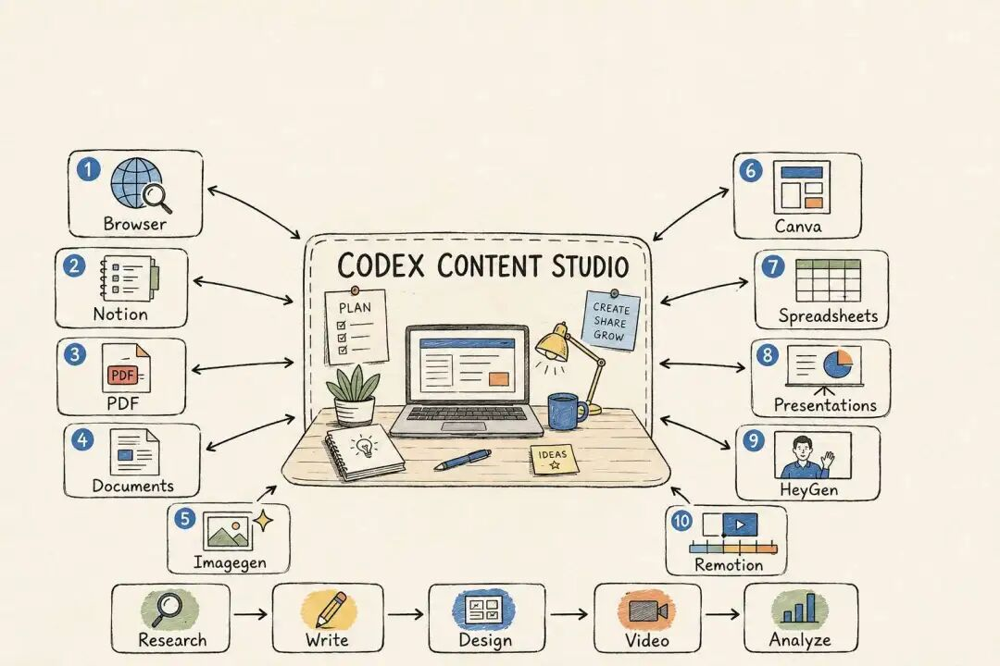
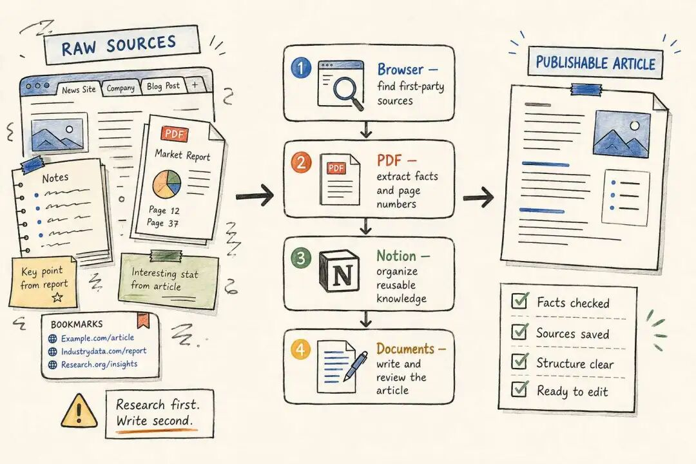
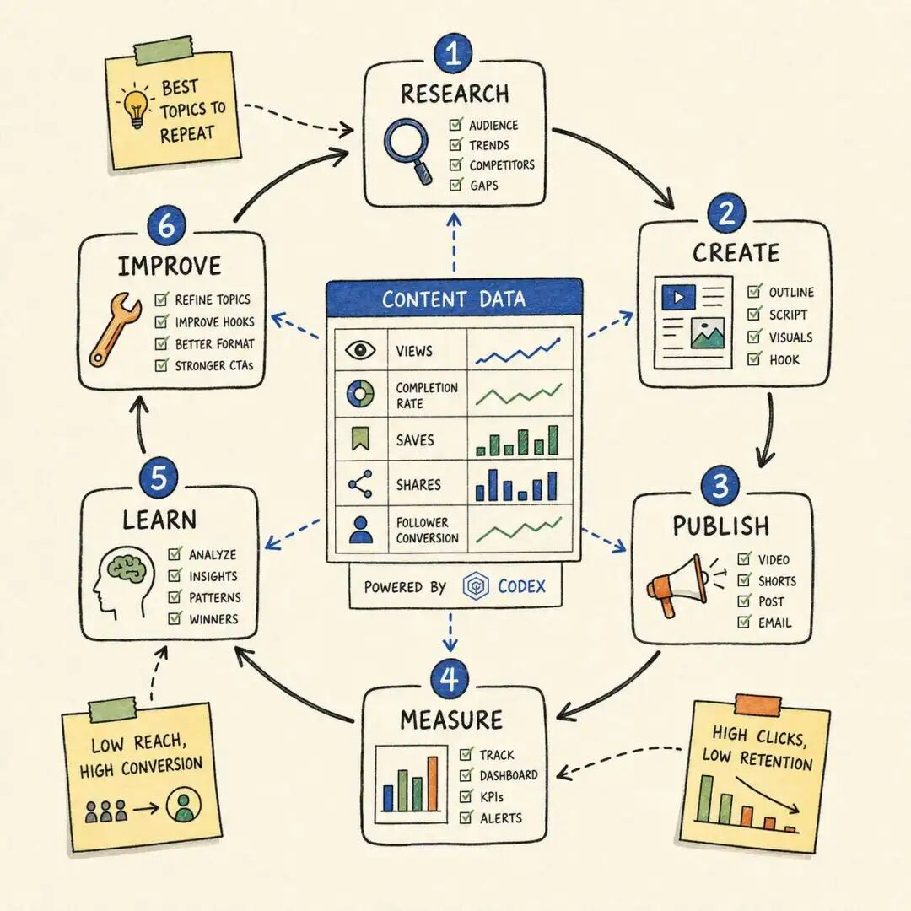
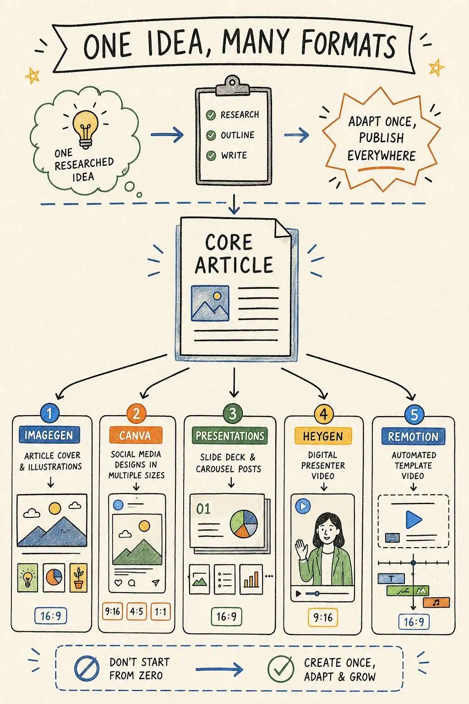
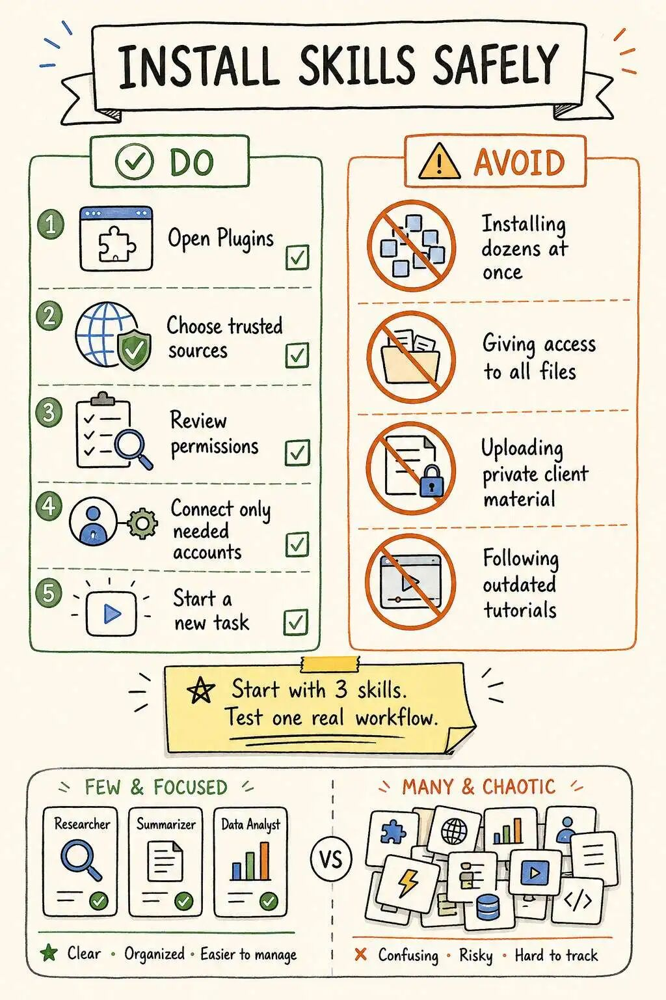

# Codex 内容生产工作流

Codex 可以把内容生产拆成一组可检查的任务。调研留下来源，写作读取事实表，配图说明用途，发布后的数据再回到下一轮选题。这样做适合需要持续更新教程、博客或社交内容的人，也适合多人协作的内容团队。

这套方法不要求一次装齐所有插件。先选出当前最耗时间的两三个环节，用一个真实选题跑通，再决定要不要增加工具。



> 概念示意，展示 Codex 可以连接的内容处理环节。

## 先建立内容工作目录

让 Codex 直接在聊天里交付整篇文章，后续很难核对来源，也不方便继续修改。可以先准备一个小型工作目录。

```text
content-project/
  brief.md
  research.md
  sources.md
  draft.md
  assets/
  review.md
```

`brief.md` 写读者、主题和交付格式。`research.md` 保存调研笔记，`sources.md` 单独记录链接、日期和引用位置。正文只写入 `draft.md`，检查结果放进 `review.md`。这几个文件足以让 Codex 知道每一步该读什么、该交付什么。


> 概念示意，同一工作台可以按任务接入少量必要能力。

## 调研阶段先收集证据

网页、PDF 和知识库适合处理不同材料。

- 浏览器用于打开官方文档和一手来源，记录页面地址与访问日期。
- PDF 工具用于提取报告中的数据、页码、统计范围和脚注。
- Notion 等知识库插件适合查询团队已经整理的选题、采访和历史结论。

可以先让 Codex 生成事实表，不要立刻写稿。

```text
调研这个选题，优先使用官方网站和一手资料。
把结果写入 research.md，并在 sources.md 记录链接、发布日期和访问日期。
每条结论标明它能证明什么，遇到冲突信息时保留双方口径。
先交付事实表，不要写正文。
```

PDF 中的数字还要附页码和口径。网页标题、产品价格、开放范围和软件版本会变化，定稿前需要重新访问来源。



> 概念示意，原始网页和报告先转成可追溯的事实，再进入写作。

## 写作阶段给清楚边界

`draft.md` 应当只使用已经整理的材料。提示词里写清正文要保留的事实、不能改动的数字、引用格式和未知部分。材料不够时，让 Codex 缩短文章或列出缺口，不要用泛泛解释补长度。

需要 Word 交付时，可以使用 Documents 类工具处理批注、修订和格式。只发布 Markdown 时，直接在项目内编辑更简单。无论使用哪种入口，都要保留一份能继续修改的源文件。

一轮修改只处理一个问题。先看事实与结构，再检查标题、段落和语气，最后检查链接、图片和格式。把所有要求塞进一次提示，容易出现局部修好、其他部分又被改坏的情况。

## 配图和内容复用分开处理

生成式图片适合概念示意和封面草案，不能充当产品界面、新闻现场或真实操作证据。涉及产品功能时，优先使用官方图片或经过脱敏的实操图。

一篇核心文章完成后，可以继续生成演示文稿、轮播图或视频脚本。每种格式都应重新安排信息密度，不能把长文原样塞进画面。



> 概念示意，发布后的数据用于修正下一轮选题和表达。



> 概念示意，核心文章可以派生其他格式，但每种格式需要单独编辑。

## 用数据做复盘

平台导出的表格可以交给 Spreadsheets 类工具检查。先处理缺失值、重复记录和异常值，再比较标题、主题、发布时间与内容形式。

不同平台的指标口径不能直接混用。阅读量、播放量、完播率和收藏率分别说明不同问题，相关性也不能写成因果。复盘结果可以更新 `brief.md`，也可以写入选题库，供下一轮调研使用。

```text
读取最近 90 天的内容数据。
先列出缺失值、重复记录和异常值，再按主题与内容形式比较。
标出高点击低留存、低点击高转化的内容，不把相关性写成因果。
把可复用结论写入 review.md。
```

## 安装插件前检查权限

Skill 是一套供 Codex 遵循的任务方法。插件还可能包含 Skills、外部应用连接和工具。安装前要查看来源、脚本、连接器与权限，并确认它会把哪些数据发送给外部服务。

未发布客户材料、账号凭据和个人隐私不应直接上传。外部账号按需连接，完成任务后也要检查是否仍需保留授权。



> 概念示意，先核对来源和权限，再用一个小任务验证。

## 跑通一次最小流程

第一次可以只使用网页调研、Markdown 编辑和表格复盘。

1. 在 `brief.md` 写清读者和交付要求。
2. 让 Codex 调研并生成 `research.md` 与 `sources.md`。
3. 核对关键来源后生成 `draft.md`。
4. 分轮检查事实、结构、语气、图片和链接。
5. 发布后导出数据，把复盘写入 `review.md`。

这条流程稳定以后，再接入知识库、文档、设计或视频工具。每增加一个连接，都要说明它解决了哪个问题，以及结果怎样验收。

## 参考资料

- [Codex Skills](https://developers.openai.com/codex/skills)
- [Codex Plugins](https://developers.openai.com/codex/plugins)
- [OpenAI Plugins 仓库](https://github.com/openai/plugins)
