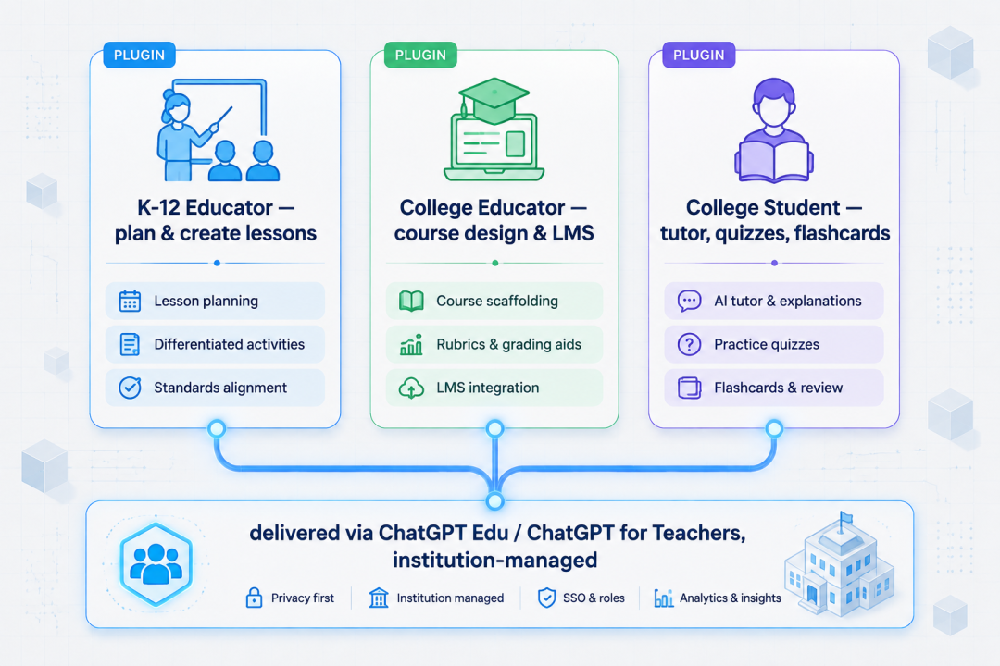
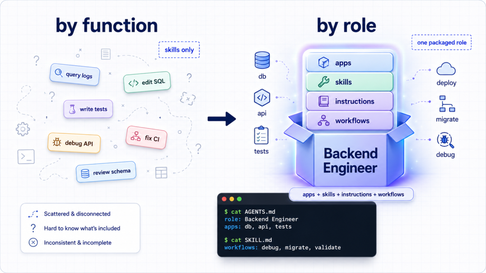
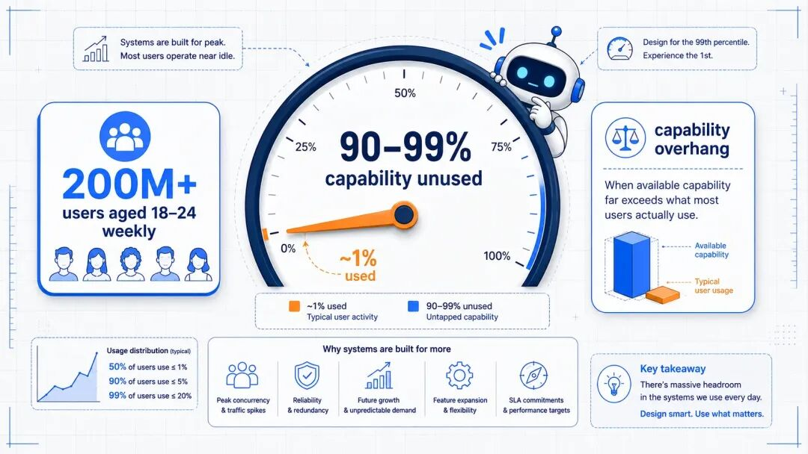

# Codex 插件入口：安装、调用与权限边界

去阅读**

** 设置星标 学习更多AI出海知识  **

这两天 OpenAI 发了三个教育插件，K–12 老师、大学老师、大学生各一个。

标题挂着教育两个字，跟天天写代码的人看着没半点关系，一开始我也想直接划过去。

但翻完公告改主意了，有两件事跟我们有关。

一是这三个插件不只在 ChatGPT Work 里，Codex 里也有了插件入口，那可是我们天天开着的东西。

二是公告中段藏了个数字，比插件本身扎人得多，OpenAI 说，就算是已经用得挺溜的年轻人，摸到的能力也比重度用户少 90% 到 99%。

OpenAI 把怎么用好 AI 这件事，从各自写 prompt，变成了装一个现成的包。

##  三个插件，各管一段活

先把三个插件是干嘛的说清楚，这部分官方讲得很具体。

K–12 教师插件，给中小学老师备课用。接进老师手头已有的材料和工具，生成分层的教学资源、做互动可视化、把学情整理成能落地的洞察。

它还接了个叫 Learning Commons 的公益组织的数据，让老师能按当地的学业标准来生成材料。但有一条写得很明白：教学决策、打分、以及 agent
具体干了什么，控制权始终在老师手里。

大学教师插件，管课程设计和教学规划。改教学大纲、搭互动网站或多媒体测评、给不同基础的学生改材料、把内容打包进
LMS。连上日历、文档这些批准过的工具后，老师在教学、科研、日常事务之间切换时，不用每次都重新交代一遍背景。

大学生插件，帮本科生把正在学的东西变成更个性化的学习过程。带引导的辅导、针对难点反复练、从自己选的资料里生成学习指南、测验、闪卡和可视化讲解，OpenAI
说这个是照着学习科学设计的，目标是让人真正学懂，而不是抄近道。

交付渠道是 ChatGPT Edu 和 ChatGPT for Teachers 的机构部署，个人账号暂时开不了。

##  把插件拆开，其实就是个打包好的 skill 包

官方给插件下的定义很实在：一个插件，等于 apps + 角色专属的 skills + instructions + 常用
workflows，全都围着用户自己选的材料转。

目的是让人不用自己憋复杂的 prompt，装上就能直接开工。

这几个词你要是眼熟，那就对了。

skills、instructions、workflows，这套东西开发者社区已经玩了很久。

我们聊过 AGENTS.md，聊过给 Codex 写专属 Skill，聊过怎么把一整套开发流程打包成可复用的 skill。

区别只是，以前这是开发者自己的手艺活，你得会写 SKILL.md，得知道放哪个目录，还得自己维护。

OpenAI 这次把它做成了正式的产品形态，而且第一批发给了完全不写代码的老师和学生。

对写代码的人来说，真正值得抄的不是这三个插件，是它的打包思路，按角色打包，不是按功能打包。

手里那堆 skill，大概率是按功能分的，一个查日志，一个改 SQL，一个写测试。

OpenAI 的分法是你是谁，同一个角色要干的所有活，连同他的材料、权限、常用流程，打成一个包，这个分法在团队里特别好使。

新人进来装一个后端包，项目规范、常用命令、能碰哪些库全在里面，不用他先修一门怎么写 prompt 的课。

##  那个 90% 到 99%，才是这篇公告的硬货

三个插件的功能说完了，但公告中段那个数字，比插件本身更值得琢磨。

OpenAI 说，18 到 24 岁的人里，每周有超过 2 亿在用 ChatGPT。但就算是这里面用得挺溜的，摸到的能力也比重度用户少 90% 到 99%。

它给这现象起了个名，叫 capability overhang，能力过剩。说白了就是车买了，油门只踩到 1%。

为什么要在一篇讲教育插件的公告里提这个？因为这三个插件，本质就是 OpenAI 给出的解法。

学生和老师不会写 prompt，摸不到模型的真本事，那就别让他们从零学。把「一个角色该怎么用好 AI」这件事，提前打包成一个插件塞给他们。装上就是 90
分的用法，不用自己从 1% 慢慢爬。

Codex 你天天开着，真正用到的是它哪几成？大概率就是「帮我改这个函数」「跑一下测试」「解释这段代码」。至于让它自己拆任务、并行跑子
agent、串起一整条工作循环，你认真用过几回？

看到这数字，第一反应不该是同情学生，是照镜子。

这三个插件真正给我们的启发，不是它们能干嘛，是它们证明了一件事：把「用好 AI」这件事产品化、打包化，是可行的，而且有人已经在做了。

##  这功能到底怎么用到自己身上

三个插件本身，暂时轮不到我们，得有 ChatGPT Edu 或 ChatGPT for Teachers 的机构部署才开得了，但它的做法可以直接抄。

** 天天用 Codex 的：  ** 先去 Codex
里看一眼那个新的插件入口。这回进来的是教育包，但入口这个形态一旦定下来，后面会往里塞什么不难猜，趁现在，把自己那几个高频 prompt 攒一攒，你最常让
Codex 干的三五件事，就是你未来那个插件的雏形。

** 给团队搭 AI 工作流的：  ** 这次最该抄的是它的打包思路，按角色打，不是按功能打。你手里那堆 skill 大概率是按功能分的，一个查日志、一个改
SQL、一个写测试。OpenAI 的分法是按「你是谁」，一个后端工程师要用的所有东西，apps、他专属的 skills、instructions、常用
workflows，连同他能碰的材料和权限，打成一个包。新人进来装一个后端包就能开工，不用先修一门怎么写 prompt
的课。权限交给管理员统一管，别撒给个人，这比你现在按功能散着放好维护太多。

** 做教育或 B 端 AI 产品的：  ** 盯着「机构控权限」这一条看。OpenAI 把开关放在学校手里，不放在师生手里，教学决策、打分、agent
干的事，责任也全划给机构。这套边界看着冷，但合规场景下的 AI 产品，目前大概只有这一种形状走得通。

##  写在最后

虽然挂着教育两个字，但它真正的信号是，OpenAI 把怎么用好 AI 这件事，从各自写 prompt 的手艺活，变成了一个能装、能发、能统一管的产品形态。

第一批发给了完全不写代码的老师和学生，恰恰说明这套打包思路已经成熟到能给小白用了，轮到开发者手里，只会更顺。

至于那三个插件本身，等机构版铺开再说，但那个 capability overhang，值得现在就记一下，不是记 OpenAI
的数据，是记它逼出来的那个问题：你手里这台已经很强的工具，到底用到了几成。

想清楚这个，你比大多数人都早一步。

> 延伸阅读：
>
> OpenAI 官方公告：https://openai.com/index/learn-teach-chatgpt-work-codex/
>
> ChatGPT Edu 介绍：https://openai.com/business/solutions/education/
>
> ChatGPT for Teachers：https://chatgpt.com/plans/k12-teachers/

* * *

最近发现一个好用的 AI 生图工具，分享一下。

** 想了解更多可以加我  vx: 257735  聊。  **

** [ 出海赚钱案例：一个人做了个开源UI库，不融资不投广告，45天30万美元

**

** [ 出海建站必备：一小时搞定自建邮件，免费！

**

** [ OpenClaw 真香！我让它每天帮我干这些活

**

** [ 出海赚钱案例：一个人用 PHP 做到月入 17 万美金，利润率 99%！

**

** [ （2026年最新）Codex CLI 国内使用全攻略：终端 + VSCode + Cursor + Opencode 四种姿势全搞定

**

** [ 从海外公司注册到 Stripe 收款，跑通了出海收付款全流程（实操分享）

**

** [ 玩转 Claude Code Hooks：让自动化渗透到每个环节

**

预览时标签不可点

阅读

知道了

****

取消  允许

****

取消  允许

****

取消  允许

__
