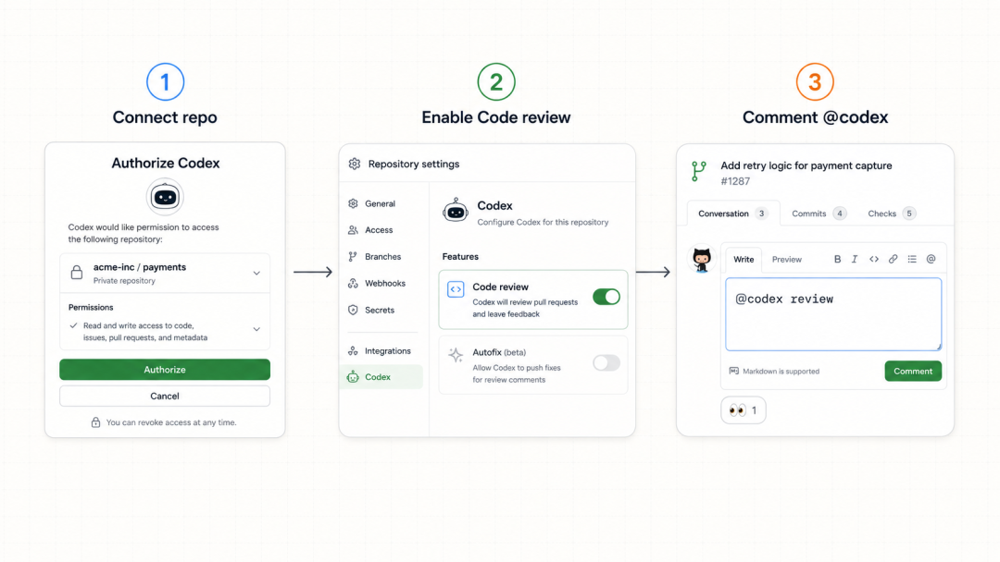
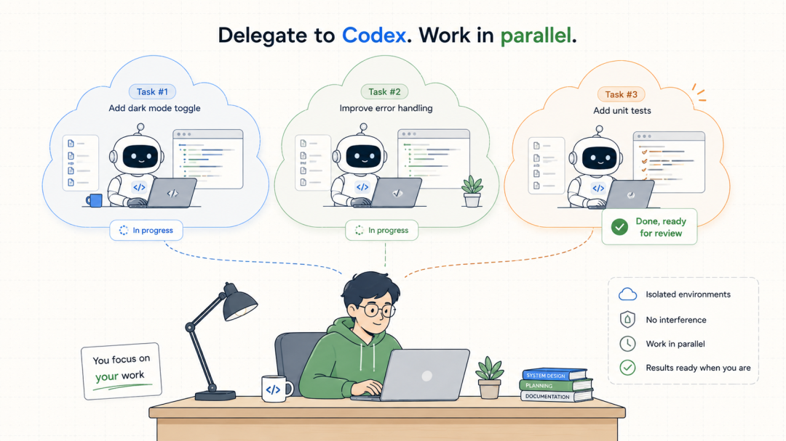
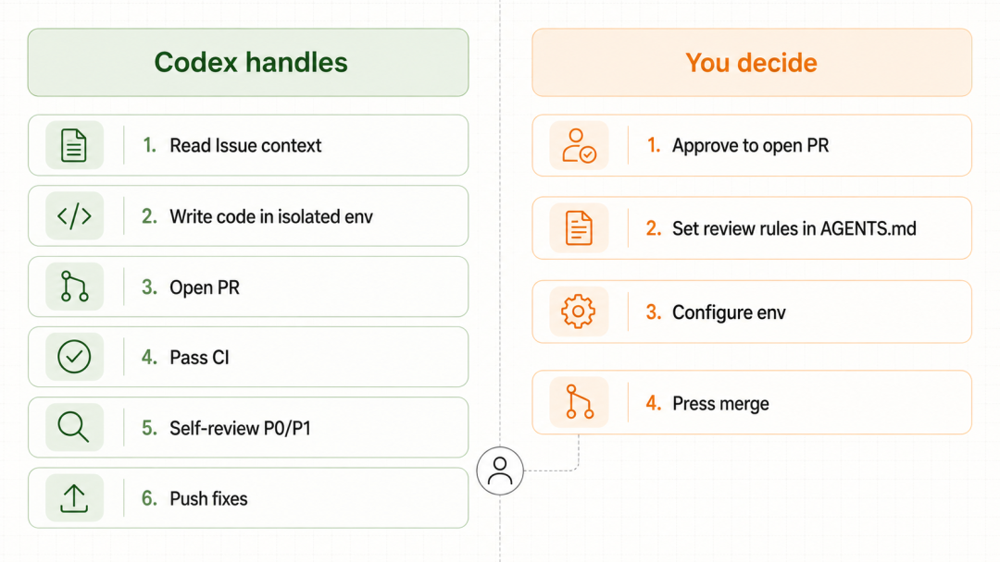

# GitHub Issue 到 Pull Request：让 Codex 跑完整协作流程

之前，我拿一个积压了很久的小 Issue 做了个实验，不打开编辑器，全程只在 GitHub 的 Issue 和 PR 评论区里 @codex
给它派活，看它能把这条 Issue 推进到什么程度。

结果比我预期的走得远，它自己开了分支、写了代码、发起 PR、跑完 CI，最后连 review 意见都自己提了。

但也不是全程撒手不管，有几个环节该我拍板的地方,它老老实实停下来等我。

这篇就把这条链路拆开讲清楚，Codex 接上 GitHub 之后，从一条 Issue 到一个可合并的 PR，中间每一步到底谁在干活、哪一步是它的能力边界。

##  它是个能进仓库干活的队友，不是许愿池

很多人对「AI 写代码」的想象还停留在「我说一句它吐一段」。

Codex 跟 GitHub 打通之后不是这个模式，它更像一个能进你仓库、能开分支、能发 PR、能过 CI 的远程同事。

关键在于它跑在  ** 云端隔离环境  ** 里，你把任务甩给它，它在一个独立环境里干，该忙啥忙啥，甚至可以同时甩好几个任务并行跑，互不占用你本地机器。

干完了它提供一份改动摘要和 diff，有空了再回来看。

这个后台异步的特性，是它能串起整条 Issue-to-PR 工作流的前提。

##  开始之前：怎么让 GitHub 里能 @到 Codex

这套流程有个前提得先说清楚，@codex 不是 GitHub 自带的功能，得先把仓库和 Codex 连起来，光在评论里打 @codex 是不会有任何反应的。

前提：得有 ChatGPT 官方的 Codex 访问权限，能登录 chatgpt.com 进到 Codex 就行。

配置就三步：

  * 第一步，给仓库接上 Codex cloud。在 chatgpt.com 的 Codex 里连接你的 GitHub 账号或组织，授权它访问你要用的那个仓库。这一步是把仓库和云环境绑上，@codex 才有干活的对象。 
  * 第二步，打开这个仓库的 Code review 开关。去 Codex 设置的代码审查页，把你那个仓库的 Code review 打开。不开这个，你在 PR 里 @codex review 它是不理你的。 
  * 第三步，在 PR 评论里 @codex。发一句 @codex review，等它冒个 👀 的表情回应，它就会像同事一样贴一份审查意见（只标 P0/P1 严重问题）。 

几个进阶开关顺手一提：想每个新 PR 都自动审，在设置里打开 Automatic reviews；想让它按你的规矩审，在仓库根目录放一个 AGENTS.md
写审查准则；@codex 后面跟的不是 review 而是别的指令，它就当成一个新的云任务来跑。

如果 @了没反应，排查三点：这个仓库的 Code review 开关开了没、仓库接上 Codex cloud 没、触发词是不是准确写的 @codex
review。

##  第一步：从一条 Issue 起手

工作流的起点可以直接在已经在用的地方，GitHub 的 PR、Linear 的 issue、Slack 的频道，都能直接把活交给
Codex，不用切到别的界面。

具体到 GitHub，在一条 Issue 或 PR 里点名它，它就把这条 Issue 当作任务上下文，去云端环境开工。

它读得懂 Issue 描述里的诉求，也读得到仓库代码，所以不用把背景再复述一遍，这正是在仓库里干活和在对话框里问它的本质区别。

##  第二步：它在云环境里把代码写了

接到任务后，Codex 在配好的云环境里干活，这里有个容易被忽略的准备工作：  ** 环境要可复现  ** 。

得先告诉它这个仓库需要哪些依赖、什么工具、哪些环境变量、怎么初始化，配好之后，它每次起的环境都跟本地那套一致，跑出来的东西才靠谱，不会出现它那边能跑我这边报错。

这一步基本是它自己完成的，可以在等结果，同时甩出去的其他任务也在各自的环境里跑，互不打架。

##  第三步：审查前你先把关

代码写完，Codex 不会替你直接合，它给你一份摘要和 diff，你来审。

这一步是我觉得设计得最克制、也最该保留的地方，可以看完就让它开 PR，也可以觉得思路不对、直接甩一句「follow-up」让它返工。

** 要不要进入下一环，决定权在你手里  ** ，它不会自作主张把没过目的东西推上去。

看着没问题了，就让它开 PR。到这儿，一条 Issue 已经变成一个躺在仓库里、等着被审的 Pull Request 了。

##  第四步：让它给自己的 PR 挑刺

PR 开出来之后，还有一步很多人不知道，Codex 能给 PR 做代码审查。

在 PR 评论里 @ 它并要求 review，它会像一个同事那样，看完整个 PR 的 diff，然后贴一份标准的 GitHub code review。

有意思的是它  ** 只标 P0 和 P1 的严重问题  ** ，不会拿一堆无关痛痒的风格碎碎念淹没评论区，这个取舍很务实，审查意见的信噪比一下就上去了。

如果嫌每次都要手动喊它麻烦，可以在设置里打开自动审查，之后每开一个新 PR 它都会自动过一遍，不用你招呼。

##  第五步：审查规矩写进 AGENTS.md，它照着挑

这里是让审查真正好用的关键：Codex 审查时会去翻仓库里的  ` AGENTS.md  ` ，按你写的 review 规矩来挑。

在仓库根目录的  ` AGENTS.md  ` 里写一段审查准则，比如：

    ## Review guidelines  
      
    - 不要在日志里打印 PII  
    - 确认每个路由都被鉴权中间件包住  
    

它就会照着这些规矩审，而且规矩是  ** 就近生效  ** 的，哪个目录下的 AGENTS.md 离改动文件最近，就用哪份的规矩。

可以在某个需要额外盯紧的包目录里放一份更严格的 AGENTS.md，那个目录的改动就会被重点照顾。

想临时改一次审查重点也行，不用改文件，评论里直接说这次帮我盯安全回归就行。

##  第六步：让它顺手把问题修了

审查挑出问题之后，不用自己撸起袖子改。

在同一个 PR 里再 @ 它一句把那个 P1 问题修了，它会以这个 PR 作为上下文起一个新的云任务，在有权限的前提下，直接把修复推回这个分支。

CI 挂了也一样，甩一句「把 CI 的失败修了」，它就去查去修。

这时候整条链路就闭环了：发现问题 → 起任务 → 推修复，全在这个 PR 里转，不用你在本地来回切。

如果想把这套接进 CI 做成自动化，它还提供了 GitHub Action，可以塞进流水线里跑。

##  那到底「能做到哪一步」

** 它能自己干的  ** ：读 Issue 上下文、在隔离环境写代码、开 PR、过 CI、审自己的 PR（按你的规矩挑
P0/P1）、按指令推修复回分支，这一串确实能大幅省掉机械劳动。

** 还得把关的  ** ：合并前的审查确认（要不要开 PR、要不要 merge，它停下来等你）、审查规矩得你来定（AGENTS.md
是你写的）、环境得你配（可复现是前提）、真正拍板合入的那一下，是你的责任。

所以能做到哪一步的答案是，  ** 它能把一条 Issue 推到「一个审查过、修过、CI 绿了的 PR」这一步，但最后按下 merge 的那个人，还是你。

这条线划得其实很健康，机械的活它包了，判断的活留给人。

##  写在最后

如果你手里有个仓库，别急着把整套流程一次上齐，先从最轻的一步试：给一个仓库开上 Codex 的代码审查，在下一个 PR 里 @ 它 review
一次，看看它挑出来的 P0/P1 靠不靠谱，觉得顺手了，再往前接 Issue 发起、往后接自动修复。

工作流这东西，是一步步长出来的，不是一次配到位的，但方向已经很清楚了，以后在 GitHub
上干的很多机械活，可以交给一个能进仓库的队友，你只要负责那些真正需要判断的环节。

延伸阅读：

  * Codex cloud 官方文档：https://developers.openai.com/codex/cloud 
  * Codex 代码审查（GitHub）：https://developers.openai.com/codex/third-party/github 
  * Codex 开发者集成总览：https://developers.openai.com/codex/developers 

* * *
