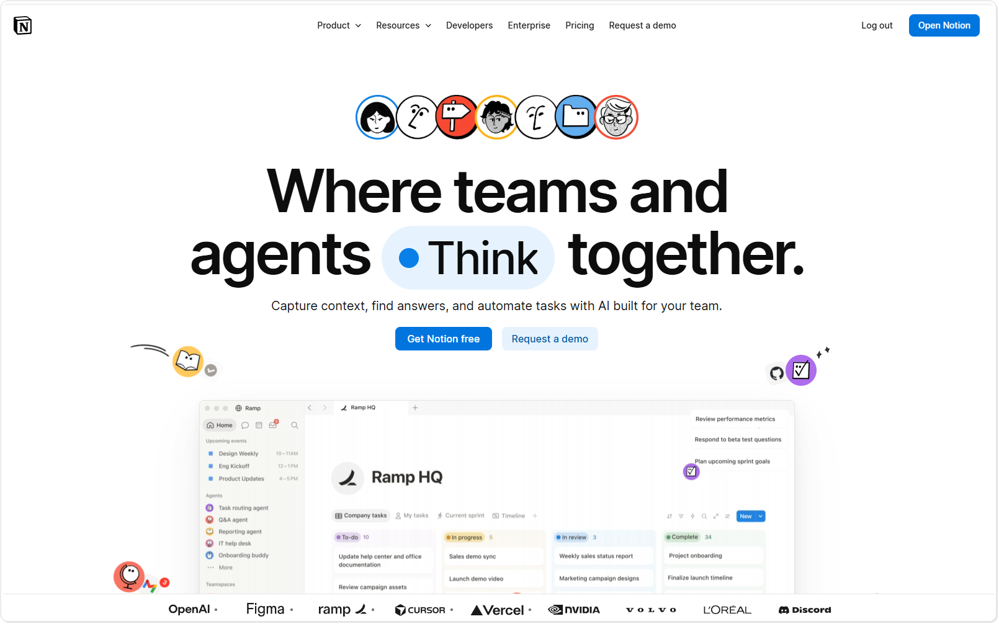
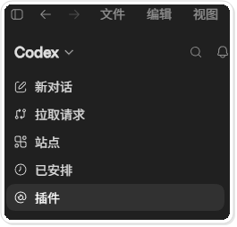
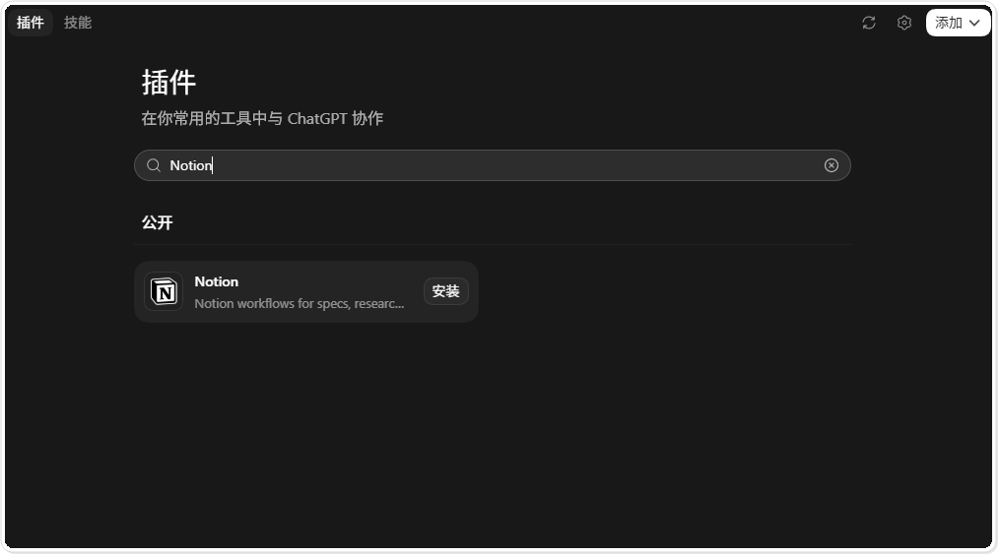
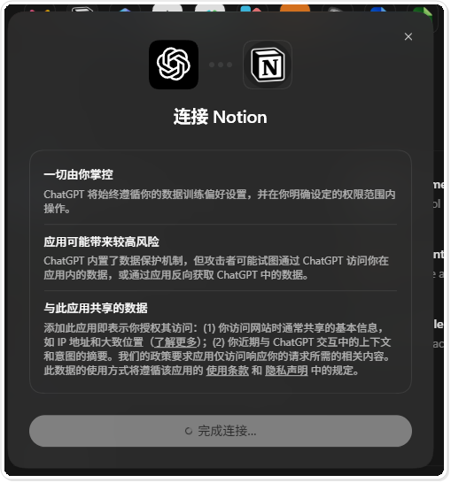
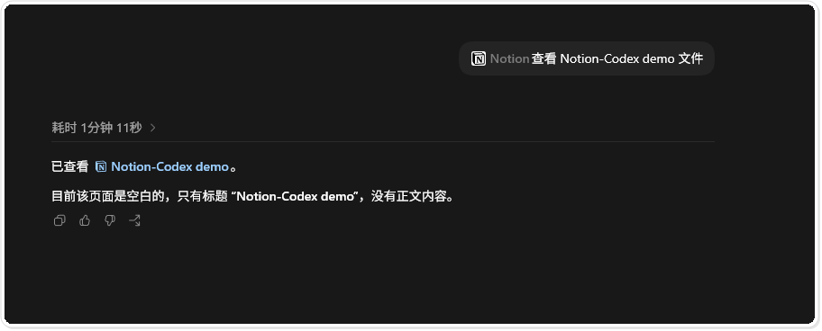
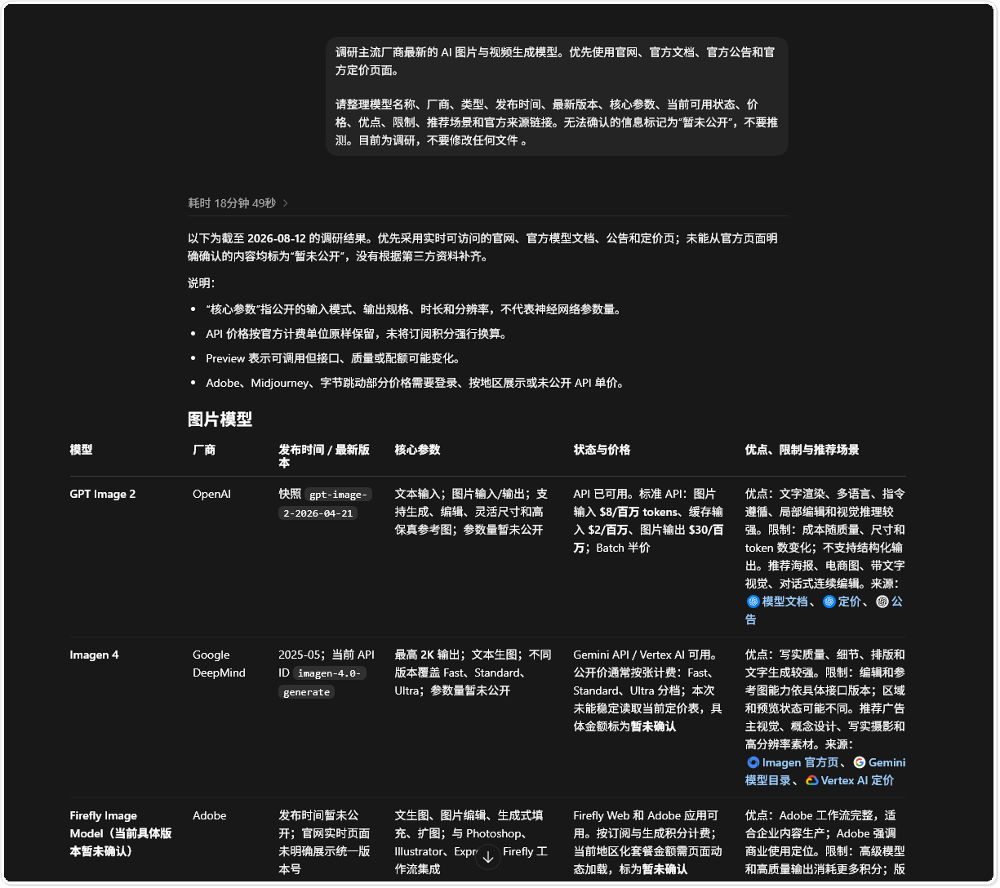
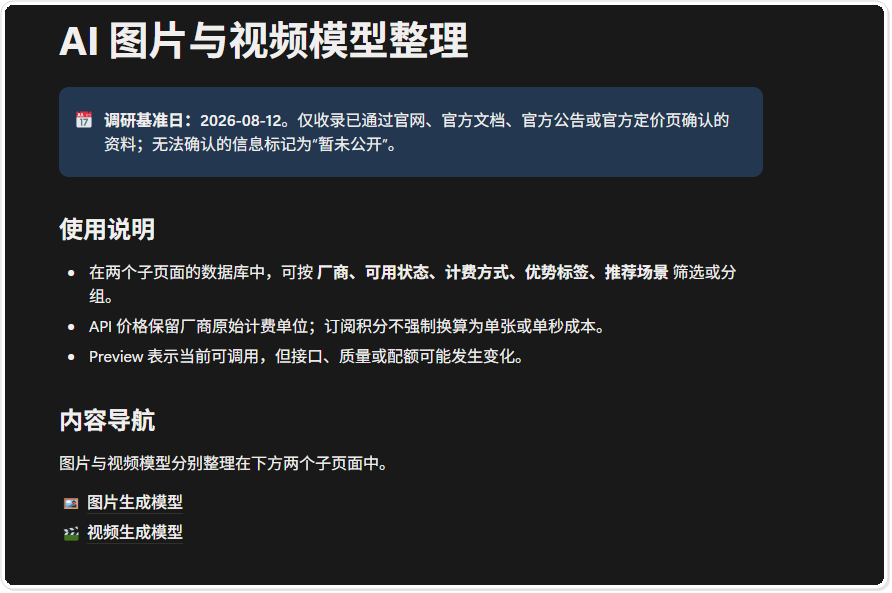
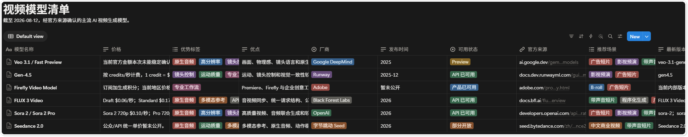

# 在 Codex 里连接 Notion，把调研结果直接写成数据库

Codex 做完资料调研，结果往往还要再整理。表格要重排，链接要归档，状态和标签也要补齐。接入 Notion 插件后，这些工作可以继续在同一个任务里完成。Codex 能读取你授权的页面，也能在确认后新建页面和数据库。

下面按一次完整操作来讲。先安装并连接 Notion，再让 Codex 查看测试页面，接着调研主流 AI 图片与视频生成模型，最后把结果整理进 Notion。示例只使用测试工作区，不碰真实项目资料。

## 本教程环境

以下版本核验于 2026 年 8 月 13 日。Notion 插件运行在 Codex 桌面端的 Plugins 界面中，不要求通过 IDE 或 Codex CLI 操作。

| 项目 | 本教程使用版本 | 获取方式 | 备注 |
|---|---|---|---|
| 操作系统 | Windows 11 专业版 64 位，构建 `26100` | Windows 系统信息 | 本机实测环境 |
| Codex 桌面端 | `26.803.10989.0` | Windows 应用包信息 | 本教程的插件宿主 |
| Notion 插件 | 目录托管版本，界面未展示独立版本号 | OpenAI Plugins 目录 | 以当前插件详情为准 |
| Notion App / Connector | Web 托管版本，界面未展示独立版本号 | Notion 授权界面 | 可用权限受工作区设置影响 |
| Codex CLI | `0.146.1` | `codex --version` | 本教程不在 CLI 中执行 |
| IDE | 不适用，本机 VS Code `1.132.1` | `code --version` | 本教程不在 IDE 中执行 |

Notion 用来保存页面、表格和团队知识，Codex 负责读取材料、组织内容，再调用插件完成操作。

图一 Notion 官方网站

## 一、打开插件目录

启动 Codex 桌面端，在左侧导航栏找到“插件”。如果看不到这个入口，先确认当前界面支持 Plugins，再检查工作区是否禁止安装插件。

图二 Codex 左侧导航栏中的插件入口

进入插件目录，在搜索框输入 `Notion`。结果卡片会显示插件名称、简介和安装按钮，核对无误后再点击安装。

图三 在插件目录搜索 Notion

安装过程中，Windows 可能询问是否允许网页打开 ChatGPT。点击“打开 ChatGPT”回到连接流程。不想让系统以后自动跳转，就不要勾选“始终允许”。

图四 浏览器请求返回 ChatGPT

## 二、检查权限后连接 Notion

连接窗口会说明 ChatGPT 与 Notion 之间会共享哪些数据。先看插件申请的权限，再确认选中的 Notion 工作区。

教程截图没有保留工作区选择页，因为原画面含有个人空间名称。你在自己的电脑上操作时，也不要把邮箱、成员名单、内部页面名称或授权令牌放进文章截图。

图五 连接前的数据与风险说明

连接完成后，先用专门的测试页面验证权限。不要直接修改团队知识库。测试页面放少量可公开内容，确认读取范围后，再尝试写入。

## 三、在任务里调用 Notion

新建 Codex 任务，在输入框键入 `@notion`。候选列表会出现 Notion 插件，选中后再写具体要求。只有把插件加入当前任务，Codex 才会在这轮对话中调用它。

图六 通过 `@notion` 把插件加入当前任务

第一次测试不用复杂。让 Codex 查看一个指定页面，并返回页面标题和正文状态即可。本次示例读取 `Notion-Codex demo`，结果显示页面只有标题，没有正文内容。

图七 Codex 读取测试页面后的结果

这一步可以确认插件已经连通，Codex 也能访问指定页面。若提示找不到页面，检查页面是否属于已授权工作区，以及当前账号是否有访问权限。

## 四、让 Codex 调研并整理资料

确认连接正常后，再提交正式任务。本次任务是调研主流 AI 图片与视频生成模型，优先查官网、官方文档、公告和定价页；记录模型名称、厂商、发布时间、版本、核心参数、可用状态、价格、优点、限制、推荐场景和官方来源。官网没有给出的字段标为“暂未公开”，不要补猜测值。

Codex 完成检索后，先在任务里查看结构化结果。截图中的调研基准日是 2026 年 8 月 12 日。模型状态和价格变化很快，重新使用这套表格时要再核对来源和日期。

图八 Codex 汇总图片模型调研结果

确认字段和内容后，再让 Codex 写入 Notion。这次先创建总览页，再把图片模型和视频模型分别放进两个子数据库。总览页保留调研日期、使用说明和两个数据库入口。

图九 Codex 创建的 Notion 调研总览页

图片模型数据库包含厂商、可用状态、计费方式、优势标签和推荐场景。标签颜色方便筛选，官方来源列用于后续复核。

图十 写入 Notion 的 AI 图片模型数据库

视频模型数据库沿用同一套字段。图片和视频分开后，筛选时不用混在一起，版本和价格也能分别维护。

图十一 写入 Notion 的 AI 视频模型数据库

## 五、操作时注意什么

涉及写入时，提示词最好把目标页面、字段和停止条件写清楚。先让 Codex 读取并汇报，再授权创建或更新。批量改库之前，要求它列出准备执行的动作；内容不对就停在确认环节。

资料型数据库要保留来源和核验日期。模型名称通常比较稳定，价格、地区可用性和 Preview 状态会变化。没有来源的数字宁可留空，也不要让 Codex 补一个看起来合理的答案。

测试结束后，到 Notion 与 Codex 的连接设置里检查授权范围。不再使用的测试连接可以撤销，测试页面也应与正式工作区分开。

## 结语

Notion 插件适合处理“调研已经做完，结果还没整理好”的任务。Codex 负责检索、整理和写入，页面结构与字段由你决定。先缩小权限，写入前确认，完成后检查来源，后面再把它用于其他资料整理任务。

更多 Codex 安装与实战教程可以访问 [CodexGuide](https://codexguide.io)。

添加微信 `257735`，备注“Notion 插件”，交流这套工作流的配置与使用问题。
