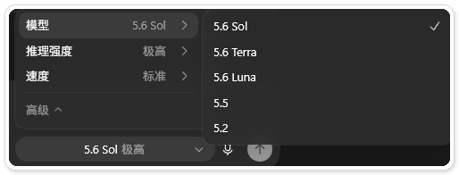
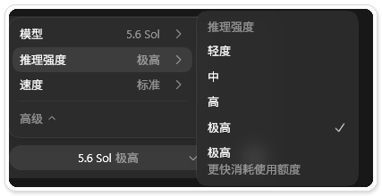
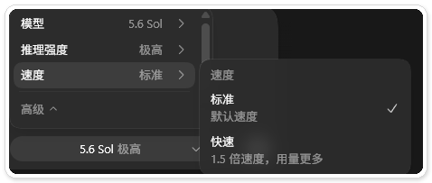
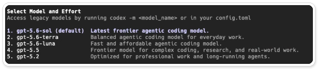
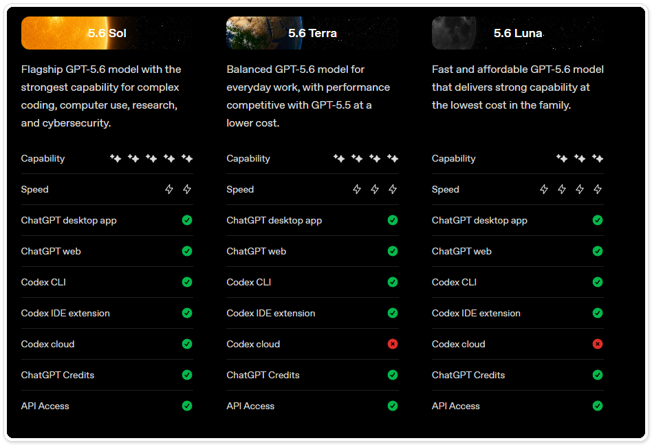
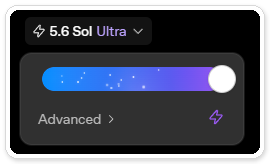

# Codex 模型怎么选？推理强度 Low、Medium、High 有什么区别

> 测试环境：Windows 11 24H2；Codex Desktop 26.803.10989.0；Codex CLI 0.146.1；2026-08-14 核验。

> 名称提醒。截至核验日期，Codex 桌面端把最低档显示为 **Light**，CLI 显示为 **Low**。本文标题沿用读者更常搜索的 Low，正文会在对应界面中说明名称差异。

打开 Codex 的模型菜单，很多人会先选 Sol，再把推理强度拉到最高。这样是不是最省事？

偶尔跑一个短任务，这样选确实省心。长期把 Sol 和高推理档当默认值，等待时间和消耗都会涨。一味选便宜模型也未必省钱。任务失败后重跑两次，再花半小时人工收拾，省下的额度很快就补回去了。

我平时会这样分。

- 日常改代码、补测试和整理方案，用 Terra + Medium。
- 跨模块重构、复杂调试和架构规划，用 Sol + Medium，确实不够再升 High。
- 摘要、分类、格式转换和批量改名，用 Luna + Light（CLI 中叫 Low）或 Medium。
- Max 和 Ultra 留给少数真正困难的任务。Ultra 会调动子智能体，消耗通常远高于普通高档位。

这套选法看的是完成一次任务的总成本，返工也算在里面。

## 先分清三个开关

Codex 的高级菜单里有三组设置，分别是模型、推理强度和速度。每一组控制的东西不同。



模型决定能力、速度和基础消耗的大致区间。推理强度决定模型愿意在当前任务上投入多少计算。速度选项则是用更多额度换更快返回。不要因为任务执行慢，就直接把推理强度调高；那通常只会让它想得更久。





桌面端的 Light，在 CLI 中叫 Low。两者都偏向速度和较低消耗，适合边界清楚的小任务。CLI 可以通过 `/model` 同时选择模型和推理强度。



## Sol、Terra、Luna 分别适合什么

OpenAI 给三个模型的分工很清楚。Sol 负责复杂、开放的高价值任务，Terra 是日常主力，Luna 处理清晰、重复且数量较多的工作。



| 模型 | 更适合 | 不建议直接交给它 |
|---|---|---|
| Sol | 复杂规划、跨模块修改、多阶段调试、安全审查、最终复核 | 大量机械改写、简单摘要、格式转换 |
| Terra | 日常开发、范围明确的实现、常规代码审查、测试补全 | 高风险架构决策、模糊且没有验收标准的长任务 |
| Luna | 文件摘要、分类抽取、批量转换、脚手架、变更说明初稿 | 并发问题、复杂状态流转、需要持续判断的仓库级修改 |

Terra 走的是效率路线。范围明确时，它往往已经够用。一旦任务需要在多个假设之间反复判断，Terra 与 Sol 的差距就会放大。

## 性价比不能只看单价

按 OpenAI 当前公布的 Codex credit 费率，相同 token 结构下，Terra 的消耗约为 Sol 的一半，Luna 约为 Sol 的五分之一。

| 模型 | 输入 / 100 万 token | 缓存输入 / 100 万 token | 输出 / 100 万 token |
|---|---|---|---|
| Sol | 125 credits | 12.5 credits | 750 credits |
| Terra | 62.5 credits | 6.25 credits | 375 credits |
| Luna | 25 credits | 2.5 credits | 150 credits |

这张表只能告诉我们 token 的单价，不能直接证明哪个模型完成一次任务更便宜。推理强度、上下文长度、工具调用、输出长度和失败重试都会改变最终消耗。

把三组公开测评放在一起看，单价和最终成本的差别会更清楚。

| 来源与测试条件 | 主要结果 | 能说明什么 |
|---|---|---|
| Artificial Analysis，Coding Agent Index，Max 档 | Sol、Terra、Luna 得分约 80、77、75；Terra 和 Luna 的单任务成本比 Sol 低约 60% 和 80% | 大量任务中，便宜模型可能只损失少量平均分，适合做分流 |
| Sonar，4,444 个 Java 任务，同为 Medium | Sol 与 Terra 通过率为 81.99% 和 79.96%；Terra 代码更短，但代码异味密度更高 | 平均通过率接近，不代表审查成本相同 |
| CodeRabbit，100 多个跨语言仓库任务 | Sol 通过率 63.7%，平均输出 20,968 token；Terra 通过率 40.7%，平均输出 55,594 token | 长任务里，半价模型可能因为绕路和重试变得更贵 |

这些数字不能互相替代。它们使用不同任务、运行环境和评分方法，结论自然不完全一致。实际选择模型时，可以按下面这笔账来算。

> 一次可用结果的总成本 = 模型消耗 + 重试次数 + 人工复核时间 + 出错风险。

如果 Luna 一次做对，当然最划算。如果 Terra 连续两次跑偏，而 Sol 一次通过测试，Sol 反而更便宜。不要只记住“Terra 半价、Luna 五分之一”这两个比例。

## 推理强度怎么选

模型选完，再看任务难度调推理强度。最稳妥的做法是从 Medium 起步，结果不够再逐级上调。

| 档位 | 适合的任务 | 什么时候不该用 |
|---|---|---|
| Light / Low | 搜索文件、解释一段代码、改文案、机械修改 | 任务包含多个依赖关系或隐含约束 |
| Medium | 日常开发、补测试、常规调试、资料整理 | 已经出现相互冲突的根因，或需要权衡多个方案 |
| High | 跨模块问题、复杂逻辑、边界条件、安全与正确性复核 | 验收标准很清楚、修改只是重复劳动 |
| Extra High | 多阶段研究、困难调试、需要反复检查的高价值任务 | 日常默认使用，性价比通常不好 |
| Max | 单个极难任务，需要尽可能多的推理与验证 | 可拆成几个独立子任务时 |
| Ultra | 能被拆成独立工作流的复杂任务，多智能体并行有收益 | 小任务、强顺序依赖、多人同时改同一批文件 |



高档位也救不了模糊需求。任务没有验收标准时，先把目标、限制和完成条件说清楚，比从 Medium 拉到 High 更有效。

## 把规划和执行分开

我更常用的省额度办法，是让强模型做少量高价值判断，再让便宜模型执行已经说清楚的工作。

实际可以分成四步。

1. 用 Sol + High 阅读需求和关键代码，只输出计划、风险、受影响文件和验收条件，先不改代码。
2. 人工确认计划。把其中边界清楚的步骤交给 Terra + Medium 执行。
3. 批量改名、摘要、生成变更说明等机械步骤交给 Luna。
4. 修改完成后，再让 Sol + High 做一次只读复核，重点检查遗漏、回归风险和测试缺口。

规划阶段可以用下面这段提示词。

```text
先不要修改文件。请分析这个需求涉及的代码路径，列出：
1. 需要修改的文件和原因；
2. 实施顺序；
3. 每一步的验收条件；
4. 可能的回归风险和测试方案。
计划中不要使用“视情况而定”，遇到不确定信息就指出需要先验证什么。
```

执行阶段换到 Terra 后，把已经确认的计划直接作为约束。

```text
按下面已经确认的计划执行。只处理第 2、3 步，不扩大范围。
完成后运行计划中指定的测试，并报告实际结果；如果发现计划与代码现状冲突，停止修改并说明冲突。
```

这套方法要求执行任务已经被拆清楚。CodeRabbit 的长任务结果提醒我们，仓库级实现如果仍需要频繁重新规划，Terra 可能比 Sol 产生更多输出，也更容易失败。碰到这种任务，直接让 Sol 完成实现往往更省。

Codex 的子智能体也支持为不同角色指定模型。官方示例会让较强模型处理复杂审查，让 Terra 做读密集扫描，让 Luna 核对文档或完成窄任务。对刚开始使用的人，手动切换模型更直观；等流程稳定后，再把 planner、worker、reviewer 写成自定义 agent。

## 四套可以直接照用的组合

| 场景 | 推荐组合 | 升级条件 |
|---|---|---|
| 小改动、解释代码、整理文本 | Luna + Light / Medium | 连续遗漏约束时换 Terra |
| 日常功能开发、补测试 | Terra + Medium | 涉及多个模块或两轮仍未通过测试时换 Sol |
| 复杂调试、架构规划、高风险修改 | Sol + High | 仍缺少关键证据时先补材料，不急着上 Max |
| 可并行的大型研究、迁移或审查 | Sol + Ultra | 只有子任务相互独立、并行确实能缩短时间时使用 |

我的日常默认值会放在 Terra + Medium。大多数任务里它已经够快，也留出了升级空间。碰到并发、权限、安全、跨模块状态这类问题，我会直接切 Sol。Luna 留给那些“结果格式已经写在题目里”的工作。

## 用自己的任务做一次小测

公开跑分只能帮你缩小选择范围。真正决定默认模型的，应该是你自己的任务。

我用 `codex-cli 0.146.1` 做了一轮小测试。任务是修复一个 Python 区间合并函数，需要校验输入、处理反向端点、合并重叠或相邻区间，而且不能修改原始数据。三个模型都使用 Medium，拿到的初始文件、提示词和 7 个测试完全相同，每次都从独立副本开始。

| 模型 | 端到端耗时 | 首轮测试 | 追加提示 | 独立复查 |
|---|---|---|---|---|
| Luna + Medium | 3 分 20 秒（200.05 秒） | 7/7 通过 | 0 次 | 通过 |
| Terra + Medium | 3 分 23 秒（203.36 秒） | 7/7 通过 | 0 次 | 通过 |
| Sol + Medium | 4 分 07 秒（247.27 秒） | 7/7 通过 | 0 次 | 通过 |

这里的耗时从 CLI 命令发出算到进程退出，包括启动、排队、思考和工具调用。它记录的是端到端等待时间，不能直接当作模型生成速度。三次任务按 Luna、Terra、Sol 的顺序运行，每个模型只跑了一次，3 秒左右的差距没有比较意义。Sol 这次更慢，也不能据此断定它总是慢。换成长任务，结果可能会变。

这轮测试只回答了一个很窄的问题。需求写清楚、测试现成的小修复，Luna 已经可以一次交付。在这类工作上直接用 Sol，通常没有必要。桌面端没有稳定显示每个任务的精确用量，CLI 日志也没有给出可直接换算 credit 的输入、缓存输入和输出明细，因此本文不估算单次成本。

你也可以挑两个过去做过、结果可验证的任务，一个简单修改，一个跨文件问题。让三个模型使用相同提示词和 Medium 各跑一次，记录是否一次通过、大致耗时、追加提示次数和人工修正量。界面明确显示用量就顺手记下，没有就留空。

如果 Luna 在简单任务里稳定一次通过，就让它继续做这类工作。如果 Terra 在跨文件任务里经常重试，就把这部分路由给 Sol。默认模型不需要永远固定，它只需要符合你最近一个月最常做的事。

## 参考资料

- [Models - OpenAI Codex](https://developers.openai.com/codex/models)
- [Pricing - OpenAI Codex](https://developers.openai.com/codex/pricing)
- [Subagents - OpenAI Codex](https://developers.openai.com/codex/subagents)
- [GPT-5.6 benchmarks across Intelligence, Speed and Cost](https://artificialanalysis.ai/articles/gpt-5-6-has-landed)，Artificial Analysis，2026-07-09
- [An Evaluation of OpenAI GPT-5.6 Sol & Terra](https://www.sonarsource.com/blog/openai-gpt-5-6-sol-and-terra/)，Sonar，2026-08-06
- [CodeRabbit 对 Sol 与 Terra 的代码任务测评](https://www.coderabbit.ai/blog/gpt-5-6-sol-and-terra-benchmark)，CodeRabbit，2026-07-09
- [I Tested GPT-5.6 Luna and Terra with Low/Medium Efforts](https://www.youtube.com/watch?v=0I-hZEMaadw)，AI Coding Daily，2026-07-11
- [Pat Simmons 的 GPT-5.6 Sol 测试](https://www.youtube.com/watch?v=rdqgMNjvhMY)，Pat Simmons，2026-07-10

想继续系统学习 Codex，可以访问 [CodexGuide 教程网站](https://codexguide.io)。

使用 Codex 时遇到问题，可以添加微信 `257735`，备注“模型选择”。
