# Codex 与其他编程模型怎么比较：从任务类型和验证条件出发

去阅读**

** 设置星标 学习更多AI出海知识  **

两大模型同一天发布新版本，这是要直接PK的意思啊，AI圈又热闹起来了。

Anthropic 放出 Opus 4.6，之后 OpenAI 放出 GPT-5.3-Codex。

今天还看到了这张图，有点难绷。

这俩是我现在用得最多的主力模型，一个负责日常创作和主力编程，一个负责搜索研究和精准改 bug，现在同时升级了。

先各自一句话总结：

Claude Opus 4.6：更强规划、更长自主任务、百万 token 上下文（beta）

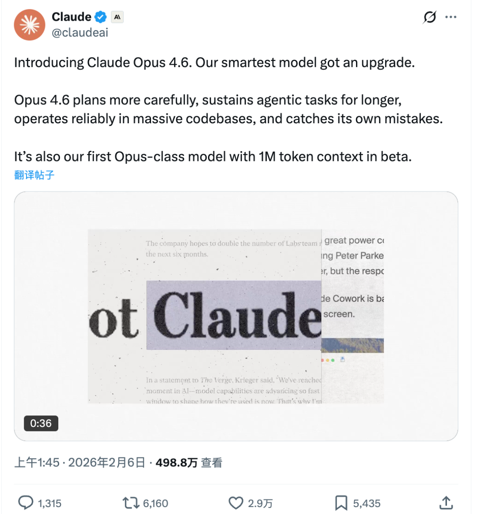

GPT-5.3-Codex：融合 5.2-Codex 编码能力和 5.2 推理能力，速度快 25%，token 消耗减半

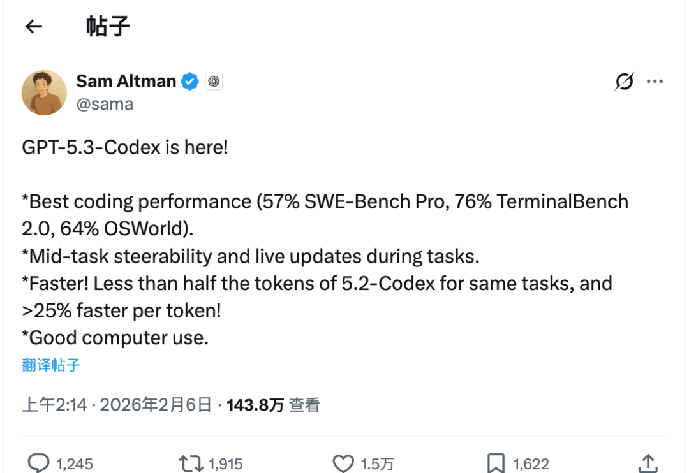

##  Opus 4.6：编程更严谨，上下文翻了 5 倍

官方文档：https://www.anthropic.com/news/claude-opus-4-6

###  模型能力升级

Opus 4.6 在编码上的改进方向：规划更周密，先想清楚再动手；能更长时间地执行 agent 任务；代码审查和调试能力更强，能更有效地发现自身错误。

之前 Claude 经常被吐槽太自信，一路错到底也不回头检查，这次有了改善。Cognition（Devin 团队）的反馈是 bug
捕获率明显提升，Cursor 团队也说它在代码审查上表现很好。

** Opus 系列首次支持 100 万 token 上下文窗口（beta）！！  **

之前 Opus 只有 200K，这次直接翻了 5 倍。对做 Coding
的人来说，上下文容量有多重要不用多说。唯一要注意的就是考虑一下消耗，可能计费会比较夸张。

Opus 4.6 在这方面的表现相当不错：MRCR v2 的 8-needle 1M 测试中，Opus 4.6 得分 76%，而 Sonnet 4.5 只有
18.5%。这是一个质变级的提升，意味着百万行代码库、长文档分析、多轮对话都能 hold 住，不是摆设。

输出上限也从之前的 64K 翻倍到了 128K token，一次性输出更多内容，减少分轮请求的麻烦。

###  跑分表现

再来看看跑分吧，每次新的模型出来都少不了这个环节。

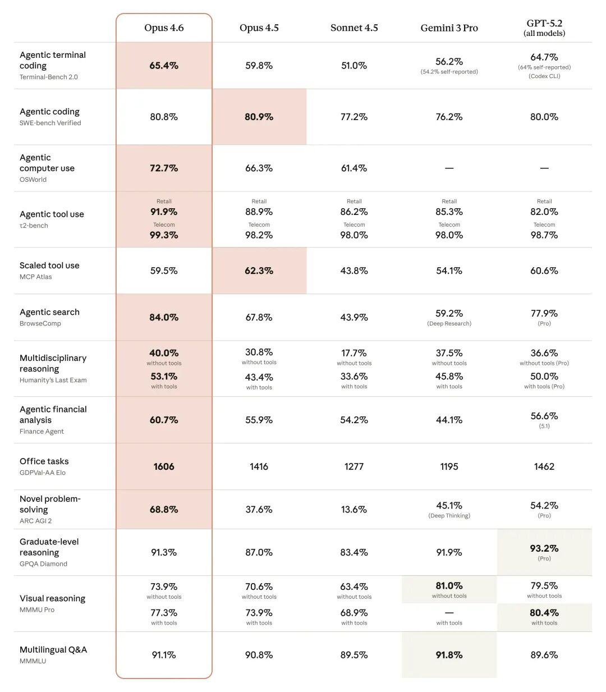

Opus 4.6 在多个评测上拿到了最高分。Terminal-Bench 2.0（终端编程能力）65.4%，GDPval-
AA（真实工作任务，涵盖金融、法律等领域）Elo 1606 分，比 GPT-5.2 高 144 分，比前代 Opus 4.5 高 190 分。

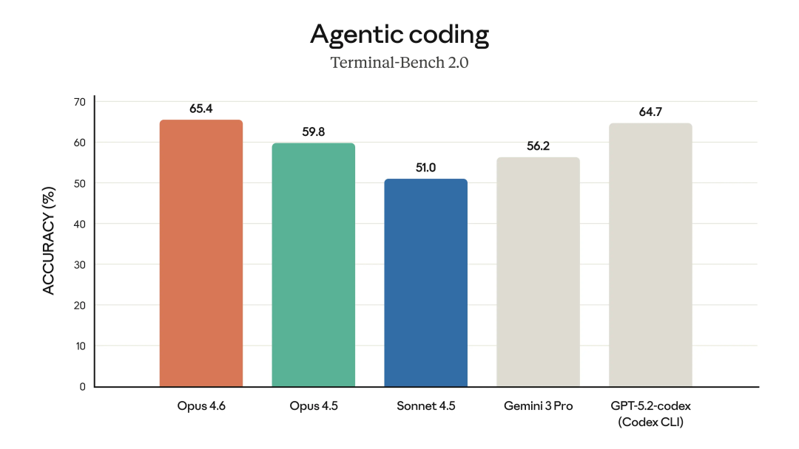

BrowseComp（网络搜索能力）84.0%，远超第二名 GPT-5.2 Pro 的 77.9%。Humanity's Last
Exam（复杂多学科推理）和 ARC AGI 2（流体智力测试，68.8%）也都是最高分。

在 OSWorld（操作电脑能力）上拿了 72.7%，比 Opus 4.5 的 66.3% 提升不少，说明 Claude 越来越会操控电脑了，越来越智能
agent化了。

###  新功能和产品更新

** Context Compaction（上下文压缩）。  ** 之前 Claude Code 里的 /compact
命令已经能手动触发上下文压缩，或者在检测到接近限制时自动总结对话。

这次的改进是在 API 层面，模型自己能判断什么时候该压缩、压缩哪些内容，配合百万 token 上下文，长任务能跑更久而不会因为上下文溢出中断。

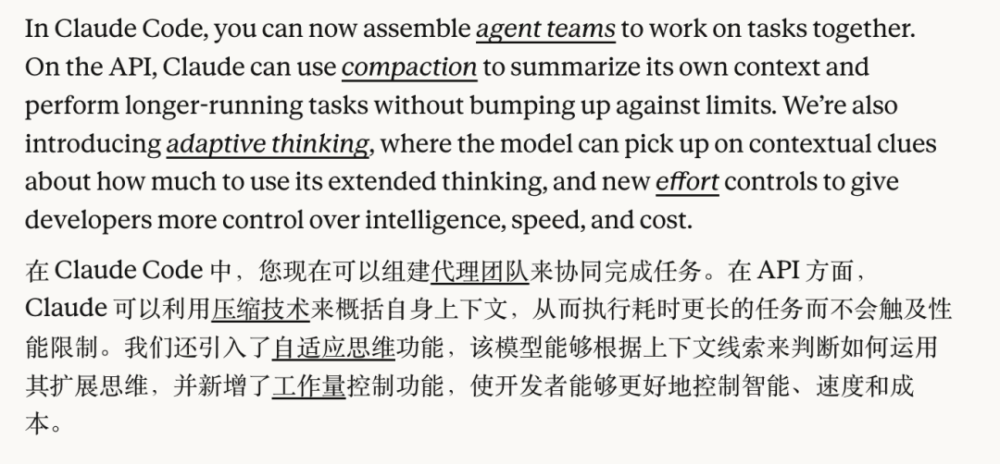

** Adaptive Thinking（自适应思考）。  ** 以前 extended thinking
只能开或关，没有中间状态。简单问题开了深度思考就是浪费。现在 Claude 能自己判断问题的复杂度，简单问题快速回答，复杂问题多想一会儿。

配合新增的 Effort 控制（low / medium / high / max 四档，默认 high），开发者可以在速度、成本、质量之间灵活调整。

** Agent Teams（多 Agent 团队协作）。  ** 这是 Claude Code 的一个重要更新，目前是 research
preview。以前用 Claude Code 是一个 agent 在干活，现在可以启动多个 agent
并行工作，一个审代码、一个写测试、一个改文档，最后汇总结果。

和之前的 subagent 不同，subagent 只能向主 agent 报告结果，Agent Teams
的成员之间可以直接沟通、互相质疑、共享发现，不需要通过负责人中转。你可以用 Shift+Up/Down 或 tmux 直接接管任何一个 subagent。

** Claude in Excel 增强 + Claude in PowerPoint 首发。  ** Excel
插件现在支持数据透视表、图表修改、条件格式、排序筛选、数据验证，不只是写公式了。

PowerPoint 插件进入 research preview，能读懂你的模板、字体、配色，生成的 PPT 不用大改。这两个插件对 Max、Team 和
Enterprise 用户开放。

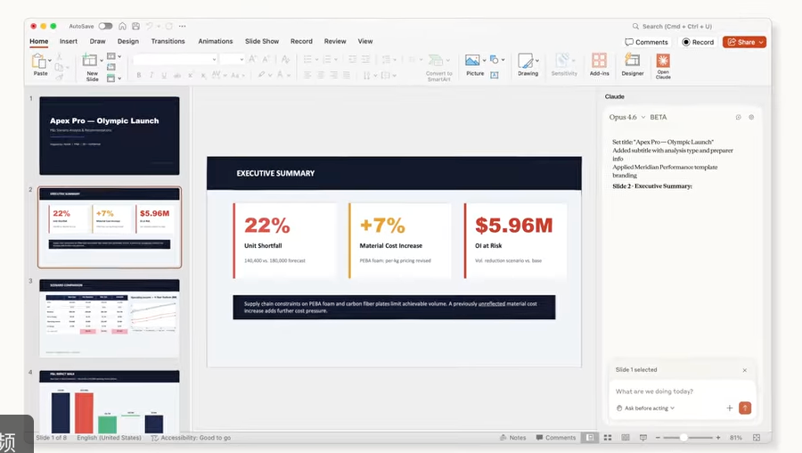

价格保持不变，  25 per million tokens（输入/输出）。超过 200K token 的上下文有额外定价，  37.50 per
million tokens。

##  GPT-5.3-Codex：更快更省，模型开始造模型

OpenAI 官方：https://openai.com/index/introducing-gpt-5-3-codex

###  模型能力升级

GPT-5.3-Codex 融合了 GPT-5.2-Codex 的前沿编码性能和 GPT-5.2 的推理及专业知识能力，同时速度提升 25%。

Sam Altman 在推文里补充了一个更直观的数据：完成相同任务所需的 token 不到 5.2-Codex 的一半。

速度更快、消耗更少，这对跑长任务的开发者来说是实打实的省钱。

这次最值得关注的一点是，OpenAI 在博客里说 GPT-5.3-Codex 是他们第一个"  ** 在创造自己的过程中发挥重要作用的模型  ** "。

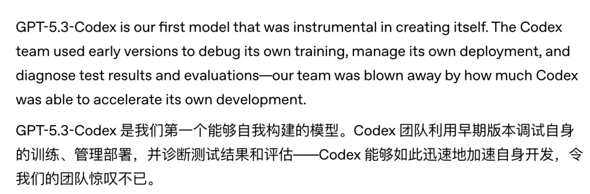

Codex 团队用早期版本来 debug 自己的训练过程、管理部署、诊断测试结果。

工程团队用它定位 context 渲染 bug 和缓存命中率问题；

数据团队用它建数据管道、分析结果，三分钟内就能对上千个数据点生成摘要。

** 模型造模型。  ** 挺有意思的。

** Mid-task steerability（任务中途可调整）。  ** 这是 5.3 主打的差异化功能。

以前 Codex agent 跑起来只能等结果，现在可以中途提问、调整方向、讨论方案，不会丢失上下文。

Codex 还会频繁汇报进展，让你随时了解关键决策和进度，官方说体验像和同事协作一样。在 Settings > General > Follow-up
behavior 里开启。

前端生成能力也有明显提升。官方对比了 GPT-5.3-Codex 和 GPT-5.2-Codex 生成的落地页，5.3
会自动把年付方案显示为折算后的月价让折扣更直观，还会做自动轮播的多条用户评价，整体更接近生产级别的页面。

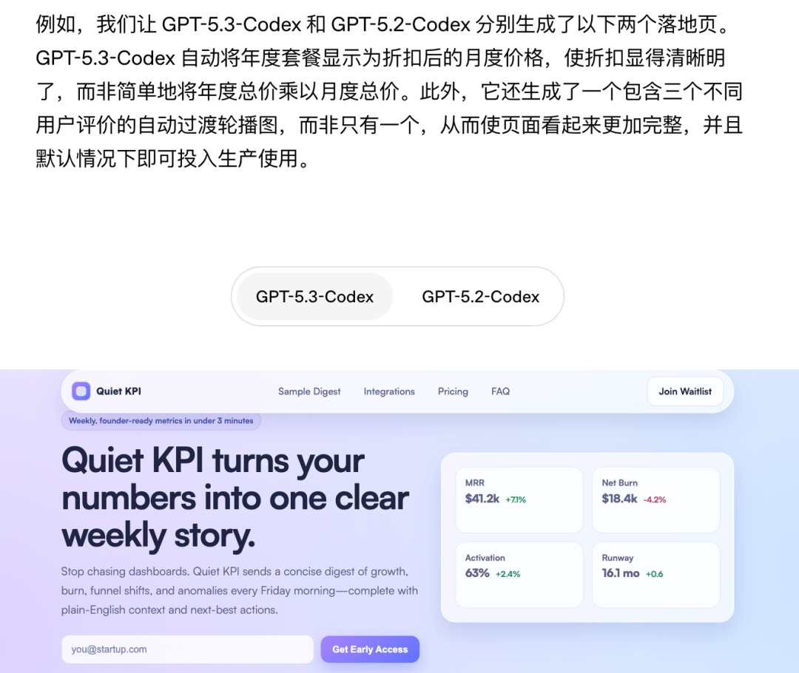

OpenAI 还测试了让 5.3-Codex 用 "develop web game" Skill 配合通用跟进提示（修复
bug、改进游戏），在几天时间里自主迭代了数百万 token，做出了一个有 8 张地图和道具系统的赛车游戏，以及一个有氧气和压力管理系统的潜水游戏。

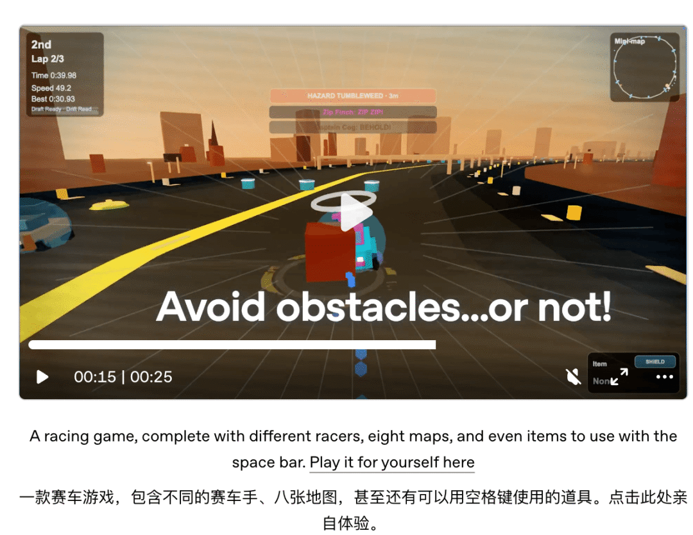
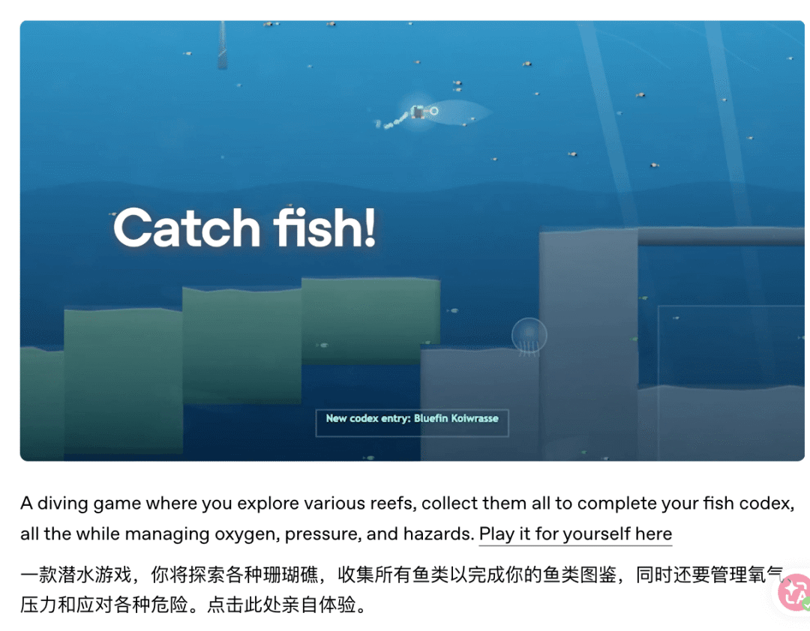

###  跑分表现

Terminal-Bench 2.0 从 64%（5.2-Codex）跳到 77.3%，提升明显。

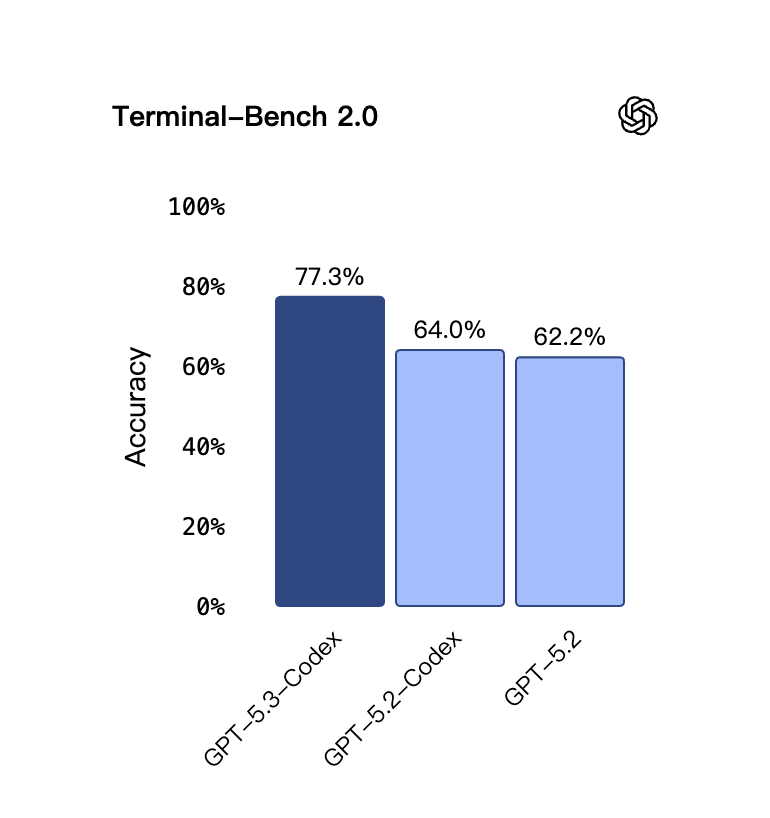

OSWorld-Verified 从 38.2% 跳到 64.7%，接近翻倍，computer use 能力大幅增强。

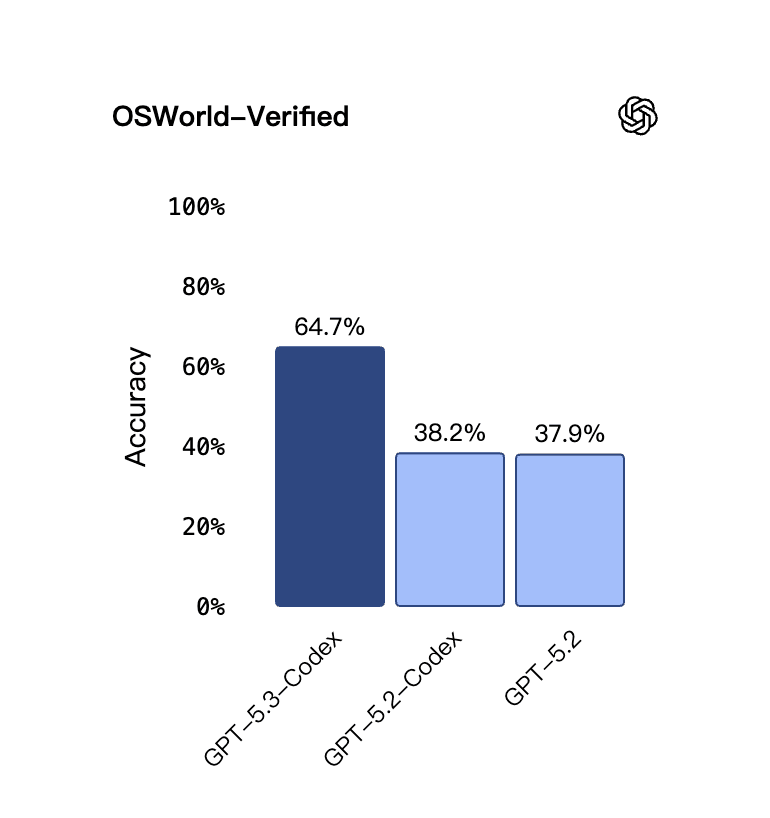

SWE-Bench Pro 是 56.8%，比 5.2 的 56.4% 提升不大，但这个 benchmark 覆盖
Python、Go、JavaScript、TypeScript 四种语言，比 SWE-bench Verified 更难也更抗数据污染。

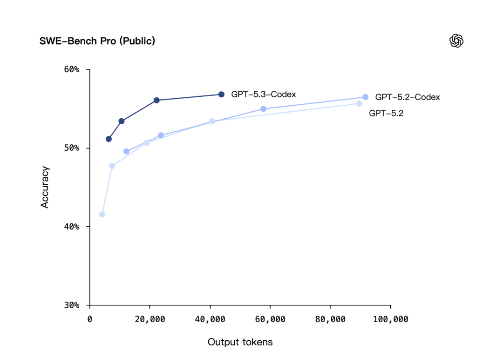

网络安全 CTF 挑战从 67.4% 提升到 77.6%，SWE-Lancer IC Diamond 从 76% 提升到 81.4%。

###  新功能和产品更新

** 网络安全能力首次被标记为 High Capability。  **

这是 OpenAI Preparedness Framework 下第一个在网络安全领域被标记为高能力的模型，也是第一个专门训练来发现软件漏洞的模型。

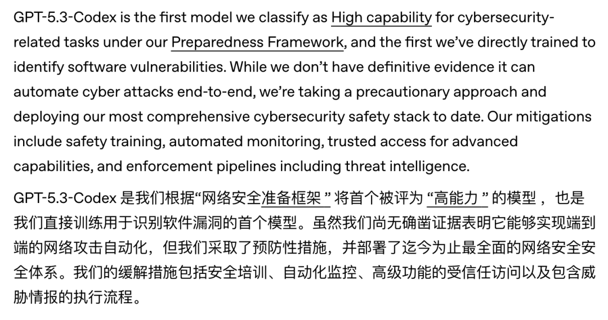

OpenAI 同时投了 $10M API credits 用于网络防御研究，推出了 Trusted Access for Cyber
试点项目，还在扩展安全研究 agent Aardvark 的私测范围。

目前 GPT-5.3-Codex 通过 ChatGPT 付费订阅使用，API 还没开放。桌面 App 暂时只支持 Mac Apple
Silicon（M1+）。

##  两家怎么比

产品形态上，

OpenAI 把 Codex 做成了桌面 App、CLI、IDE 插件、Web 端全线打通的产品。不过这点 Claude 也一样，claude.ai Web
端、桌面 App、Claude Code CLI、各 IDE 插件都有，两家在产品覆盖面上基本持平。

然后就是说实话跑分这个东西参考一下就好。

一方面两家的评测基准有很多细节差异，OSWorld、SWE-bench、GDPval 用的都是不同版本或不同评测方法，表面上的数字高低说明不了太多问题。

另一方面，很多模型跑分很高但用起来就是不顺手，反过来有些模型跑分一般但在某些场景下特别好用。

关于产品路线的差异。

两家都在往 agent 方向走，但产品化思路不太一样。

Claude 这边是嵌入式路线，直接做了 Excel 和 PowerPoint 插件，嵌入你现有的工作流。Agent Teams 让多个 agent
并行协作，Cowork 让 Claude 在后台自主多任务。

产品矩阵更全，百万 token 上下文也是 GPT-5.3 的 128K 的 8 倍，对大项目的体验提升是质变级的。

OpenAI 这边是平台化路线，把 Codex 做成了一站式产品（App + CLI + IDE + Web），Skills 系统让 Codex
能对齐团队规范，Automations 能在后台自动处理 issue 分类、告警监控这些日常杂活。Mid-task steerability
让长任务的交互体验更好。

如果你想开箱即用地增强办公效率，Claude 的插件更方便。如果你习惯在一个产品里一站式搞定开发工作，Codex 的体验更完整。

我自己的工作流大概率不会大变：Claude Code 打草稿做主力开发，Codex
接手后续精准调试和长任务。两边同时升级，都去试试吧，找到自己的最佳使用方式。

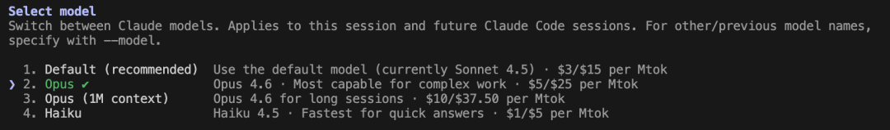
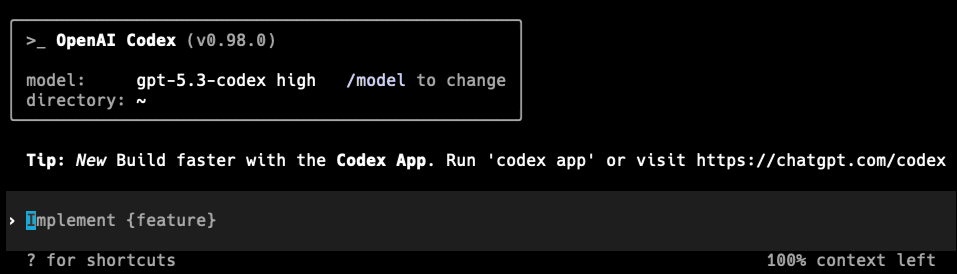

现在算力已经变成了生产力，Opus 4.6 百万上下文一开，跑个大项目 token 消耗很可观。如果你是重度用户，比如用 OpenClaw 跑自动化、用
Claude Code 做大项目开发，API 费用会是一笔不小的开支。

推荐一个中转，消耗比官网低一些，最近在搞春节活动充值有赠送，适合 token 消耗大的场景，有需要的可以了解一下。 [ 推荐一个牛逼的中转工具！

* * *

  

关于AI工具使用这块，我们整理了一份非常详细的关于  Claude skills 和 openclaw
的教程，从介绍到安装，从案例分享到实操都有，补充在出海资料里面，有需要的朋友看图自取。

想了解更多可以加我  vx: 257735  聊。

  

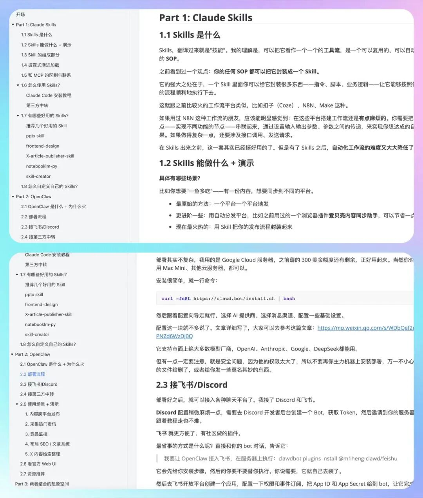

** [ Codex 桌面版来了！比我想象中要好得多

**

** [ OpenClaw 真香！我让它每天帮我干这些活

**

** [ （2026年最新）Codex CLI 国内使用全攻略：终端 + VSCode + Cursor + Opencode 四种姿势全搞定

**

** [ 实测 4 个爆火 Skill，一句话生成画布/知识库/任务规划/自动发布

**

** [ 从海外公司注册到 Stripe 收款，跑通了出海收付款全流程（实操分享）

**

** [ 出海建站必备：告别AI味，这两个页面设计 Skills 太牛了！

**

** [ 玩转 Claude Code Hooks：让自动化渗透到每个环节

**

** [ 出海工具全集：覆盖 9 大类别，收藏这一篇就够了

**

** [ 出海网站实战：Stripe 支付接入，从 0 到收款全流程

**

预览时标签不可点

阅读

知道了

****

取消  允许

****

取消  允许

****

取消  允许

__
