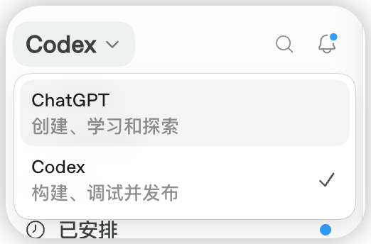
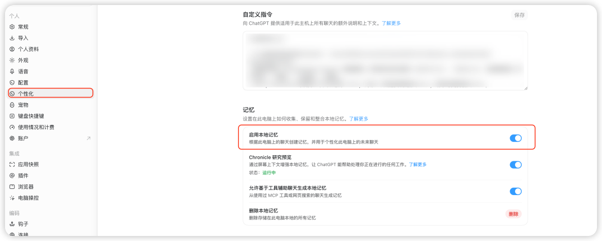
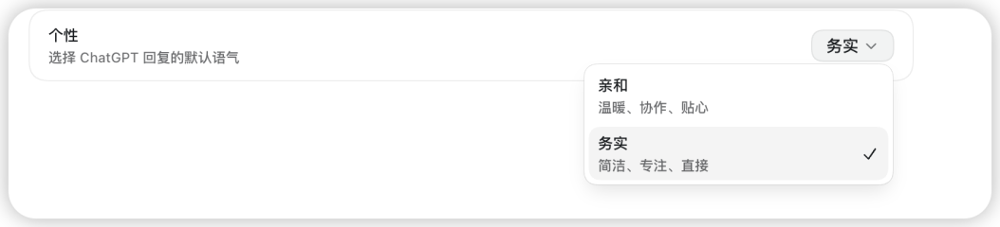
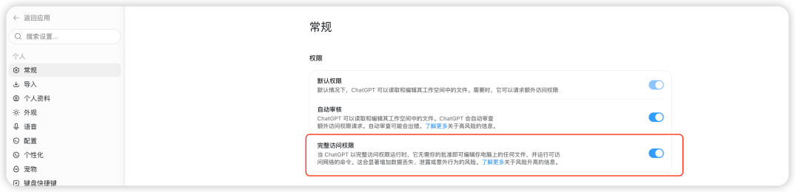
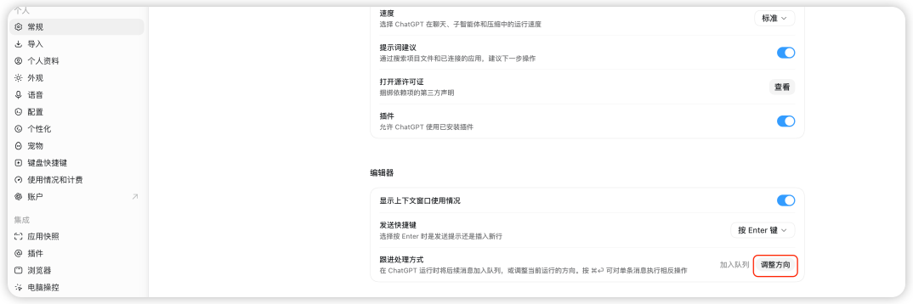

# Codex 桌面端协作设置，从入口到权限与任务纠偏

> 难度 | 基础
>
> 类型 | 设置与权限

## 这篇文章适合谁

这篇文章写给已经安装 ChatGPT 桌面端，准备让 Codex 读取项目、修改文件并运行命令的读者。

你会依次检查工作入口、长期协作习惯、默认表达方式、权限，以及新消息是立即纠偏还是排队等待。

界面会随版本变化。找不到某个选项时，先更新桌面端，再以当前设置页和官方文档为准。

## 先选对工作入口

桌面端把 ChatGPT 与 Codex 放在同一个产品中，但两者面对的任务不同。



ChatGPT 适合讨论、研究和文件类交付。Codex 面向软件开发任务，可以在你授权的工作区中读取和修改文件、运行命令，并结合测试结果继续工作。

准备改代码、配置或仓库文件时选择 Codex。只想比较方案或整理想法时，可以先在 ChatGPT 中讨论，方向确定后再进入 Codex。

## 把稳定要求写进自定义指令

设置页的“个性化”区域包含自定义指令和 Memories。两者不能混为一项设置。



自定义指令保存你主动声明的长期要求，例如修改范围、汇报方式和验证标准。可以先写一组短规则。

```text
开始修改前先读取仓库规则和相关文件。
只处理当前任务需要的范围。
完成后说明改动文件、验证命令和未覆盖的风险。
提交、推送、发布或删除重要数据前先确认授权。
```

Memories 用来让后续聊天复用过去工作中提取的有用信息。官方文档说明，本地 Codex Memories 默认关闭，可在“设置 > 个性化”中启用，也可以用 `/memories` 控制当前聊天是否读取或生成记忆。

密钥、Cookie、客户资料和私人聊天原文不要写进自定义指令或长期记忆。项目事实仍应保存在项目文档、代码和版本记录中，并在使用前重新核对。

## 个性只改变表达方式

如果回复经常太长，可以在“个性”中选择更直接的表达方式。



个性会影响默认语气和解释多少，不会提高模型能力，也不会覆盖当前任务的明确要求。与其只靠一个全局选项，不如在重要任务里写清交付格式。

```text
先给处理结果，再列验证情况和剩余风险。
解释控制在读者能够复核修改的范围内。
```

## 权限要跟任务风险匹配

Codex 的权限决定它能读取哪些路径、能否写入工作区，以及网络或工作区之外的操作是否需要审批。



第一次进入陌生项目，先使用受限权限完成只读检查。确认项目结构、Git 状态和计划后，再允许工作区写入。只有任务确实需要广泛文件或网络访问，并且你清楚影响范围时，才考虑更宽的权限。

完整访问会减少中途审批，也会扩大误删文件、泄露数据或执行意外命令的影响。生产数据库、账号安全设置、公开发布和费用相关操作应保留人工确认点。

## 用 Follow-up behavior 控制临时消息

Codex 工作时仍然可以接收新消息。设置页的 Follow-up behavior 决定消息进入当前执行，还是等待下一轮。



Steer 会把新消息加入当前执行，适合纠正范围、补充遗漏条件或提供新证据。Queue 会把消息留到下一轮，适合不应打断当前工作的后续任务。

发现 Codex 正在修改无关文件时应立即 Steer。想让它完成测试后再整理文档，则可以 Queue。队列中的消息可以在发送前编辑、调整顺序或删除。

## 设置完成后再扩展 Skills

Skills 用来保存可复用的工作流程，不负责修复含糊的任务边界。先把入口、指令和权限调顺，再根据重复出现的真实任务选择 Skill。


官方文档建议让每个 Skill 聚焦一个任务，写清触发条件、输入、步骤和输出。安装第三方 Skill 前，还要检查来源、脚本、依赖、文件访问和网络请求，并用可丢弃的样例做第一次测试。

## 验证设置是否生效

选一个有 Git 版本控制的小项目，先让 Codex 只读检查，再交给它一项可以撤销的小修改。

```text
先读取 README、仓库规则和 Git 状态，不要修改文件。
说明完成这项小改动需要哪些文件、命令和权限，等我确认后再执行。
```

执行中补一条范围限制，观察消息是立即 Steer 还是进入 Queue。完成后检查 `git diff` 和验证命令。能够看清修改范围、审批节点和验证结果，说明这套设置已经可以用于日常任务。

## 参考资料

- [Codex Quickstart](https://developers.openai.com/codex/quickstart)
- [Codex app settings](https://developers.openai.com/codex/app/settings)
- [Codex permissions](https://developers.openai.com/codex/permissions)
- [Codex Memories](https://developers.openai.com/codex/memories)
- [Prompting 中的 Steering 与 Queue](https://learn.chatgpt.com/docs/prompting)
- [Codex Skills](https://developers.openai.com/codex/skills)
