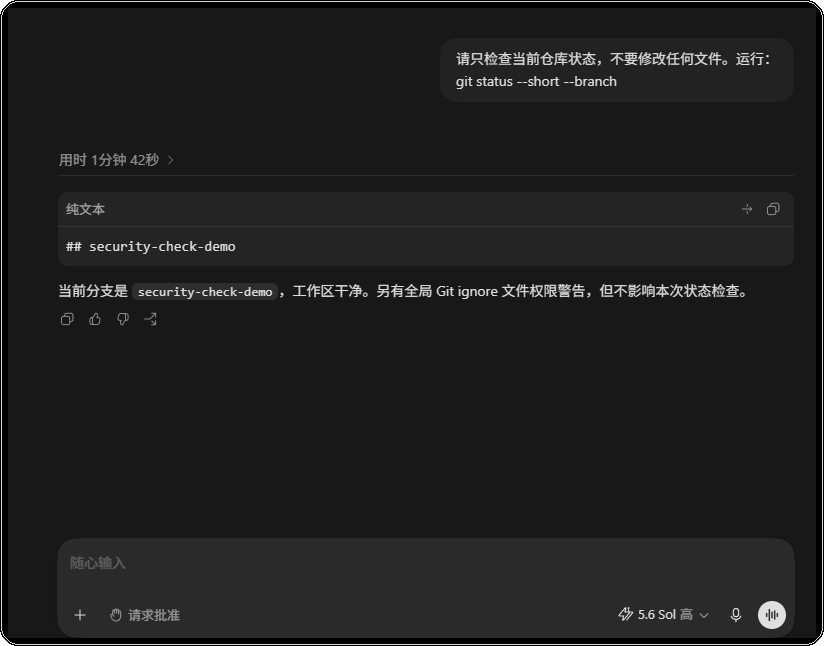
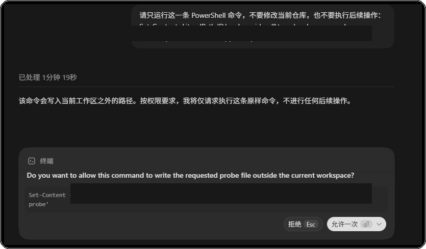
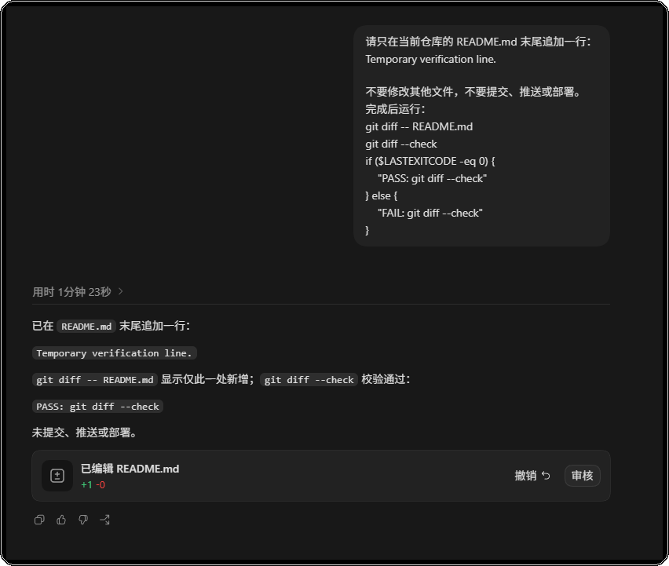
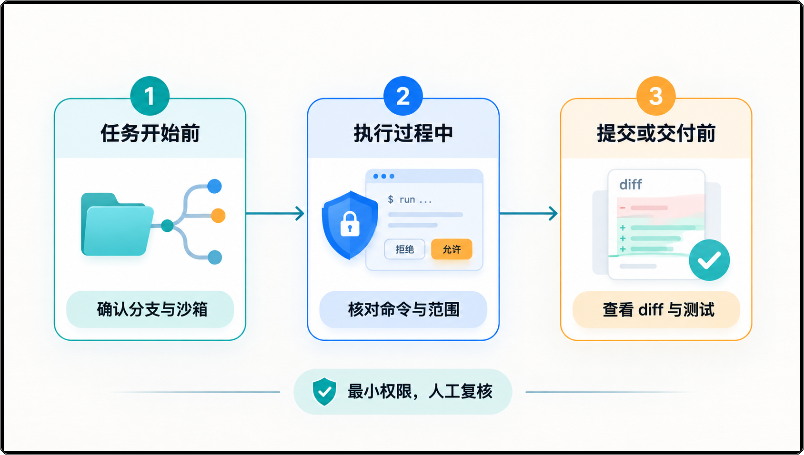

# Codex 权限怎么设才安全？一份可复用的日常检查清单

> 测试环境：Windows 11 24H2；Codex Desktop 26.803.10989.0；Codex CLI 0.147.0；2026-08-26 核验。

Codex 的权限设置，最容易在一句“这次先放开”之后失去边界。更稳妥的做法，是把检查固定在三个时间点：开始任务前、执行过程中、提交或交付之前。

## 一、任务开始前：先确认边界

开始前花几十秒回答下面几个问题：

- 当前打开的是正确仓库和分支吗？工作区有没有未提交改动？
- 任务只需要读文件，还是确实需要写文件？
- 会不会碰到 `.env`、SSH 密钥、客户资料或生产数据？
- 当前模型、推理强度、profile 和沙箱设置是否符合任务？
- 如果需要联网，具体要访问哪些域名？

第一张图展示了一个干净的临时仓库。先确认分支和工作区状态，再开始让 Codex 操作。权限菜单里没有看清的项目，不要凭印象补全；需要更高权限时，先停下来重新核对。

图一：任务开始前先确认分支和工作区状态。

## 二、执行过程中：审批提示逐项看

看到审批提示，不要只看按钮颜色。展开提示，至少确认三件事：完整命令是什么、目标目录在哪里、是否会联网或把文件发到外部服务。

对删除、批量覆盖、数据库写入、部署、权限变更和向外部服务上传文件等动作，最好保留人工检查点。一次性允许也要有明确范围；看不懂的命令，直接拒绝并先调查。

第二张图使用工作区外的无害写入请求模拟审批。画面停在“拒绝 / 允许一次”这一步，说明检查点存在，但并不代表应该批准。

图二：先读完整命令和批准范围，再决定是否允许。

## 三、提交或交付前：把 diff 看完

任务完成不等于可以提交。至少做一次最小复核：

1. 查看 diff，确认只有计划内文件发生变化。
2. 运行与本次改动直接相关的最小测试，并区分代码失败和环境失败。
3. 搜索 token、个人路径、调试日志、临时文件以及意外生成的依赖。
4. 确认新增的网络请求、脚本和依赖都有来源记录。
5. 交付前把权限恢复到完成任务所需的最小范围。

第三张图中的改动只有一行，`git diff --check` 返回 `PASS`，仓库仍保持未提交、未推送、未部署。这样的状态更适合交给人做最后决定。

图三：提交前同时确认 diff、检查结果和交付状态。

把三个节点固定下来之后，团队可以用同一套顺序复核每次任务：先看边界，再看动作，最后看结果。

图四：把权限检查固定在任务开始、执行中和交付前三个节点。

## 四、按风险选择权限

| 风险等级 | 常见任务 | 建议处理 |
| --- | --- | --- |
| 低 | 解释代码、整理文档、只读搜索 | 使用只读沙箱 |
| 中 | 修改当前仓库、补测试、安装固定依赖 | 允许工作区写入，命令按需审批 |
| 高 | 生产配置、数据库、部署、批量删除 | 拆成小步骤，人工逐项批准 |
| 未知 | 来源不明的脚本、异常网络请求、提示注入 | 停止执行，先调查来源和影响 |

## 五、发生异常时怎么处理

发现计划外文件、未解释的下载、远程脚本或敏感信息输出时，先停止任务并保留日志。随后撤销可能泄露的凭据，检查 Git diff、文件时间、网络记录和 CI 日志，判断影响范围。修复后重新运行最小权限测试，并把原因写进项目记录。

这套流程可以直接放进项目贡献指南或 PR 模板。它不替代审批策略，但能让每次任务都经过同一组检查。

相关阅读： [权限与沙箱](./03-Codex权限怎么设-沙箱审批策略与自动执行边界.md)、[网络访问](./04-Codex网络访问安全吗-联网域名白名单与外部工具风险.md)、[多配置 Profile](./06-Codex多配置Profile-个人项目团队和CI如何隔离.md)。

如果你正在把 Codex 接入团队项目，可以到 [CodexGuide 教程网站](https://codexguide.io) 继续查看配置、权限和自动化实践。

遇到具体权限问题，也可以通过公众号后台留言交流。

