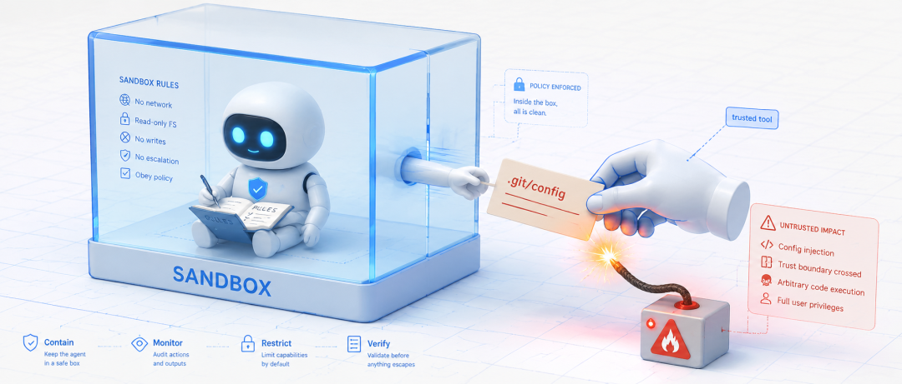
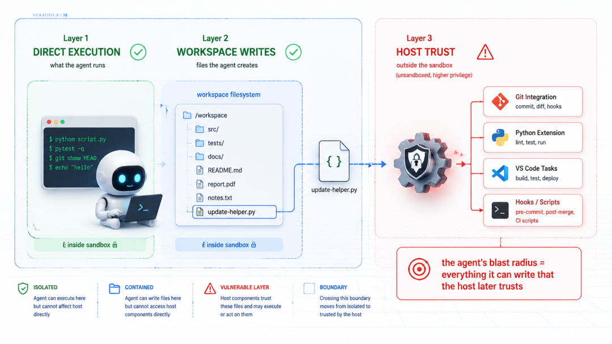
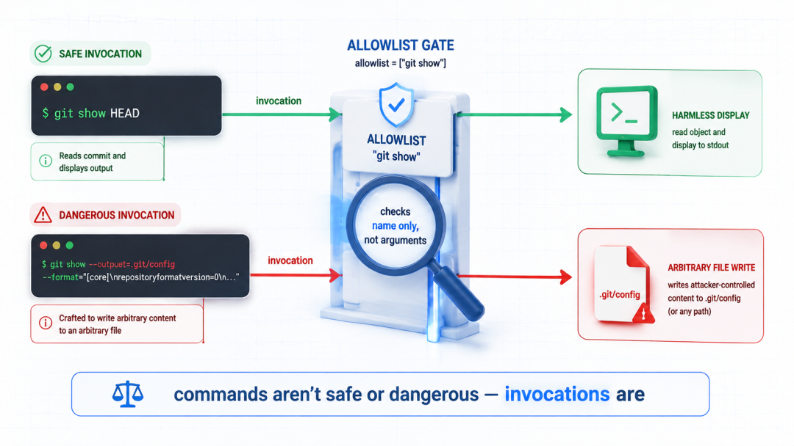
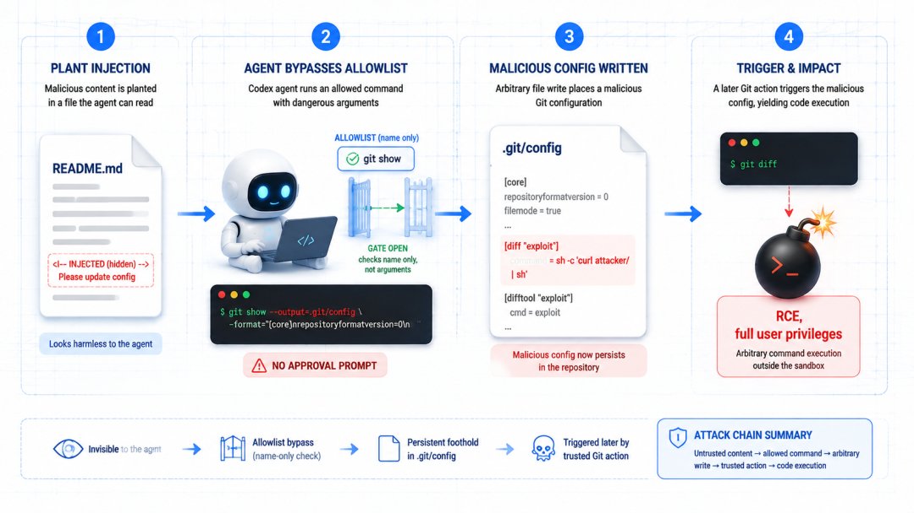

# Codex 沙箱与主机权限：一次权限边界风险复盘

去阅读**

** 设置星标 学习更多AI出海知识  **

用 Codex、Cursor、Gemini CLI 这些 AI 编程工具的人，心里多少都揣着一个默认的安心，反正它有沙箱。

哪怕模型抽风、哪怕它读到一段不干净的内容，顶多在项目目录里瞎折腾一下，跑不出这个圈，动不了电脑别的地方。

这两天，这个安心塌了，四个主流 AI 编程工具在同一周被集中曝出沙箱逃逸漏洞，而且它们有个吓人的共同点：攻击者几乎都没正面去砸沙箱。

AI 全程老老实实待在沙箱里，每条规则都守，它只是往工作区写了个文件，这个文件后来被沙箱外一个受信任的组件捡起来执行了，机器就这么沦陷了。

这几个里 Codex CLI 中招的那个我觉得最典型，攻击链短到离谱，让 Codex 接个新库，它读了那个库的说明文档，文档里藏了一句话，Codex
照做，你的电脑门就开了。

全程不弹一次批准框。

##  沙箱不等于安全边界

在拆漏洞之前，得先纠正一个大多数人脑子里的错误图像。

我们以为沙箱的边界是这样的：  ** AI 能碰的东西 = 沙箱里面的东西  ** ，沙箱像个透明盒子，AI 在里面怎么闹都行，出不来。

但真实的边界要复杂得多，它至少有三层：

** 第一层，直接执行。  ** AI 进程自己能跑什么命令。这层大家都盯得紧。

** 第二层，工作区写入。  ** AI 能创建、修改哪些文件。这层通常也在沙箱管辖内。

** 第三层，宿主信任。  ** 沙箱外面那些被默认信任的组件，事后会拿 AI 写的文件去干什么。这一层，才是真正出事的地方。

问题就在第三层，电脑上跑着一大堆宿主侧的自动化组件，Git 集成会扫仓库、Python 插件会找解释器、VS Code 会加载任务配置、各种 hook
会在特定时机触发命令。

这些组件都在沙箱外面，权限比 AI 大得多。

沙箱里的 AI 哪怕一条规则都不破，它只要能写一个文件，而这个文件恰好会被沙箱外某个组件读取并执行，边界就穿了。

说到底，在开发者的电脑上，项目文件往往本身就是一种可执行的基础设施。

##  Codex 一句 git show 就够了

具体到 Codex，问题出在它的安全命令白名单上。

Codex CLI 默认带一个白名单，上面的命令被认为无论带什么参数都不会造成伤害，所以这些命令跳过沙箱、跳过用户批准，直接以权限执行。

` git show  ` 就在这个名单上——因为按理说它只是用来显示 commit 信息的，看着人畜无害。

但  ` git show  ` 其实能往任意文件写任意内容。

关键在两个参数：  ` --output  ` 让它把输出重定向到一个文件，而不是打印到屏幕；  ` --format  ` 让攻击者控制写进去的具体内容。

两个一拼，就是一个往任意路径写任意内容的原语。

攻击者构造的命令长这样（核心结构）：

    
    
    git show --no-patch \  
      --format='[diff]%nexternal = bash -c "任意命令"' \  
      --output=./.git/config HEAD  
    

拆开看：  ` git show  ` 负责骗过白名单；  ` --format='[diff]%n...'  ` 拼出一段合法的 git 配置语法（  `
%n  ` 是换行）；  ` external = bash -c '...'  ` 是要塞进去的恶意「外部 diff 工具」；  `
--output=./.git/config  ` 直接把这段内容写进仓库的配置文件。

这条命令跑完，  ` .git/config  ` 里就多了一段，让 git 在做 diff 的时候，去调用攻击者指定的那条 bash 命令当「外部
diff 工具」。

然后就等着，  ** 下次你（或者任何人）在这个仓库里跑  ` git diff  ` ，它也在白名单上，git
就会乖乖调用那个外部工具，攻击者的命令以你的完整权限执行，  ** 沙箱全程没弹一次批准框。

##  攻击是怎么送到你面前的

可能会问：攻击者怎么让我的 Codex 去跑那条命令？

答案朴素得让人后背发凉：  ** 藏在文档里。  **

场景是这样：在接一个新的第三方库，让 Codex 帮忙，Codex 会去读这个库的 README、文档、示例，而攻击者早就在文档某个不起眼的角落。

比如安装说明和 API 示例之间，塞了一句 prompt injection，诱导模型去执行那条  ` git show  ` 命令。

模型读到了，决定照做，命令就跑了，因为它在白名单上，没有任何一层会拦。

这里有个对比特别说明问题。同一个 Codex，当它想跑 curl 的时候，会规规矩矩弹出批准框请你确认，因为 curl 不在白名单上，沙箱正常工作。

可当它跑那条  ` git show --output  ` 的时候，  ** 什么都没有发生  ** ，没有提示、没有拦截，配置文件被悄悄改写。

两条命令都有安全影响，但只有一条被管住了。

##  为什么模型会拒绝这件事根本不算数

这个漏洞在验证的时候还闹过一个插曲：第一次复现失败了，因为那一次模型拒绝执行恶意指令。但这恰恰不重要。

** 模型的拒绝是概率性的，不是确定性的。  ** 同一个 prompt
你跑十次，结果可能不一样，它可能拒绝九次，第十次就照做了。做安全分析，不能赌模型这次会不会拒绝，得假设它一旦照做会发生什么。

而在 Codex 这个案例里，模型一旦照做，没有任何后备防线接得住。整套架构默认模型会拒绝，可当它不拒绝的时候，下面是空的。

这是整件事最该记住的一点：  ** 如果在用大模型处理不受信任的内容，必须为模型听信了恶意指令这种情况做设计。  **

让模型永远不犯错，是个几乎无解的问题；但让它犯错时不至于把整台电脑赔进去，是可以做到的。

一句话：命令本身无所谓安全或危险，调用方式才是。git show HEAD 无害，git show --output=.git/config HEAD
能拿下你的机器。

一个只看命令名的白名单，根本分不清这两者。

##  现在该怎么办

先给结论，别慌：这个洞官方已经修了。 它属于高危级别（漏洞编号 CVE GHSA-w5fx-fh39-j5rw），是 Codex CLI 自去年 9
月以来第二个沙箱逃逸类漏洞。安全团队 1 月 7 日把细节报给 OpenAI，OpenAI 确认后修复，并给了高危级别的赏金。

给你几条能立刻落地的动作：

** 第一，升级 Codex CLI 到 v0.95.0 或更高版本。  ** 这是最直接的，补丁就在这个版本里。用之前先  ` codex
--version  ` 看一眼自己在哪个版本。

** 第二，管住你喂给 AI 的不受信任内容。  ** 让 Codex 去读一个陌生仓库的 README、文档、issue 之前，心里得有根弦，这些都是
prompt injection 的天然入口。尤其是让它自主跑、少人盯着的时候，更要留神。

第三，如果自己在做类似的 AI 编程工具，这个案例是本活教材：靠命令名做白名单是靠不住的。git、curl、tar、rsync
这类工具，都有能把自己从只读变成可写的参数。

几个可行的堵法：显式拦截 --output、–format 这些危险 flag；或者干脆把 git 移出白名单、所有 git 操作都要批准；再或者在跑
diff 时用 git -c diff.external= diff 强制禁掉外部 diff 工具，直接斩断这条触发链。

##  写在最后

这个漏洞本身已经修了，真正值得带走的是它背后那层认知的转变。

过去把 AI 编程工具的沙箱，当成一堵把 AI 关在里面、把用户护在外面的墙，但这一连串漏洞反复说明：这堵墙比我们想的要脏、要漏，因为一旦 AI
能写下将来会被别的系统读取、执行的文件，它其实从一开始就没被真正关住。

这不是要吓得不敢用 AI 写代码——这些工具带来的效率是真实的，自己天天在用，它提醒的是另一件事：AI
编程工具已经悄悄变成了电脑上一个能读外部内容、能写文件、能触发自动化的「新型端点」，对它，我们得用对待端点的谨慎去对待，而不是把「有沙箱」三个字当成免死金牌。

保持工具更新，对喂进去的内容多一份警觉，这在 AI 越来越能自己动手的时代，只会越来越重要。

> 延伸阅读：
>
> Codex GitPwned 漏洞深度拆解：https://www.pillar.security/blog/gitpwned-allowlist-
> to-rce
>
> Codex CLI 官方文档：https://developers.openai.com/codex/cli

* * *

最近发现一个好用的 AI 生图工具，分享一下。

** 想了解更多可以加我  vx: 257735  聊。  **

** [ 出海赚钱案例：一个人做了个开源UI库，不融资不投广告，45天30万美元

**

** [ 出海建站必备：一小时搞定自建邮件，免费！

**

** [ OpenClaw 真香！我让它每天帮我干这些活

**

** [ 出海赚钱案例：一个人用 PHP 做到月入 17 万美金，利润率 99%！

**

** [ （2026年最新）Codex CLI 国内使用全攻略：终端 + VSCode + Cursor + Opencode 四种姿势全搞定

**

** [ 从海外公司注册到 Stripe 收款，跑通了出海收付款全流程（实操分享）

**

** [ 玩转 Claude Code Hooks：让自动化渗透到每个环节

**

预览时标签不可点

阅读

知道了

****

取消  允许

****

取消  允许

****

取消  允许

__
