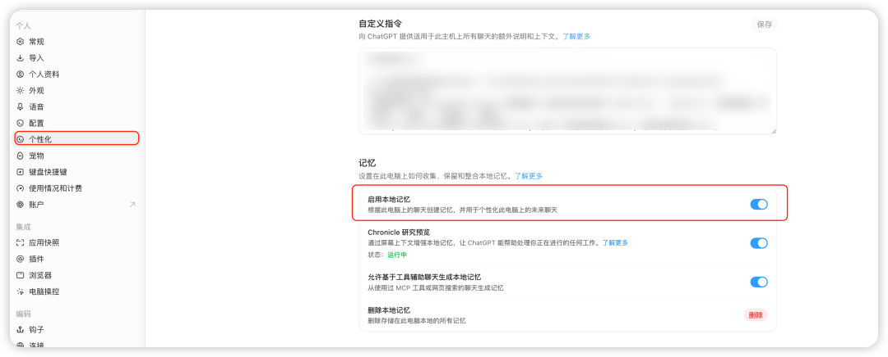
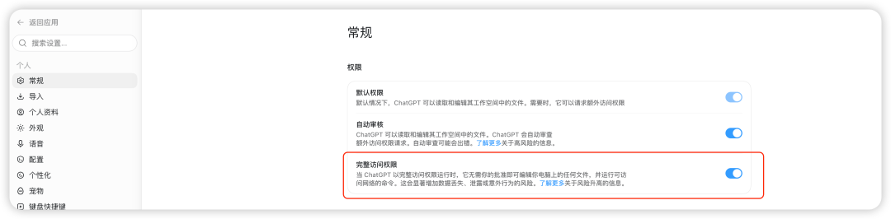
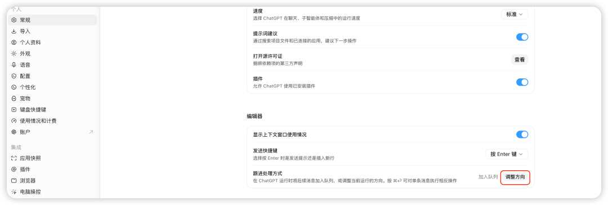
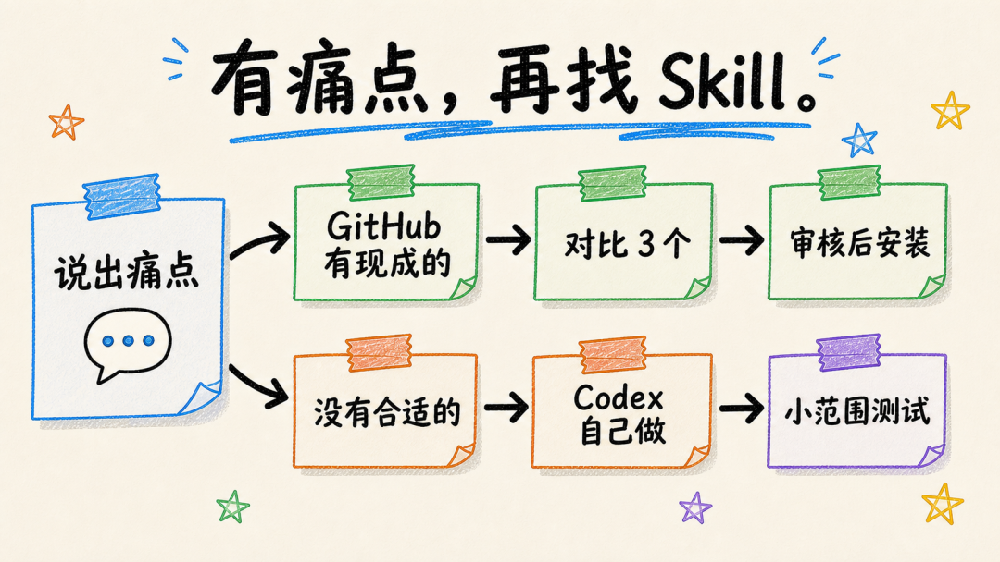

# Codex 任务总跑偏？先检查这 5 个设置

忙了一圈，使用体验还是别扭。

让它改一个小问题，它顺手碰了旁边几个文件。任务正在执行，临时补一句要求，不知道它会立刻改方向，还是等前面的工作结束。回复有时太长，有时又省掉了想看的解释。权限收得太紧，读文件、改代码、跑命令一路都在等确认。

这些问题未必需要一条更长的提示词。很多时候，Codex 还没按你的习惯设置好。

我把当前设置重新过了一遍，也对照了 OpenAI 的官方说明。开始干活以前，最值得先处理的是下面 5
项。顺序不必照着设置菜单走，我更建议从“你准备让它做什么”开始。

##  01 先选对入口， ChatGPT 和 Codex 是两个模式

左上角可以在 ChatGPT 与 Codex 之间切换。当前界面给出的说明很直白。

ChatGPT 用于“创建、学习和探索”，Codex 用于“构建、调试并发布”。

ChatGPT 与 Codex 入口

这两个入口有能力重叠，不能简单理解成 ChatGPT 只写文章，Codex 只写代码。

ChatGPT 更适合从对话出发。查资料、理解概念、比较方案、整理想法、写文档和规划产品，都可以在这里完成。即使是软件工作，也可以先用 ChatGPT
分析需求、讨论设计和写规格说明。

Codex 更像一个进入工作现场的编码智能体。它可以打开本地文件夹或代码仓库，阅读和修改文件，运行命令与测试，持续处理一个较长的工程任务。OpenAI 对
Codex 的定位也包括修复问题、开发功能、代码审查、迁移和准备可供人工审核的改动。

只需要讨论、研究、创作和规划，先用 ChatGPT。需要进入真实工作区，对文件和命令产生操作，切到 Codex。

##  02 把长期习惯写进自定义指令，再决定要不要开本地记忆

进入“个性化”，上半部分是自定义指令，下半部分是记忆。

自定义指令与本地记忆

自定义指令适合保存长期不变的协作要求。你希望它先分析还是直接做，要简短结论还是详细解释，能不能顺手调整相邻文件，都可以提前说清楚。

新手先写四条就够了。

    先思考，再动手。  
    减少无关解释，优先回答当前问题。  
    只做必要修改，不随意扩大范围。  
    围绕目标给出结果和验证情况。  
    

“启用本地记忆”，会根据这台电脑上的聊天创建记忆，用来个性化这台电脑上的后续聊天。

自定义指令和记忆解决的问题不同。前者是你主动写下的规则，后者会从聊天中保留可复用的信息。它们都不适合存放密钥、Cookie、客户资料和其他敏感内容。

如果你不希望某次聊天读取或更新记忆，可以关闭记忆，或者在支持的入口里使用临时聊天。官方也提供了查看、修改和删除记忆的控制。

##  03 回复总是太啰嗦，就把“个性”改成务实

“个性”决定 ChatGPT 默认用什么语气回复。当前界面提供两种选择。

“亲和”对应温暖、协作、贴心。它更愿意照顾阅读感受，解释通常也会多一些。刚开始接触 Codex，希望它多补背景、多讲原因，可以先用这一档。

“务实”对应简洁、专注、直接。它会更快进入问题，减少客套和铺垫。已经熟悉操作，平时更关心步骤、结果和风险提示，用这一档会省心很多。

回复个性中的亲和与务实

如果你经常觉得回复绕、重点难找，可以跟着这样设置。

个性只影响默认表达方式，不会改变模型能力和安全规则。具体任务的要求仍然优先。比如让它写一封温和的邮件，即使默认选择务实，它也会根据当前要求调整语气。

如果还想控制得更细，可以在自定义指令里补两句。

    减少客套和重复总结。  
    先给结果，必要时再补原因和注意事项。  
    

##  04 权限决定 Codex 能不能把一条任务连续做完

当前有三种选择。

“默认权限”允许 ChatGPT 读取和编辑工作空间里的文件，需要额外访问时再请求批准。

“自动审核”会自动审查额外访问权限请求，但界面明确提醒，自动审核可能出错。

“完整访问权限”允许它编辑电脑上的任何文件，并运行可以访问网络的命令，不再逐次等待批准。页面同时给出了数据丢失、泄露和意外行为风险提示。

默认权限、自动审核与完整访问权限

权限收得太紧，一条本来连续的执行过程会不断停下来。读文件、分析、修改、运行测试，每一步都在等人点确认，Codex 很快就变成了半自动工具。

完整访问确实省事，代价是监督更少。官方对 Full Access 的描述也是减少阻力，同时牺牲一部分人工监督。

熟悉、已经备份、风险可控的本地项目，可以按需要放宽权限。涉及数据库、生产环境、公开发布、账号配置和重要文件删除时，仍要在任务里写清边界。项目陌生、文件重要或没有备份时，默认权限会更稳。

##  05 跟进处理方式选“调整方向”，临时纠偏才不会排到最后

跟进处理方式中的调整方向

“跟进处理方式”决定 Codex 正在运行时，新消息怎样进入当前任务。当前有“加入队列”和“调整方向”两个选项。

加入队列会把新消息排到当前工作之后。适合要求已经明确、只想让后续任务按顺序执行的情况。

调整方向会让新消息参与当前执行。发现理解偏了，需要补一条限制，或者想让它立即缩小修改范围时，新要求可以直接改变正在进行的工作。

OpenAI 将这种用法称为 steering。它允许用户在 Codex 工作时补充上下文、修正方向、批准下一步，或者安排工具调用之后的动作。

对于新手，我更建议选择“调整方向”。需求往往很难一次写全，发现偏差后及时拉回来，比等它沿着错误方向做完更省时间。

##  基础设置调顺以后，再谈 Skill

前面 5 项决定 Codex 怎样跟你合作。Skill 解决的是另一件事，把一套重复出现的工作流程保存下来，让 ChatGPT 或 Codex
以后能够继续照着做。

一个 Skill 通常会写清任务什么时候触发、需要哪些输入、中间按什么步骤执行、最后交付什么，还可以带模板、示例和检查脚本。

新手不用先逛一堆网站，也不用研究哪一个 Skill 最热门。先把自己的痛点告诉 AI。

![Skill

##  有明确痛点，就让 AI 直接去 GitHub 找

比如你每周都要整理文献，做完以后还要按固定格式生成综述。或者每次改完代码，都想自动检查修改范围、测试和潜在风险。

把这件事原样告诉 ChatGPT 或 Codex，让它去 GitHub 搜索合适的
Skill。找到以后先别急着安装，让它继续检查用途、最近更新、安装方式、依赖、文件访问范围和风险。

可以直接复制这段。

    我经常需要完成下面这项工作。  
      
    请根据这个痛点去 GitHub 搜索合适的 Skill。先给我列出最匹配的 3 个，说明各自解决什么问题、需要哪些依赖、会访问哪些文件、最近是否仍在维护，以及可能存在的风险。  
      
    先不要安装，等我选定以后再继续。  
    

##  GitHub 没找到合适的，就让 Codex 做一个自己的 Skill

有些流程很私人，网上很难刚好找到。

比如每周都要读取同一批文件，按照自己的模板输出报告，最后还要检查几个固定项目。现成 Skill 即使方向接近，细节也常常对不上。

这时候可以直接使用 Codex 自带的 Skill
创建能力。把你平时怎样完成这件事告诉它，让它整理出触发条件、输入、执行步骤、输出格式和最后检查，再生成一个可以安装的 Skill。

第一次描述不用特别专业。把真实流程讲清楚就行。

    我经常重复下面这项工作。  
      
    请先帮我梳理输入、操作步骤、输出格式和检查标准，再把它做成一个 Skill。生成后先展示完整内容和文件结构，说明它会读取或修改哪些内容。等我审核通过后再安装。  
    

如果说不清完整流程，可以先让 Codex 跟着你做一遍。任务结束后，再让它根据这一轮实际步骤整理
Skill。这样做出来的内容通常比凭空写一套规则更贴合自己的习惯。

##  找到或做好以后，先跑一次小测试

无论 Skill 来自 GitHub，还是由 Codex 根据你的流程生成，第一次都别直接扔进重要项目。

挑一份可以丢弃的示例文件，跑一次低风险测试。确认系统能够识别，任务匹配时能够触发，读取和修改范围符合预期，最后输出也能用。

做到这一步，这个 Skill 才算真正装好。

##  最后

第一次用 Codex，不需要一上来就研究复杂提示词，也不用先装满一页 Skill。

先花几分钟把入口、个性、记忆、权限和跟进方式调顺，再拿一个真实的小任务试一遍。哪里还别扭，就回到对应设置改一下。

等你发现某件事已经重复做了三四次，再把痛点交给 AI。GitHub 有合适的就筛选后使用，没有合适的就让 Codex 按自己的流程做一个。

这样装下来的每个 Skill，你都知道它为什么存在，也知道下次什么时候该用。

