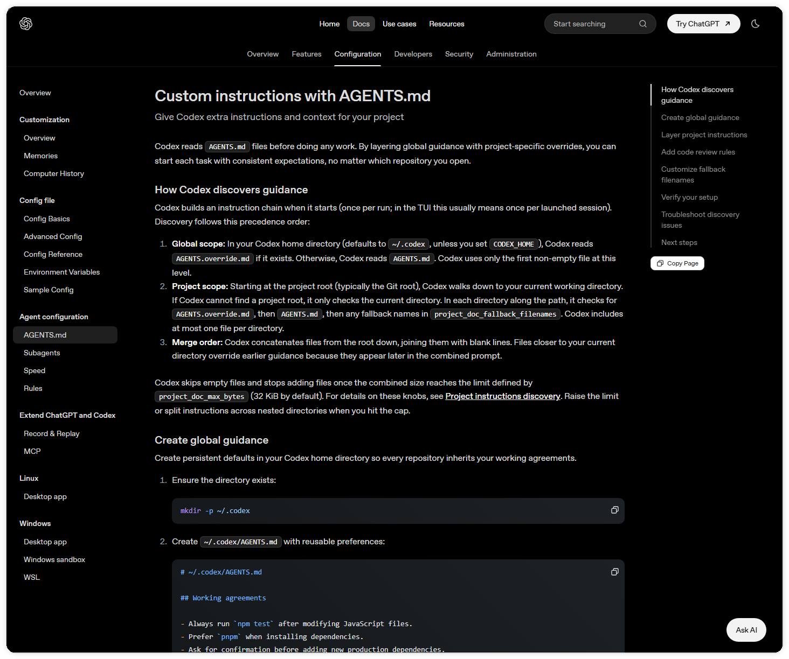
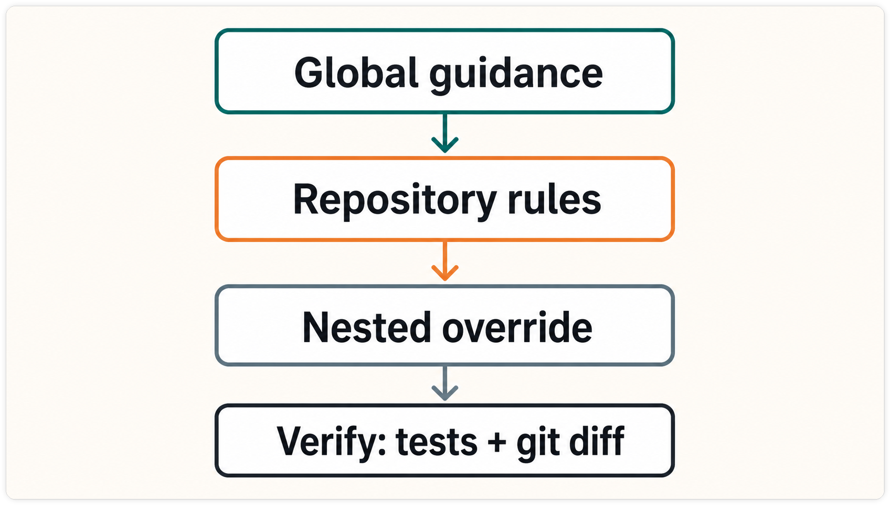

# AGENTS.md 怎么写：项目规则、继承关系与验收标准

`AGENTS.md` 是写给 Codex 的项目工作约定。它应该让 Codex 知道项目做什么、哪些目录可以改、用什么命令检查，以及哪些动作需要人确认。规则写得越具体，开发者越容易在 diff 和命令输出里检查它有没有生效。

如果你还在熟悉 Codex 的工作方式，可以先看《别再重复提醒 Codex：用 AGENTS.md 让它读项目先读规则》，再回来整理当前项目的规则文件。

## 先决定文件放在哪里

Codex 会在一次运行开始时建立指令链。全局规则来自 Codex home 目录，默认是 `~/.codex`。这一层优先读取 `AGENTS.override.md`，没有它才读取 `AGENTS.md`，同一层只取第一个非空文件。

项目规则从项目根目录一路检查到当前工作目录。每个目录依次检查 `AGENTS.override.md`、`AGENTS.md` 和配置中声明的备用文件名，每个目录最多加入一个文件。合并时先放根目录内容，再放更靠近当前目录的内容，后者会覆盖前面的约定。

例如，仓库根目录可以写通用测试命令，`services/payments/AGENTS.override.md` 再补充支付服务的测试命令和密钥操作限制。Codex 从 `services/payments` 启动时，会先读全局规则，再读仓库根目录，最后读这个子目录的 override 文件。同一目录同时存在 `AGENTS.override.md` 和 `AGENTS.md` 时，普通文件不会再加入指令链。

Codex 默认把合并后的项目说明限制在 32 KiB。文件过长时，优先拆到更具体的子目录，或在确认影响后调整 `project_doc_max_bytes`。备用文件名也必须在 `config.toml` 的 `project_doc_fallback_filenames` 中声明，写完后重新启动 Codex 再验证。



图一：官方文档列出全局规则、项目规则和目录合并顺序。



图二：规则从全局层逐步收窄到目录覆盖，最后由测试和 Git diff 验收。

## 一份可用文件写清四件事

一份规则文件至少要回答下面四个问题。

1. 项目用途和主要技术是什么。
2. 安装、开发、测试、构建和格式化分别运行什么命令。
3. 哪些目录允许修改，哪些生成文件或配置不应直接编辑。
4. 什么时候算完成，哪些高风险操作必须先得到人工确认。

把“修改后注意测试”改成可以检查的句子。例如，写成“修改 `src/` 后运行 `npm test -- --runInBand`，失败时保留输出并先说明原因”，开发者就能从命令、范围和失败处理三处核对这条规则。

## 通用模板

下面的模板适合先放在仓库根目录，再按实际项目替换命令和路径。

```md
# AGENTS.md

## 项目

- 用一句话说明项目用途和主要技术。
- 说明默认开发环境和包管理器。

## 常用命令

- 安装依赖：`npm ci`
- 开发：`npm run dev`
- 测试：`npm test`
- 构建：`npm run build`
- 格式检查：`npm run lint`

## 修改边界

- 允许修改：`src/`、`tests/`。
- 生成文件：`dist/`，由构建命令生成，不直接编辑。
- 禁止提交：`.env`、密钥文件和本机临时目录。

## 完成标准

- 只修改任务涉及的文件。
- 运行与改动直接相关的测试和检查。
- 提交前查看 `git diff` 和 `git diff --check`。

## 需要确认的操作

- 删除、批量覆盖、部署、数据库写入和向外部服务上传文件前，先说明目标、范围和恢复办法。
```

这些命令只是模板示例。项目使用其他语言或包管理器时，替换成仓库里真实存在的命令，不要把示例原样当成项目事实。

## 前端项目模板

前端项目往往同时有源码、静态资源和构建产物，可以把边界写得更细。

```md
# AGENTS.md

## 项目结构

- 页面和组件位于 `src/`。
- 浏览器测试位于 `e2e/`。
- `public/` 只放不需要构建处理的静态资源。
- `.next/`、`dist/` 等产物由脚本生成，不直接修改。

## 验证顺序

1. 修改组件后运行 `npm run lint`。
2. 修改交互后运行对应的 `npm run test:e2e -- <spec>`。
3. 发布前运行 `npm run build`，并检查构建日志和页面结果。

## 视觉与数据边界

- 沿用现有设计令牌和组件，不在单个页面复制一套全局样式。
- 不把真实用户数据、访问令牌或生产接口写入示例。
- 需要改路由、环境变量或部署配置时，先列出影响范围。

## 交付检查

- 查看 `git diff --stat` 和完整 diff。
- 确认没有调试日志、截图或临时文件进入提交。
- 记录测试命令、结果和未解决的环境问题。
```

## 规则、请求和 Git 各管一段

`AGENTS.md` 负责长期有效的项目约定，不能代替当前任务的需求确认。它也不能越过沙箱、操作系统权限或审批策略去授权危险操作。任务开始前先看 `git status --short --branch`，修改后再看 diff，保留现有改动，不用规则文件掩盖冲突。

更稳妥的验证顺序是先让 Codex 做只读检查，再完成一个十几分钟内可以审查的小修改。确认它读到了预期文件、运行了指定命令、没有碰到边界外的目录后，再把规则扩大到更多服务或自动化流程。

## 常见问题与排查

- 文件存在但没有生效。检查启动目录、项目根目录和文件是否为空，然后重新启动 Codex。
- 子目录规则没有覆盖根规则。确认当前目录确实位于该子目录，并检查同层是否有 `AGENTS.override.md`。
- 命令只适用于某台机器。把命令所需的运行时、版本和前置条件写清楚，不能只写“运行测试”。
- 规则文件里出现密钥、个人路径或生产操作。立即移出敏感内容，并把高风险动作改成需要人工确认的步骤。

## 相关阅读

如果你还在整理项目入口，可以继续看 [Codex 项目理解与上下文](../03-项目理解与上下文/)。完成修改后，再按 [Codex 安全检查清单](./07-Codex安全检查清单-把权限配置变成可复用的日常流程.md) 复核权限、diff 和交付状态。

本文依据 [OpenAI 官方 AGENTS.md 文档](https://developers.openai.com/codex/agent-configuration/agents-md) 核对加载顺序、override 规则和项目说明大小限制。

规则文件让重复约定有了固定位置，但人工审查、测试结果和 Git 回滚仍然不可省略。

如果你准备把这套规则落到自己的仓库，可以到 [CodexGuide 的 AGENTS.md 项目协作规则](https://codexguide.io/advanced/agents-md?utm_source=wechat&utm_medium=article&utm_campaign=agents-md-project-rules&utm_content=closing-site-01) 对照网页版本继续实践。

如果你的项目有特殊目录、命令或审批边界，也可以扫码添加微信，带着具体规则一起交流。


