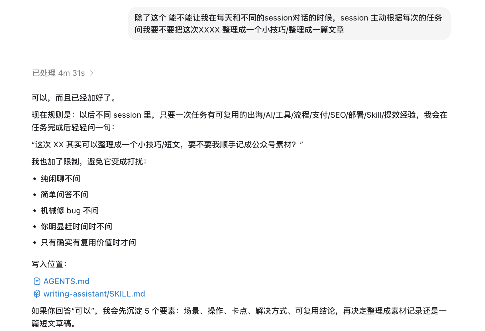

# Codex 在任务结束时捕捉可复用素材

最近一直在调整内容方向。

每天都想写一点和 Codex 相关的内容，但到了要写的时候，经常想不起今天有什么值得写。

这时候很容易去搜最近几天有什么热点资讯，然后硬写一篇。文章能写出来，但自己回头看也会觉得干。像是在整理别人的信息，离自己每天真实做的事情越来越远。

这段时间复盘下来，真实做过的 Codex 任务更适合整理。比如改过一个流程、处理过一个配置问题，或者发现了一个可以复用的小技巧。

这些内容不一定大，也不一定完整，但是真实。

我每天会在不同的 Codex session 里处理很多事情。

有时是在 Codex 里改项目，有时让 Codex 通过浏览器配置服务。

这些事情当时看起来都很普通，但里面经常有可以分享的细节，比如一个流程怎样交给 Codex 执行，一个配置项为什么这样选，或一张截图怎样处理才不暴露内部信息。

问题是，意识不到我可以把它分享出来，或者忙起来就忘了。上下文不在同一个 session 里，自己也不一定记得当时的判断。

所以我今天先做了一个很小的调整，让 Codex 在工作结束时提醒我。

## 我加了一个“素材捕捉触发器”

这个规则很简单。

以后如果某次 Codex 任务包含可复用的流程、支付、SEO、部署、Skill 或提效经验，Codex 在任务完成后主动问一句

“这次 XX 其实可以整理成一个小技巧或短文，要不要我顺手记下来？”

如果我说可以，它再帮我整理 5 个要素，包括场景、操作、卡点、解决方式和可复用结论。

现在只是先把提醒规则加到 Codex 的用户级配置里，让不同 session 都能记得这件事。

我想解决一个具体问题，不要等到写文章时再找素材，尽量在 Codex 任务现场把素材记下来。

如果后面这个机制能跑起来，内容整理应该会更轻一点。

不需要每次都写长文，也不需要每篇都追热点。今天让 Codex 完成一个工具接入，可以写。今天让 Codex 跑完一个重复流程，也可以写。今天发现一个截图避坑、一个支付配置细节或一个 SEO 检查项，也可以写。

关键是内容来自真实操作，而不是为了更新去凑一个主题。

这个规则今天刚加上，还不能说效果怎么样。

但我觉得这个方向值得试。很多时候，写不出来是因为 Codex 做过的事情没有及时变成素材。

如果效果不错，这可能会变成一个很轻的内容工作流，日常做事，Codex 帮忙提醒，合适的内容再整理成短文。
