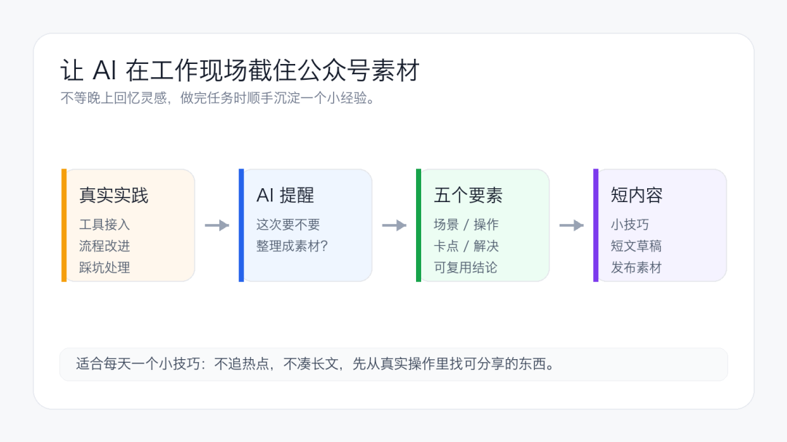

# Codex 在任务结束时捕捉可复用素材

一个任务刚结束时，操作步骤、失败原因和取舍还在当前上下文里。等到几天后再整理，很多细节已经需要重新查。可以给 Codex 增加一条任务结束规则，只在确实出现可复用经验时生成素材候选。

这条规则适合经常用 Codex 做项目维护、工具接入和流程改进的人。它只负责记录线索，不自动发布内容，也不应把私密配置写进素材库。



> 概念示意，任务完成后先判断复用价值，再整理可核对的素材记录。

## 哪些任务值得记录

触发条件要具体，否则 Codex 每次简单问答后都来提醒，几天以后这条规则就会变成干扰。

适合记录的内容包括一条跑通的工具接入流程、经过验证的配置取舍、具有复现步骤的故障处理，以及可以重复执行的发布或检查方法。

下面几类任务可以直接跳过。

- 纯聊天和简单问答。
- 没有稳定复现方式的偶发故障。
- 只对当前临时环境有效的处理。
- 包含账号凭据、客户数据或内部地址，且无法可靠脱敏的内容。
- 赶时间结束，用户已经明确不需要额外整理的任务。

## 把规则放在哪里

只服务一个仓库的规则可以写入项目根目录的 `AGENTS.md`。多个项目都要使用时，可以放进 Codex 的用户级 `AGENTS.md`，再让具体项目用更靠近工作目录的规则覆盖它。

项目规则会随仓库一起共享。个人内容规划、私有素材路径和账号信息不要提交到公共仓库，这类设置更适合放在本机用户级规则中。

## 一份可直接使用的触发规则

```markdown
任务结束时捕捉可复用素材

完成主要任务后，检查本次工作是否产生了可复用经验。

满足下列任一条件时，输出一个“素材候选”小节。

- 跑通了可以重复执行的工具接入或自动化流程。
- 找到并验证了一个不明显的故障原因和修复方法。
- 形成了有依据的配置、安全或发布取舍。
- 产出了可公开复用的命令、检查清单或操作顺序。

纯聊天、简单问答、机械性修改和没有复现证据的猜测不触发。

素材候选包含任务场景、实际操作、遇到的卡点、解决方法、
可复用结论和证据路径。不得写入密钥、个人信息、客户数据、
内部域名或未经确认的结论。

只生成候选内容。写入素材文件或发布前先取得用户确认。
```

规则里的“完成主要任务后”很重要。素材整理不能打断原任务，也不能把尚未验证的中间结果写成经验。


> 原稿中的规则配置示例，展示了触发范围、跳过条件和输出要素。

## 固定素材候选的格式

稳定格式方便后续筛选，也能减少同一件事被写成多条空泛总结。

```markdown
素材候选

- 任务场景
- 实际操作
- 卡点与原因
- 解决方法
- 可复用结论
- 证据路径或公开来源
- 需要删除或脱敏的信息
```

证据路径可以是改动文件、测试命令、公开文档链接或错误日志位置。它帮助后续写作者重新核对，不代表这些内部路径都可以直接公开。

## 需要落盘时再增加保存规则

素材候选先显示在任务结果里最稳妥。确定要长期保存后，可以增加一个本机目录，例如 `notes/materials/`，并规定文件名和状态字段。

```markdown
---
title: Codex 任务素材标题
status: candidate
created: 2026-08-20
source_task: 任务名称或本机记录
privacy_review: pending
---
```

公共仓库不适合存放个人内容计划。素材目录如果位于项目内，需要先检查 `.gitignore` 和团队约定，避免把本机记录误提交。

## 用一个小任务验证规则

配置完成后，分别测试一次应该触发和不应触发的任务。

1. 让 Codex 完成一个带验证步骤的小型流程改动，检查结果中是否出现素材候选。
2. 提一个普通概念问题，确认它不会生成无关提醒。
3. 在测试材料里放入明显的占位密钥，确认输出不会复述敏感值。
4. 拒绝保存一次，确认 Codex 不会擅自写入素材文件。

如果触发太频繁，就收紧条件。候选内容总是很空，说明规则缺少证据字段或任务本身没有足够材料。先把触发和记录做好，再考虑自动分类、定时复盘或发布工作流。

## 参考资料

- [Codex 的 AGENTS.md 说明](https://developers.openai.com/codex/guides/agents-md)
- [Codex 官方文档](https://developers.openai.com/codex/)
