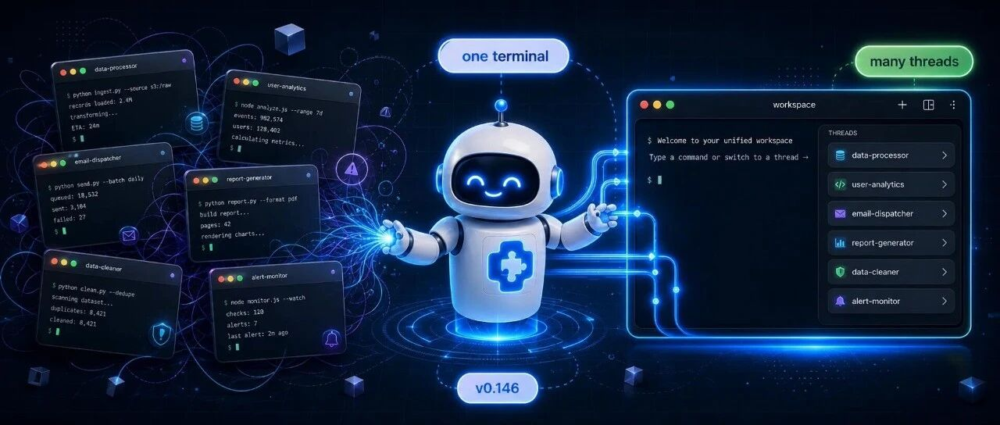
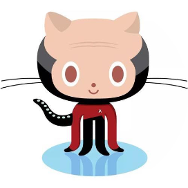
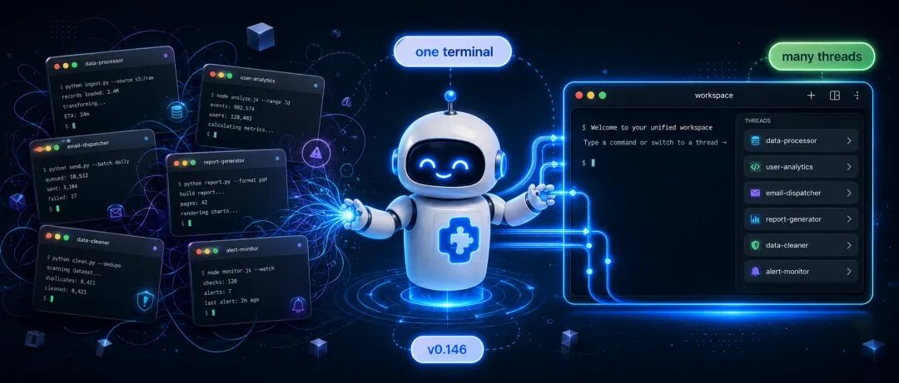
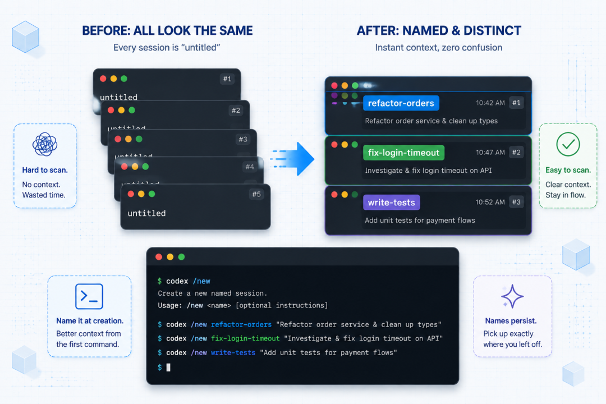
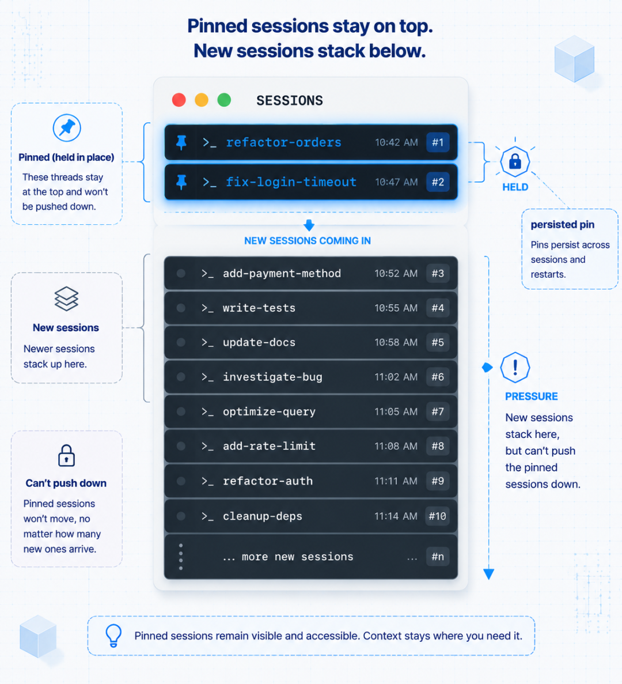
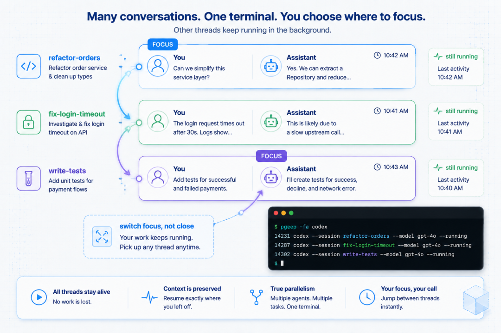
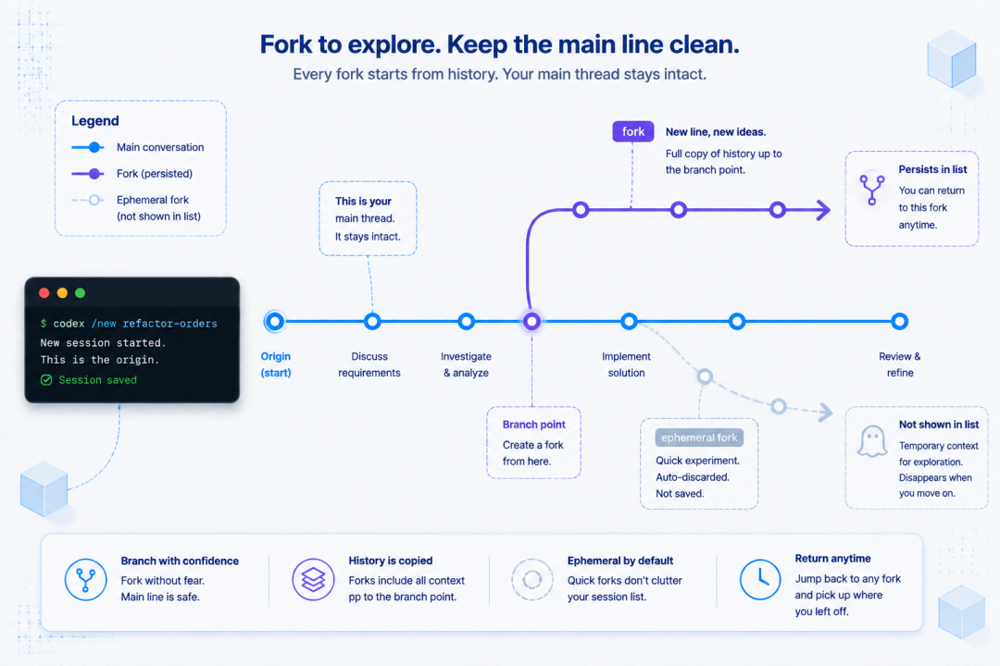
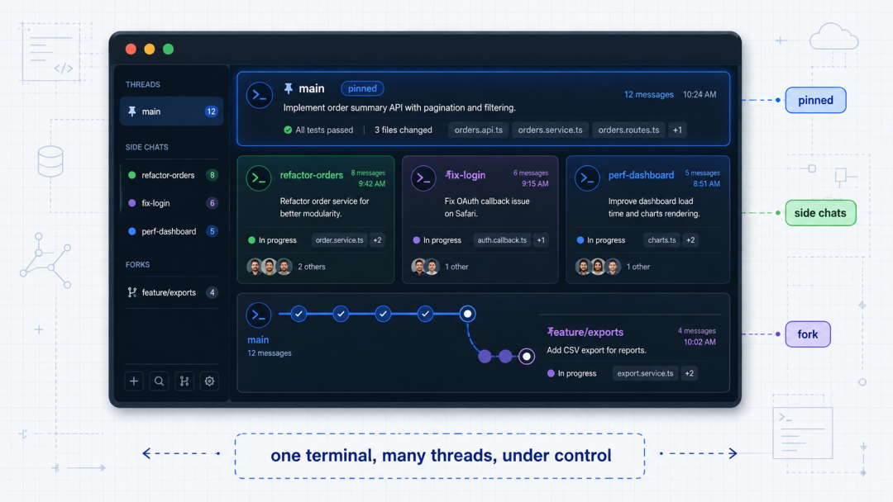

# Codex CLI 管理多条任务线：命名、切换与 fork

> 难度：进阶
>
> 类型：CLI 会话管理

当你同时处理重构、排错和测试时，不必为每条任务线开一个终端窗口。Codex CLI 可以保存会话、给会话命名、在会话之间切换，并从已有会话 fork 出一条独立分支。



## 先给会话命名

在当前会话中输入 `/rename`，给它一个能表达任务的名字，例如 `订单模块重构`。名字会显示在会话选择器里，后面查找时不必逐个打开历史记录。

```text
/rename 订单模块重构
```

名称只帮助识别，不会改变任务目标，也不会扩大 Codex 的权限。


## 保存、切换和归档

`codex resume` 会打开已保存的交互会话列表，也可以按会话 ID 或名称恢复。会话选择器支持搜索和归档，归档只是从常用列表中收起，不会删除转录内容。

```bash
codex resume
codex resume --last
```

需要清理列表时，可以归档已经结束的会话。正在运行的任务不要为了“整理界面”而关闭，先确认它是否已经完成并记录验证结果。



## 从当前节点 fork

`/fork` 会从当前聊天复制出一条新会话，原会话保持不变。适合在不影响主线的情况下尝试另一种实现、比较两种修复方案，或对同一份上下文做一次只读审查。

```text
/fork
```

在终端里，也可以用 `codex fork` 打开会话选择器，或用 `codex fork --last` 直接从最近一次会话分叉。

fork 会复制截至当前节点的对话历史，不会自动合并两条会话后续产生的文件修改。涉及写入时，先给每条分支独立 worktree，或明确只允许其中一条执行修改。



## 一套实用的多线安排

可以把任务分成三类：

1. 主线会话负责实现和最终验证。
2. 辅助会话只读分析日志、测试和代码结构。
3. 实验会话从主线 fork，用来比较替代方案。

每条会话都写清输入、输出和是否允许修改文件。这样切换会话时，名字和状态就足够恢复上下文，不需要重新回忆“这条窗口在做什么”。



## 常见风险

- 多条会话同时修改同一文件，容易产生覆盖或难以审查的差异。
- fork 只是复制上下文，不是 Git 分支，也不会替你隔离工作目录。
- 归档不会删除敏感内容，归档前仍应按项目规则处理日志和凭据。
- 会话名称、命令和界面可能随 CLI 版本变化，遇到差异以当前 `codex --help` 和官方文档为准。









## 参考资料

- [Codex CLI command reference](https://developers.openai.com/codex/cli/reference)
- [Slash commands in Codex CLI](https://developers.openai.com/codex/cli/slash-commands)
