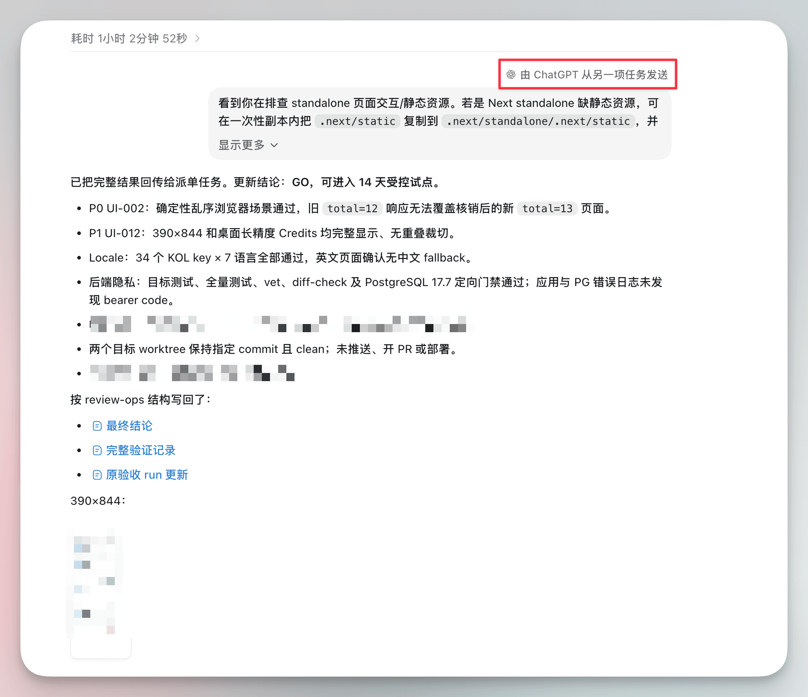
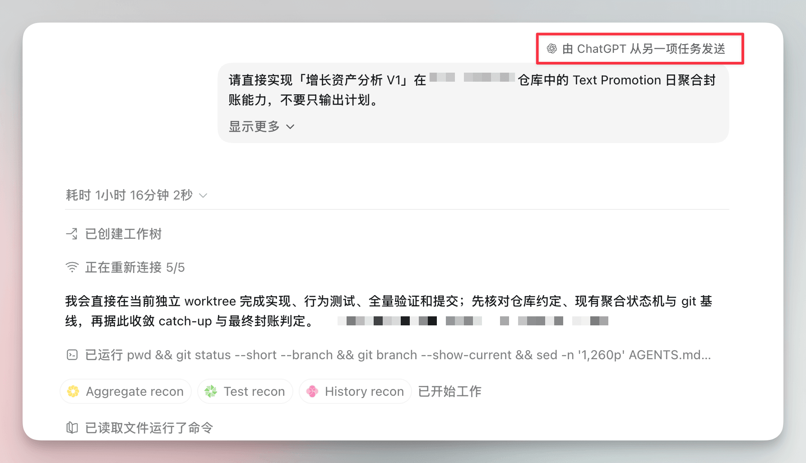

# Codex 跨会话协作功能

Codex 的跨会话协作功能，我已经用了一段时间。它帮我省掉了很多来回搬运信息的时间。

下面是我目前的使用场景。

我比较喜欢把一个需求或一项任务完整地放在同一个会话里，从讨论、执行到最后部署上线。这样这个会话会非常清楚整个需求的上下文，从开始一直到最终验收，也能确保不会混入其他内容。

一个会话里要处理的事情太多，经常动不动就是一长串 P0、P1、P2，很容易把需要我决策的关键信息覆盖掉。

如果重新开一个会话，人又像搬运工一样，需要来回复制粘贴，还可能漏掉关键点。

Codex 支持一个会话创建另一个会话，并把任务交过去，这个问题就简单了很多。

比如功能做完之后，我可以直接告诉它：“准备测试用例，在某个文件夹下面创建一个新会话，把测试交给对方来做，你负责验收即可。”

这样一个负责测试，一个负责验收，两个会话之间可以互相交流。我只需要等结果，再做最后的验收就行了。

再比如，一个任务进行过程中衍生出了可以独立处理的其他任务，也可以直接让当前会话创建一个新会话，把任务和上下文一起发送过去，省时省力。

