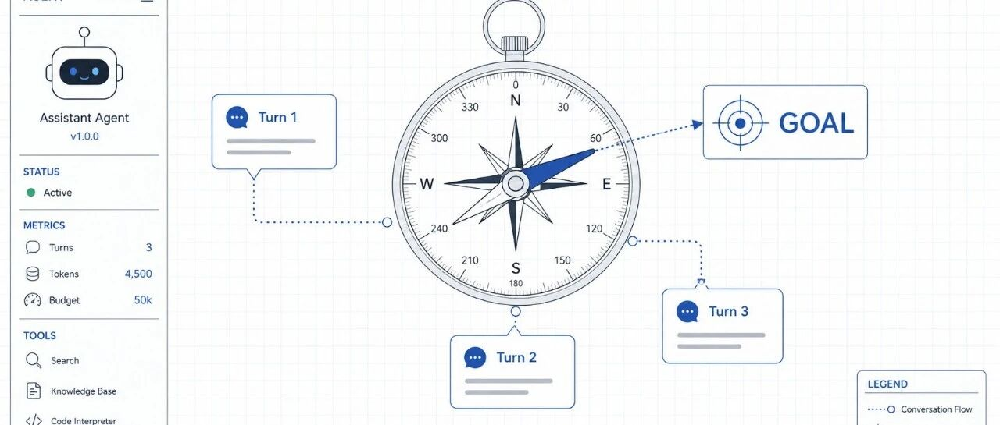
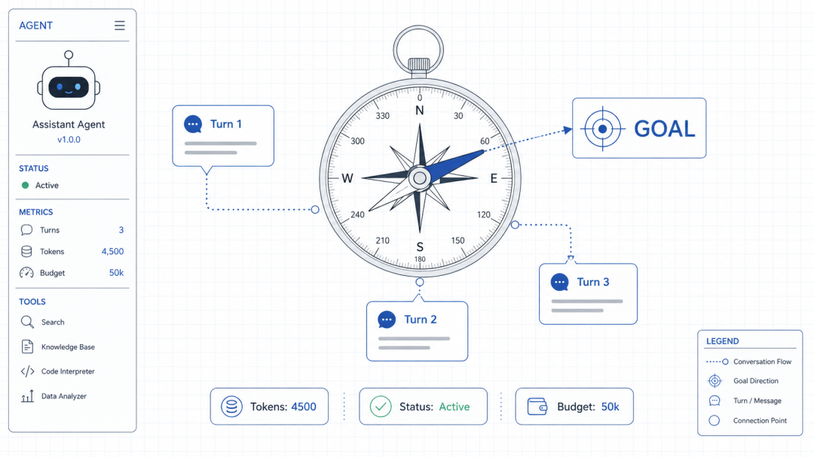
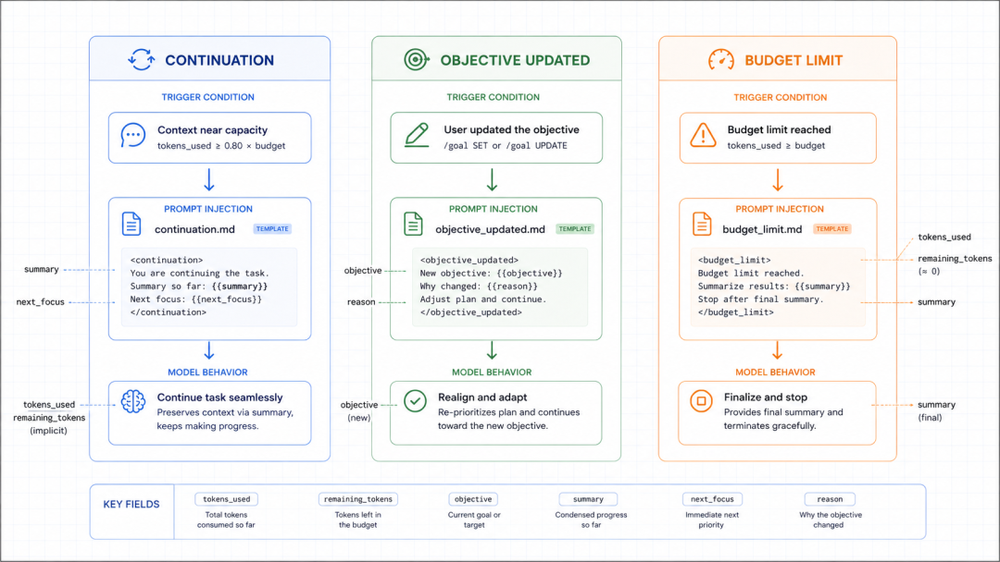
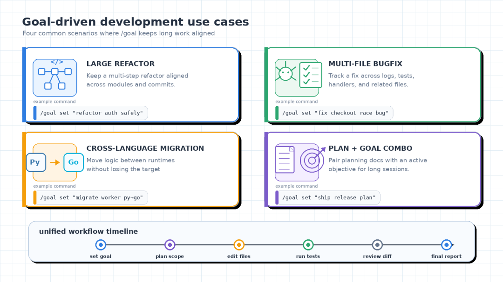

# Codex CLI 长任务如何恢复：保存、继续与检查会话

> 难度：进阶
>
> 类型：长任务与会话恢复

长任务中断后，最重要的不是让 Codex“接着猜”，而是恢复原会话并重新确认目标、修改范围和验证状态。CLI 的会话恢复能力可以保留对话历史，但不能替代 Git、测试和人工检查。



## 先保存现场

结束终端前先记录三件事：当前目标、已经修改的文件、最后一次实际运行的检查。把这些信息写进项目任务文件或提交说明，比只依赖聊天记录更可靠。

如果任务还在运行，不要直接关闭终端。先让 Codex 汇报进度，必要时暂停在一个可检查的节点。


## 恢复已有会话

在项目目录中运行：

```bash
codex resume
```

从列表中按名称或 ID 选择会话。只想继续最近一次会话时，可以使用：

```bash
codex resume --last
```

恢复后先让 Codex 只读检查当前工作区，不要马上继续大范围修改：

```text
请先检查当前会话目标、git status 和最近的 diff。
不要修改文件。列出已经完成、尚未完成和需要重新验证的项目。
```


## 目标变化时重新确认

如果需求已经变化，先明确告诉 Codex 哪些约束被替换，哪些仍然有效。不要在旧会话里追加一句模糊的“顺便改一下”，否则它可能把新任务和旧目标混在一起。

需要完全不同方向的尝试时，用 `/fork` 创建新会话；需要继续同一条主线时，用 `codex resume`。



## 恢复后的验收顺序

1. 查看 `git status`，确认工作区和预期项目一致。
2. 查看 `git diff`，检查是否有无关文件或意外重构。
3. 运行失败过的最小测试，再扩大到完整检查。
4. 记录命令、结果和仍未覆盖的边界。

会话历史只能说明“讨论过什么”，不能证明“代码现在正确”。真正的完成证据仍然是差异、测试、构建或页面检查。


## 什么时候不要继续旧会话

出现以下情况时，开新会话通常更稳妥：原目标已被完全替换，工作区被其他人改动，历史里混入了密钥或客户数据，或者原会话已经无法清楚说明当前状态。新会话要从项目文件和 Git 状态重新建立事实基础。





## 参考资料

- [Codex CLI command reference](https://developers.openai.com/codex/cli/reference)
- [Long-running work](https://developers.openai.com/codex/long-running-work)
