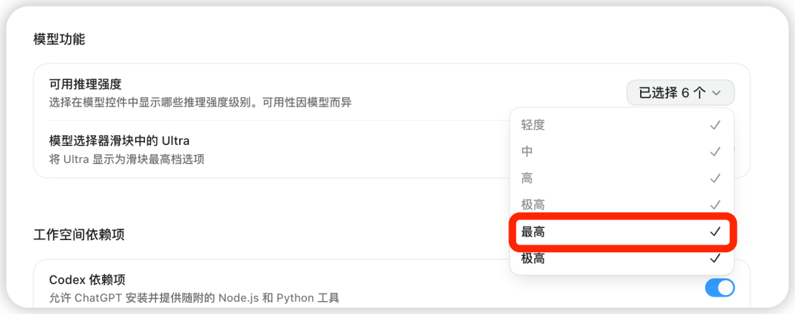
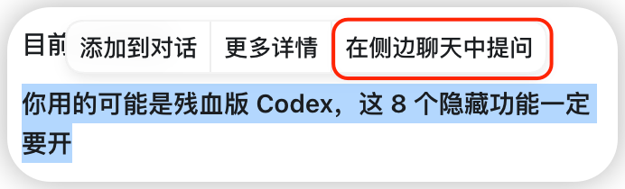
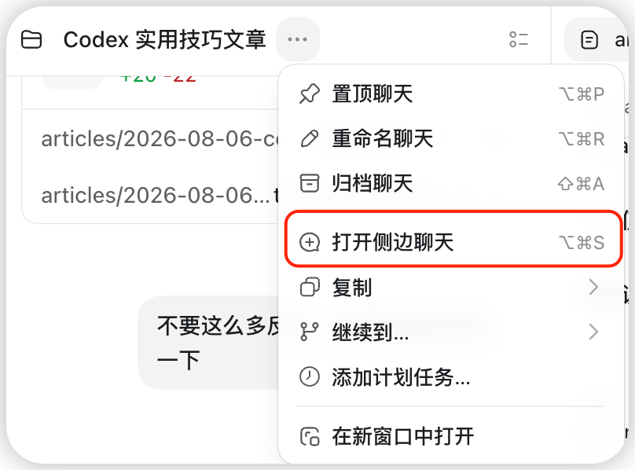

# Codex 长任务工作流，分开讨论、执行、审查与交接

> 难度 | 进阶
>
> 类型 | 长任务与多 Agent 协作

## 这篇文章适合谁

这篇文章适合已经能用 Codex 完成小修改，但在长任务中遇到上下文混乱、讨论打断执行、审查缺少独立视角或跨聊天交接困难的读者。

核心做法很简单。临时问题放进 Quick Chat，围绕当前任务的方案讨论放进 Side Chat，范围明确的独立工作交给 Subagent，修改完成后单独 Review，最后留下可以复核的交接记录。

## 推理强度只解决一部分问题

复杂任务需要足够的推理强度，但把所有工作塞进一个聊天，选择更高档位也不会自动消除上下文噪声。



先按任务难度选择模型和推理强度。架构取舍、跨模块修改和回归风险较高的排查需要更充分的推理；机械搜索、读取日志或执行边界已经确定的小步骤，可以交给更快的模型或独立工作线程。

模型名称和可用档位可能随账号与版本变化。不要把某个档位写成长期规则，先在当前模型选择器中确认。

## 临时问题放进 Quick Chat

Quick Chat 适合处理不应打断主任务的短问题。Windows 可以使用 `Ctrl + Alt + N`，也可以从“新聊天”旁的入口打开。


例如主任务正在运行测试，你想确认一个配置字段的含义。把问题放进 Quick Chat，等结论明确后再决定是否加入主任务。


回传时只发送已经确认的要求，不要把整段试探性讨论全部带回去。

## 方案分歧放进 Side Chat

Side Chat 会带着当前任务的相关上下文开始一段临时讨论，同时不打断主聊天。IDE 中可以使用 `/side`。


看到某段内容需要单独展开时，也可以选中文字后进入 Side Chat。



桌面端任务菜单同样提供入口。



Side Chat 适合比较两种实现、检查迁移风险或整理新的执行指令。讨论结束后，把决定和理由压缩成几句话送回主任务。

## 独立工作交给 Subagent

官方文档将 Subagent 定位为并行处理独立子任务的方式。每个 Subagent 有自己的上下文，主聊天负责委派、等待和汇总。

适合委派的任务包括只读扫描某个模块、补一组测试、核对文档来源或从不同角度审查同一分支。需求仍在变化、多个子任务会同时修改同一文件，或者工作量很小的时候，不要为了并行而并行。

可以直接在提示词里规定分工。

```text
把当前分支的审查拆给两个 Subagent。
一个只检查行为回归和缺失测试，另一个只检查权限与敏感数据风险。
两边都只读，不要修改文件。等待全部完成后，按严重程度汇总并附文件位置。
```

Codex 也支持把自定义 Agent 定义放在用户或项目的 `.codex/agents/` 目录。自定义 Agent 应只负责一个清楚的角色，并限制修改范围、工具和验证要求。没有必要时可以省略固定模型，让 Codex 按任务选择。

## 修改完成后单独 Review

实现任务完成后，打开 Review 面板或运行 `/review`，让 Codex只看当前差异、行为风险和缺失测试。

```text
审查当前分支相对 main 的差异。
只报告能够由代码、测试或运行路径证明的问题，标明文件和位置。
先不要修改内容。
```

审查和修复分开，可以保留问题出现时的证据。确认哪些发现需要处理后，再开始下一轮修改。

## 交接记录必须区分状态

长任务暂停前，可以在项目中写一份临时 `HANDOFF.md`，或在新的聊天中引用原聊天的技术 ID。交接记录不能替代当前文件和 Git 状态。

一份可用的交接至少要写清当前目标、已经完成的内容、未解决问题、下一步动作和已知风险。状态要分开记录。

```markdown
## 当前状态

- 本地修改：已完成
- 测试：已通过指定命令
- 提交：未创建
- 远端：未推送
- 部署：未开始
- 线上验证：未进行
```

下一次继续时，先读交接，再检查真实状态。

```text
先读 HANDOFF.md，再检查当前文件、Git 状态和最近的验证结果。
指出交接记录与现场不一致的地方，然后给出下一步。
```

## 一套可执行的长任务顺序

1. 在主聊天中确认目标、限制和完成标准。
2. 临时问题放进 Quick Chat，较长的方案分歧放进 Side Chat。
3. 只把独立、边界稳定的工作交给 Subagent。
4. 主聊天整合结果并完成实现和验证。
5. 用独立 Review 检查当前差异。
6. 暂停前写交接，继续时重新核对现场。

这套顺序的价值在于隔离不同种类的上下文。主聊天保留最终决定和项目状态，旁支讨论与并行搜索不会把执行要求淹没。

## 参考资料

- [Codex app commands](https://developers.openai.com/codex/app/commands)
- [Codex IDE commands](https://developers.openai.com/codex/ide/commands)
- [Codex Subagents](https://developers.openai.com/codex/subagents)
- [Codex Developer commands](https://developers.openai.com/codex/developer-commands)
- [Prompting 中的 Steering 与 Queue](https://learn.chatgpt.com/docs/prompting)
