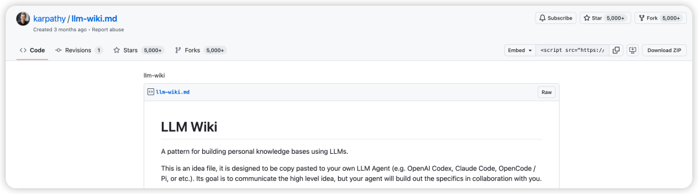
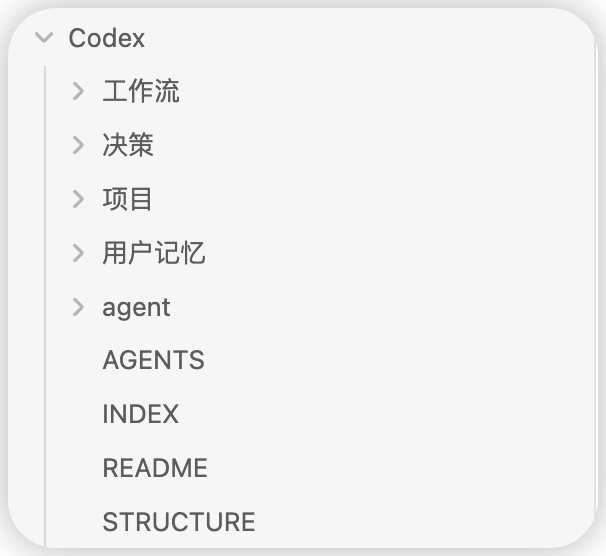
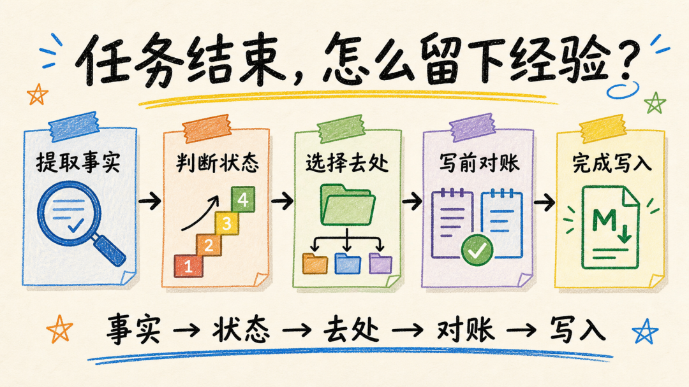
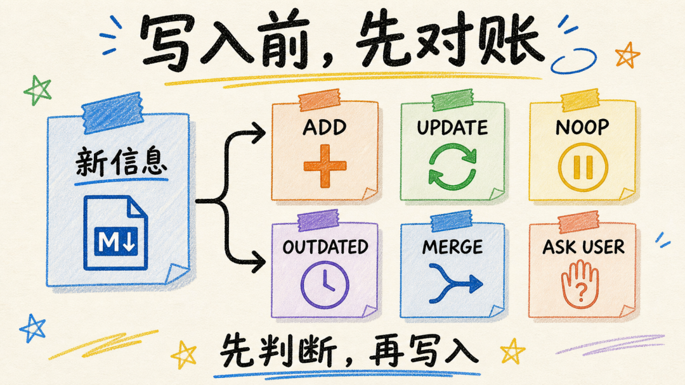

# Codex 任务收尾系统，用 Markdown 保存状态、决策与可复用流程

> 难度 | 进阶
>
> 类型 | 知识管理与任务交接

## 这篇文章适合谁

这篇文章写给需要长期维护多个项目，已经发现“任务做完了，下一次还要重新解释”的读者。

你会建立一套本地 Markdown 收尾流程。它记录本轮已经证实的状态、选择方案的理由和下次可以复用的步骤，同时把密钥、私人内容和没有证据的推测挡在长期记录之外。

## 聊天摘要不能代替任务状态

普通摘要能说明刚才讨论了什么，却不一定能回答项目现在处于哪个阶段。

本地测试通过、代码已经合并、服务已经部署和公开页面完成验证是四种不同状态。收尾记录应写到证据能够支持的位置，不能提前升级。

例如只运行了本地测试，可以记录测试命令和结果。没有检查远端分支与线上页面时，就保留“未推送”和“未部署”。

## LLM Wiki 提供了一个可借鉴的结构

Andrej Karpathy 在 2026 年 4 月 4 日发布了 LLM Wiki 构想，提出让 Agent 持续维护相互连接的 Markdown 知识库。原始资料、整理后的 Wiki 和规则文件承担不同责任，新材料进入后还要处理来源、矛盾和更新。



这个构想没有规定唯一目录。下面的结构是一套个人实践，用来管理 Codex 任务收尾，不代表 Karpathy、OpenAI 或 Obsidian 的官方方案。

## 用目录区分写入责任

可以先建立一个很小的本地目录。

```text
Codex/
├── AGENTS.md
├── INDEX.md
├── 项目/
├── 工作流/
├── 决策/
└── 用户记忆/
```



`INDEX.md` 只保存入口和关键词，避免每次扫描整个目录。项目记录保存当前可核验状态和下一步；工作流保存能够重复使用的操作顺序；决策记录备选方案、最终选择和重新评估条件；用户记忆只保存稳定偏好与授权边界。

`AGENTS.md` 规定读取顺序、写入位置、敏感信息和冲突处理。项目私有规则放在项目中，个人规则留在用户目录，不要把本机习惯复制进公开仓库。

## 任务结束时走完五步

一次重要任务完成后，按下面顺序收尾。

1. 提取本轮新确认的事实，并记录证据位置。
2. 区分本地、提交、远端、部署和线上验证状态。
3. 判断内容属于项目、工作流、决策或用户记忆。
4. 写入前检查重复、冲突、过时内容和敏感信息。
5. 只更新本轮真正影响到的少量文件。



一次性命令输出、可以直接从代码读取的细节和未验证猜测通常不值得长期保存。记忆负责提供线索，真实项目和外部服务仍要在下一次任务中重新核对。

## 写入前先判断动作

为了避免知识库不断堆叠重复内容，可以给每条候选信息分配一个动作。

| 动作 | 什么时候使用 |
|---|---|
| `ADD` | 当前没有对应记录，需要新建 |
| `UPDATE` | 已有事实发生变化，应更新原记录 |
| `NOOP` | 内容已经存在，不重复写入 |
| `MARK_OUTDATED` | 旧结论失效，但需要保留变化痕迹 |
| `MERGE_REQUIRED` | 多处记录重复或冲突，需要人工合并 |
| `ASK_USER` | 涉及敏感信息或无法判断归属 |



假设项目记录原来写着“功能尚未部署”，新任务只看到公开页面出现了新入口。当前证据只能支持“公开页面可见”。接口是否可用、是否需要登录、后端是否已经切换仍要继续验证。

## 先生成计划，再允许写入

第一次使用这套方法时，不要让 Codex 直接批量更新知识库。先让它生成写入计划。

```text
请为本轮任务做一次记忆收尾，先不要写入文件。

1. 列出本轮新确认的事实和证据来源。
2. 分开记录本地修改、测试、提交、远端、部署和线上验证。
3. 判断每条内容应进入项目、工作流、决策、用户记忆，或不写入。
4. 标记 ADD、UPDATE、NOOP、MARK_OUTDATED、MERGE_REQUIRED 或 ASK_USER。
5. 检查密码、密钥、Cookie、账号信息和私人聊天原文。
6. 列出拟修改文件，等我确认后再执行。
```

审核几次真实任务以后，再把稳定规则写入 `AGENTS.md` 或制作成 Skill。目录和字段应跟着实际问题调整，不需要一开始搭建复杂系统。

## 本地文件仍有隐私边界

文件保存在本地，不代表模型处理过程完全离线。内容是否发送到云端、怎样保存以及谁能访问，取决于产品、账号、插件和连接方式。

长期记录至少遵守下面几条边界。

- 不保存 API Key、Token、Cookie 和密码。
- 不把完整私人聊天或客户资料写进通用记忆。
- 共享项目的事实以项目文档和版本记录为准。
- 删除、发布、费用和账号操作保留人工确认。
- 使用旧记录前重新检查当前文件和外部状态。

## 怎样验证这套系统

选一个刚完成且有 Git 记录的任务，让 Codex只生成收尾计划。逐条检查事实是否有证据、状态是否提前升级、文件归属是否合理，并确认没有敏感信息。

写入后重新打开一个不带聊天上下文的任务，让它先读 `INDEX.md` 和相关项目记录，再检查 Git 与真实文件。如果它能指出旧记录与现场的差异，并从正确位置继续，说明收尾记录已经发挥作用。

## 参考资料

- [Andrej Karpathy 的 LLM Wiki 原始构想](https://gist.github.com/karpathy/442a6bf555914893e9891c11519de94f)
- [Codex AGENTS.md](https://developers.openai.com/codex/guides/agents-md)
- [Codex Memories](https://developers.openai.com/codex/memories)
- [Obsidian Create a vault](https://help.obsidian.md/vault)
