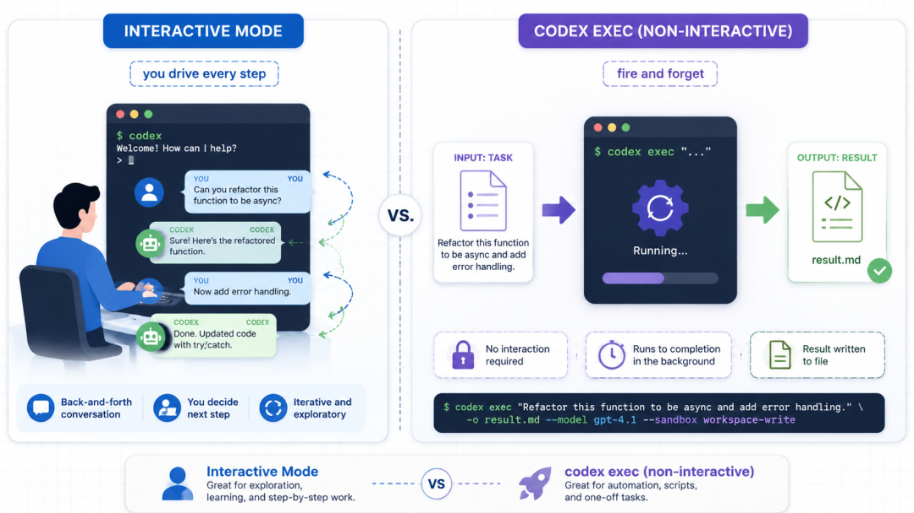
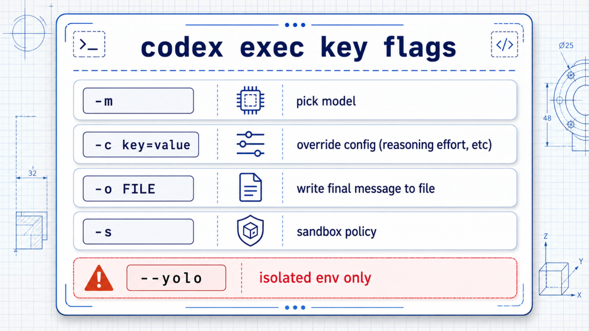
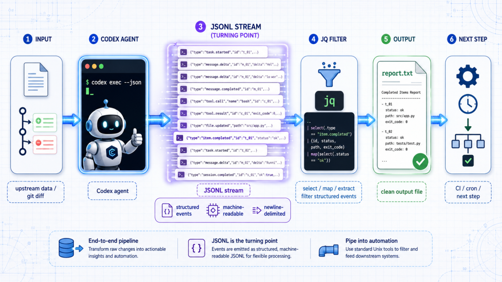
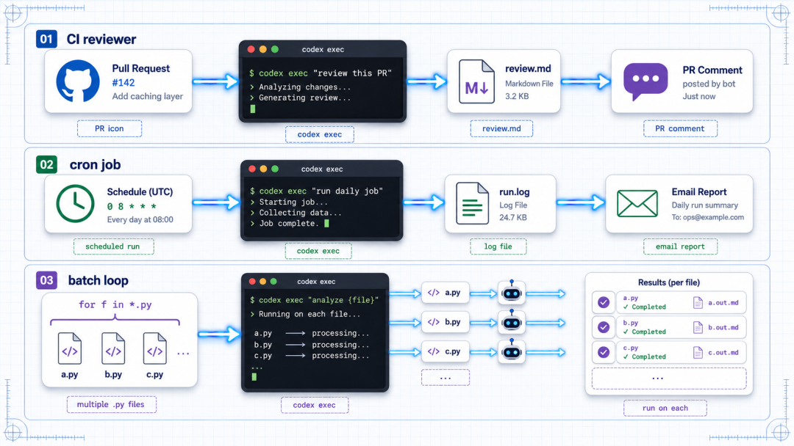

# Codex 自动化与定时任务：从手动流程到 CI 执行

用 Codex 的人，绝大多数都是这么用的：打开终端，输  ` codex  `
，进到那个交互界面，然后跟它一来一回地聊，你说要求，它改代码，看一眼再说下一句。

这没错，也是它最顺手的形态，但用久了你会发现一个问题，它离不开你。

每一步都得有个人坐在屏幕前面，看着它、催着它、点着确认，活儿再简单，也得占着你一只手。

那些真正烦人的重复活儿，每天早上把昨晚的日志扫一遍挑出报错、每次发版前给 changelog
补一段、每周把某个目录的注释统一格式，你其实根本不想亲自坐那儿陪它聊。

你想的是，能不能让它自己跑，跑完把结果放那儿，我睡醒了直接看。

能！这就是  ` codex exec  ` 干的事。

它是 Codex 的非交互模式，一条命令给个任务，它闷头跑完就退出，全程不需要盯着，这意味着可以把它写进 shell 脚本、塞进 CI 流水线、挂进
crontab 定时任务里，让 AI 变成一个能被自动化调度的东西。

##  交互模式和 exec 模式，差在哪

先把这两种形态的区别说清楚，不然不知道什么时候该用哪个。

平时敲  ` codex  ` 进去的那个，是交互模式，一个持续开着的会话，你来我往，它随时等你输入。适合你还没想清楚要干嘛、需要边做边调整的活儿。

` codex exec  ` 是非交互模式，把任务一次性喂给它，它自己规划、自己执行、跑完直接退出，中间不问你、也不等你。

它的设计目标就是无人值守，所以天然适合被脚本调用。

最基础的用法就一行：

    codex exec"把 src 目录下所有函数补上类型注解"  
    

回车，它就开始干了，任务描述也可以从管道喂进去，这在脚本里特别有用：

    cat task.txt | codex exec  
    

或者把前一个命令的输出直接接给它：

    git diff | codex exec"根据这些改动，帮我写一段 changelog"  
    

看出来了吧，它就是个普通的命令行程序，能读 stdin、能被 pipe、能拼进任何 shell 逻辑里。

这是它能自动化的根本原因。

##  想让它在脚本里听话，这几个参数得会

裸跑一句  ` codex exec  ` 只是开始，真要把它嵌进自动化流程，你得让它行为可控、输出可读。

下面这几个参数是关键。

** 指定模型和思考强度。  ** 自动化任务往往不需要顶配模型，用  ` -m  ` 挑一个够用的就行，思考强度用配置覆盖参数  ` -c  `
来调，比如让它别想太久、快点出结果：

    codex exec -m gpt-5.1-codex \  
      -c model_reasoning_effort="low" \  
    "把这个文件里的 print 全换成 logging"  
    

这里的  ` -c  ` 是个万能开关，能覆盖任何  ` ~/.codex/config.toml  ` 里的配置项，用点号写嵌套路径，值按 TOML
解析。省钱、控速度，都靠它。

** 把最终结果单独存出来。  ** 这是脚本化里最实用的一个，  ` -o  ` 让 Codex
把它最后那段总结写进指定文件，后面的脚本直接读这个文件就行，不用去满屏的过程日志里 grep：

    codex exec -o result.txt "检查依赖有没有已知的安全漏洞"  
    cat result.txt   # 后续脚本读这里  
    

** 权限和沙箱。  ** 无人值守时没人帮它点确认，所以你得提前把权限说清楚。  ` -s  ` 指定沙箱策略（只读、还是允许写工作区），  `
--skip-git-repo-check  ` 让它能在非 Git 目录里跑。

至于那个  ` --dangerously-bypass-approvals-and-sandbox  ` （别名  ` --yolo  `
），会跳过所有确认和沙箱。

这个只在本身已经被隔离的环境里用，比如一个一次性的 CI 容器，在自己主力机上图省事开它，等于把 AI 的手直接伸进你整个系统，出事没人拦得住。

一句话：  ** 能限权就别放开，自动化环境里尤其是。  **

##  真正的杀手锏：–json 让输出能被程序消费

前面的参数还只是让它安静地跑，  ` --json  ` 才是把它接进流水线的关键。

加上这个参数，Codex 不再输出给人看的花哨界面，而是把整个执行过程按 JSONL 吐到标准输出。

它干了哪一步、调用了什么工具、最后说了什么，全都是结构化的。

结构化意味着什么？意味着你的脚本能  ** 读懂  ** 它的输出，然后据此做决策，配合  ` jq  ` 这类工具，可以把它的结果接进任何后续逻辑：

    codex exec --json "跑一遍测试，告诉我有没有失败" \  
      | jq -r 'select(.type=="item.completed") | .item.text' \  
      > report.txt  
    

这一步是 AI 陪你干活和 AI 替你自动干活的真正分水岭。

人看得懂自然语言，程序看不懂；但程序看得懂 JSON。一旦 Codex 的输出能被程序消费，它就从一个聊天工具，变成了流水线里的一个可编程节点。

上游给它喂数据，它处理完，下游接着往下走，全程不需要人插手。

如果还想约束它最后返回的格式，  ` --output-schema  ` 能传一个 JSON Schema
文件，规定它最终答复必须长成什么样子，这样连解析都省了，拿到的直接是想要的结构。

##  几个能直接抄的自动化场景

参数讲完了，落到实处，下面几个是拿  ` codex exec  ` 能立刻跑起来、也确实省事的活儿。

** 塞进 CI，让它当自动审查员。  ** 在 CI 流水线里加一步，每次提 PR 就让 Codex 扫一遍改动，把问题写进报告：

    git diff origin/main...HEAD \  
      | codex exec -s read-only -o review.md \  
    "审查这些改动，列出潜在 bug 和风格问题"  
    

用只读沙箱，它碰不了代码，只输出意见，审查结果落在  ` review.md  ` ，在 CI 里把它贴成 PR 评论就行。

** 挂进 crontab，让它每天定时干活。  ** 比如每天早上八点，让它把昨天的错误日志汇总一遍：

    0 8 * * * cd /path/to/project && \  
      codex exec -s read-only -o /tmp/daily.txt \  
    "扫一遍 logs/ 目录里昨天的日志，把报错归类总结" \  
      && cat /tmp/daily.txt | mail -s "昨日日志汇总" me@example.com  
    

人还睡着，报告已经在邮箱里了，这就是标题说的那个睡觉时自动干活，不是修辞，是真能这么排。

** 批量处理一堆文件。  ** 用最普通的 shell 循环，把它套在外面：

    for f in src/*.py; do  
      codex exec -s workspace-write \  
    "给 $f 补上文档字符串，风格参考 Google style"  
    done  
    

一个文件一次调用，跑完一个换下一个，几十个文件的机械活儿，扔给它挂着跑就是了。

看出这几个场景的共性了吗？

它们都不需要你在场，你要做的只是把任务描述清楚、把权限框好、把输出接对地方，剩下的交给调度器。

Codex 从一个你得盯着的对话框，变成了一个能被 cron、被 CI、被 shell 脚本随意调用的命令。

##  写在最后

Codex 最被低估的地方，可能就是大家默认它只能陪你在终端里聊，codex exec 把它从对话框里放了出来，它可以是脚本里的一个命令、CI
里的一步、crontab 里的一行。你要做的，只是把任务说清楚、把权限框好、把输出接对地方，剩下的交给调度器。

上手不用一步到位，想省事的，先把 git diff | codex exec 写进小脚本帮你生成 commit message，跑顺了再往 CI 和定时任务加；无人值守的活儿从只读、低风险的做起，验证靠谱了再放开权限。说到底，交互模式解决怎么和 AI 一起干活，exec 模式解决怎么让 AI 替你自动干活。 

* * *
