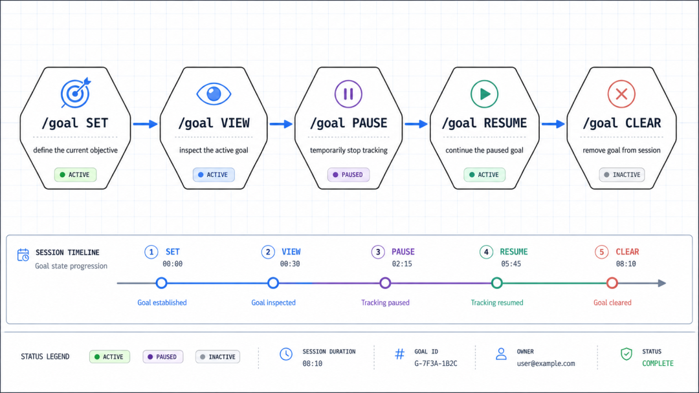

# Codex 使用 Goal 模式运行长任务

> 难度：进阶
>
> 类型：长任务与持续执行

## 这篇文章适合谁

如果你已经会让 Codex 修改代码，但任务一长就容易失去方向，可以学习 Goal 模式。它适合有明确交付物、能够持续验证的迁移、重构、排错和发布前检查。

Goal 是持续目标，不是一次性提示词。它会附着在当前会话上，帮助 Codex 在多轮工作中保持目标、约束和完成条件。


## 先写清楚完成标准

进入 Goal 前，先写三件事：要得到什么，不能改什么，怎样证明已经完成。比如：

```text
把 checkout 模块迁移到新的错误处理方式。
只修改 src/checkout 和对应测试，不改公共 API。
完成条件是测试通过、类型检查通过，并在最终报告中列出未覆盖的边界。
```

目标越具体，后续检查越容易。Goal 不会替你补齐模糊的产品决策，也不会因为持续运行就获得更大的文件或账号权限。

## 设置和管理 Goal

在 Codex App、CLI 或 IDE 扩展的输入框中使用 `/goal`。CLI 中可以这样操作：

```text
/goal 完成 checkout 错误处理迁移，并保持测试通过
```

当前目标可以用 `/goal` 查看，用 `/goal edit` 修改，用 `/goal pause` 暂停，用 `/goal resume` 继续，用 `/goal clear` 清除。



目标文本最长 4000 个字符。更长的背景、检查清单和接口说明应当放进项目文件，再让 Codex 先阅读它们。

## 让长任务按检查点推进

Goal 最适合有验证回路的任务。可以把工作分成几个检查点：

1. 先阅读项目和规则，输出影响范围。
2. 先改一个小切片，运行对应测试。
3. 再扩展到剩余文件，重复测试和 diff 检查。
4. 最后运行完整验证，说明仍然未知的部分。


不要只写“持续做到完成”。如果没有测试、构建或人工复核这样的停止条件，Goal 很容易把时间花在低价值的细节上。

## 预算、暂停和人工介入

Goal 会受当前会话的上下文、模型用量和运行环境限制。预算用尽、目标改变、遇到需要你决定的分歧时，任务都可能暂停。

暂停不是失败。你可以查看当前进展，补充约束，再继续。涉及生产环境、密钥、付款、删除数据或系统权限的步骤，仍应保留人工批准。


## 什么时候不该用 Goal

一次能在几分钟内完成的小修改，不需要 Goal。需求还没有定稿、成功标准无法检查、或任务需要不断做产品判断时，也应该先讨论和规划。

使用 Goal 的判断标准很简单：目标稳定，过程可以拆开，结果可以验证。满足这三点，长任务才值得交给它持续推进。

## 参考资料

- [Long-running work](https://developers.openai.com/codex/long-running-work)
- [Slash commands in Codex CLI](https://developers.openai.com/codex/cli/slash-commands)
- [Codex Manual](https://developers.openai.com/codex/codex-manual.md)
