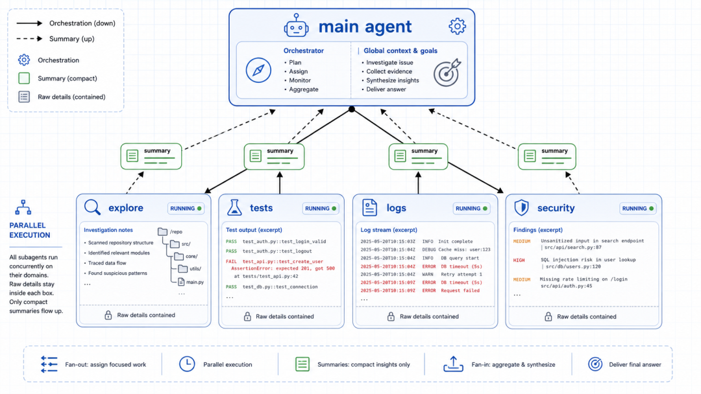
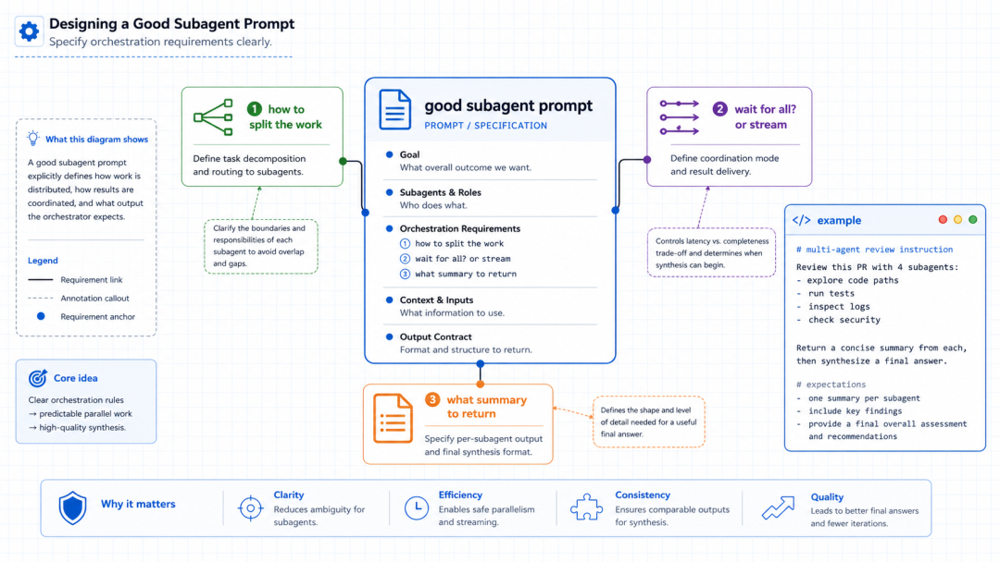
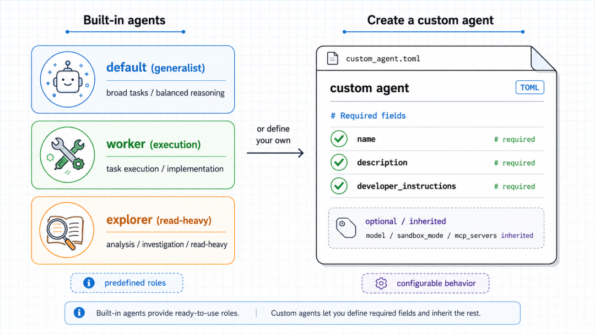

# Codex 使用 Subagents 并行处理任务

> 难度：进阶
>
> 类型：多 Agent 协作

## 这篇文章适合谁

如果一个任务可以拆成几块互不修改同一文件的工作，可以让 Codex 把其中一部分交给 Subagents。它适合代码库探索、测试检查、日志分析和安全审查，也适合需要多个独立结论的调研。

Subagent 是独立的工作线程。主 Agent 负责拆分、分派、等待和汇总，子 Agent 返回结果后，主 Agent 再形成最终答案。



## 先拆出真正独立的工作

好的拆分有清楚的输入和输出。例如检查一个 Pull Request 时，可以分别让子 Agent 阅读项目结构、运行测试、分析日志和检查安全风险。每个线程都有自己的上下文，最后只把摘要交回主 Agent。

不适合并行的任务包括多个线程同时改同一组文件、前一步结果决定后一步输入、或需要共享一个正在变化的运行状态。那种任务应当按顺序执行。

可以这样描述一次分工：

```text
请把这次审查拆成四个独立任务：项目结构、测试、日志、安全。
每个子任务只读，不修改文件。
每个子任务返回发现、证据、风险等级和建议，最后由主任务汇总。
```

## 让子 Agent 返回固定格式

主 Agent 要汇总多份结果，子 Agent 的输出格式越接近，合并越省事。可以要求每个线程返回：

- 检查范围
- 发现的问题和文件位置
- 使用过的命令及结果
- 尚未确认的地方
- 一句话建议



主 Agent 不应把摘要当成未经核验的事实。需要时继续打开子 Agent 的完整结果，或自己复查关键文件和命令输出。

## 内置角色与自定义 Agent

当前 Codex 提供可直接使用的内置角色，常见分工包括通用任务、执行任务和偏阅读分析的任务。具体可用角色取决于当前客户端和版本，调用时以界面或官方文档为准。

需要固定团队分工时，可以在 `~/.codex/agents/` 创建个人 Agent，或在项目的 `.codex/agents/` 创建项目级 Agent。文件使用 TOML，里面可以写名称、说明和开发者指令，也可以覆盖模型、沙箱或 MCP 设置。



全局并发设置位于 `config.toml` 的 `[agents]` 配置中。`agents.max_concurrent_threads_per_session` 用来限制同一会话中同时打开的子 Agent 数量。不要把并发数当成性能保证，线程越多，汇总和复核的成本也会增加。

## 权限和冲突控制

子 Agent 继承父任务能看到的部分设置，但每个线程仍有自己的操作过程。涉及写入时，要给每个线程独立 worktree，或明确规定只有主 Agent 可以修改文件。

最稳妥的第一步是让所有子 Agent 只读探索，主 Agent 根据结果选择一个实现方案，再由单个执行线程修改。这样能减少并行写入造成的冲突。

## 参考资料

- [Subagents](https://developers.openai.com/codex/concepts/subagents)
- [Customization](https://developers.openai.com/codex/concepts/customization)
- [Configuration Reference](https://developers.openai.com/codex/config-reference)
