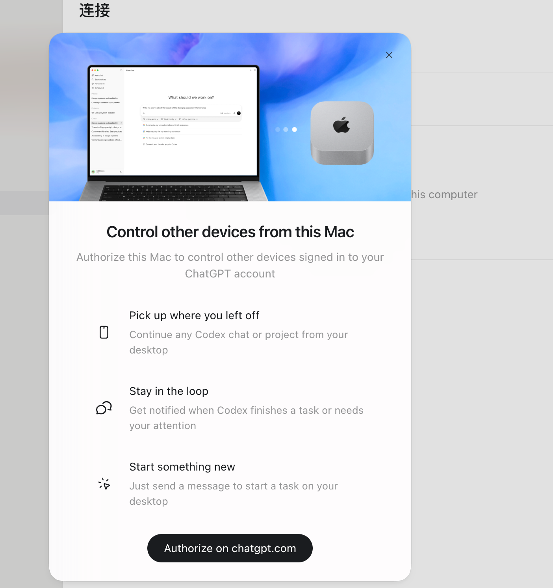
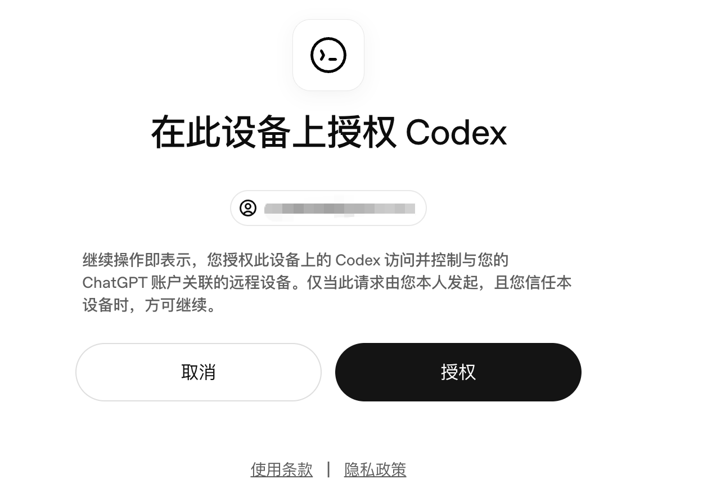
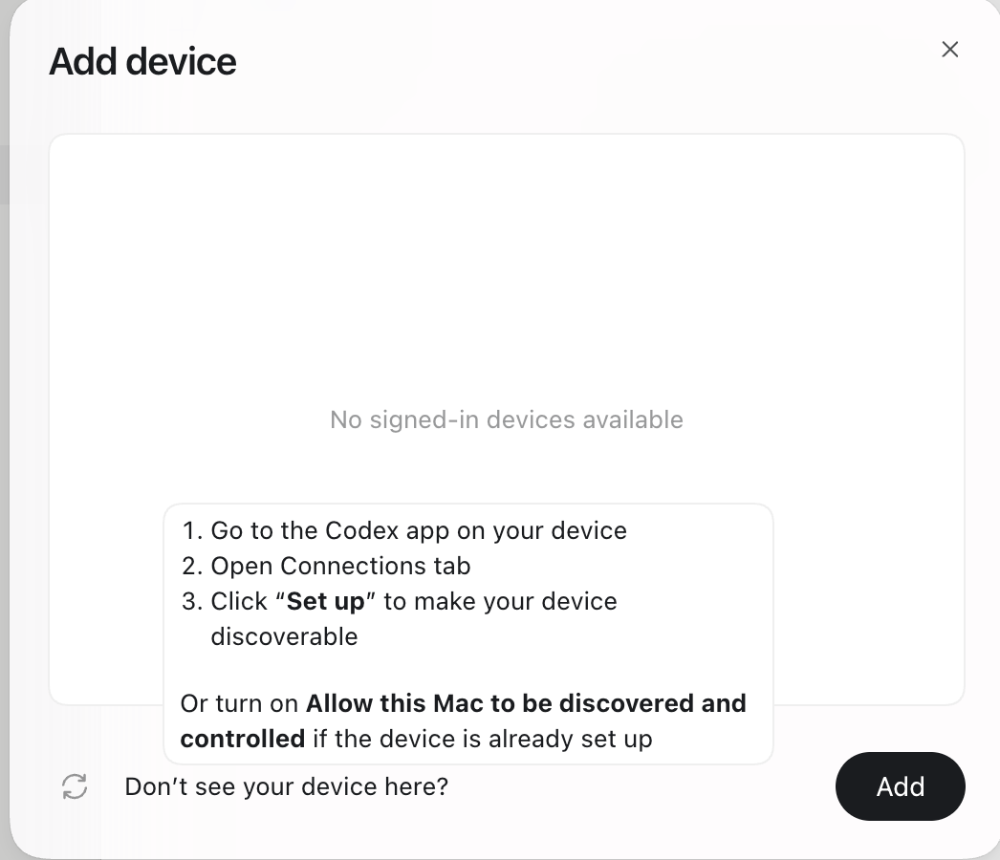
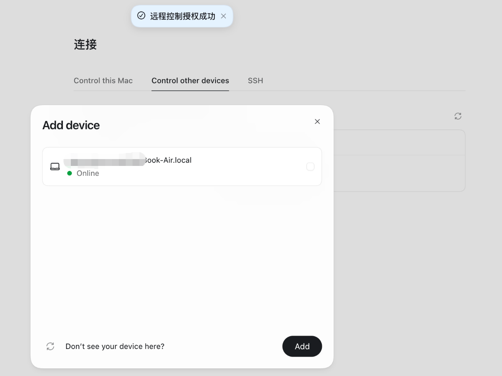
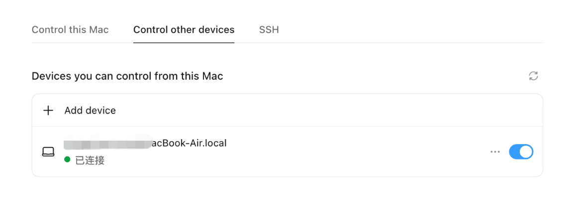
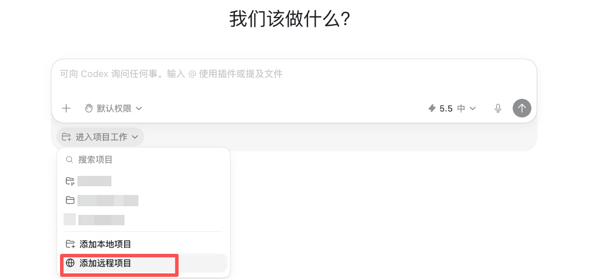
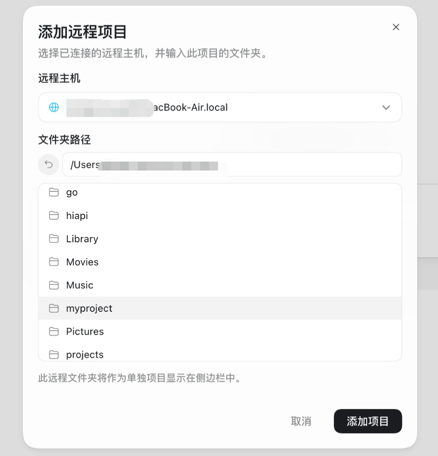

# Codex 远程控制另一台 Mac

场景很具体。你有一台 MacBook Air，还有一台始终插电的 Mac mini。之前要远程进去操作 Codex ，现在不需要了，你可以直接在主机操作远程 Mac 的 Codex。

如果项目在公司的 devbox 或其他 Linux 主机上，则使用 SSH 连接。

现在也可以从 ChatGPT 移动端发起和跟进远程任务。移动端不是在手机上运行本地项目，而是连接到已经配对、在线并保持唤醒的主机；代码、命令和桌面操作仍然发生在主机上。

## 连接设置里的三个标签

Codex App 升级到最新版后，设置里多了一个连接项，进去有三个标签。

- **Control this Mac** 开启后，允许别的设备控制这台 Mac。
- **Control other devices** 开启后，允许这台 Mac 控制别的设备。
- **SSH** 把 Codex 连接到 SSH 远程主机，在远程机器上运行。

这里有一件事一定要先记住。控制是单向的。Control this Mac 管的是这台机器能不能被控制，Control other devices 管的是这台机器能不能去控制别人，两个开关互相独立。

要让 A 控制 B，得同时满足两件事：B 在自己的 Control this Mac 里开启被发现，A 在自己的 Control other devices 里加上 B。这只配通了 A 控制 B 一个方向。想让 B 反过来也能控制 A，得把这套动作再反着做一遍。一台设备同时扮演两个角色没问题，但两个角色要分别配。

## 让一台 Mac 控制另一台

先说清楚两个角色。

- **控制端** 是你正在使用、负责发指令的设备。
- **被控端** 是实际运行 Codex 的设备。

两台 Mac 都要安装最新版 Codex App，并登录同一个账户。

移动端配对使用同一个 ChatGPT 账号和 workspace。桌面端会显示二维码或配对入口，用 iOS 或 Android 上的 ChatGPT 扫码后确认授权；完成后，手机可以继续已有会话、查看完成或需要关注的通知，也可以在已连接主机上创建新任务。

### 第 1 步：控制端发起授权

在控制端打开 设置 → 连接 → Control other devices，会弹出引导窗。点底部的授权入口。



### 第 2 步：网页确认授权

浏览器会跳到一个授权页，确认是你本人操作、设备可信，点授权。



### 第 3 步：去被控端开启被发现

授权完回到 App，会弹 Add device 窗口。这时候大概率显示 No signed-in devices available，一台设备都没有。



别慌，不是 bug。回想前面说的控制是单向的：你在控制端做的授权，只解决了这台 Mac 有资格去控制别人，被控端那台还没开启被发现。Add device 弹窗里的提示也写得很清楚，去被控端的 Codex app，打开连接标签，让设备可被发现。

所以切到**被控端那台 Mac**，打开它的 Codex → 连接 → Control this Mac → 点 Set up，开启允许本机被发现和控制。

到这里，控制端到被控端这个方向才算配齐：控制端在 Control other devices 授权过了，被控端在 Control this Mac 开了被发现。

> 实测时一定要注意方向。这两个动作配反了不会报错，但控制关系会反过来。如果你在 A 上开了 Control this Mac、在 B 上开了 Control other devices，配通的是 B 控制 A。想让 A 控制 B，需要在 B 上打开 Control this Mac，再从 A 的 Control other devices 添加 B。两台机器要互控，就按两个方向各配置一遍。

### 第 4 步：回控制端，添加设备

被控端 set up 完，回到控制端的 Add device 窗口刷新一下，那台机器就出现了，状态是 Online。勾选它，点 Add。



顶部会弹出远程控制授权成功。Control other devices 列表里也能看到这台设备，状态已连接，开关是打开的。



到这里设备就组好了。

### 第 5 步：在远程主机上开项目

光连上设备还不够，得告诉 Codex 在远程机器的哪个文件夹干活。

新建一个对话，点输入框下方的 进入项目工作，下拉菜单里选 添加远程项目。



弹窗里选刚才连上的远程主机，再浏览它的文件系统，选中要干活的项目文件夹，点 添加项目。



这个远程文件夹会作为一个独立项目出现在侧边栏。之后你在控制端对它发指令，Codex 实际是在被控端那台机器上读文件、跑命令、改代码。控制端只负责发号施令和看结果。

## SSH 远程主机：连 devbox 和服务器

如果你的项目不在另一台 Mac 上，而在公司的 devbox 或者一台 Linux 服务器上，走连接设置里的 SSH 标签。这条路我没实操截图，下面按官方文档列出步骤。

远程主机需要提前写入 `~/.ssh/config`，能从本机直接连接，并且远程主机已经安装 Codex，登录 shell 的 `PATH` 里也能找到 `codex` 命令。

具体步骤如下。

1. 配好 SSH config，例如：

```
Host devbox
  HostName devbox.example.com
  User you
  IdentityFile ~/.ssh/id_ed25519
```

2. 本机验证 ssh devbox 能连通

3. 远程主机装好 Codex 并完成登录

4. Codex App 里 设置 → 连接 → SSH，App 会自动从你的 SSH config 里发现主机，添加后选远程项目文件夹

连上之后，仓库文件、shell 命令全在远程主机上跑，还能用上远程主机的插件、MCP 服务器、浏览器和 computer use。等于把 Codex 整个搬到了 devbox 上，本机只当入口。

## 安全和限制

跨设备通信走 OpenAI 的 secure relay，不会把你的机器直接暴露在公网上。跨公网使用时，OpenAI 建议再加一层 VPN。SSH 连接也要保持标准的密钥管理和最小权限账户。

被控端必须始终在线、唤醒并联网。拿笔记本当被控端时，记得开启 Keep this Mac awake，否则设备休眠后远程连接就会断开。

远程连接现在也支持 Windows host。Windows 主机需要保持 Codex App、用户会话和目标项目可用；Computer Use 操作桌面时会占用前台输入，不能同时用鼠标键盘干预同一桌面。移动端或控制端显示离线时，先检查主机是否睡眠、网络是否中断，以及是否仍登录同一 workspace。

## 使用边界

远程控制的前提是被控端保持在线、唤醒并联网。跨设备前先确认账户、授权方向和远程项目路径，涉及真实项目时仍要检查差异和命令结果。

---

## 参考链接

- [Codex Remote connections 官方文档](https://developers.openai.com/codex/remote-connections)
- [OpenAI 官方公告：Work with Codex from anywhere](https://openai.com/index/work-with-codex-from-anywhere/)
