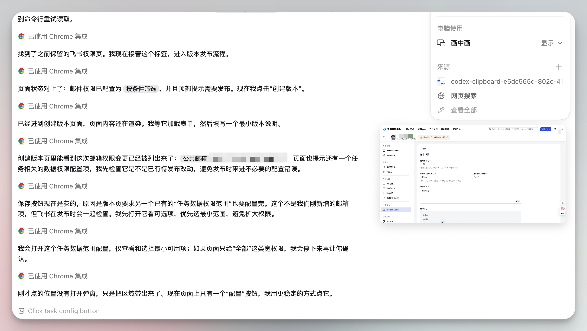
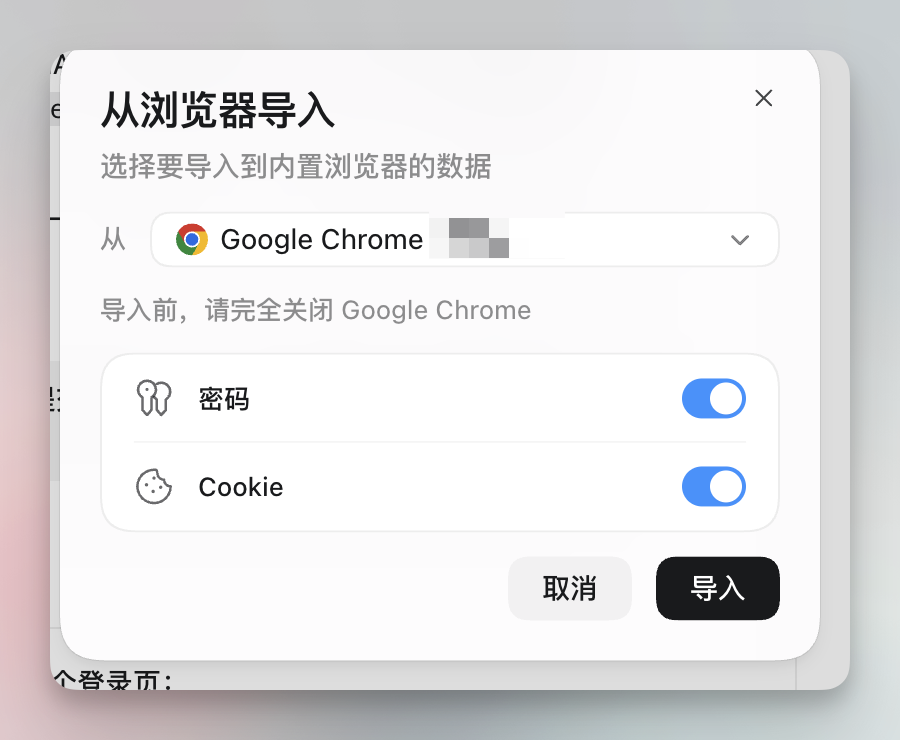
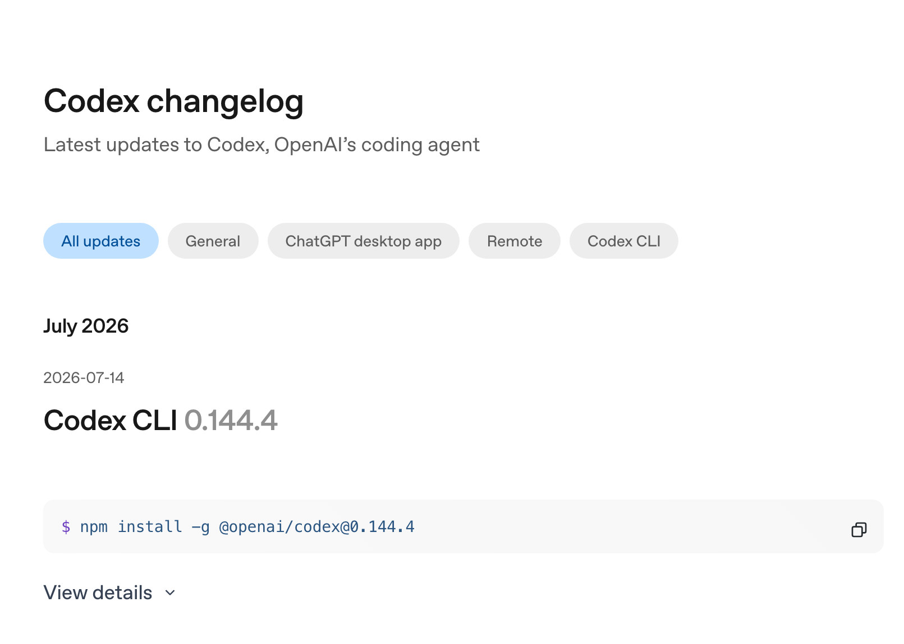

# Codex 浏览器操作与登录态功能

Codex 现在可以通过浏览器扩展、内置浏览器和 Computer Use 操作网页或桌面应用。这几种入口的登录态、操作范围和限制不同，选错入口容易在任务中途卡住。

前几天让 Codex 通过浏览器扩展走一遍开放平台的应用权限发布流程。它先在我开着的标签页里找到之前保留的权限页，直接接管并进入发布流程。

每走一步，它都在对话里说清楚自己在干什么。而且边界定的挺好的，不确定的，还有权限相关的问题会停下来确认。

前几天发现Codex有画中画功能，太牛了。

界面右侧多了个画中画小窗，它操作哪个页面，小窗里就实时显示哪个页面，不用再在 Codex 和浏览器之间来回切。

这是最近一次大版本更新带的。那次更新把 Codex 桌面应用的相关能力集中到了新的桌面体验里。

只要 Codex 开始操作电脑或浏览器，小窗就自动弹出。可以拖动位置，点一下直接跳到正在被操作的应用。任务用到多个窗口时，预览叠成一摞，可以切着看。

不想看就关掉，任务运行中随时能从任务摘要视图重新打开，侧边栏的"电脑使用"分区里也有显示开关。

## 它确实不抢你的鼠标

我注意到一个细节，它在浏览器里点点点，我自己的鼠标不受影响，该干嘛干嘛。

查了一下，Chrome 扩展安装时申请的第一个权限就是页面调试器，也就是 Chrome DevTools Protocol。它的点击和输入是通过调试协议直接发进页面的合成事件，不经过系统鼠标，你的光标不会被拖走。

官方发布 Chrome 扩展时的说法也是这个意思，**它可以在后台跨标签页并行干活，不接管你的浏览器**。

操作 macOS 桌面应用的 Computer Use 同理，它用自己的光标去看、去点、去打字，不干扰你在其他应用里的工作。

例外是 Windows。Windows 上的 Computer Use 只能在当前桌面前台跑，官方文档明确写了会移动指针、打字、占住前台。

## 三个入口

Codex 现在有三种操作界面的方式。

内置浏览器（@Browser）用独立的浏览器环境，默认没有你的登录态。看公开网页、预览 localhost 上自己开发的页面，用它最干净。

不过最近上了一个"从浏览器导入"功能，可以把 Chrome 的密码和 Cookie 拷一份进内置浏览器，导入时要完全关闭 Chrome。Cookie 本身就是登录凭证，导过之后它也能直接打开需要登录的网站了。

官方文档原来写内置浏览器不支持登录，这次改版已经把这句删掉了。

要注意这是一次性拷贝，不是持续同步。之后你在 Chrome 里新登录的账号、改过的密码不会跟过来。官方也提醒 Cookie 要当敏感数据对待，导了哪些站的登录态，自己心里要有数。

Chrome 扩展（@Chrome）直接用你 Chrome 里已登录的账号。判断标准就一条，任务是否依赖你的账号、cookies 或已经打开的标签页。要就用它，我这次的后台配置就属于这类。和导入过数据的内置浏览器比，扩展用的是活的 Chrome，当下的会话、刚打开的标签页都在。

Computer Use（@Computer）操作桌面应用，活儿完全在浏览器之外时才轮到它。

如果任务有结构化接口，优先让 Codex 使用结构化连接。只有接口覆盖不到时，再让它通过视觉操作完成任务。

## 别人都拿它干什么

看了一圈国内外的实测分享。

流传最广的一个案例，有人让它盯亚马逊客服的排队页面，每五分钟看一眼，真人客服上线后改成每分钟盯，最后趁主人洗澡的时候把退款办完了。

日常一点的用法也不少。每天定时检查社交账号的私信，把用户反馈收集进笔记库，并且明确禁止它发帖；把领英收件箱里的招聘私信按公司分组整理；从通话笔记更新 CRM 里的客户记录。

开发相关的，登录后才能复现的 bug 直接在真实会话里复现；开多个标签页，并行测试不同用户角色下的流程。

信息整理类，搜十几篇游记，把景点整理进在线表格，再去地图上建好收藏清单。

这些活的共同点是没有 API，界面是唯一入口，以前只能自己点。

## 想让它干得稳，有几个技巧

看别人的经验，加上我自己这次的体会，有几条值得记下来。

**把禁区和停止点写进指令里。**比如"不要动账号和订阅设置""提交前停下来等我确认"。发送、发布、购买这类动作前必须留人工确认，这是社区的普遍共识。

指令用"做 X，验证 Y，符合 Z 才继续"的写法，能明显减少静默失败。让它汇报具体细节，比如确切的 URL 和页面上的确认信息，别让它只说"完成了"。

**从小任务开始，跑通的指令存下来复用。**一次性的演示跑成功了，把 prompt 原文存住，下次同类活直接用，慢慢攒出自己的自动化清单。

授权按域名管理，首次访问新网站它都会弹窗问你。白名单从空开始按需加，财务、HR 这类后台可以直接拉黑。"始终允许浏览器内容"这种开关官方自己都标了高风险。

要让它往网页表单传文件，得在 Chrome 扩展详情里手动打开文件访问权限，不然会卡在上传那步。

模型分了 Sol、Terra、Luna 三档之后，派活可以更精细。日常任务用 Terra 就够，难题再上 Sol。Luna 快而便宜，但长上下文能力差得多，别拿它碰大仓库和长文档。

如果上下文或用量紧张，关闭当前任务用不到的连接，并在任务摘要里确认剩余用量。

## 不该给它的活

反爬严的站点和验证码它过不去，一操作就容易被拦。系统级的安全弹窗它点不了，需要管理员身份的认证也过不去，这些是官方明确的硬边界。

浏览器扩展目前只支持一个浏览器配置档。切换配置档后，需要重新完成扩展连接和授权。

更要紧的是安全边界。授权是按域名给的，一个域名放行之后，上面的页面内容都会进它的上下文，恶意页面理论上可以往里塞指令。这个问题目前没有根治的办法。

所以社区的红线很一致，支付、删除生产数据、改安全设置、大批量导出个人数据，这四类活永远自己点。**它能做，不代表应该让它做。**

## 这个月还上了什么

这波更新里画中画只是个小点，changelog 里还有不少东西。

这次桌面更新除了画中画，还加入了应用内编辑代码和文档、行内批注、代码评审等能力。

GPT-5.6 也在这波全量上线，就是上面说的三个档位，API 定价每百万输入 token 分别是 5、2.5、1 美元。Computer Use 换上 GPT-5.6 之后，操作速度也提了一截。

CLI 也在补充远程连接和任务管理能力，具体入口以当前版本界面为准。

## 参考资料

- [Codex 官方文档](https://developers.openai.com/codex/)
