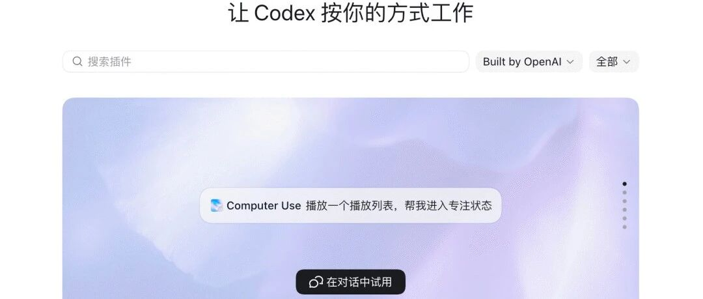
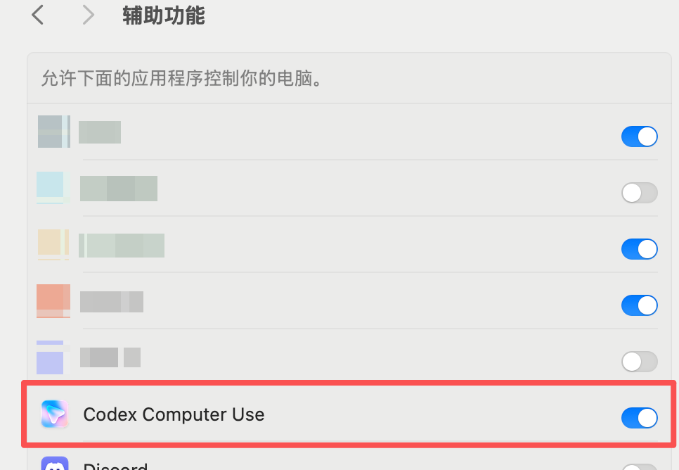
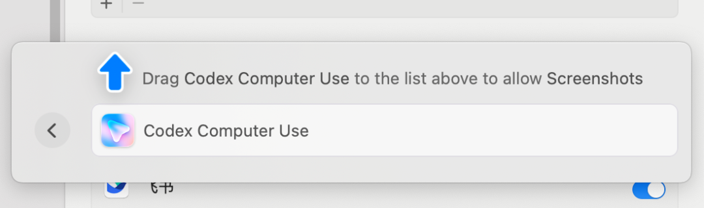
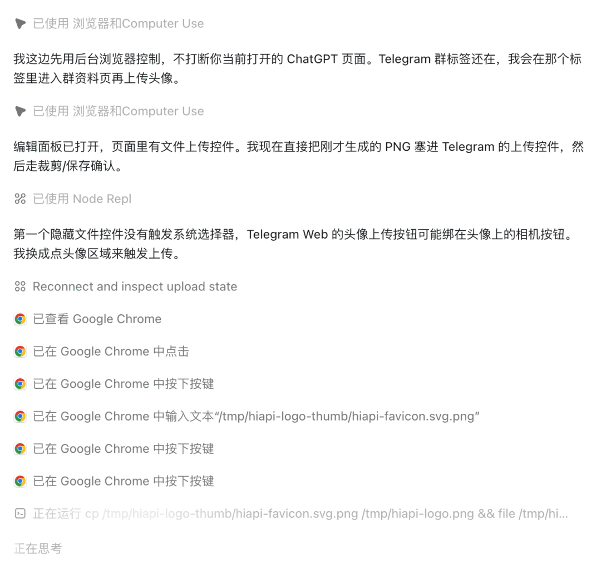

# Codex 使用 Computer Use 操作桌面应用

> 难度：进阶
>
> 类型：官方工具与集成

## 这篇文章适合谁

当任务只能通过桌面应用完成，或者命令行和结构化插件拿不到所需信息时，可以考虑 Computer Use。它能看屏幕、点击窗口、输入文字并在多个应用之间完成一段流程。

Computer Use 当前支持 macOS 和 Windows。Windows 运行时会接管活动桌面的前台输入，不能一边让它操作同一台电脑一边继续使用鼠标键盘。

## 安装和授权

在 ChatGPT 桌面 App 中切换到 Work 或 Codex，打开 Plugins，安装并启用 Computer Use。再到设置中查看应用访问权限。

macOS 需要按系统提示授予 Screen Recording 和 Accessibility 权限。Windows 要保持目标应用在活动桌面并处于可见状态。应用授权和文件、终端权限是两套设置，授予其中一项不会自动扩大另一项权限。

## 适合交给它的任务

Computer Use 适合检查桌面应用、操作浏览器、复现只在 GUI 中出现的问题、修改必须点击设置的选项，以及跨多个应用完成一段流程。开始时给它一个应用和一个清楚的目标，必要时逐步批准高风险动作。

不要把密码、密钥和客户数据放进不必要的任务。关闭不相关的敏感应用，也不要同时运行两个任务操作同一个应用。

## Windows 与 macOS 的区别

macOS 可以在你处理其他事情时运行部分后台任务，具体取决于锁定和权限设置。Windows 的 Computer Use 只能在前台运行，任务期间会移动指针和输入文字。要让 Windows 任务持续运行，应保持会话解锁，并把这台机器专门留给任务。

这项能力不会自动批准系统安全弹窗，也不能替你输入管理员凭据。遇到系统权限、登录和付款页面时，应该停下来由人确认。

## 如何验收结果

让 Codex 在动作完成后说明改了什么，保留必要截图或应用内结果。涉及代码的任务还要回到仓库运行测试、检查 diff。Computer Use 看到界面，不等于它已经验证了后台状态。

## 参考资料

- [Computer Use](https://developers.openai.com/codex/computer-use)
- [Computer Use 设置](https://developers.openai.com/codex/app/computer-use)
- [Use your computer with ChatGPT](https://developers.openai.com/codex/use-cases/use-your-computer-with-codex)
