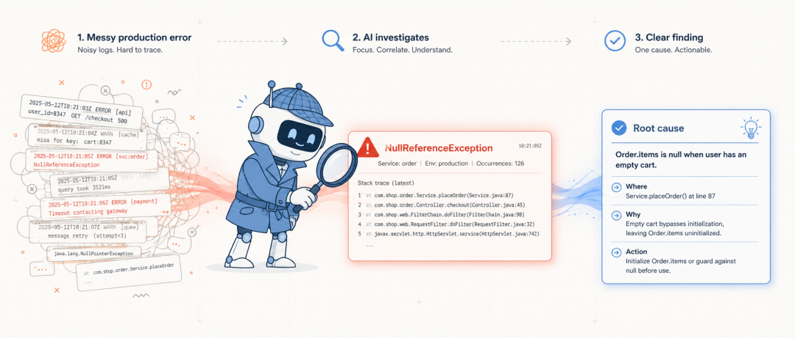
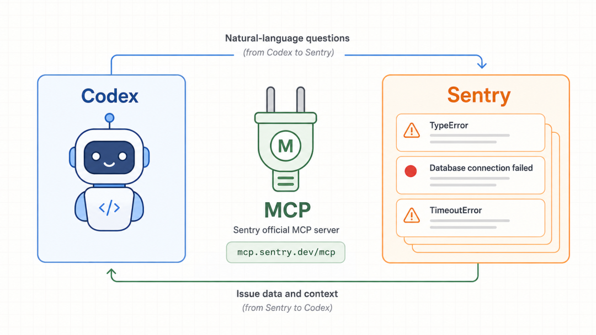
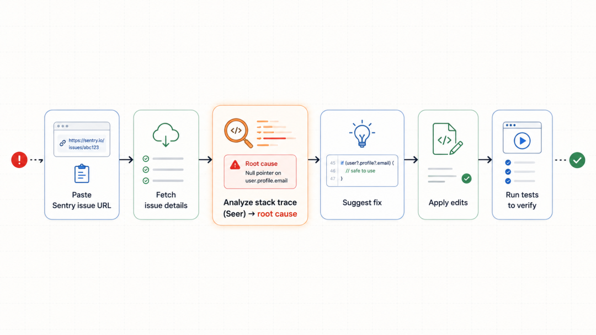
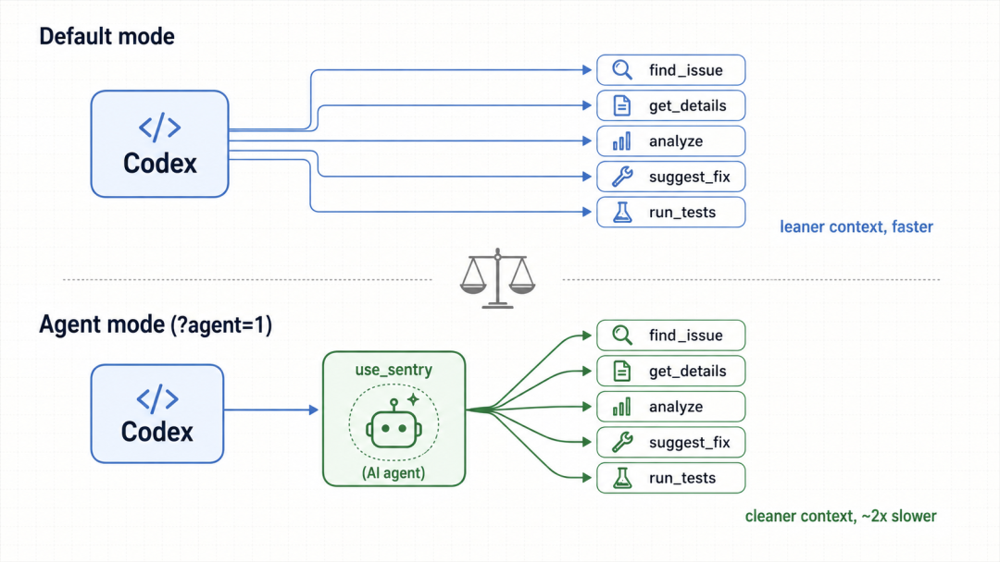

# Codex 连接 Sentry 排查线上错误

> 难度：进阶
>
> 类型：官方工具与集成

## 这篇文章适合谁

如果线上错误已经进入 Sentry，而你还要在日志、Issue、代码和测试之间来回切换，可以把 Sentry 接入 Codex，让它读取错误上下文，再回到代码仓库分析原因。

Sentry 是外部数据源。接入后 Codex 能看到哪些项目、Issue 和事件，取决于你授予的账号范围和工具权限。



## 选择连接方式

OpenAI 官方文档把 Sentry 列为 Codex 可用的插件或 MCP 服务。桌面 App 中可以从 Plugins 安装推荐的 Sentry 工具；CLI 也可以配置远程 MCP。使用哪条路径，要看当前客户端和组织提供的连接方式。

如果通过 CLI 添加远程 MCP，可以先按官方文档配置，再完成 OAuth 登录。不要直接把 Token 写进命令、文章或仓库。连接成功后，先让 Codex列出它能访问的组织和项目，确认范围正确。



## 从一个 Issue 开始

不要一上来让 Codex 扫整个组织。先给一个 Sentry Issue 链接或 Issue 标识，让它完成四步：读取 Issue 详情，定位相关代码，解释堆栈和发生条件，列出可验证的修复建议。

可以这样开始：

```text
请读取这个 Sentry Issue，先不要修改文件。
结合当前仓库定位异常来源，列出堆栈证据、可能原因、需要补的测试，以及还无法确认的信息。
```



有了原因和证据后，再让 Codex 修改代码。修复完成要运行对应测试，检查 diff，并确认 Sentry 中的错误条件确实被覆盖。

## 控制读取范围

Sentry 里的事件、请求参数和用户上下文可能包含敏感数据。把组织和项目范围收窄，只读取当前问题需要的事件。对外部工具设置最小必要权限，排查结束后复查连接和审批设置。

## 默认模式和 Agent 模式

工具的调用方式和可见名称会随插件版本变化。不要把某个截图中的 Agent Mode 名称当成固定接口。更可靠的做法是让 Codex先说明当前可用工具，再根据工具返回结果继续。



## 参考资料

- [Model Context Protocol](https://developers.openai.com/codex/mcp)
- [Automate bug triage](https://developers.openai.com/codex/use-cases/automation-bug-triage)
- [Codex 官方文档](https://developers.openai.com/codex/)
