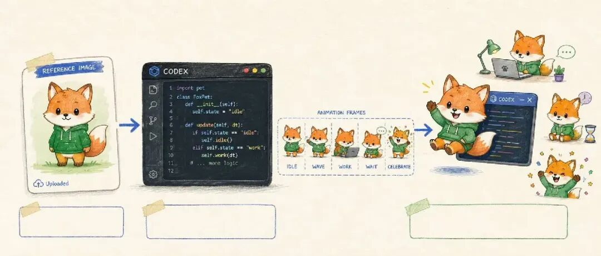
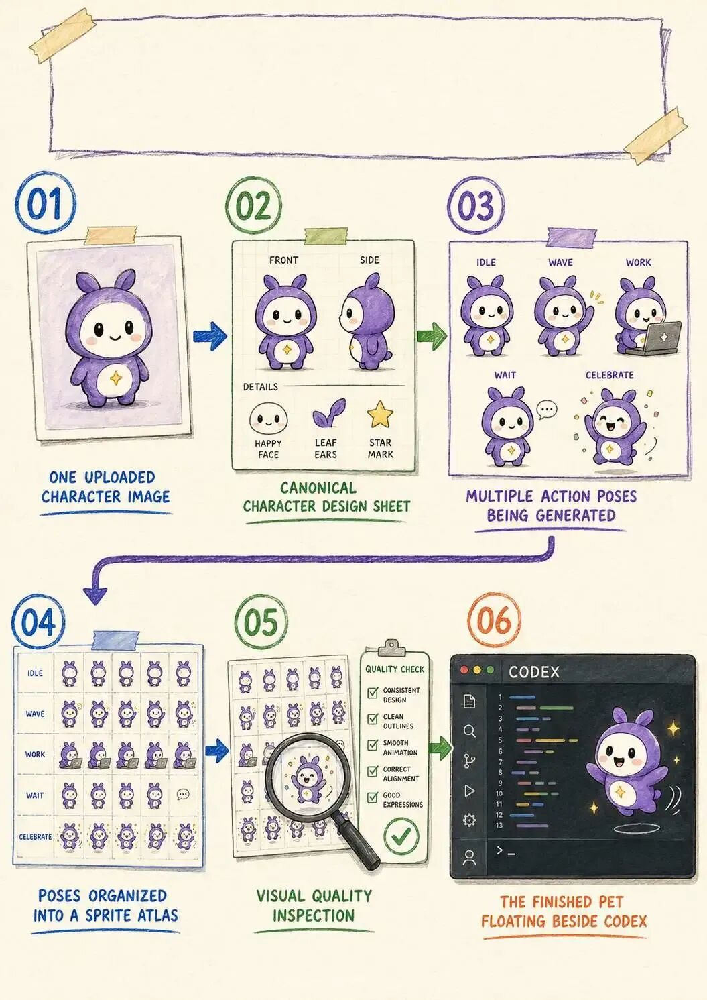
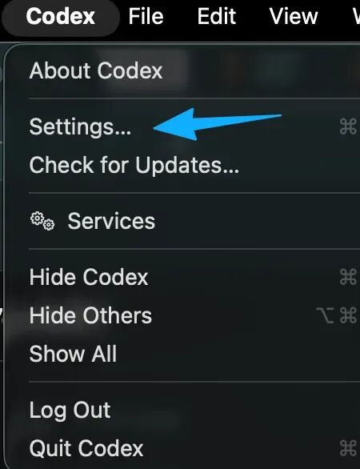
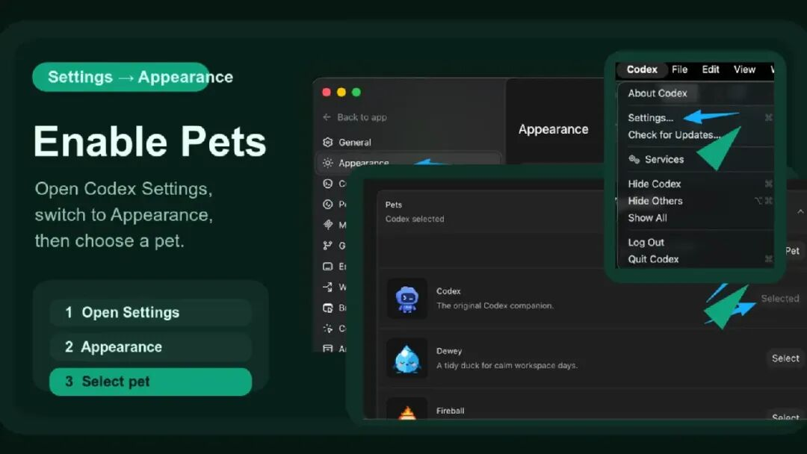
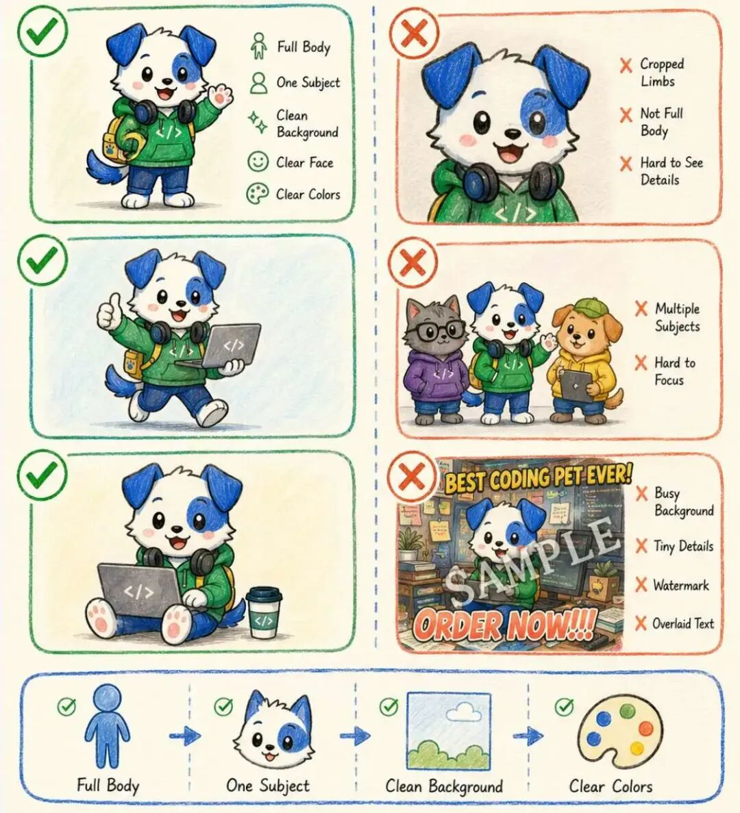
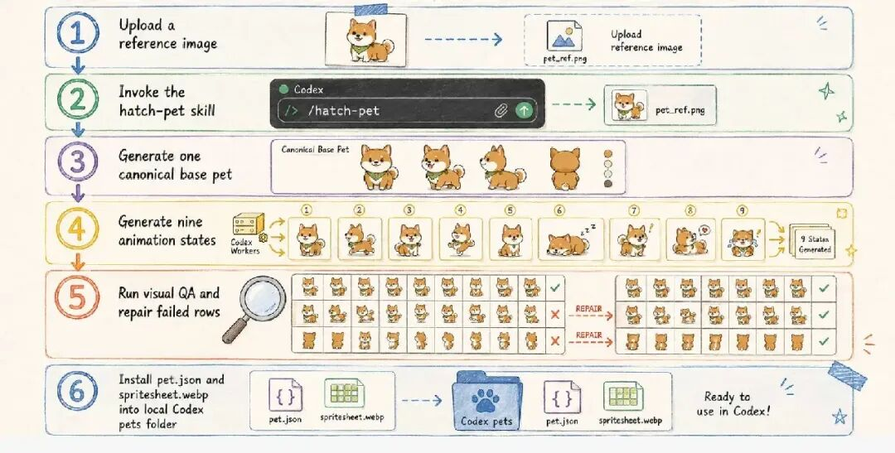
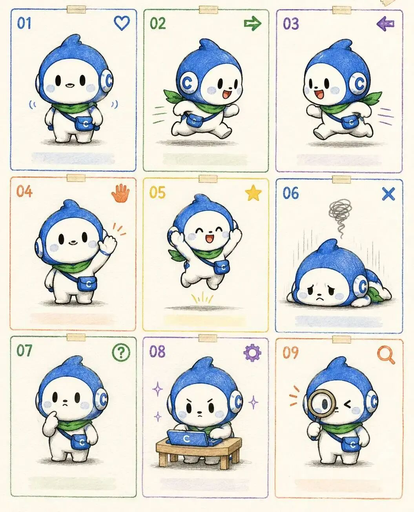
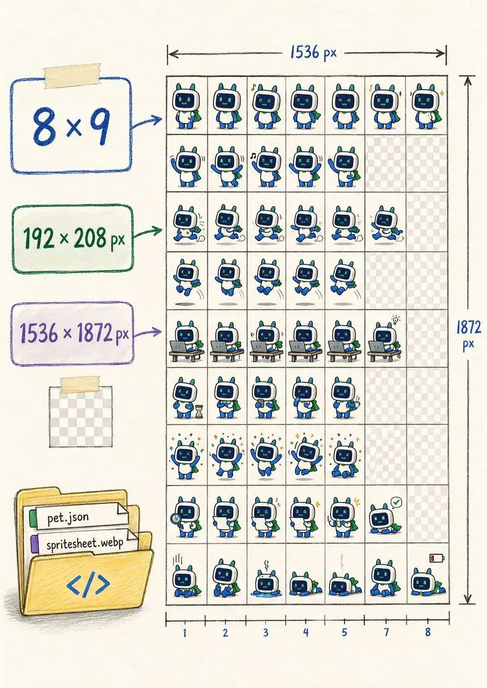
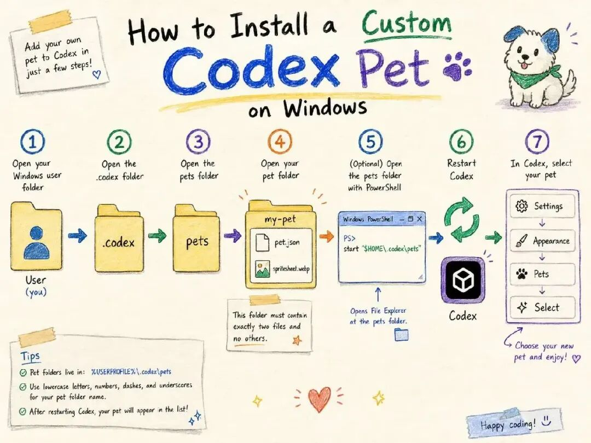
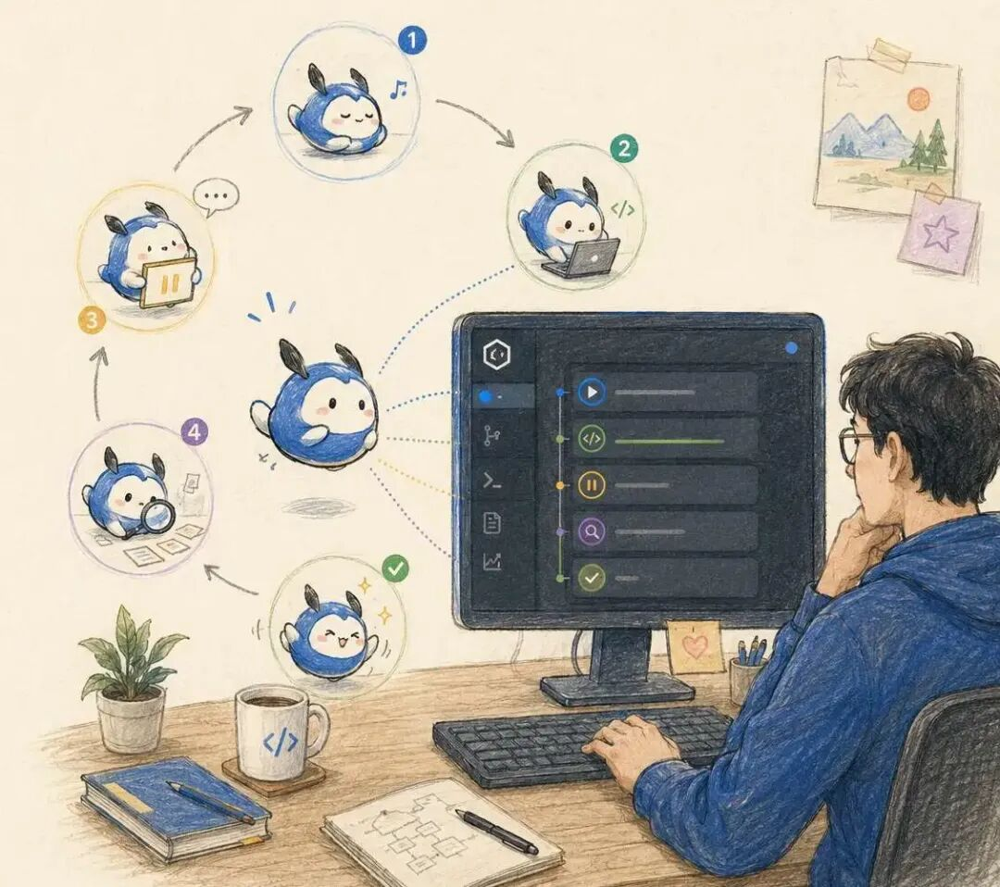

# Codex 创建自定义桌宠，从参考图到动画精灵图

> 难度 | 进阶
>
> 类型 | 官方工具与集成

Codex 桌面应用支持 Pets。你可以先启用内置宠物，也可以通过设置页里的自定义入口安装 `hatch-pet` Skill，再用一张参考图制作自己的动画角色。

这套流程会生成多组状态动画和一张精灵图。参考图只负责确定角色外观，不能直接当成桌宠文件。



## 开始前的准备

先把 Codex 桌面应用更新到当前版本，然后打开设置页，确认外观选项中能找到 Pets。不同版本的菜单文字可能略有变化，以当前客户端为准。



打开 Codex 的设置入口。



进入外观设置后启用 Pets，并先选择一只内置宠物。内置宠物能够出现，说明当前客户端已经具备动画播放能力。



参考图最好只有一个主体，轮廓清楚，完整身体没有被裁掉。复杂背景、密集文字和水印会增加角色走样的概率。真人肖像、公司标志和受版权保护的角色还要先确认上传与使用权限。



## 安装并调用 hatch-pet

官方文档当前给出的入口位于 `Settings > Pets > Create your own pet`。第一次使用时，Codex 会安装 `hatch-pet` Skill。安装后如果当前任务没有识别到新 Skill，新建一个任务再继续。

把参考图拖入任务，并说明宠物名称、希望保留的外观特征和视觉风格。下面这段可以直接改。

```text
请使用 hatch-pet Skill，以我上传的图片为角色参考，制作一只可在 Codex 桌面应用中使用的自定义宠物。

宠物名称为小橘。
保留参考图中的脸型、配色和红色围巾，使用清晰的像素风。
所有状态保持同一个角色，最终背景必须透明。
完成后检查精灵图尺寸、动作连贯性和边缘残留，并告诉我安装路径和启用方法。
```



## 检查动作状态

`hatch-pet` 会围绕 Codex 的工作状态生成动作。原稿记录的状态包括待机、左右移动、招手、跳跃、失败、等待、运行和审查。具体名称与帧数可能随 Skill 更新，制作时应读取当前安装版本的规范，不能把旧表格当成固定接口。



重点看四件事。

1. 不同动作中的脸、比例、配色和配件是否一致。
2. 左右移动方向是否正确，身体是否被格子边缘裁掉。
3. 等待、运行和审查能否表达 Codex 的实际状态。
4. 透明背景是否残留白边、色边、阴影或零散像素。

## 检查精灵图与安装结果

原稿使用的精灵图为八列九行，每格 `192 × 208` 像素，整张图为 `1536 × 1872` 像素。这个规格需要以当前 `hatch-pet` Skill 的输出要求复核。不要在图像软件里随意拉伸最终文件，也不要把未使用的透明格填上背景色。



生成完成后，检查输出目录中是否有宠物配置和精灵图文件。让 Codex 报告实际安装路径，再回到 Pets 设置页选择新角色。





最后分别触发普通任务、等待审批和失败状态，观察动画是否切换。文件存在只能证明生成完成，状态切换正常才说明这套桌宠可以使用。


## 常见问题

设置页没有 Pets 时，先更新客户端并查看官方文档中的平台与版本说明。新 Skill 没有出现时，新建任务或重启客户端。角色走样时只重做失败的动作，已经通过检查的行不必全部生成一遍。背景残留时要让 Codex 检查透明通道和边缘像素，不能只看缩略图。

## 参考资料

- [Codex Pets](https://developers.openai.com/codex/pets)
- [Codex Skills](https://developers.openai.com/codex/skills)
