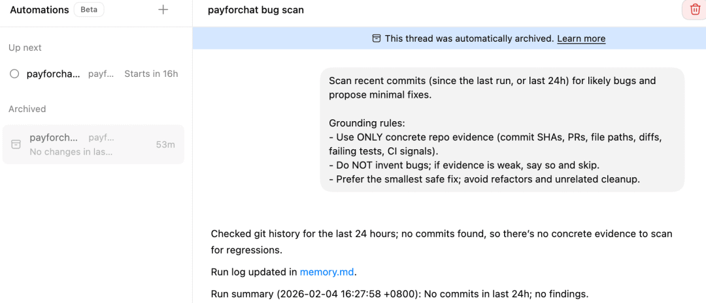

# Codex Automations 定时执行任务，创建、检查与运行条件

> 难度 | 进阶
>
> 类型 | 官方工具与集成

Automations 可以让 Codex 桌面应用按计划重复运行任务。它适合检查最近提交、汇总 Git 活动、整理 CI 失败和生成周期性报告。每次运行仍然需要明确的数据来源和完成标准。

本文只处理桌面应用中的定时任务。原稿中的 Skills 管理、线程界面和其他设置已经有独立教程，因此不在这里重复。

## 创建一条 Automation

打开 Codex 桌面应用中的 Automations 页面。可以从模板开始，也可以新建空白任务。


创建时至少检查名称、项目、提示词和执行计划。

| 字段 | 应写内容 | 检查重点 |
|---|---|---|
| Name | 能区分用途的任务名 | 不要只写 Daily Task |
| Projects | 允许读取的项目目录 | 避免把无关或敏感项目一起选中 |
| Prompt | 数据范围、动作和完成标准 | 说明没有数据时怎样结束 |
| Schedule | 日期、星期和时间 | 核对本机时区与工作日 |


检查最近提交可以这样写。

```text
检查当前项目过去 24 小时内的新提交。
只报告有代码证据支持的潜在问题，并给出文件路径和相关差异。
不要自动修改文件。
如果没有新提交，明确记录没有可检查内容并结束任务。
```

最后一句很重要。没有提交时，Automation 应如实结束，不能为了生成报告而假设存在问题。

## 运行条件

桌面端 Automation 依赖本机环境。电脑、Codex 应用和目标项目都要在任务执行时可用。系统休眠、应用退出、项目被移动或账号失效都会影响运行。云端触发能力若有变化，应以当前官方文档为准。

定时任务也不会自动获得更高权限。它仍然受项目范围、审批策略、网络访问和外部工具授权约束。涉及写文件、发消息或调用外部系统时，先用只读任务验证流程，再逐步增加权限。

## 检查运行结果

每次执行后查看任务状态、输入范围和实际输出。原稿中的示例检查了过去 24 小时的 Git 历史，因为没有提交而没有报告问题，并被归档。这种结果是正常完成，不是失败。



上线一条长期运行的 Automation 前，先手动执行一次。确认它读到了正确项目，没有越过时间范围，输出能回链到证据，并且空数据时会安静结束。之后再观察至少一次定时触发，确认本机时区和运行条件正确。

## 适合与不适合的任务

规则稳定、数据来源明确、结果可以复核的工作适合定时执行。需要临场判断、会产生外部副作用或错误成本很高的任务，应保留人工确认。自动提交代码、修改生产配置和向外部联系人发送消息都不宜直接作为第一版 Automation。

## 参考资料

- [Codex Automations](https://developers.openai.com/codex/app/automations)
- [Codex App](https://developers.openai.com/codex/app)
