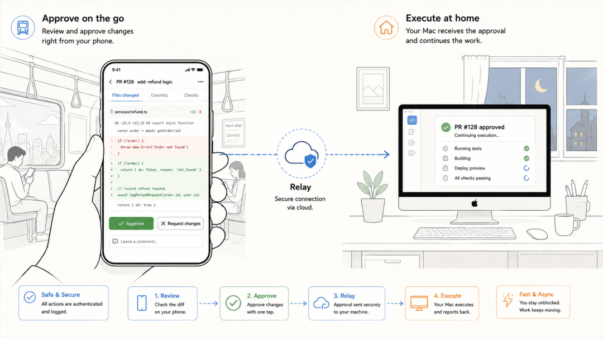
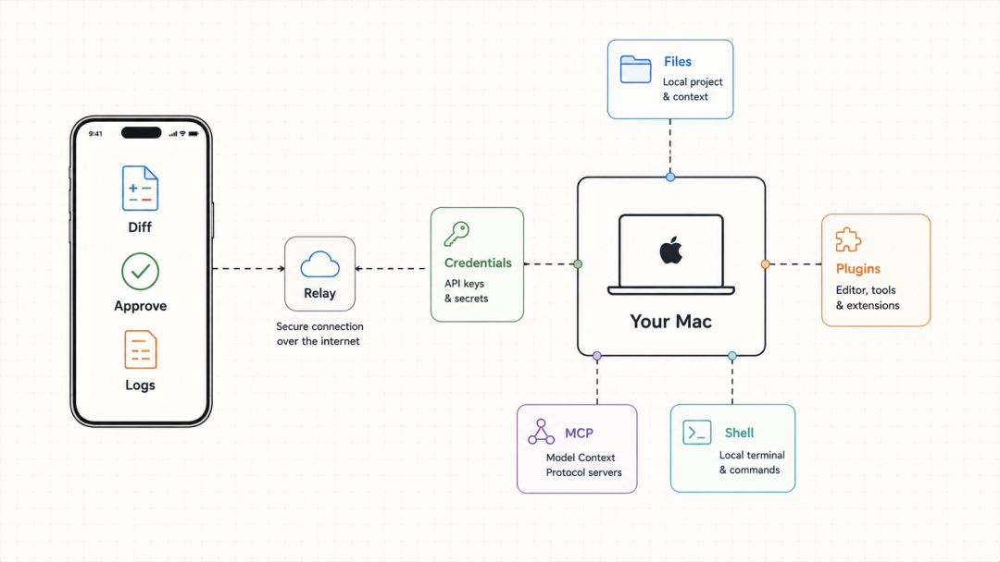
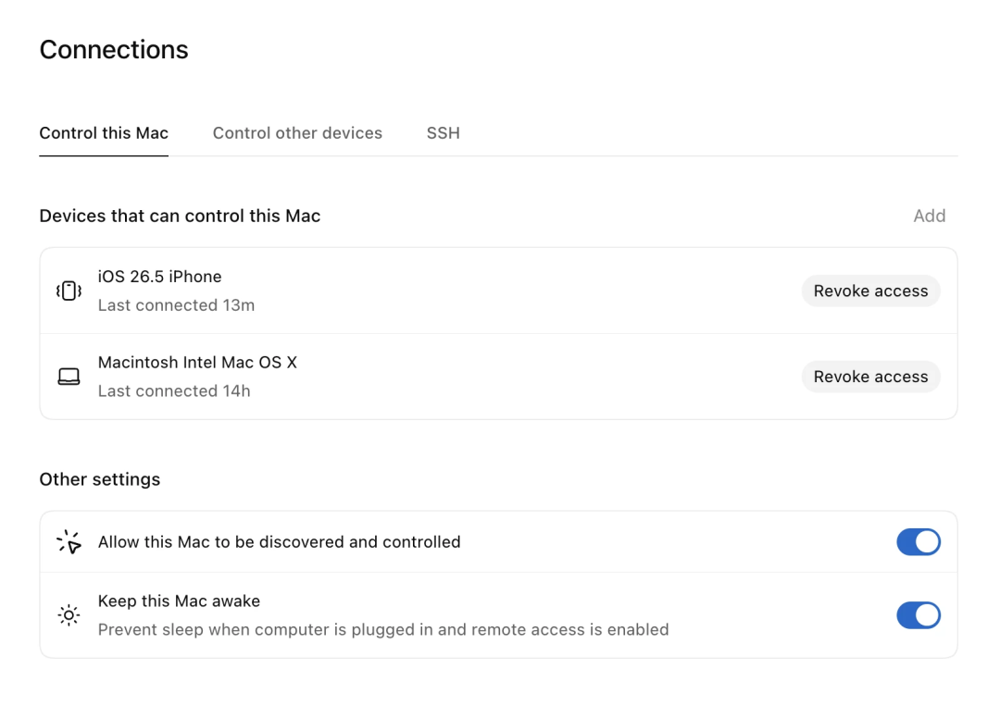
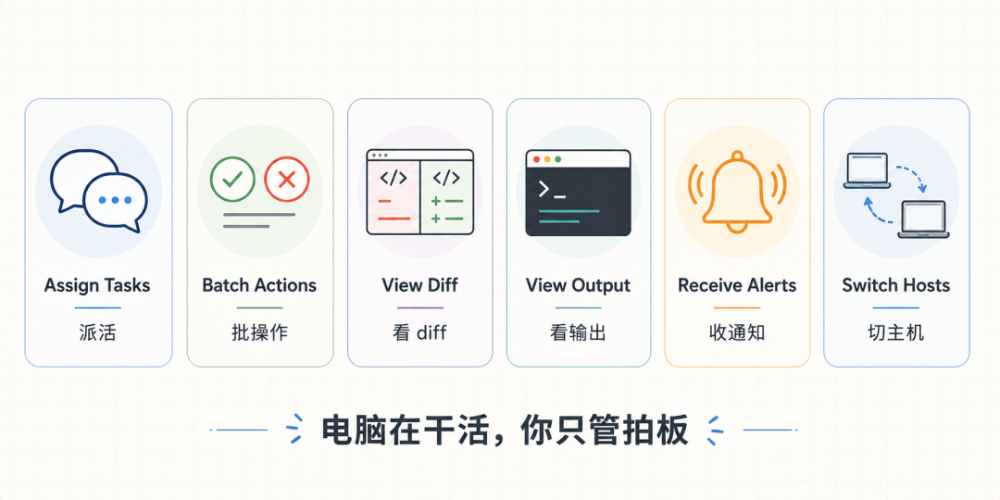
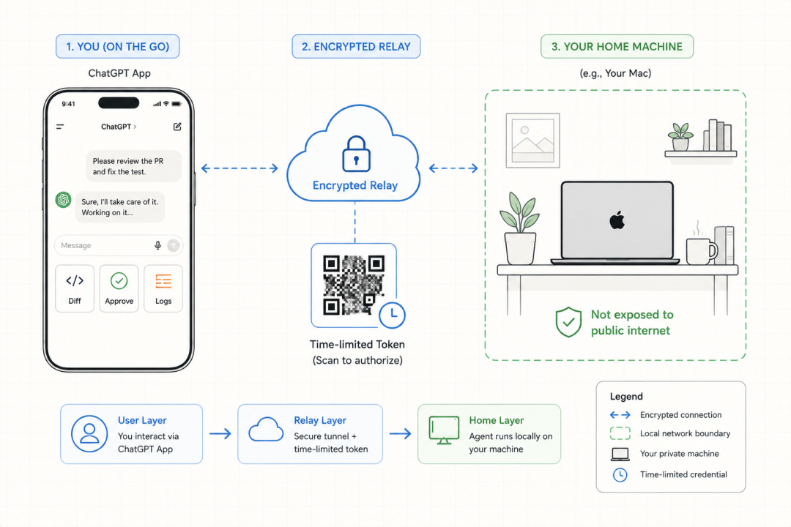

# Codex 移动端远程协作：用手机查看、分派和跟进电脑上的任务

早高峰的地铁上，你掏出手机，点开 ChatGPT。

家里书房的 Mac 正在跑一个重构任务，Codex 刚把测试跑完，diff
摆在屏幕上等你审，你扫两眼，批准，顺手又派了个新活：“把昨天那个接口的报错日志也查一下。”

全程手机不烫，流量没走几兆，模型调用、代码、终端都在家里那台电脑上，手机只是个遥控器。

这就是 Codex Remote！刚出预览版的时候只支持 Mac 主机，不少人卡在配对这一步；现在正式
GA，Plus、Pro、Business、Enterprise、Education 这些付费用户都能用了，Windows 主机也补上了。

一句话概括：手机变遥控器，电脑变成你的随身机房。

##  它不是把 Codex 搬到手机上

最容易误会的一点先说：这不是"手机版 Codex"。

模型调用、代码、shell 命令、文件、凭据，还有你装好的插件和 MCP server，全部留在电脑上。

手机拿到的只是实时推过来的结果，diff、测试输出、终端日志、截图，以及最重要的审批请求。

为什么这么设计？因为 Agent 干活最依赖的是环境。你登录过的网站、配好的数据库环境，放到云端沙箱要重新配一遍，在自己电脑上是现成的。

所以它的思路是反着来的：不把环境搬上云，把操作入口装进口袋。

##  用之前，先确认你能不能用

几个硬门槛提前说，免得你扫半天码找不到入口。

首先得是付费 ChatGPT 计划，其次两端 App 都要更到最新版，手机 ChatGPT 加电脑 Codex App，缺一不可。手机上找不到 Codex
入口，八成是版本没更。

配对只能从电脑上的 Codex App 发起，CLI 和 IDE 插件里没有这个入口，别在终端里翻了。

电脑要醒着、联网，而且登录的必须是同一个 ChatGPT 账号和工作区。公司账号还多一道：管理员可能要先在后台开启 Remote Control 权限。

##  两分钟配对

  1. 电脑上打开 Codex App，侧边栏选 Set up Codex mobile。
  2. 手机扫屏幕上的二维码，自动跳转到 ChatGPT。
  3. 确认账号和工作区一致，过一遍 MFA 或 passkey。
  4. 完事，主机出现在手机端 Codex 里。

配好之后去 Settings 里的 Connections
看一眼，那里能管理已配对设备。有个选项建议顺手打开：保持机器唤醒。不然你人在地铁上，电脑在家睡着了，白配。

##  手机上能干什么

比想象的全。开新线程派活、接着旧线程继续聊、中途追加指令、回答它的提问，都行。跑出来的
diff、测试结果、终端输出，包括截图，实时推到手机上。任务做完了，或者它卡住需要你了，手机弹通知。家里不止一台电脑的，还能来回切。

最值钱的是审批，Agent 要执行敏感操作，比如装依赖、跑数据库迁移，会停下来等你点头，以前这意味着你得守在电脑前，现在是手机上弹一条通知，你点一下。

别小看这一下，让 Agent 跑长任务，最大的顾虑从来不是它干不完，是它干到一半要权限，然后干等你一个小时，这个功能的价值有一半在这。

##  安全这块怎么处理的

把自己电脑的操作权开到外网，听起来就危险。GA 版本专门重做了这一层。

那个二维码也不是普通链接，里面编码的是一个限时会话令牌。必须你本人拿着手机对着电脑屏幕扫，配对绑在你的 ChatGPT
账号和多因素认证上。想远程劫持你的机器？得先走进你家书房。

官方也把丑话说在前面，只配对你自己拥有且信任的设备。

##  写在最后

Codex 这个远程控制，本质上是把人必须坐在电脑前这个前提给拆了。

以前 AI 帮你写代码，你还是得守着，现在你能把电脑当成一个一直在家干活的同事，用手机远程给它派活、盯着、拍板。

真正跑代码的还是那台真实的机器，你只是不用再被物理位置绑住。

它没多神奇，配对也就扫个码的事，但那种人在外面，活在家里跑的感觉，用过一次确实回不去。

好不好用，你自己试一把就知道了。

> 延伸阅读：
>
> 官方文档：https://developers.openai.com/codex/remote-connections

