# Codex 桌面端任务工作流：项目切换、并行任务与本地协作

Sam Altman 昨天在 X 上宣布 Codex 桌面版正式上线 Mac
平台。也是立马试用了一下，可视化界面操作起来确实方便，多个线程可以独立工作互不影响，Skill 管理也比较直观，还新增了定时任务功能。

下载地址：  ** openai.com/codex  ** 官方说后续会支持 Windows，目前只有 Mac 版本。

限时福利：Free 和 Go 用户也能用，付费用户 rate limit 翻倍。

官方博客提到"For a limited time we're including Codex with ChatGPT Free and
Go"，不确定这个限时会持续多久，想试的可以抓紧。

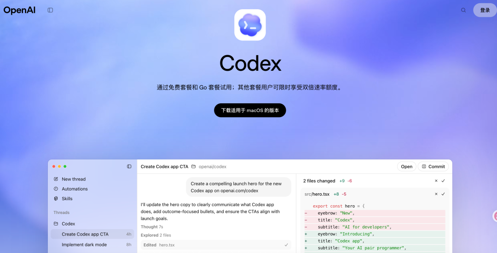

官网文档：https://openai.com/zh-Hans-CN/index/introducing-the-codex-app/

通常一手信息是最有价值的。

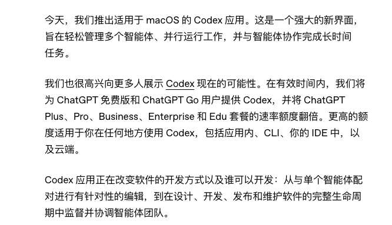

##  智能体的指挥中心

Codex Desktop 的核心优势在于并行工作流管理。你可以同时运行多个独立的 Agent 线程，一个查
bug，一个讨论需求，一个策划活动，切换起来很流畅。

在 CLI 版本里需要开多个终端窗口才能实现。可视化界面让任务状态一目了然，对非技术人员或者不熟悉命令行的人来说更友好。

相比 Claude Code，Codex Desktop 更侧重于项目级的任务编排和可视化管理，而 Claude Code 在 IDE
集成和代码编辑体验上更深入。两者都支持 Skills 和 MCP，但使用场景有所不同。

##  Skills 管理界面

桌面版提供了可视化的 Skills 管理界面，所有已安装的 Skill 都在这里。我平时用 Claude Code
比较多，所以这边只有两个元技能。下面有很多官方推荐的 Skill，可以一键安装。

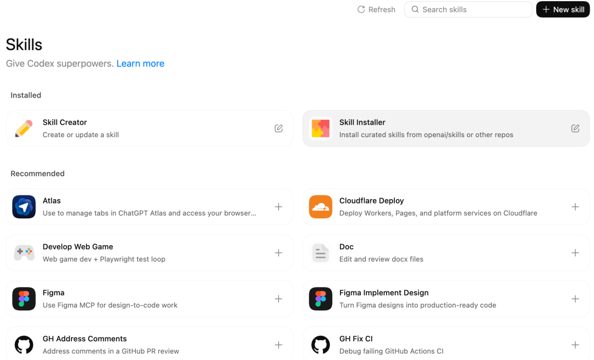

比如 Figma Skill，让 Codex 能直接读取 Figma 设计稿，自动生成 React + Tailwind 代码，还会校验是否 1:1 还原。

简单说下这两个核心 Skill：

  * ** Skill Creator  ** ：用来创建自定义技能。官方提供了十几个现成技能，你也可以用 Skill Creator 自己做一个。 
  * ** Skill Installer  ** ：从官方仓库安装技能。点右下角的 Try 按钮，它会开一个新对话，然后你可以问它"有什么可以安装的技能？"（其实都是从 OpenAI 官方技能库拉取的，和页面推荐的那些一样） 

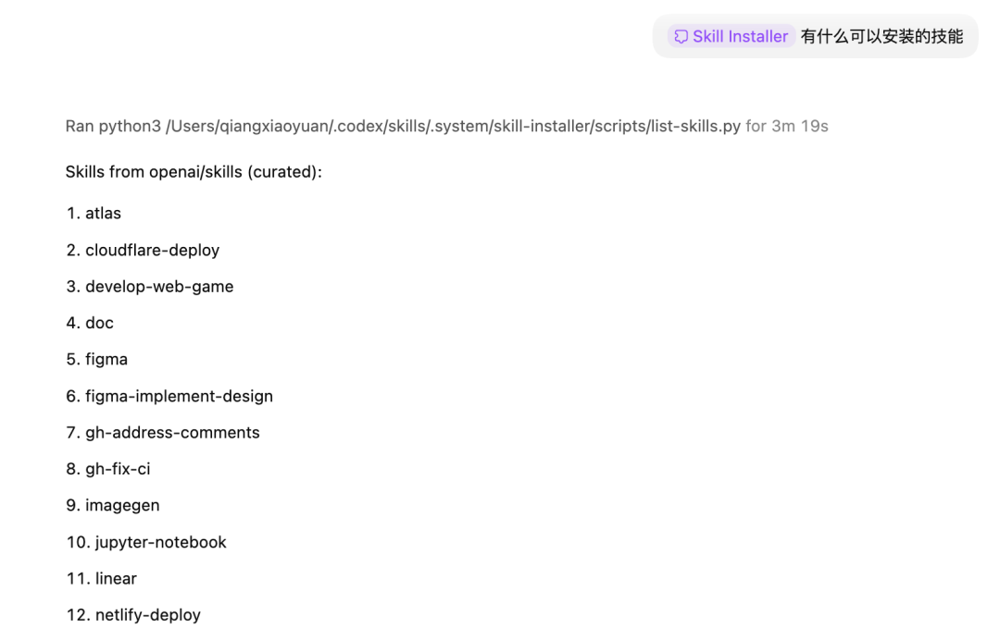
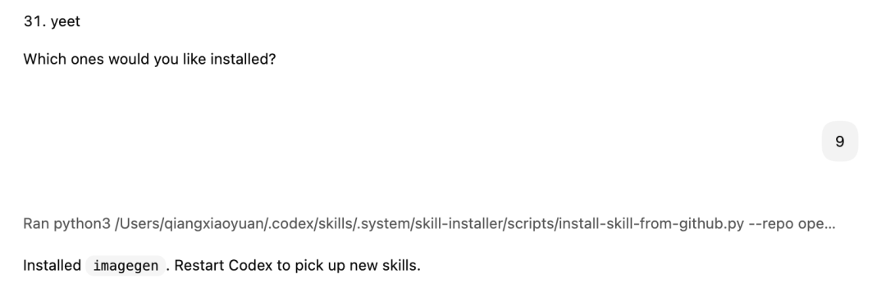

##  定时任务

这是 Desktop 的新功能，CLI 和 IDE 插件都没有。Automations 让 Codex 定时自动执行任务，比如每天早上自动分类 GitHub
issues，每天下班前生成日报，定期检查 CI 是否挂了，定时扫描代码里的 bug。

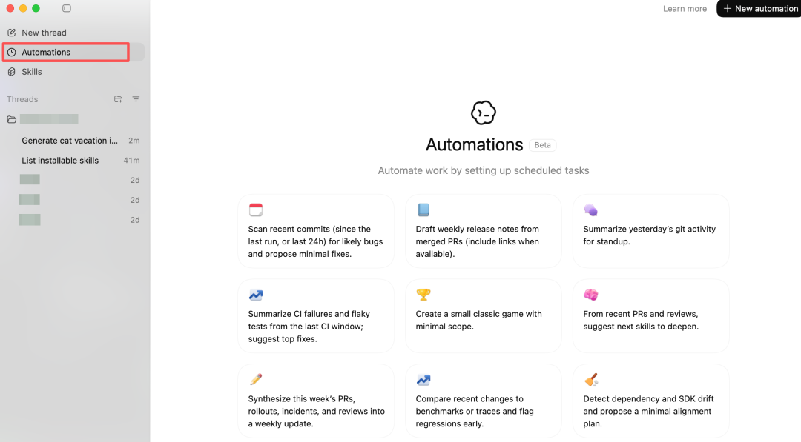

官方提供了几个模板：

模板  |  用途   
---|---  
📅 扫描最近提交  |  检查 24h 内的 commit，找潜在 bug 并建议修复   
📄 生成周报  |  从已合并的 PR 生成 release notes   
🌤 Git 日报  |  总结昨天的 git 活动，用于站会汇报   
📈 CI 失败汇总  |  总结 CI 失败和不稳定测试，建议修复   
🏆 做个小游戏  |  创建一个简单的经典小游戏（有点好玩）   
🥜 技能建议  |  根据最近 PR 和 review 推荐该学什么   
📝 周更汇总  |  汇总本周 PR、发布、事故、review   
📈 性能回归检测  |  对比 benchmark，标记性能下降   
🔧 依赖漂移检测  |  检测依赖和 SDK 版本漂移，建议对齐   
  
比如 扫描最近提交 这个定时任务可以自定义这些：

字段  |  作用   
---|---  
Name  |  任务名称（Daily bug scan）   
Projects  |  选择要扫描的项目文件夹   
Prompt  |  任务指令（可以自定义）   
Schedule  |  执行时间：每天 09:00，可选周一到周日   
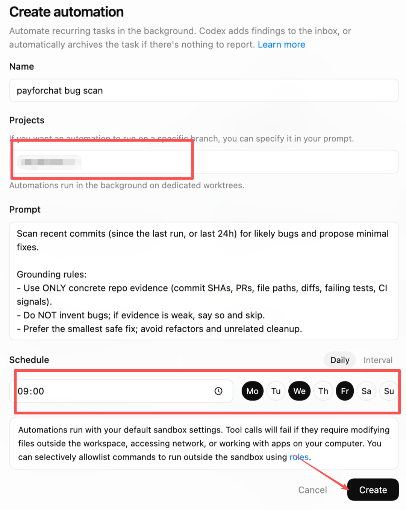

执行完会进入"待审队列"，你来最终确认。

需要注意的是，定时任务需要电脑开着 + App（客户端） 开着才会执行，目前是 Beta 功能，可能有
bug。官方博客提到未来会支持"云端触发"，就不用一直开着电脑了。

我这个检查了过去 24 小时的 git 历史，没有提交记录，所以没有可扫描的内容。遵守了 Grounding
rules，没有造bug，没活干就老实说没活干，自动归档到 Archived。

##  界面逻辑

Codex Desktop 的组织结构是：

项目（Project） └── 线程（Threads） └── 对话记录

一个项目可以有多个线程，每个线程是一个独立任务，Automations 可以针对特定项目运行。

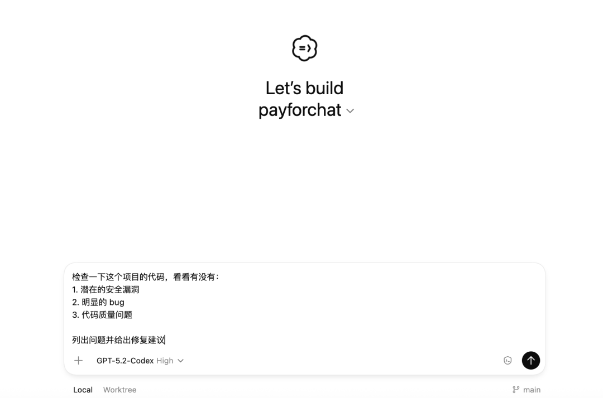
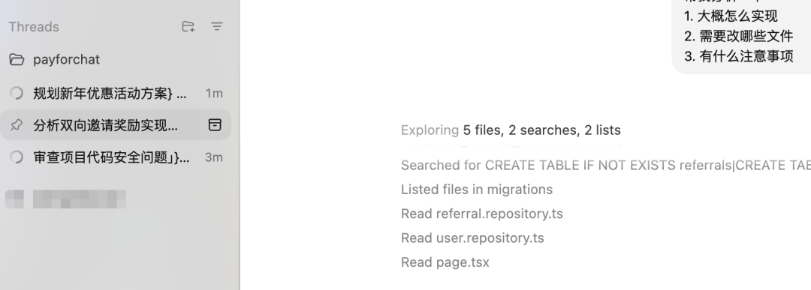

比如三个任务同时进行：一个查 bug、一个讨论需求、一个策划活动，切换起来比较流畅。

##  实用的设置项

** 防休眠模式  ** ：开启后，Codex 跑任务时电脑不会自动休眠。跑个长任务出去倒杯水，回来不用担心电脑睡着了任务断掉。

** 追问排队  ** ：当 AI 还在执行任务时，你发的新消息会自动排队等候，不会打断它。想到什么随时补充，不用等它跑完再说。

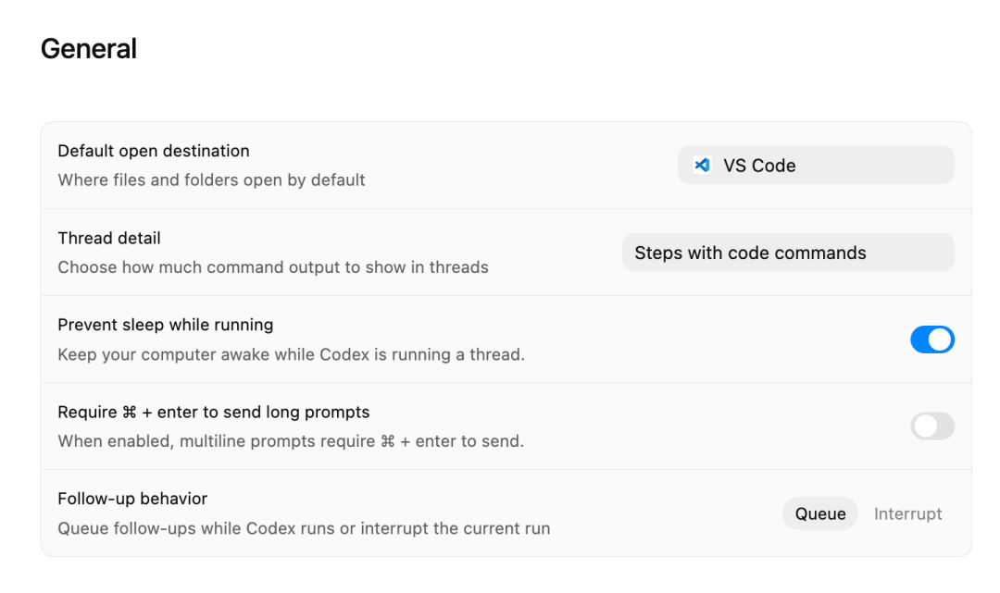

** Personality 切换  ** ：输入  ` /personality  ` 可以切换两种风格：

  * Friendly：解释详细，像个耐心的同事 
  * Pragmatic：废话少说，直接给答案 

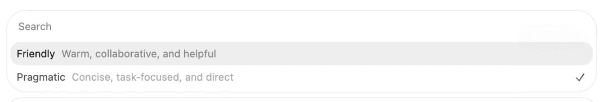

写代码赶进度选 Pragmatic，学习探索选 Friendly。很多人吐槽 AI 话太多，现在可以自己选了。

** MCP 生态  ** ：可以一键连接 Linear、Notion、Figma 等常用工具，让 AI 直接操作你的项目管理、设计稿、文档。

** Custom instructions  ** ：可以写一段"人设"，比如"我习惯用 TypeScript + React"，Codex 会记住。

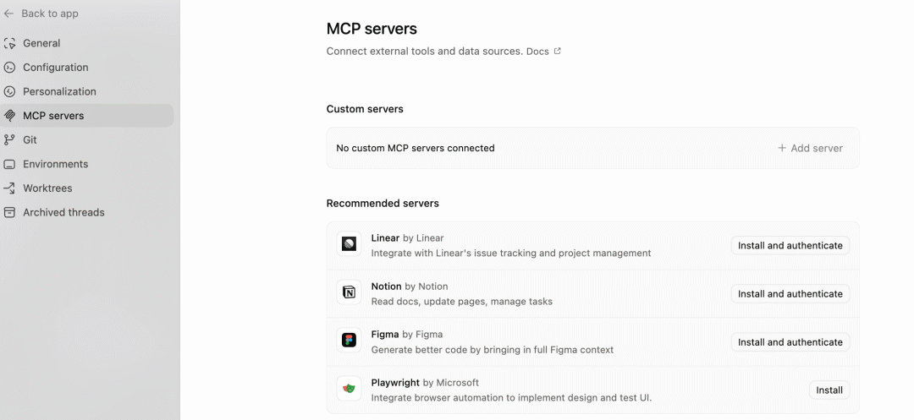

** 安全沙箱  ** ：Codex 默认在沙箱里执行，访问网络或修改工作区外的文件需要手动批准。Settings 里可以调整 Sandbox mode 和
Approval policy，根据自己的使用场景选择合适的安全级别。

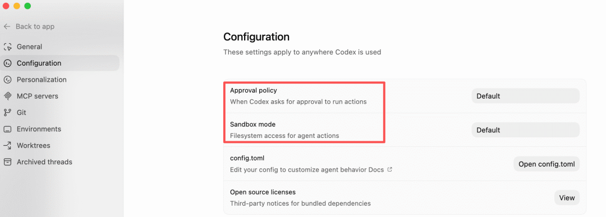

##  技术亮点

** Worktrees 隔离  ** ：多个 Agent 改同一个项目也不会冲突。Codex 使用 Git worktrees 技术，为每个 Agent
创建独立的工作目录，避免了并行任务之间的文件冲突。这在多线程开发场景下很实用。

** 跨端同步  ** ：Desktop 会读取你 CLI 和 IDE 插件的历史记录和配置，无缝衔接。不需要重新配置，直接继承之前的工作环境。

如果你想让多个 Agent 并行干活，或者需要设置定时任务自动巡检代码，桌面版的体验确实更好。

