# Codex CLI 使用与多入口配置：终端、编辑器和网络排查

现在三大主流的编程工具分别是 Codex、Claude Code 以及 Gemini。Claude Code
的综合能力很强，也是我的主力编程工具，但它封号太严重了，对国内极其不友好，使用门槛比较高，要找到靠谱的渠道。

Gemini 目前在前端设计方面优势比较明显。Codex
普遍认为在代码审查方面做得比较出色，因为它分析很严谨，这导致的另一个问题就是速度会比较慢。但它使用起来门槛要低，因为现在 ChatGPT
只要你充了会员就可以直接用 Codex，而且现在用下来发现它的速度有所提升。

##  ** Codex 是什么？  **

OpenAI 官方出品的 AI 编程工具，可以理解为终端版 ChatGPT，专门用来写代码。

** 四种使用方式：  **

  1. ** Codex  ** ** CLI  ** 在终端里直接对话写代码
  2. ** Cursor 插件  ** 在 Cursor 编辑器里用 Codex 模型
  3. ** VS Code 插件  ** 在 VS Code 里侧边栏对话
  4. ** Opencode  ** 在 Opencode 客户端里用 Codex 模型

** 为什么推荐用？  **

  * Plus 会员（$20/月）直接用，不用额外买 API
  * 比 Claude 稳定，不用担心封号
  * Codex 的使用体验越来越好，速度提升了

** 前提条件：  **

  * 需要 ChatGPT Plus/Pro/Team 会员（免费账号不行）
  * 需要科学上网环境

##  一、前置准备

###  1.1 注册 ChatGPT 账号

如果你已经有账号，跳过这一步。官网注册地址：https://chat.openai.com/

国内邮箱可用（QQ、163、Outlook 都行），不需要国外手机号，需要科学上网环境。

###  1.2 订阅 Plus 会员（必须）

** 因为Codex 只对付费用户开放，免费账号用不了。  ** Plus（  月  ）  、  （  200/月）、Team，任意一种都行。

不过ChatGPT 要绑海外卡支付，国内的visa不行，对国内用户不友好，网上可能也有一些方法，如果想省事的话找代充平台。

全网最稳！ChatGPT Plus 微信直充，2分钟到账（亲测丝滑）

升级成功后，在 ChatGPT 设置页能看到 Plus 标识。

##  二、Codex CLI（命令行）

###  2.1 安装 Node.js 环境（前提条件）

Codex CLI 基于 Node.js 运行，需要  ** Node.js 22 或以上版本  ** 。

** 先检查是否已安装：  ** 打开终端（Mac）或 PowerShell（Windows），运行：

    node -v

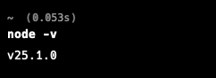

如果显示版本号 ≥ 22，跳过安装直接看 2.2。如果版本低于 22 或提示命令不存在，按下面步骤安装：

** 安装 Node.js：  **

  1. 打开浏览器访问 https://nodejs.org/

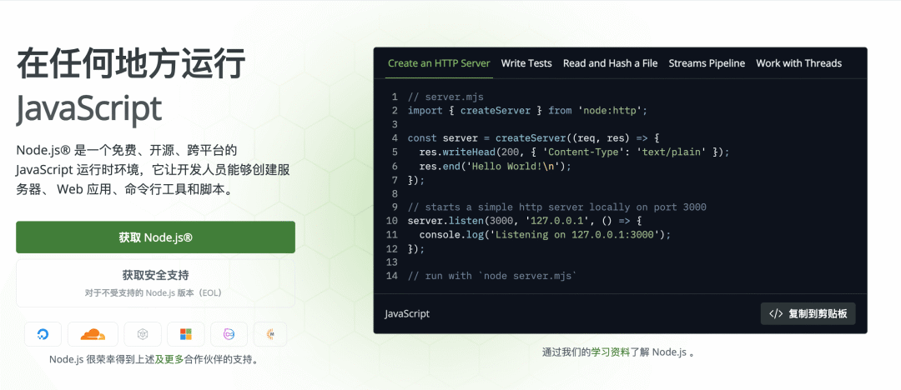

  2. 官网提供两种安装方式，任选其一：

** 方式一：下载安装程序（推荐新手）  **

页面下方有下载按钮，点击下载安装包：

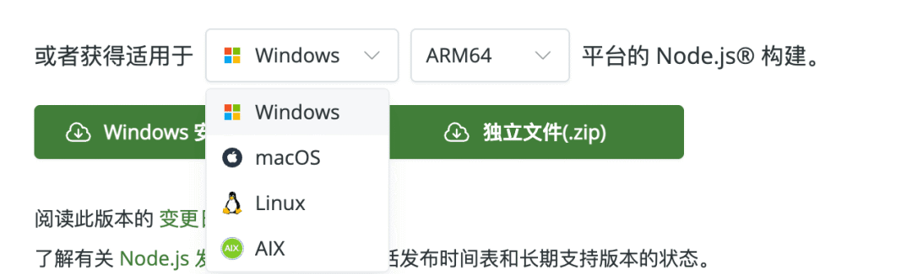

** 方式二：命令行安装（适合有终端经验的用户）  **

官网会显示一段安装命令（基于 nvm，一个 Node.js 版本管理工具）

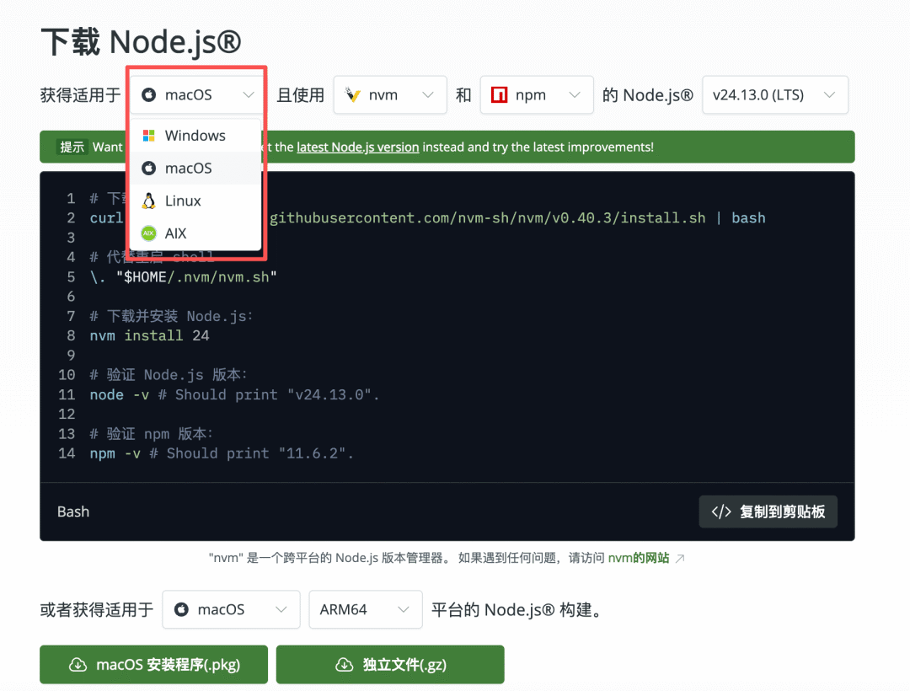

直接复制到终端执行：

        # Mac/Linux 用户执行这段命令
    curl -o- https://raw.githubusercontent.com/nvm-sh/nvm/v0.40.3/install.sh | bash
    source ~/.bashrc  # 或 source ~/.zshrc
    nvm install 24

Windows 用户建议直接用方式一下载安装程序，更简单。

     * ** Windows  ** ：下载  ` .msi  ` 文件，双击运行，一路点「下一步」即可
     * ** Mac  ** ：下载  ` .pkg  ` 文件，双击运行，按提示完成安装
  3. 安装完成后重新打开终端，运行  ` node -v  ` 确认版本 ≥ 22

###  2.2 安装 Codex CLI

####  Mac 用户

** 方式一：npm 安装（推荐）  **

    # 安装 Codex 最新版
    npm install -g @openai/codex@latest

这个命令会从 npm 官方仓库下载并安装最新版本的 Codex 工具。

如果遇到权限问题，可以用 sudo：

    sudo npm install -g @openai/codex@latest

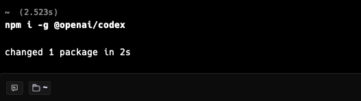

国内网络慢可以用镜像加速：

    npm install -g @openai/codex@latest --registry=https://registry.npmmirror.com

** 方式二：Homebrew 安装  **

    brew install codex

####  Windows 用户

** 第一步：打开 PowerShell（管理员模式）  **

右键点击开始菜单 → 选择 Windows PowerShell 或 终端

** 第二步：执行安装命令  **

    npm install -g @openai/codex@latest

同样国内网络慢可以用镜像加速：

    npm install -g @openai/codex@latest --registry=https://registry.npmmirror.com

> “
>
> Windows ：如果遇到权限问题，用管理员模式运行 PowerShell

####  验证安装成功

安装完成后，运行：

    codex --version

看到版本号就说明安装成功了。

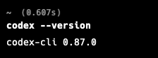

###  2.3 登录授权

Codex CLI 支持两种授权方式：

####  方式一：ChatGPT 官方账号登录（推荐）

终端输入  ` codex  ` ：

    codex

如果你没有配置任何第三方的 API key 的话，输入这个命令会弹出下面的弹框，这是官网的返回。

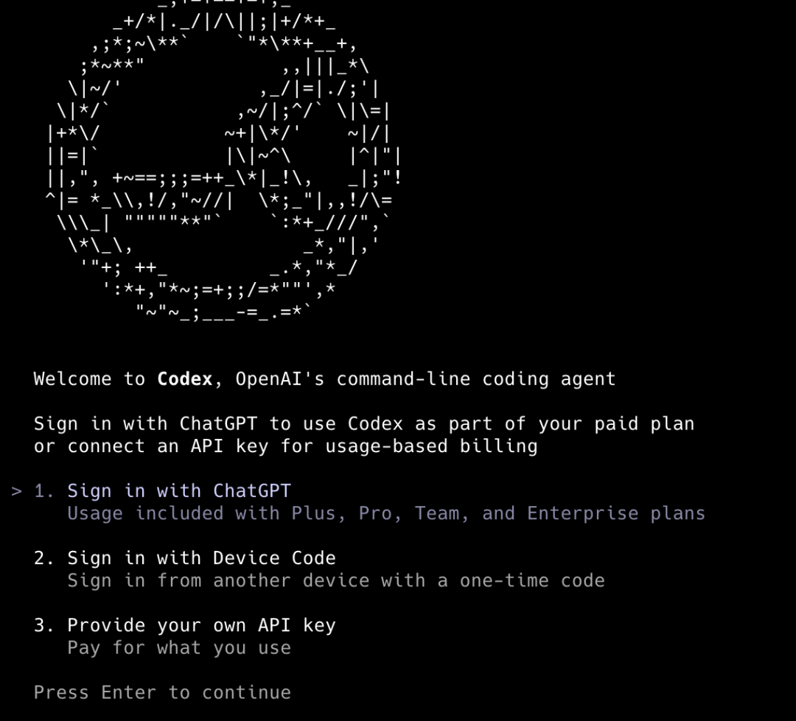

选择使用官网登录，就会跳转到官网，如果没有自动打开官网的话，也可以复制它提供的链接手动打开。

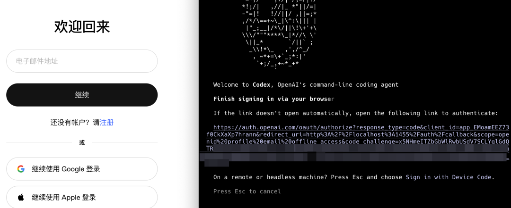

然后登录自己的 ChatGPT 账号，有会员的那一个。

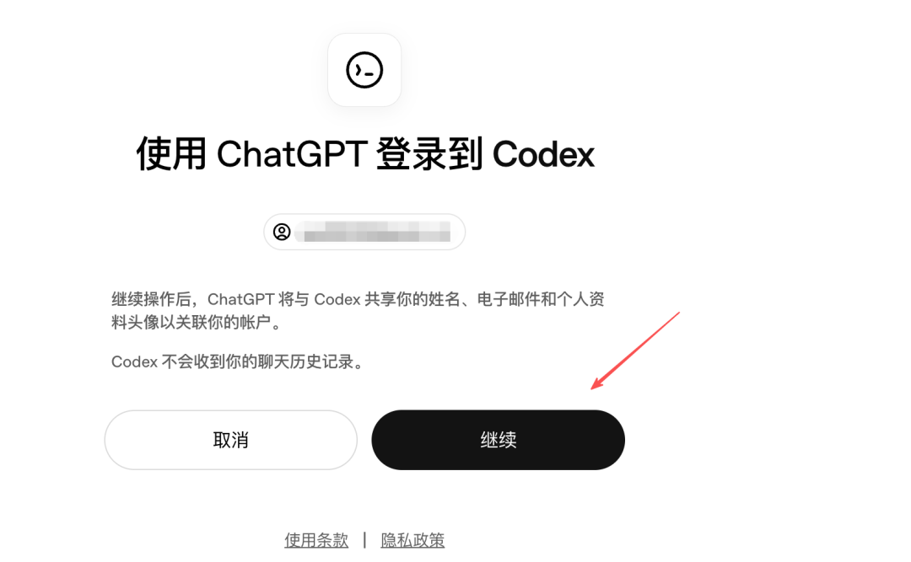

看到这个界面就是登录成功了。

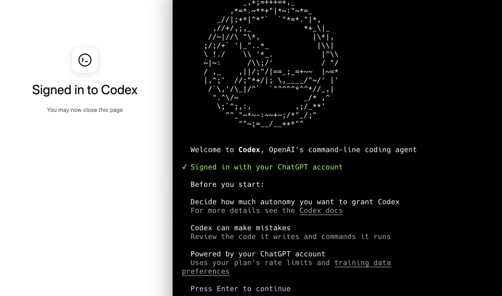

进入到下面这个页面，它会提示你现在 Codex 在哪个目录下面工作。

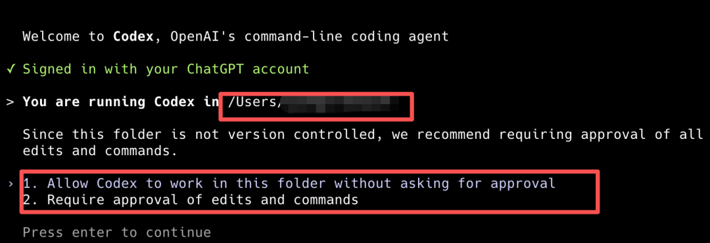

选项 1 表示允许AI 直接修改这个目录下的文件，或者直接运行终端命令，期间不会跳出任何确认提示。

选项2 表示 Codex 在修改任何一行代码或执行任何一条指令前，都会让你手动确认。

一般让它自动执行的情况比较多，每次都确认太麻烦了。选择之后就可以开始使用了。

授权成功后，token 自动保存到  ` ~/.codex/  ` 目录，下次启动不用重复登录。

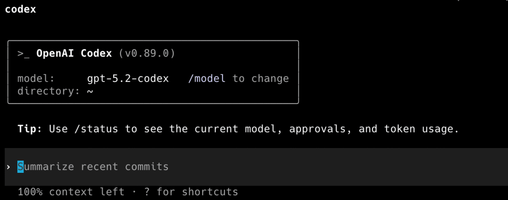

####  方式二：使用第三方 API（适合有 API key 的用户）

如果你有支持 Codex 模型的第三方 API 服务，可以通过配置文件使用，不需要 ChatGPT Plus 账号，比如 aigocode.com
这个中转服务站。

** 第一步：创建配置目录  **

    mkdir -p ~/.codex

** 第二步：创建 config.toml 配置文件  **

    nano ~/.codex/config.toml

填入以下内容（根据你的服务商修改）：

    model_provider = "custom"
    model = "gpt-5-codex"  # 改成你的服务商支持的模型
    model_reasoning_effort = "high"
    disable_response_storage = true
    preferred_auth_method = "apikey"

    [model_providers.custom]
    name = "custom"
    base_url = "https://api.xxx.com/v1"  # 改成你的服务商 API 地址
    wire_api = "responses"
    requires_openai_auth = true

** 第三步：创建 auth.json 存放 API Key  **

    nano ~/.codex/auth.json

填入：

    {
      "OPENAI_API_KEY": "sk-你的API密钥"
    }

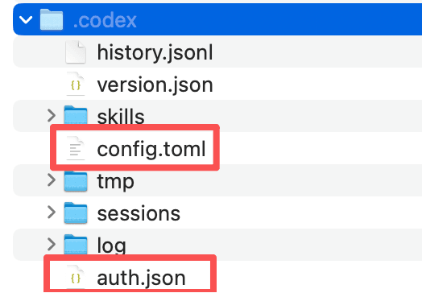

** 第四步：验证配置  **

    codex

如果配置正确，就能正常使用了。

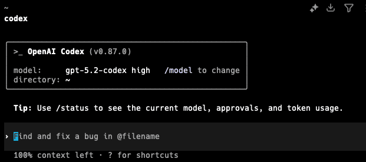

> “
>
> ** 注意：  ** 第三方 API 需要支持 Codex 相关模型（比如  ` gpt-5-codex  `
> ）才能正常使用。配置前先确认服务商是否提供对应模型。

###  ** 2.4  ** ** CLI  ** ** 常用命令  **

####  基础命令（新手使用必会）

** 启动和退出  **

命令  |  说明  |  使用场景
---|---|---
` codex  ` |  启动交互模式，进入对话界面  |  需要多轮对话完成复杂任务
` codex "你的问题"  ` |  启动时提问  |  快速问一个简单问题（感觉没必要）
` /quit  ` 或  ` Ctrl+C  ` |  退出 Codex  |  结束当前会话

** 常用交互命令  **

命令  |  说明  |  使用场景
---|---|---
` /model  ` |  切换模型和 reasoning effort  |  简单任务切低配省额度，复杂任务切高配
` /approvals  ` |  设置哪些操作需要确认、哪些自动执行  |  信任度高的项目开 full access，重要项目开 default
` /status  ` |  查看当前模型、权限模式、token 使用情况  |  检查还剩多少额度
` /clear  ` |  清空当前对话历史，重新开始  |  换个话题，不想让之前的对话影响回答
` /compact  ` |  压缩上下文，对话太长时用这个释放空间  |  聊了很久 token 快用完时（也会自动压缩）
` /new  ` |  开始新对话（不退出当前会话）  |  当前任务完成，开始下一个任务
` /review  ` |  审查当前代码改动，找出问题  |  写完代码让 AI 帮忙 review

下面是部分命令的截图。

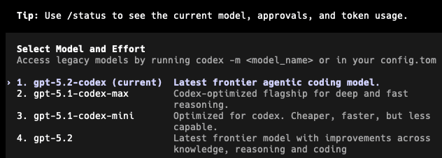
/model
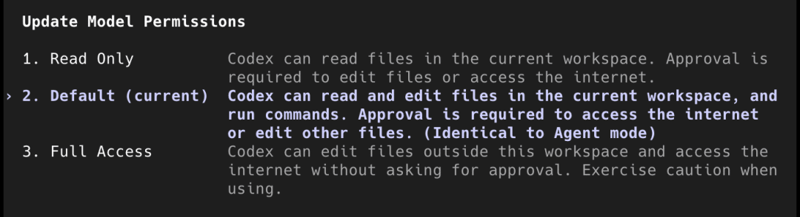
/approvals
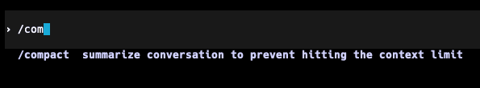
/compact
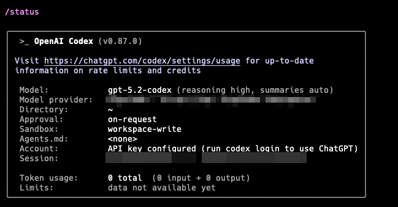
/status
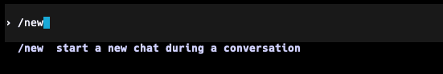
/new
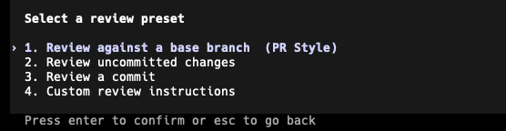
/review

** 会话管理  **

命令  |  说明  |  使用场景
---|---|---
` /resume  ` |  恢复之前保存的对话  |  第二天继续昨天的重构任务
` /fork  ` |  从当前对话分叉出一个新对话  |  想尝试不同方案但保留当前进度

** 进阶功能  **

命令  |  说明  |  使用场景
---|---|---
` /skills  ` |  使用技能来优化 Codex 执行特定任务  |  让 AI 用特定技能处理任务（下面有单独介绍，非常推荐！！）
` /experimental  ` |  开启/关闭实验性功能  |  尝鲜新功能

####  进阶命令（高手进阶）

** 启动参数  **

命令  |  说明  |  使用场景
---|---|---
` codex --full-auto  ` |  全自动模式，AI 直接执行不需确认  |  批量处理文件、自动化脚本
` codex -a on-request  ` |  让模型每次执行命令前都需要你确认  |  重要项目，想逐步确认每个操作
` codex --model gpt-5-codex  ` |  指定使用的模型  |  临时切换模型不想改配置
` codex --help  ` |  查看所有可用参数  |  忘记某个参数怎么写
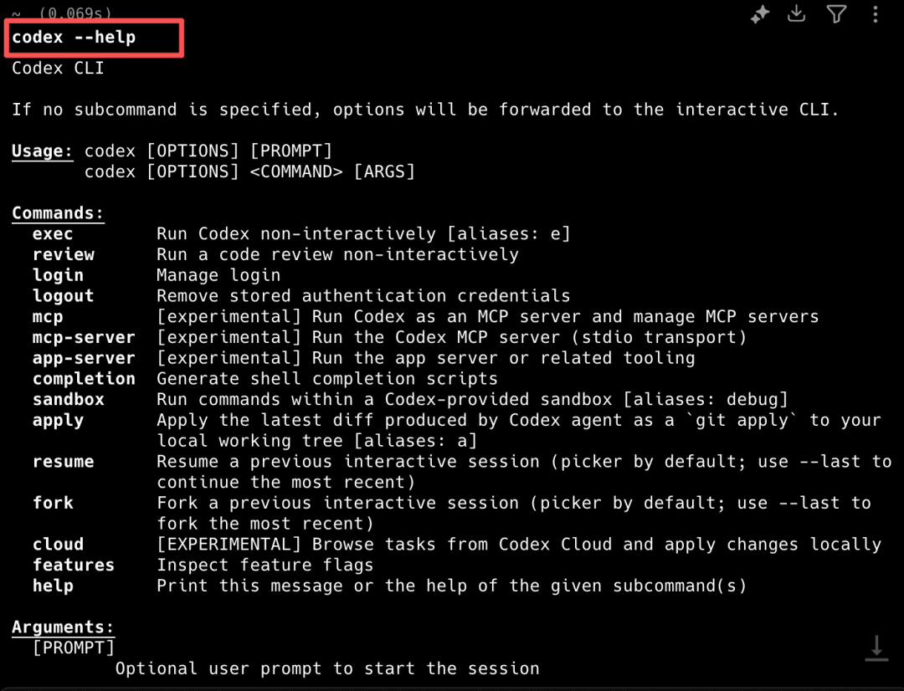

** 危险但方便的操作（谨慎使用）  **

命令  |  说明  |  使用场景
---|---|---
` codex --dangerously-bypass-approvals-and-sandbox  ` |  跳过所有确认并禁用沙盒，AI 完全自主执行  |  每次都要手动确认好麻烦

> “
>
> 建议在测试环境或你完全信任 AI 输出时使用，颇具规模的生产环境慎用！

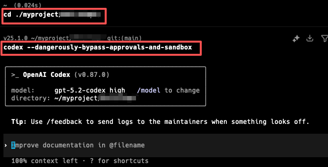

这些命令不需要全都记住，用的最多的可能就是启动命令、review 审查、compact 压缩、skills 查看技能这些了。codex在  ** 代码审查
** 这块是公认的比较强的。

####  实用技巧

** 1\. 截图报错，让 AI 帮你修  **

Codex 是多模态模型，能看懂截图里的文字、界面元素等信息，能根据截图中显示的报错内容来分析问题、推断原因，并给出修复建议。

** 2\. 指定工作目录  **

    cd /path/to/your/project
    codex

Codex 会自动读取当前目录的代码上下文。

** 3\. 恢复之前的对话  **

Codex 会自动保存对话历史，下次启动时用  ` /resume  ` 可以恢复之前的对话继续工作。

** 4\. 上下文太长时压缩  **

对话久了 token 会用完，用  ` /compact  ` 压缩上下文继续工作。

* * *

##  三、VS Code 插件

不习惯用命令行的话，推荐 VS Code 插件，更直观。

###  3.1 安装插件

  1. 打开 VS Code
  2. 左侧扩展商店
  3. 搜索  ` Codex  `
  4. 找到 OpenAI 官方的  ** Codex  ** 插件，点击安装

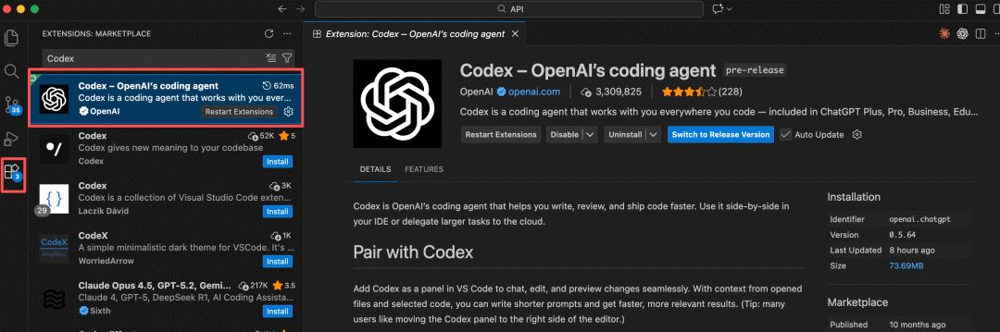

###  3.2 登录使用

安装后，左侧边栏会出现 Codex 图标：

  1. 点击 Codex 图标，弹出登录提示
  2. 点击登录，浏览器会自动打开授权页面（和 CLI 一样）
  3. 用 ChatGPT Plus 账号授权
  4. 授权成功后，回到 VS Code 就能在侧边栏对话了

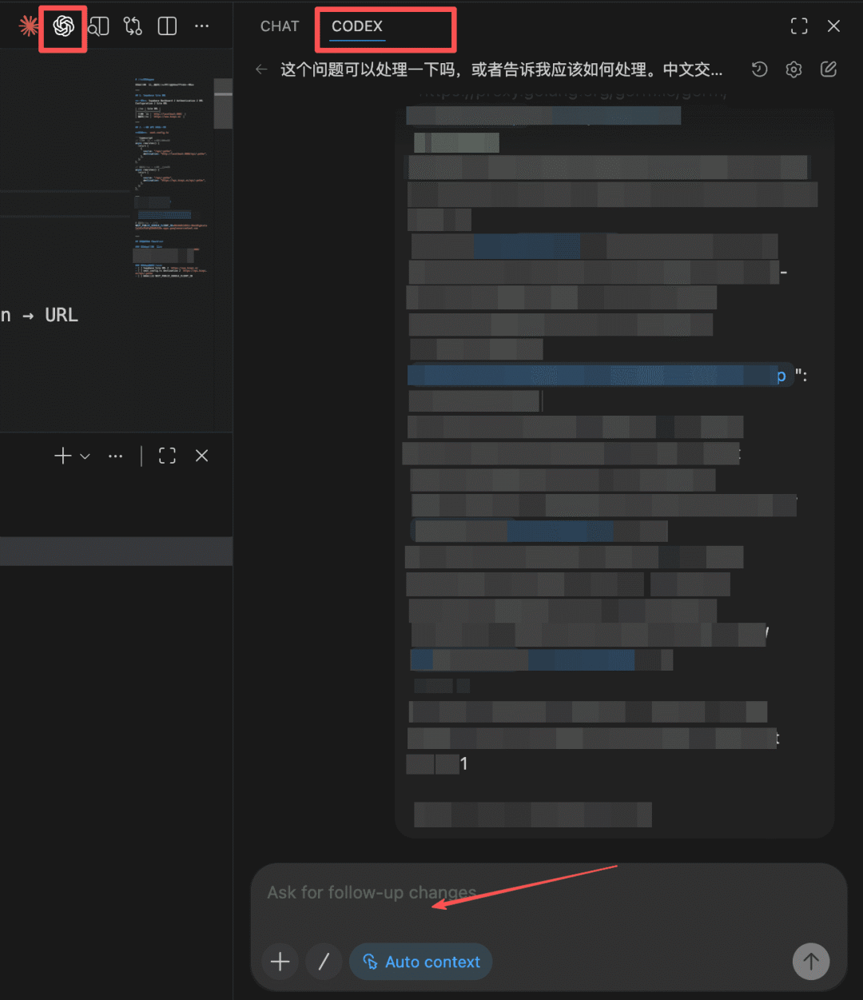

###  3.3 使用技巧

** 选中代码快速提问  **

选中一段代码 → 右键 → 选择  ` Ask Codex  ` → AI 会针对选中的代码回答

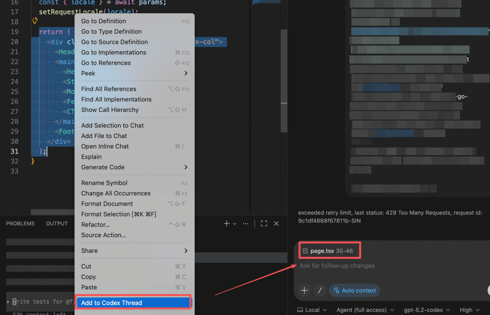

##  四、Cursor 集成

Cursor 是目前最火的 AI 编程编辑器之一，本身自带 Claude 模型，但你也可以切换成 Codex 模型。

###  方式一：安装 Codex 插件

和 VS Code 一样，在 Cursor 的扩展商店搜索 Codex 插件安装。

  * 如果已经配置了 API Key，安装后直接可用
  * 如果没有配置，需要授权登录 ChatGPT 账号

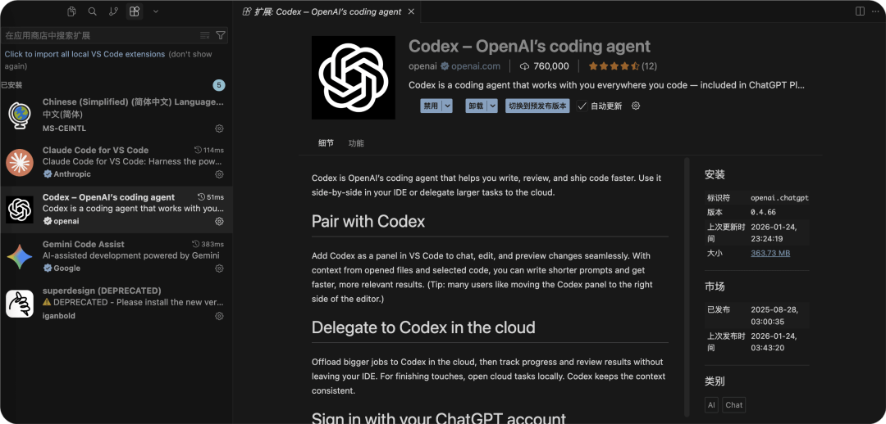

###  方式二：对话框切换模型

在 Cursor 的 AI 对话框中直接切换到 Codex 模型。

> “
>
> ** 注意：  ** 这种方式走的是 OpenAI API 计费，不是 ChatGPT Plus 会员额度。你需要在
> platform.openai.com 有 API 余额，并在 Cursor Settings → Models → OpenAI API Key
> 里填入你的 Key。

这个操作步骤有需要的话可以试一下，我平常用cursor不多，如果发现有新的使用方法，欢迎留言指正。

操作步骤：

    1. 打开 Cursor 设置
    2. 点击 Models，向下滚动找到 "OpenAI API Key"
    3. 填入你的 API Key
    4. 在对话框选择 Codex 系相关的模型

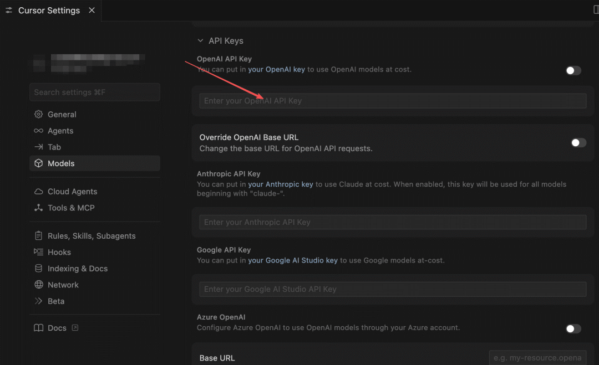

###  地区限制问题

如果遇到报错：  ` This model provider doesn't serve your region  ` ，说明 Cursor
检测模型服务商不对你这个IP所属地区开放。

** 解决方案：  ** 开全局代理（增强模式/系统代理）。如果开了还是报错，可能是 Cursor 没有走系统代理，可以尝试在 Cursor
Settings 里搜索 proxy 配置代理地址。

** 如果代理问题不好解决，建议用Codex 插件或者直接用 Codex CLI / Opencode，这些方式更稳定。  **

* * *

##  五、Opencode 集成

Codex 支持 OpenCode，允许用户直接在 Opencode 中使用 Codex 订阅和使用限制，也就是可以直接登录自己的 pro 或者 plus
账号使用。

我这里就分享一下客户端连接的过程，用命令行也是一样的。

首先下载一下 Opencode 客户端，地址：https://opencode.ai/download

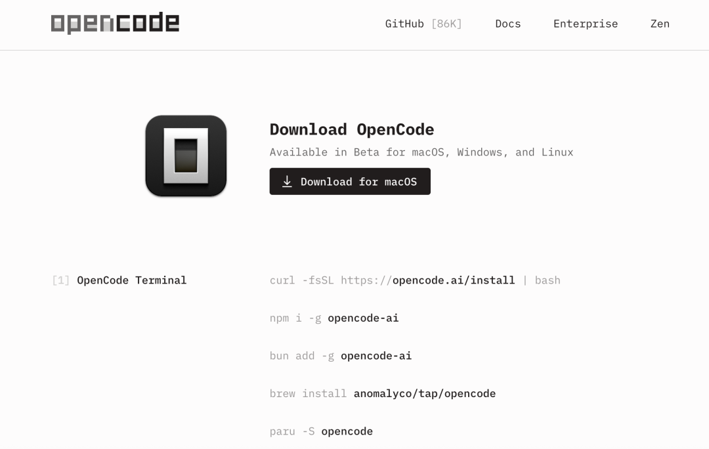

安装完之后就进入到这个页面，还是什么都没有的状态。

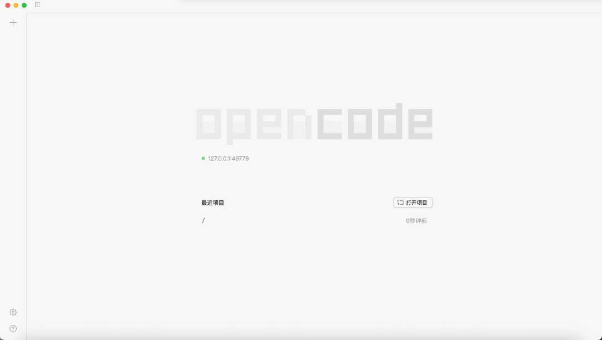

看了一下，macOS 版目前没有“添加模型”的按钮（我这边是 macOS 15.7.3，OpenCode Desktop
1.1.34）我就以这个版本测试了，具体的要看你们的系统和安装的版本，Windows 有些版本左下角会出现 “+”添加模型。

左上角的加号可以添加项目。

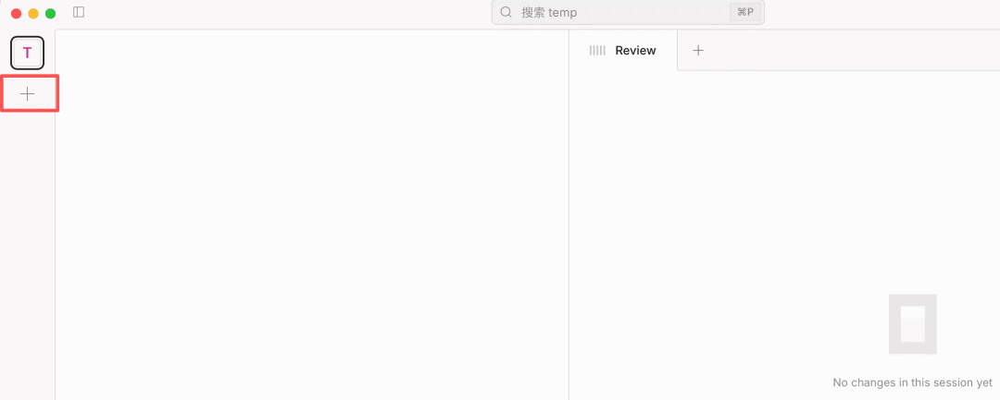

在对话框输入 /model 命令可以选择模型，右上角有个 连接供应商 按钮。

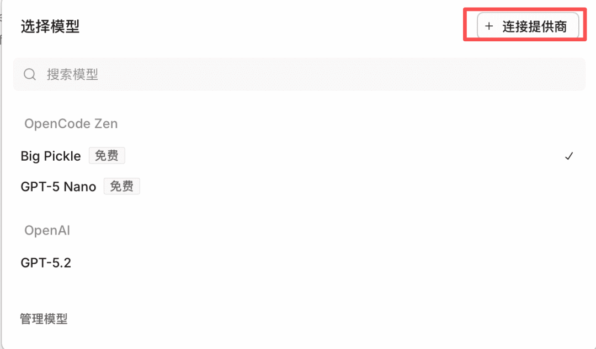
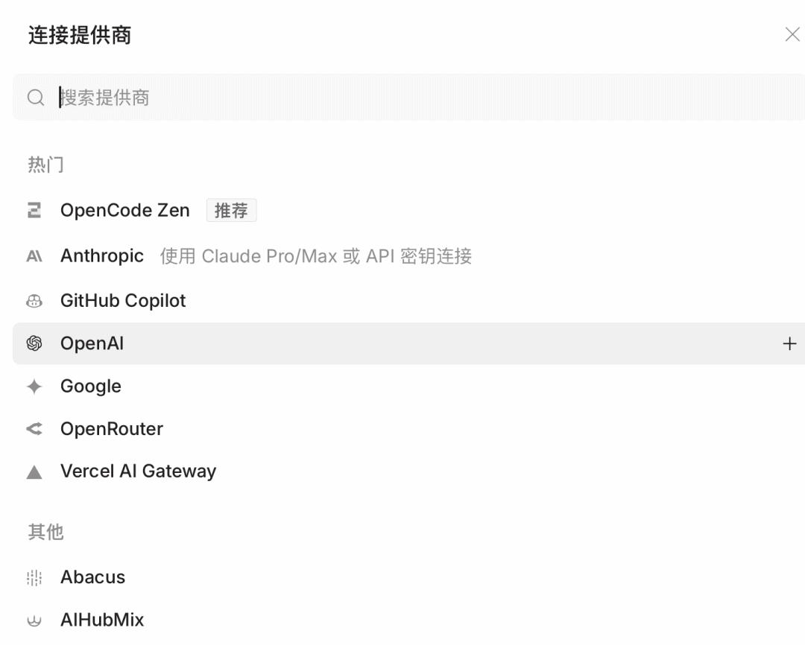

选择 连接OpenAI，如果你开了会员的话，这里登录你的 ChatGPT 账号。

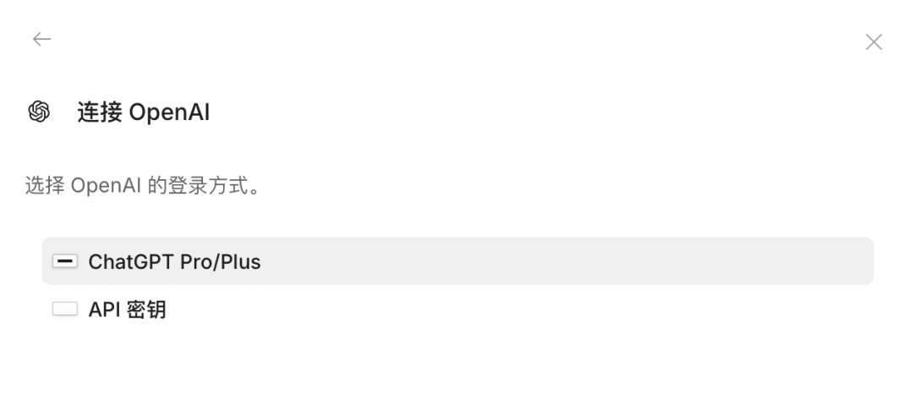

需要授权或直接跳转到 ChatGPT 登录页面，和上面的流程是一样的。

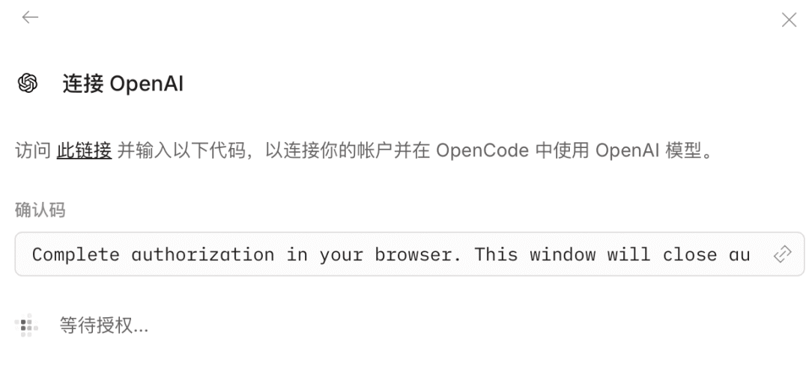
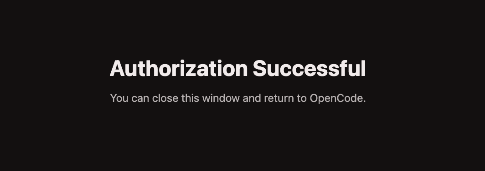

授权成功就可以使用了 ChatGPT 的模型了，然后在这个地方可以管理模型。

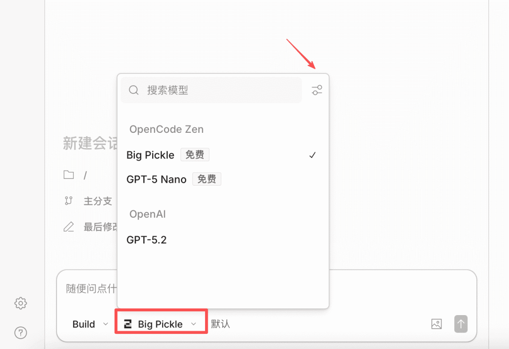
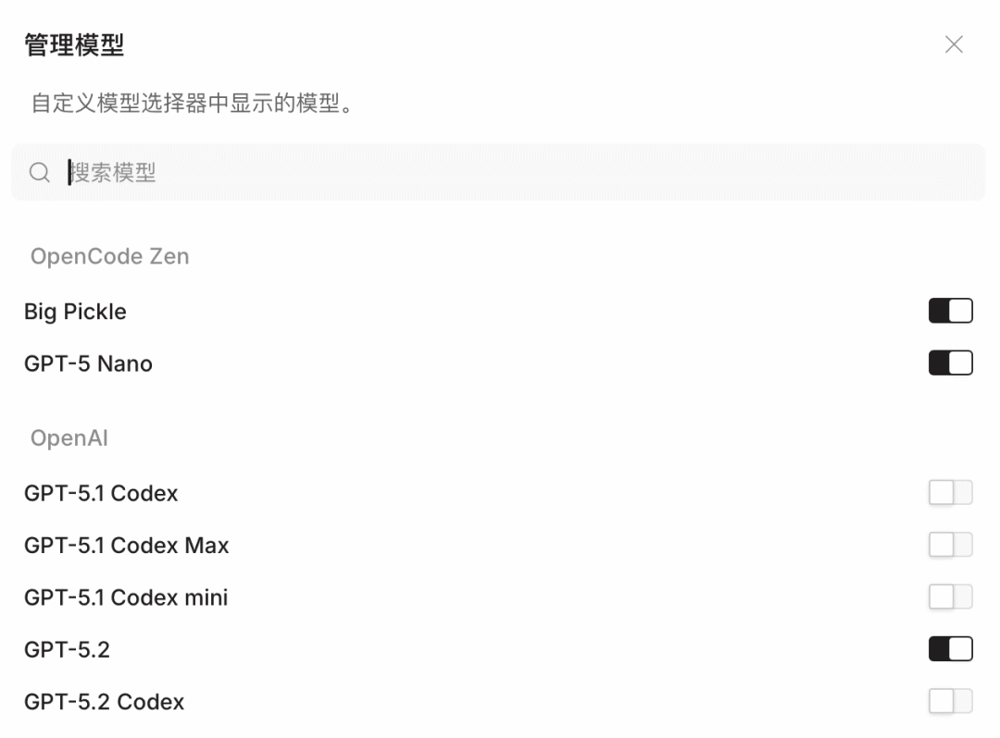

##  六、常见问题 & 踩坑指南

问题  |  原因  |  解决方案
---|---|---
安装时报错  ` npm ERR  ` |  Node 版本太低  |  升级到 Node 22+
登录后一直 thinking  |  网络问题  |  开全局代理，或设置环境变量（见下方）
Cursor 里找不到 Codex 模型  |  版本问题  |  更新 Cursor 到最新版
` /model  ` 命令无响应  |  网络延迟  |  等待几秒，或检查代理设置

** 网络问题解决方案：  **

如果遇到一直 thinking 或连接超时，在终端设置代理：

    # 临时设置（当前终端有效）
    export HTTPS_PROXY=http://127.0.0.1:7890
    export HTTP_PROXY=http://127.0.0.1:7890

    # 然后启动 Codex
    codex

把  ` 7890  ` 换成你的代理端口。

原稿还包含一张外部工作流示例图，保留在这里作为上下文参考：

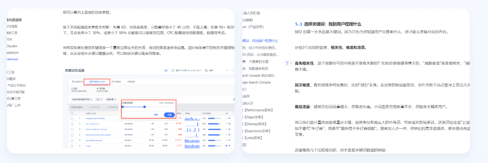

## 七、总结

Codex CLI 的入口和参数会随版本变化。完成安装后，先确认登录状态，再用一个可回退的小任务验证命令、权限和网络设置。

参考资料：

- [Codex CLI 官方文档](https://developers.openai.com/codex/cli)

- [Codex Manual](https://developers.openai.com/codex/codex-manual.md)
