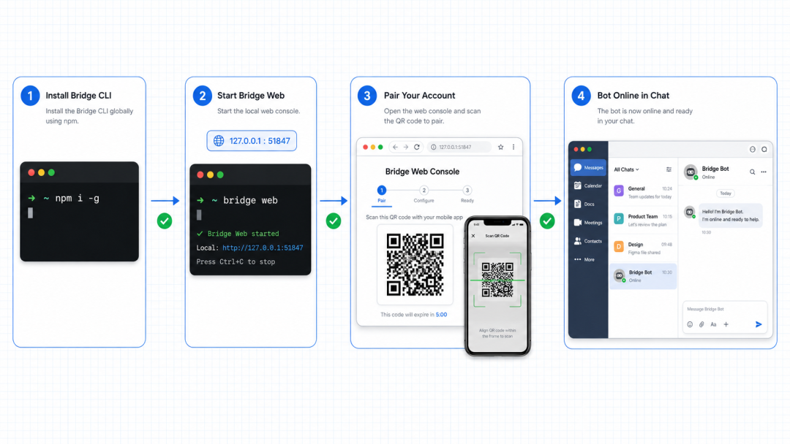
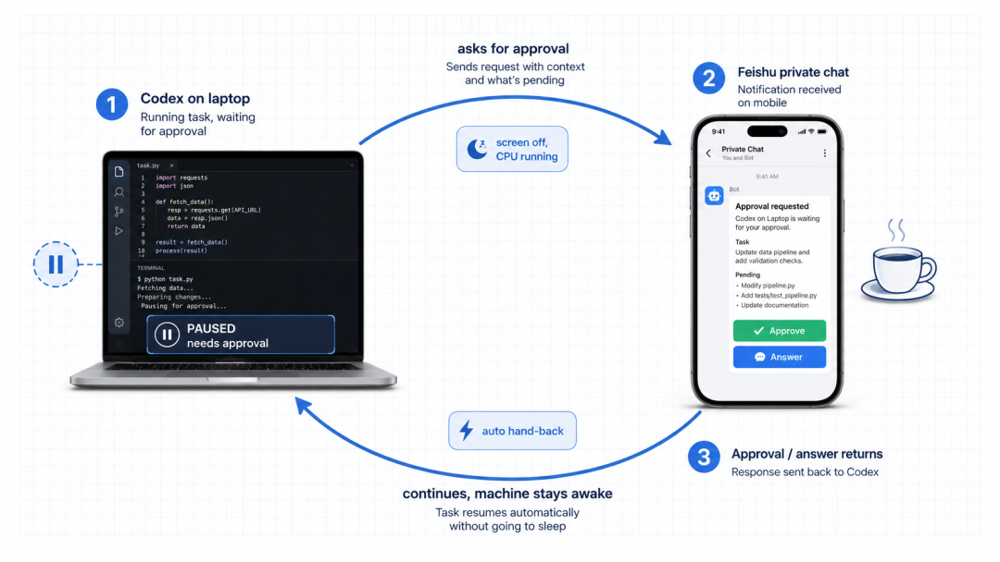
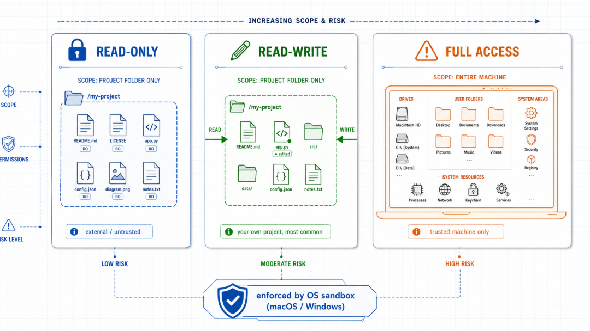

# Codex 接入飞书：从群聊指令到本地任务执行

去阅读**

** 设置星标 学习更多AI出海知识  **

用 Codex 有个一直没解决的别扭，它跑在我电脑的终端里，可我人不总在电脑前。

开会、通勤、躺沙发上刷手机的时候，突然想起有个小改动想让它去跑，只能等回到工位打开终端。

ChatGPT App 倒是能给 Codex 发消息，但那套流程对我来说总隔了一层，切来切去不顺手。

平时开会沟通全在飞书里，就想过一个特别自然的念头：能不能干脆在飞书群里直接指挥它？

还真找到了办法，有个开源项目把飞书和本机 Codex 打通了，在群里 @ 一下机器人，它就在我电脑上指定的项目目录里跑起来，边跑边把过程和结果甩回群里。

相当于给 Codex 开了个飞书账号，让它变成群里那个随叫随到的同事。

这篇就把它怎么装、怎么用讲清楚。

##  它到底是个什么东西

先说清楚原理，不然容易和别的方案搞混。

这个项目叫  ** feishu-codex-bridge  ** ，本质是一座桥，一头连着飞书群消息，一头连着本机的 Codex。

它自己不写代码、不跑模型，真正干活的还是你电脑上那个 Codex，桥只负责把飞书的消息转发过去，再把 Codex 的输出转成飞书卡片发回来。

它设计里有个很妙的对应关系，记住这个就理解了大半：

** 一个群 = 一个项目 = 一个固定的本地目录。  **

** 一个话题（thread）= 一个会话（session）。  **

意思是，给某个群绑定一个代码目录，之后在这个群里 @ 机器人说的话，都是让 Codex 在那个目录里干活，而群里每开一个话题，就相当于开一条独立的
Codex 会话，上下文互不干扰，还能自动接着上次的聊。

举个例子，在飞书群里发一句「帮我加个登录接口」，机器人立刻在这个群绑定的代码目录里跑起
Codex，然后能在一张卡片上实时看到它的推理、执行的命令、改了哪些文件、最后的结果，全程刷新，想中途叫停，卡片上点一下 ⏹ 就行。

##  装起来到底麻不麻烦

不麻烦，核心就两步。不过得先满足个前提：电脑上得先有 Node.js（18 以上）和装好的 Codex CLI，这两个大概率你早就有了。

** 第一步，全局装这个桥。  **

    
    
    npm i -g @modelzen/feishu-codex-bridge  
    

** 第二步，打开本机的网页控制台。  **

    
    
    feishu-codex-bridge web  
    

这条命令一跑，会在你本机起一个网页控制台，默认端口 51847，只绑定在 127.0.0.1 本地、每次启动随机生成一个 token
鉴权，外面访问不了，比较安全。

命令就能 Ctrl+C 关掉了，不影响后台继续跑。

这里有个偷懒的玩法，可以把安装这件事本身交给 Codex，把「帮我在这台电脑上装好 feishu-codex-bridge 并跑起来，检查 Node 和
codex 版本、全局安装、启动控制台、把链接发给我」这段话直接丢给 Codex，让它替你一步步装。用 AI 装接入 AI 的工具，还挺有意思的。

##  两种群，看你怎么用

机器人建好后，它会带你新建项目：选一个本地目录绑上，选后端（Codex 或者 Claude Code
都行），然后它自动建好群、把命令说明置顶、再把你拉进去。

建群的时候有两种模式，按场景挑：

** 多话题群。  ** 每次 @ 机器人开一个新话题，每个话题是一条独立会话，上下文隔离、能并行跑。适合多人协作，或者你一个人同时开几摊活，互不打架。

** 单会话群。  ** 整个群就是一条连续会话，全程不用 @，像私聊一样直接说话。适合个人单线深入某个任务，聊起来最顺。

我自己的习惯是，正经项目开多话题群，方便并行；临时捣鼓点小东西就开单会话群，图个省事不用老 @。

真正干活的时候也就几个动作：@ 机器人（或话题里免 @）描述需求，看流式卡片出结果，想停就点 ⏹。要让它自己多轮跑到完成，用  ` /goal  `
设个目标，它就自主推进，跑完停或者你手动结束。发图片能读图，发文件（日志、PDF、代码）它会下载到本地打开分析。

##  最戳我的一个功能：咖啡一下

前面都是飞书指挥电脑，这个功能反过来，是电脑主动找你，官方管它叫  ** 咖啡一下  ** 。

场景是这样：在电脑前用 Codex 干活，跑到一半要离开一会儿，去接杯咖啡或者开个会。平时这时候 Codex
卡在一个需要审批的操作上，就干等着，等你回来才能继续。

开了咖啡一下之后，Codex
一旦遇到需要审批、要问你问题、或者任务跑完了，会主动把这些推到你的飞书私聊，在手机上点个确认、回答一句，它就接着往下干，整个过程电脑保持不睡，屏幕关了
CPU 照样跑，等你回到座位，终端自动交还给你。

这个设计真的解决了实际问题。以前跑长任务得守在电脑前当人肉审批器，现在能起身走开，让手机替我盯着。

##  安全这块得说清楚

把一个能在电脑上跑命令的机器人放进飞书群，安全是绕不开的话题，这个项目在这块想得比较周到，给了三档权限沙箱，每个项目单独设。

** 只读档。  ** 机器人只能读项目目录，不能写。适合放外部群、给不完全信任的人用的问答机器人。

** 读写档。  ** 能读写，但锁死在项目目录里，碰不到你电脑其他地方。适合自己的编码项目，这是最常用的一档。

** 完全访问档。  **
整台电脑都能碰。只在你完全信任、自己独占的机器上开，而且要清楚：任何能给机器人发消息的人，都能以你的身份在这台电脑上执行任意命令。

有个细节得提醒：只读和读写这两档的限制，是靠操作系统级的沙箱强制的，目前只有 macOS 和原生 Windows 能真正强制住。

如果在 Linux 或者 WSL 上选这两档，它会直接拒绝启动，绝不偷偷降级成完全访问——这个处理挺负责任的，要在 Linux
上用，得把后端跑在容器或者隔离环境里。

说白了一句话：这不是一个多租户的托管服务，是给自己和信任的小团队自用的桥，别拉不认识的人进群，别在放着敏感数据的机器上开完全访问。

##  几个日常命令

装好之后，日常基本只跟两个命令打交道：

    
    
    feishu-codex-bridge start    # 起后台服务，装成系统服务、开机自启、崩了自动拉起  
    feishu-codex-bridge web      # 打开网页控制台，看日志、加机器人、启停服务  
    

其余的动作，网页控制台和飞书私聊里基本都有按钮点，不用记一堆命令，想自检环境有没有配好，一个  ` feishu-codex-bridge doctor
` 会帮查后端、登录状态、当前机器人。

有一个坑得单独拎出来：  ** 后台服务必须全局安装，别图省事用 npx。  ** 因为后台服务里硬编码了 CLI 路径，npx
那种临时缓存会被系统清掉，服务就找不着了，前台单次跑用 npx 没问题，常驻服务一定要  ` npm i -g  ` 。

##  写在最后

这个最打动我的，不是什么炫技的功能，而是它把 Codex 从一个只能待在终端里的工具变成了一个能在协作场景里随时找到的角色。

以前用 Codex，得先坐到电脑前、打开终端、进到项目目录，才能开始干活，现在这套流程被压缩成飞书群里 @
一句话。人在哪不重要了，反正活是在电脑上真真切切跑完的，结果再回到眼前。

如果团队本来就重度用飞书，又天天用 Codex，这个组合值得花十分钟装一下试试。哪怕只是为了咖啡一下那个功能，能让你跑长任务时终于敢起身离开电脑，就够本了。

延伸阅读：

  * feishu-codex-bridge 项目仓库：https://github.com/modelzen/feishu-codex-bridge 
  * Codex CLI 官方文档：https://developers.openai.com/codex/cli 

* * *

最近发现一个好用的 AI 生图工具，分享一下。

** 想了解更多可以加我  vx: 257735  聊。  **

** [ 出海赚钱案例：一个人做了个开源UI库，不融资不投广告，45天30万美元

**

** [ 出海建站必备：一小时搞定自建邮件，免费！

**

** [ OpenClaw 真香！我让它每天帮我干这些活

**

** [ 出海赚钱案例：一个人用 PHP 做到月入 17 万美金，利润率 99%！

**

** [ （2026年最新）Codex CLI 国内使用全攻略：终端 + VSCode + Cursor + Opencode 四种姿势全搞定

**

** [ 从海外公司注册到 Stripe 收款，跑通了出海收付款全流程（实操分享）

**

** [ 玩转 Claude Code Hooks：让自动化渗透到每个环节

**

预览时标签不可点

阅读

知道了

****

取消  允许

****

取消  允许

****

取消  允许

__
