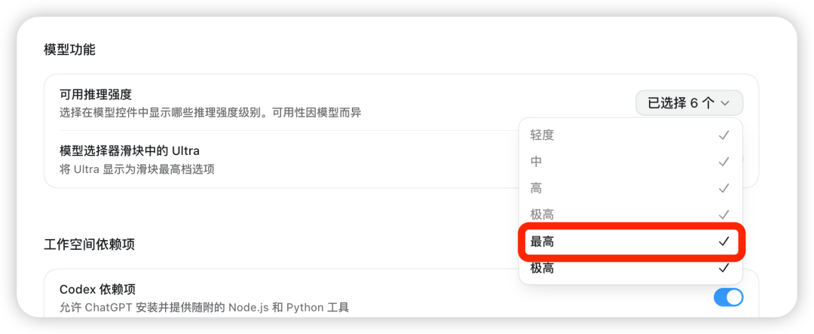
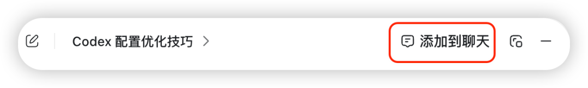
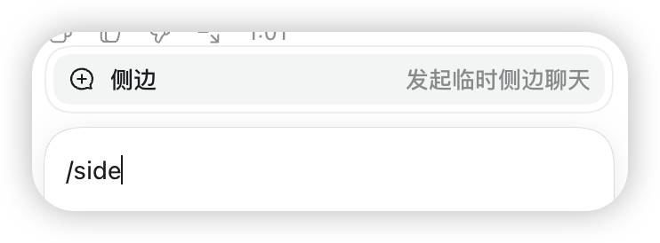
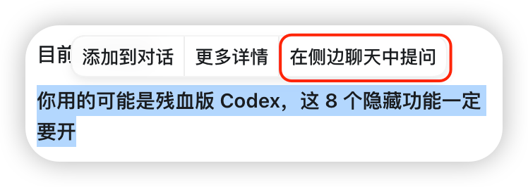
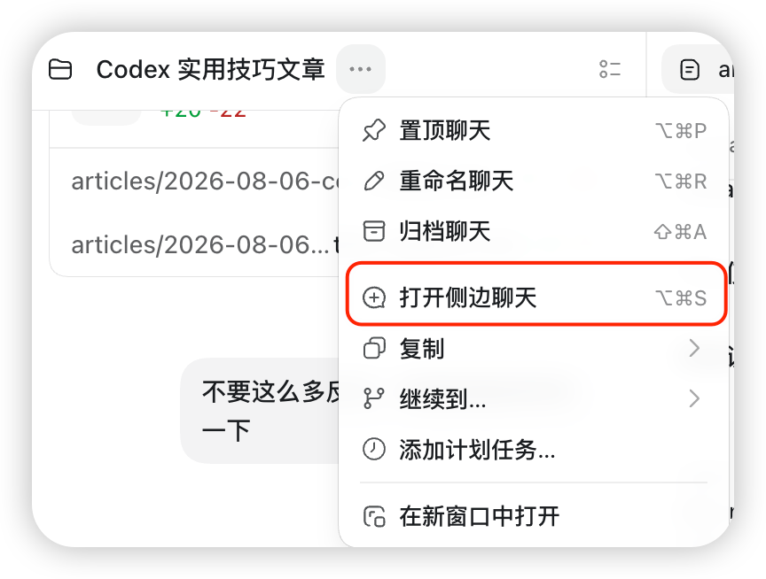

# Codex 常用功能清单：把容易漏掉的能力补齐

去阅读**

** 设置星标 学习更多AI出海知识  **

很多人第一次用 Codex，会把所有事情都扔进同一个任务。

先讨论方案，接着改文件，测试报错以后继续往里贴，最后还让它留在原任务里审查自己的修改。刚开始没什么感觉，任务一长，讨论过但放弃的方案、终端日志和最后确认的要求就混到了一起。

软件一直在工作，使用体验却越来越乱。

我现在看一套 Codex 配置是否顺手，主要看三个地方。复杂任务有没有足够的推理能力，讨论和执行有没有分开，任务结束后能不能把进度交给下一次对话。

下面这 8 项，我建议按这个顺序设置。它们有的是开关，有的是入口，还有两项只是很简单的文件习惯。全部用起来以后，Codex 才更像一个能长期合作的工作台。

##  01 先把 Luna 的最高推理强度放出来

Codex 能选 Luna，不等于已经用上了 Luna 的最高能力。推理强度需要在模型功能里手动开启。

进入设置，找到模型功能，在可用推理强度里勾选“最高”。开启后，模型选择器里才会出现对应档位。

  

  

普通任务用中档或高档就够了。跨文件重构、复杂排查、架构调整和回归风险较高的修改，我才会切到 Luna
Max。它会把更多精力放在代码结构、修改范围和验证方法上。

Sol 和 Luna 也可以分工。Sol 负责规划、架构判断和关键选择，方案明确以后，再把边界清楚的执行工作交给 Luna Max。

可以直接这样发给你的AI。

    
    
    先用 Sol 分析范围、风险和执行顺序。方案确定以后，把边界清楚的具体任务交给 Luna Max。  
    

##  02 让 Quick Chat 接住临时冒出来的问题

长任务总有等待的空档。日志还在滚动，新的疑点已经冒出来了。可能是一个接口，也可能是刚想起的遗漏条件。

这些问题直接塞进主任务，很容易把正在执行的要求打断。我会把它们先放进 Quick Chat。

入口就在左上角“新对话”旁边的加号里。

  
  
从新对话旁边打开快速聊天

Quick Chat 里讨论清楚以后，点击右上角“添加到聊天”，结论就能回到当前任务。

  
  
把快速聊天里的结论添加回当前任务

这个顺序很好用。主任务继续执行，临时问题单独讨论，最后只把确认后的要求送回去。

##  03 把方案讨论移到 Side Chat

Quick Chat 适合临时问题，Side Chat 更适合围绕当前任务继续深挖。

比如一项重构已经开始执行，你想重新比较两个架构方向，又不希望整段讨论进入主任务。这时可以从当前内容旁边开一个 Side Chat，先把分歧聊清楚。

最直接的入口是在输入框发送  ` /side  ` 。

  
  
在输入框使用 side 命令

看到某段内容需要单独展开时，也可以选中文字，点击“在侧边聊天中提问”。

  

选中文字后在侧边聊天中提问

任务顶部的更多菜单里还有“打开侧边聊天”。

  

从任务菜单打开侧边聊天

我会让 Side Chat 负责方案比较、风险讨论和执行指令整理。方向确定后，只把最终版本发回主任务。这样主任务看到的是决定，Side Chat
留下的是思考过程。

##  04 修改完成以后，单独开一次 Review

同一个任务刚写完代码，通常会沿着自己的实现思路继续检查。前面忽略掉的边界，到了最后仍有可能被忽略。

所以我会把 Review 单独拿出来。修改完成后，打开 Review 或 Changes，让它只看当前变更、风险和缺失测试，先别急着修。

    
    
    检查当前未提交修改。只报告可以被代码或测试证明的问题，标明文件和位置。先不要修改任何内容。  
    

先审查，再决定修什么。这样能保留问题出现时的原始证据，也不会让新一轮修改把旧问题盖住。

##  05 配一个只接具体任务的 Subagent

任务开始变大以后，我会再加一个  ` luna_worker  ` 。

它不参与大方向讨论，只接范围明确的执行工作。搜索过程、测试输出和中间尝试留在它自己的上下文里，主任务只接收结果、证据和改动文件。

个人 Agent 放在  ` ~/.codex/agents/  ` ，项目专用 Agent 放在项目里的  ` .codex/agents/  ` 。创建
` luna-worker.toml  ` 后，可以写成下面这样。

    
    
    name = "luna_worker"  
    description = "处理父级委托的具体且边界清楚的任务"  
    model = "gpt-5.6-luna"  
    model_reasoning_effort = "max"  
      
    developer_instructions = """  
    只处理父级委托的具体任务。  
    开始前明确范围、限制和完成标准。  
    不得扩大任务范围，也不要改动相邻文件。  
    默认先做只读调查。  
    只有委托明确授权修改时才能编辑文件。  
    保留用户已有的无关改动和配置。  
    根据风险大小验证结果。  
    完成后返回结果、验证证据、改动文件和剩余限制。  
    未经明确授权，不得提交、推送、发布、发送消息或执行破坏性操作。  
    """  
    

不想手动建文件，也可以把这段配置要求直接交给 Codex，让它按指定路径创建。

Subagent 最适合边界清楚的工作，比如只查一个报错、只修改指定文件、只补一组测试。方向还没定，或者任务范围仍在变化时，先留在主任务里讨论。

##  06 用 @ 把旧任务里的结论找回来

多个项目一起推进时，重复解释背景很浪费精力。Codex 的  ` @  ` 引用可以直接搜索其他任务，把相关对话带进当前任务。

输入  ` @  ` 和关键词，找到之前讨论过的任务，再选择需要引用的内容。另一种方法是复制任务 ID，把它发给新的任务读取。

我通常会多加一句限制。

    
    
    只读取这个任务里已经确认的方案和限制。当前状态仍以现场文件、Git 和运行结果为准。  
    

旧对话适合提供来龙去脉，当前文件和运行结果负责说明现在做到哪里。两者分开以后，引用旧任务会稳很多。

##  07 长任务结束前写一份 HANDOFF

` @  ` 引用适合找旧讨论，  ` HANDOFF.md  ` 更适合把一个进行中的任务交给下一次会话。

长任务准备结束时，我会让 Codex 把当前状态写进项目里的  ` HANDOFF.md  ` 。

    
    
    这个任务准备结束了，请把交接内容写入 HANDOFF.md。  
      
    写清当前目标、已经完成的内容、仍未解决的问题、下一步动作和已经踩过的坑。  
    分开记录本地完成、已经合并、已经部署和线上验证。  
    这份文件要让一个没有聊天上下文的新任务直接接手。  
    

下一次打开任务，先让它读文件，再检查 Git 和现场状态。

    
    
    先读 HANDOFF.md，再检查当前文件和 Git 状态，确认从哪里继续。  
    

这份文件不用写成长报告。能够回答做到哪里、下一步做什么、哪些路别再走，已经够用。

##  08 把被纠正过的问题留下来

任务停在哪里，看  ` HANDOFF.md  ` 。它为什么会走偏，看这一轮留下的纠正记录。

一次协作里，我可能纠正过范围、状态判断和验证方式。任务结束前，让 Codex 把这些纠正重新过一遍，只保留下次还可能发生的问题。

    
    
    回顾这次协作中我纠正过的地方。  
      
    列出本次纠正、错误原因和下次开局指令。  
    只保留可能再次发生的问题，不要总结普通执行过程。  
    

输出保留三列就够了。

本次纠正  |  错误原因  |  下次开局指令   
---|---|---  
把本地完成写成已经上线  |  状态判断过快  |  分开记录本地、合并、部署和线上验证   
审查时顺手修改文件  |  忽略任务边界  |  本轮只审查，不进行修复   
修改扩大到相邻模块  |  范围没有锁定  |  只触及明确列出的文件和功能   
  
错题本要尽量保持短。同类错误合并到旧条目，已经进入固定审查要求的规则就从这里移走。留下来的每一条，都应该能在下次开局时直接使用。

##  最后

同一个模型，工作方式不同，结果会差很远。所有事情挤在一个任务里，Codex 会越做越乱。把推理、讨论、执行、审查和交接分开以后，它才会稳定下来。

如果只准备先改两处，我建议从 Luna Max 和 Side Chat 开始。一个负责把复杂任务想清楚，一个负责让主任务保持干净，变化最容易感受到。
