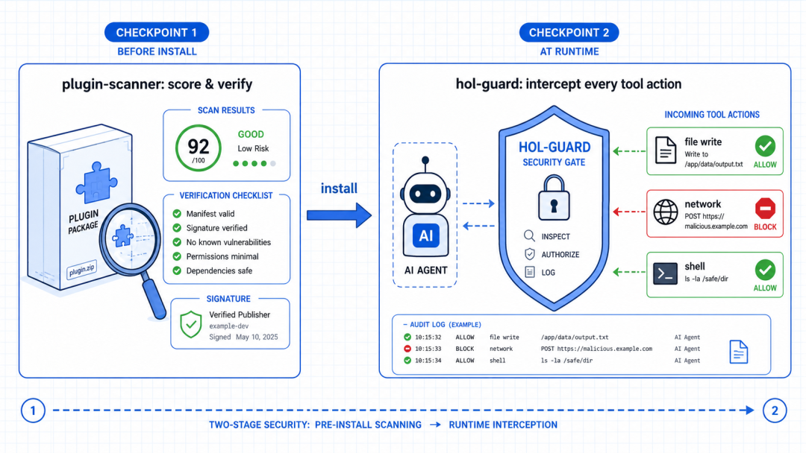
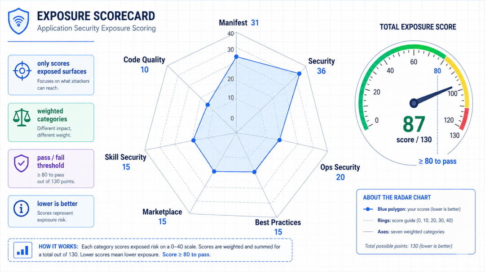
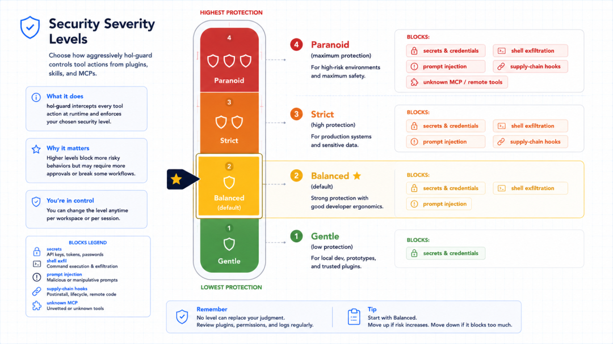

# Codex 插件安全检查：用 HOL Guard 评估第三方工具风险

现在装一个 AI 编程插件有多容易？一行命令的事。

Codex 有了插件市场，Claude Code 有 skills，Cursor、Gemini 各有各的生态。

看到一个不错的插件，  ` install  ` 一下，它就接进了你的 agent，能读你的文件、能跑命令、能连网络，爽是真爽。

但有个问题估计你也想过：这工具安装装进来，我其实不知道它会干什么。

它是个第三方写的、几百行起步的代码包，里面塞了 skill、MCP
server、各种钩子。你装它的时候，等于把"读文件、执行命令、访问网络"这几样权限一起交了出去。

万一这插件里藏了点东西，比如趁你不注意把  ` .env  ` 里的密钥发到某个服务器，大概率是发现不了的。

这不是吓唬人，AI agent 越权偷密钥、被 prompt 注入带跑偏，这些事已经实实在在发生过，问题是，普通开发者根本没有趁手的工具去防。

HOL Guard 想干的，就是给你的 AI 编程环境装一套杀毒系统。

##  装之前扫一遍，跑起来盯着拦

HOL Guard 不是单一功能，它把"安全"拆成了两个时间点来管。

** 第一个是装之前——plugin-scanner。  ** 拿到一个插件、skill 或者 MCP
server，先别急着用，拿它扫一遍打个分，它会把这个包从里到外检查一遍：清单写得规不规范、有没有硬编码的密钥、MCP 配置里有没有危险命令、GitHub
Actions 有没有被人做手脚、代码里有没有  ` eval  ` 这种高危写法。

** 第二个是跑起来之后——hol-guard。  ** 这才是"杀毒"的核心。它常驻在 agent
前面，每一个工具动作真正执行之前，也就是在你的文件被改、网络被连之前——它先拦下来，毫秒级判断这一步该不该放行。

一句话概括：  ** 扫描器管"这插件能不能信",Guard 管"这一步操作能不能放"。  ** 一个在装之前，一个在运行时，两头都堵上。

##  装之前怎么扫：给插件打一个体检分

先说扫描这块，因为最直接。

装个 scanner 很简单：

    pipx install plugin-scanner  
    

然后对着插件目录扫：

    # 扫单个插件  
    plugin-scanner scan ./my-plugin  
      
    # 自动识别仓库里所有支持的生态(默认)  
    plugin-scanner scan ./plugins-repo --ecosystem auto  
      
    # 只扫 Claude 的包  
    plugin-scanner scan ./plugins-repo --ecosystem claude  
    

它支持的不只是 Codex,Claude Code、Gemini CLI、OpenCode 的插件格式它都认，会自动从仓库里找出这些包逐个扫。

扫完会给一个分数，满分 130，分七个维度打：

    清单规范        31 分  
    安全相关        36 分  
    运维安全        20 分  
    最佳实践        15 分  
    市场合规        15 分  
    Skill 安全      15 分  
    代码质量        10 分  
    

这里有个设计挺聪明：它只评估这个插件  ** 实际暴露  **
的那些面。你没用到的可选功能，不会因为“没做”而扣分，也不会因为“做了”白送分，最后按适用项归一化。

这样小插件不吃亏，大插件也别想靠堆功能刷分。

光打分还不够，它还有一整套配套命令：  ` lint  ` 给你写插件时的规范建议，  ` verify  ` 检查能不能正常安装运行，  ` submit
` 给提交市场做门禁，  ` doctor  ` 出问题时做诊断。

如果你是插件作者，想发布前先过一道质量关，直接把它塞进 CI:

    -name:AIpluginqualitygate  
    uses:hashgraph-online/ai-plugin-scanner-action@v1  
    with:  
    plugin_dir:"."  
    fail_on_severity:high  
    min_score:80  
    

这就是那个市场的硬门槛：分数得 ≥80，不能有 high 或 critical 级别的问题，否则 PR
直接卡住。说白了，能进市场的插件，都是被这套规则筛过一遍的。

##  跑起来怎么防？

扫描是一次性的，真正天天保护你的是 Guard。

装和初始化：

    pipx install hol-guard  
    hol-guard init  
    

` init  ` 是引导式的首次设置，它有个我挺欣赏的细节：  ** 每一步会动你东西之前，都先停下来问你。  **
先给你看一遍计划，然后开本地面板要你点头，再装 agent
防护要你点头，每个动作都卡一个确认点，你不批它就不动。不像有些工具上来一把梭，装完你都不知道它改了啥。

Guard 的核心是拦截。它守在你的 agent 前面，每个工具动作执行前先过它一道，毫秒级决定放行还是拦下。具体拦多严，你自己选档位：

    hol-guard settings set security-level <level>  
    

四个档位是这么分的：

** Gentle(佛系)  ** ——只拦最明确的密钥泄露和数据外传。适合有经验、嫌麻烦的人。

** Balanced(均衡，默认)  ** ——拦密钥、shell 外传、prompt 注入、供应链钩子。大多数人用这个就够。

** Strict(严格)  ** ——在上面基础上，连低置信度的可疑信号、不可信的 prompt 也一起拦。适合对安全比较上心的团队。

** Paranoid(偏执)  ** ——再加上任何它不认识的 MCP server 动作，一律拦。高安全环境用。

官方的建议很实在：拿不准就从 Balanced 开始，用一周，回头看看它都拦了些啥，再决定要不要升到 Strict。

##  被拦了怎么办，误杀也能一键放行

实时拦截最怕的就是误杀——正常操作被挡住，活儿干不下去。Guard 这块处理得还行。

每次它拦一个动作，都会留一张"回执"，想知道它为什么拦你，几个命令查清楚：

    hol-guard receipts          # 看最近的拦截记录  
    hol-guard doctor            # 跑一遍探针,看哪些检测器在生效  
    hol-guard approvals         # 看待处理的审批  
    

如果确认是误杀，从回执里直接批准放行就行；也可以打开本地面板  ` http://localhost:6174  `
，在审批中心里点放行，所有决定都存在本地，回头能复查。

对安全要求高的，它还能给审批本身再加一道锁：开启密码门，甚至上 TOTP 双因子(就是 Google Authenticator
那种动态码)，要批准一个全局放行、清空策略、改设置这种敏感操作，得先过密码加动态码，这一层对团队环境挺有用——防的是"有人手滑或者被诱导，一路点放行"。

还有个细节值得夸：它的威胁情报库更新是  ** 只拉不传  ** 的。你跑同步的时候，它只从服务器下载签名过的情报列表，  **
不会把你的本地路径、配置、回执、工作区信息发出去  ** 。安全工具自己得先干净，这点它做到了。

##  适合谁，怎么开始

说实话，现在这个阶段，凡是认真用 AI 编程的人都该考虑装一套这种东西。

如果经常从市场装插件、装 skill、配 MCP server，那 Guard
对你几乎是刚需，装的每个第三方包都是一个潜在入口，有个东西在运行时帮你盯着，心里踏实得多。

如果自己写插件、还想发到市场，那 scanner 绕不开，市场门槛就是它定的，提前在本地和 CI 跑一遍，省得提交了被打回。

最快的上手路径就三步：

    pipx install hol-guard  
    hol-guard init  
    hol-guard settings set security-level balanced  
    

跑起来，用一周，看看  ` hol-guard receipts  ` 里它都替你拦了些什么。

##  写在最后

HOL Guard 干的事其实特别朴素，它承认了一件我们都在装糊涂的事，你装进 agent
的那些第三方插件，根本不知道它们会干什么，以前这事儿只能靠运气和自觉，现在有了个能兜底的东西，装之前用 scanner 打个体检分，跑起来用 Guard
在每个动作前站一道岗，两头都堵上，中间那段你看不见的黑箱就被照亮了。

AI 写代码这波，大家都在拼谁生成得更快更准，很少有人管生成出来这堆东西安不安全。HOL Guard
补的正是这块空白。它不让你变慢，只是在你踩坑之前拉你一把。这个阶段，只要你认真用 AI 编程，给它配套这样的防线，真不算多余。

> 延伸阅读：https://github.com/hashgraph-online/hol-guard

* * *
