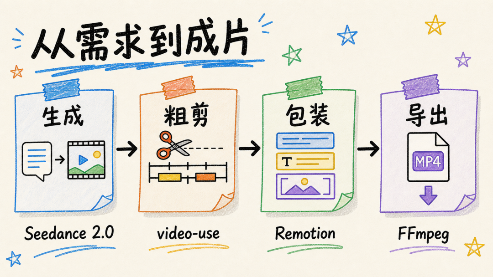
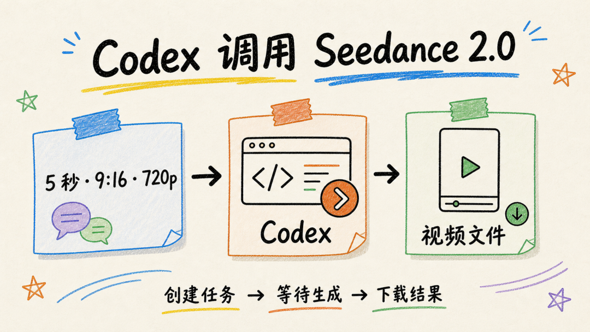
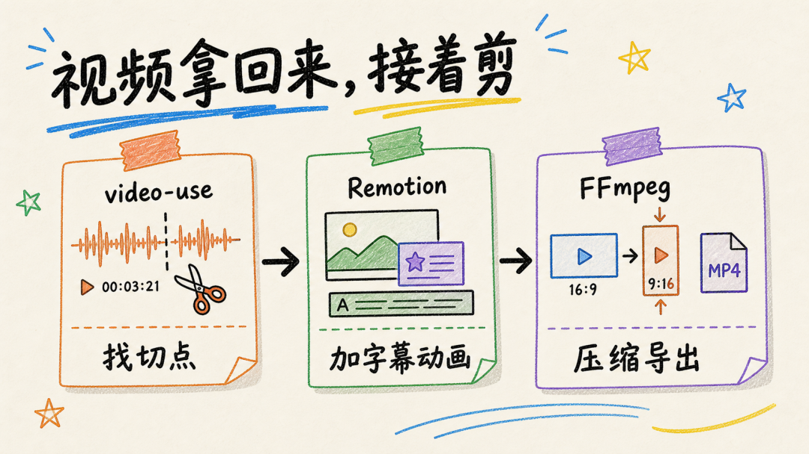

# Codex 视频工作流，4 个第三方 Skill 的用途、依赖与限制

> 难度 | 进阶
>
> 类型 | 第三方项目观察
>
> 核验日期 | 2026-08-18

## 这篇文章适合谁

这篇文章写给希望用 Codex 处理视频生成、素材粗剪、字幕动画和发布前转码的读者。

文中检查了四个公开仓库的用途、安装方式、依赖、许可证和 Codex 兼容情况。它们可以覆盖一条视频生产链的不同阶段，但 CodexGuide 没有在同一台机器上完成付费生成、粗剪、Remotion 包装和最终导出的端到端实测。因此本文是选型与测试计划，不是“安装后即可自动出片”的保证。

## 四个项目分别解决什么问题



| 阶段 | 项目 | 主要用途 | 重要限制 |
|---|---|---|---|
| 生成 | HiAPI Seedance 2.0 Skill | 文生视频、图生视频并轮询下载结果 | 需要 `HIAPI_API_KEY`，生成会消耗付费额度 |
| 粗剪 | `browser-use/video-use` | 转写素材、找切点、去停顿、加字幕并渲染 | 需要 Python、FFmpeg 和 ElevenLabs API Key |
| 包装 | `remotion-dev/skills` | 指导 Agent 使用 Remotion 编写字幕、动画和模板 | 仍需 Node.js、Remotion 项目和人工预览 |
| 转码 | Digital Samba Video Toolkit | 提供 FFmpeg 等视频处理知识和完整工具包 | 项目以 Claude Code 为主，Codex 迁移脚本标为实验性 |

这四个仓库不是一套由同一团队维护的产品。安装目录、依赖和授权方式各不相同，不能把它们视为一个已经集成好的流水线。

## 用 HiAPI Skill 生成视频

HiAPI Seedance 2.0 Skill 的仓库明确列出 Codex 安装方式，并提供文本生成、首帧图生视频、首尾帧和多模态参考模式。结果可下载时会保存到本地 `outputs/`。



安装命令来自项目 README。

```bash
npx -y github:HiAPIAI/hiapi-seedance-2-0-video-skill --codex
```

执行前需要设置 `HIAPI_API_KEY`。不要把 Key 写进提示词、截图或仓库文件。第一次生成先使用短时长和较低分辨率，确认画面方向后再增加成本。

```text
使用 $hiapi-seedance-2-0-video 生成一段 5 秒竖版测试视频。
先检查配置和费用参数，展示最终请求，不要在我确认前提交付费任务。
生成完成后保留原始返回信息，并把可下载结果保存到 outputs/。
```

截至核验日期，该仓库使用 MIT License，公开元数据显示最近推送时间为 2026-07-21。仓库规模和社区采用量仍较小，使用前应自行检查脚本和 API 请求地址。

## 用 video-use 整理多段素材

`video-use` 面向带有口播、访谈或录屏的多段素材。项目 README 说明，它会结合转写、时间戳和 FFmpeg 完成切点处理、字幕与渲染。



它的安装比普通说明型 Skill 更重。项目要求先阅读 `install.md`，手动路径包含 `uv sync`、FFmpeg，以及用于转写的 ElevenLabs API Key。在线素材下载还可能需要 `yt-dlp`。

```text
检查 https://github.com/browser-use/video-use 的 install.md 和 SKILL.md。
先列出要安装的系统依赖、Python 包、Skill 目录和环境变量。
不要写入全局目录，也不要索取 API Key，等我确认安装计划后再继续。
```

截至核验日期，该仓库使用 MIT License，最近推送时间为 2026-07-01。README 明确提到 Codex，但安装脚本会修改本地环境并接触原始视频，建议先在隔离目录和无敏感信息的短素材上测试。

## 用 Remotion Skills 编写包装层

Remotion 使用 React 生成视频。`remotion-dev/skills` 为 Codex 等 Agent 提供 Remotion 的结构、动画、字幕、多媒体和渲染规则。

```bash
npx skills add remotion-dev/skills
```

Skill 负责让 Agent 遵循 Remotion 的用法，并不会代替审美判断或浏览器预览。每次修改后仍要在 Remotion Studio 中检查文字是否溢出、动画时间是否正确、音画是否同步，再执行最终渲染。

截至核验日期，仓库最近推送时间为 2026-08-14。GitHub 元数据没有识别到仓库级许可证，准备把内容用于商业项目或再分发前，应进一步确认各文件和 Remotion 本身的许可条款。

## FFmpeg 阶段要分清 Skill 与工具包

原稿引用的 Digital Samba Video Toolkit 是一个完整的 Claude Code 视频生产项目，其中包含 FFmpeg、Remotion、配音、图像和云端 GPU 工具。它不是只包装几条 FFmpeg 命令的小型 Codex Skill。

项目提供 `scripts/migrate_to_codex.py`，会把 `.claude/skills/` 和工作流迁入 Codex，并根据 `CLAUDE.md` 生成 `AGENTS.md` 管理区块。项目文档把这条路径标为实验性。

```bash
python3 scripts/migrate_to_codex.py --force
```

这条命令会写入用户 Skill 目录和当前仓库的 `AGENTS.md`，不能在不了解差异时直接运行。只需要压缩、缩放或转格式时，直接审查并执行 FFmpeg 命令通常更简单。

```text
读取 final.mp4 的编码、分辨率、帧率、音轨和文件大小。
先给出 FFmpeg 命令及输出文件名，不覆盖原文件。
目标是 1080×1920，保持比例，不拉伸画面。等我确认后再执行。
```

截至核验日期，该工具包使用 MIT License，最近推送时间为 2026-08-13。项目能力很多，依赖和权限范围也更大，适合愿意维护完整视频工程的读者。

## 推荐的最小测试顺序

不要第一次就把四个项目全部装进常用环境。按当前痛点选择一段开始。

1. 只需要生成镜头时，先审查 HiAPI Skill，使用低成本参数生成一条测试视频。
2. 已有多段口播时，在隔离目录安装 `video-use`，先处理一段可丢弃素材。
3. 需要统一字幕和动画时，新建最小 Remotion 项目并在 Studio 中预览。
4. 发布前只做格式处理时，先用 `ffprobe` 读取源文件，再确认 FFmpeg 命令。

每一步都保留原文件，并把生成、剪辑、包装和导出放在不同目录。这样出现问题时，可以知道失败发生在哪个阶段，也能单独替换其中一个工具。

## 参考资料

- [HiAPI Seedance 2.0 Video Skill](https://github.com/HiAPIAI/hiapi-seedance-2-0-video-skill)
- [browser-use/video-use](https://github.com/browser-use/video-use)
- [Remotion Agent Skills](https://github.com/remotion-dev/skills)
- [Digital Samba Video Toolkit](https://github.com/digitalsamba/claude-code-video-toolkit)
- [Digital Samba 的 Codex 迁移说明](https://github.com/digitalsamba/claude-code-video-toolkit/blob/main/docs/codex.md)
- [Codex Skills 官方文档](https://developers.openai.com/codex/skills)
