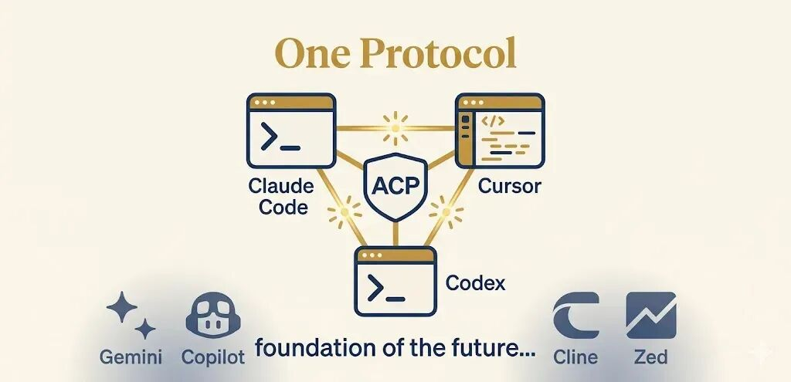

# 在 Zed 中通过 ACP 使用 Codex CLI

> 难度 | 进阶
>
> 类型 | 社区生态与项目评测

Zed 可以通过 Agent Client Protocol 运行 Codex CLI。这样可以保留 Codex 的认证、模型和工具配置，同时使用编辑器里的文件树、差异预览和审批界面。

我在写作前核对了 Zed 官方文档和 `codex-acp` 适配器仓库。ACP 生态仍在变化，安装前应再次查看文末来源。



## ACP 负责什么

ACP 定义编辑器与编程 Agent 之间的通信方式。编辑器负责展示会话、流式输出、工具调用和审批请求，Agent 继续负责读取项目、执行命令和修改文件。

协议基于 JSON-RPC。Agent 可以作为本地子进程通过标准输入输出通信，也可以由兼容客户端连接远程服务。实际支持范围取决于客户端与适配器版本。


## ACP 和 MCP 的分工

MCP 让 Codex 连接数据库、文档服务和其他外部工具。ACP 让 Zed 这类编辑器连接 Codex。一次任务中可以同时使用两者。

Zed 通过 ACP 管理 Codex 会话。Codex 再通过 MCP 调用已经配置的外部服务。ACP 不会绕过 Codex 的沙箱、审批策略或账号额度。


## 在 Zed 中启动 Codex

先安装并登录 Codex CLI，再安装当前版本的 Zed。打开 Zed 的 Agent 面板，在新建线程菜单中选择 Codex。Zed 官方页面会显示当前支持的安装或登录步骤，应以页面上的实际入口为准。

创建线程后先做一个最小测试。

```text
读取当前项目的 README，不要修改文件。
告诉我项目使用的主要语言、启动命令和测试命令，并给出对应文件路径。
```

确认读取范围正确后，再让 Codex 修改一个临时文件。检查 Zed 是否显示差异，拒绝修改时文件是否保持不变，批准后修改是否真实写入磁盘。

## 其他 ACP 客户端

Zed 之外的 ACP 客户端可以使用 `agentclientprotocol/codex-acp` 适配器。仓库当前给出的启动方式如下。

```bash
npx -y @agentclientprotocol/codex-acp
```

适配器通过 Codex App Server 对接 Codex。模型、认证、工具、审批和沙箱仍由 Codex 负责。客户端配置方式不同，不能把 Zed 的菜单步骤直接套到其他编辑器。

使用 API Key 时放进安全的环境变量或密钥管理器，不要写进编辑器设置、项目仓库或截图。启动后先用只读任务确认项目目录，再逐步开放写入和命令执行。

## 适用范围与限制

ACP 适合希望在编辑器中使用 Codex，又不想把工作流绑定到某个专用面板的人。它也方便客户端统一处理多种 Agent 的会话和审批。

目前仍要留意三类差异。客户端未必实现全部协议能力，适配器版本可能要求特定 Codex 版本，编辑器界面显示成功也不能替代 Git 和测试验收。出现问题时先分别检查 Zed、适配器和 Codex CLI 的版本与日志。

## 参考资料

- [Zed 中使用 Codex CLI](https://zed.dev/acp/agent/codex-cli)
- [Zed External Agents](https://zed.dev/docs/ai/external-agents)
- [codex-acp 适配器](https://github.com/agentclientprotocol/codex-acp)
- [Agent Client Protocol](https://agentclientprotocol.com/)
