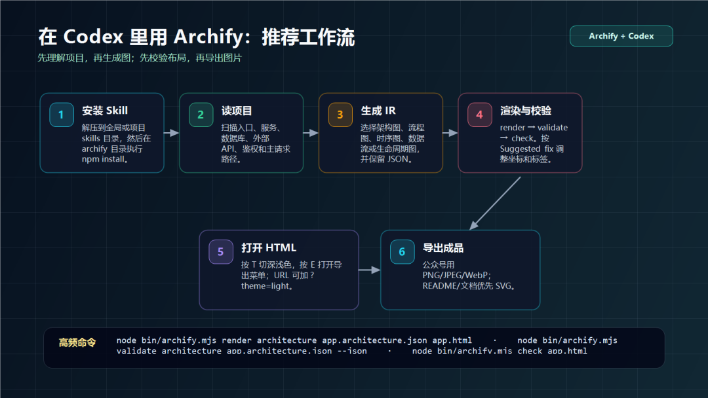
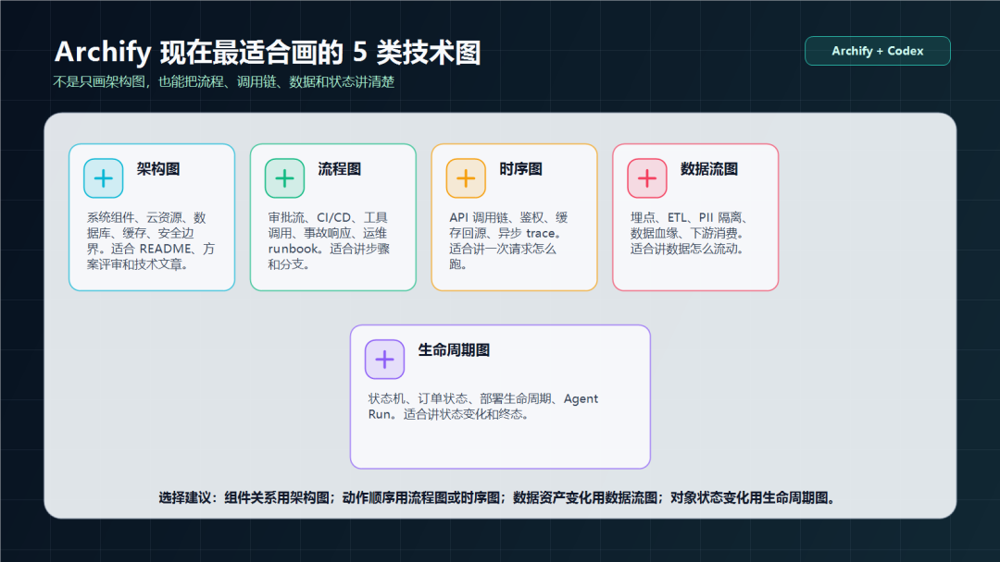
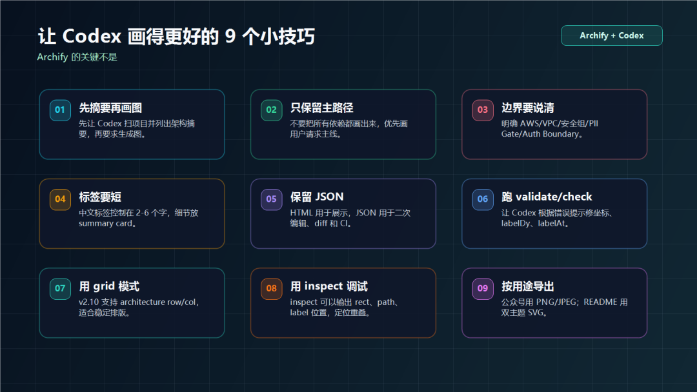
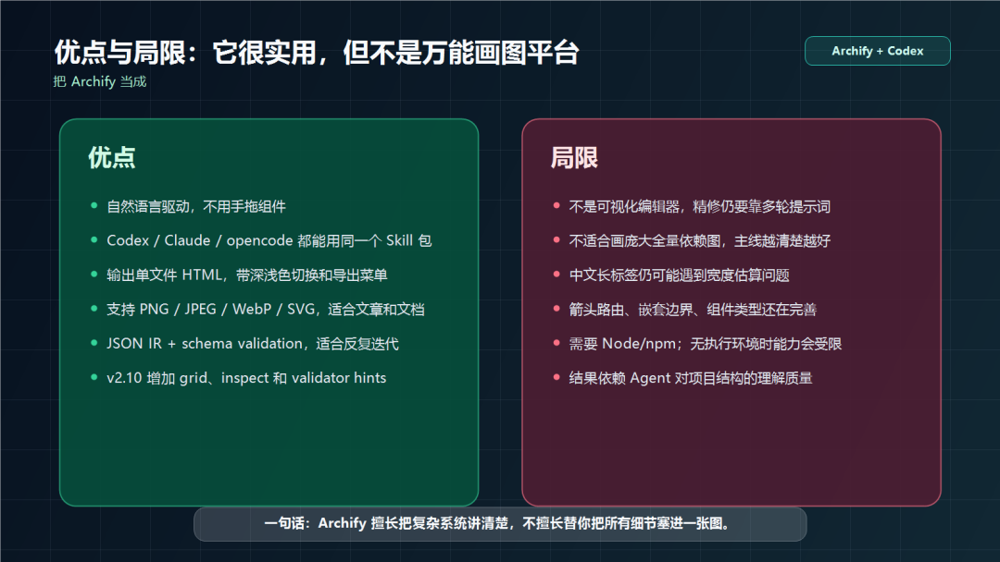

# Codex 使用 Archify 生成可验证的代码架构图

> 难度 | 进阶
>
> 类型 | 社区生态与项目评测

Archify 是第三方 Agent Skill。Codex 可以先读取代码仓库，整理系统边界和主调用路径，再让 Archify 把这些信息渲染成技术图。

这类工具最容易出现的问题是图很好看，内容却和代码对不上。本文把代码证据、图表生成和验证分成三个阶段。


## Archify 能生成什么

Archify 当前支持 architecture、workflow、sequence、dataflow 和 lifecycle 等图表。不同图解决的问题不同。

| 类型 | 适合表达 |
|---|---|
| architecture | 服务、数据库、缓存和外部系统的边界 |
| workflow | 审批、CI、事故处理和工具调用步骤 |
| sequence | 请求、鉴权、缓存和异步消息的先后关系 |
| dataflow | 数据来源、转换、存储和下游消费 |
| lifecycle | 任务、订单或部署状态的变化 |





## 安装到 Codex

项目 README 当前提供的 Skill 安装方式如下。

```bash
npx skills use tt-a1i/archify@archify --agent codex
```

第三方 Skill 可以读取项目并运行自己的脚本。安装前先查看仓库内容、依赖和最近更新，确认它没有超出当前任务需要的权限。安装完成后新建 Codex 任务，检查 Skill 是否出现在可用列表中。

## 先生成 architecture brief

不要直接要求 Codex 画整座系统。先让它输出一份能回链到代码的说明。

```text
先扫描当前项目，不要生成图。
列出应用入口、核心模块、数据存储、外部服务和一条主要请求路径。
每个判断给出文件路径和关键符号。
无法从代码确认的部署信息单独列出，不要猜测。
```

人工检查这份 brief。删除不需要出现在图里的实现细节，补充仓库外才能确认的信息，并明确图要回答的问题。

## 让 Archify 生成图

确认 brief 后再调用 Skill。

```text
使用 Archify 根据刚才确认的 architecture brief 生成一张 architecture 图。
主路径从用户请求开始，到 API、业务模块和数据存储结束。
外部服务放在系统边界之外。
中文标签保持简短，节点内不放长段说明。
保存可编辑源文件和渲染结果。
```



复杂项目可以拆成多张图。总览图只画边界和主路径，时序图解释一个请求，数据流图解释一批数据。把所有依赖塞进一张图通常会降低可读性。

## 验证图表

让 Codex 对图中的每个节点和连接生成证据表。节点要对应代码、配置或已确认的外部事实，箭头要能说明调用、事件或数据关系。随后运行 Archify 提供的校验命令，并打开导出结果检查文字重叠、箭头方向和裁切。



建议把可编辑源文件留在仓库，把 HTML、SVG 或 PNG 当成构建产物。代码结构变化后重新生成，并通过 Git diff 查看图表说明是否同步更新。

## 适用范围与限制

Archify 适合 README、技术方案和架构评审中的展示图。小型流程放在 Markdown 中时，Mermaid 往往更轻。需要精确品牌排版或大量手工微调时，专业设计工具更合适。

它是第三方项目，不能写成 Codex 官方功能。生成结果也不能证明系统真实存在某项能力，最终依据仍然是代码、配置和运行环境。

## 参考资料

- [Archify 项目仓库](https://github.com/tt-a1i/archify)
- [Codex Skills](https://developers.openai.com/codex/skills)
