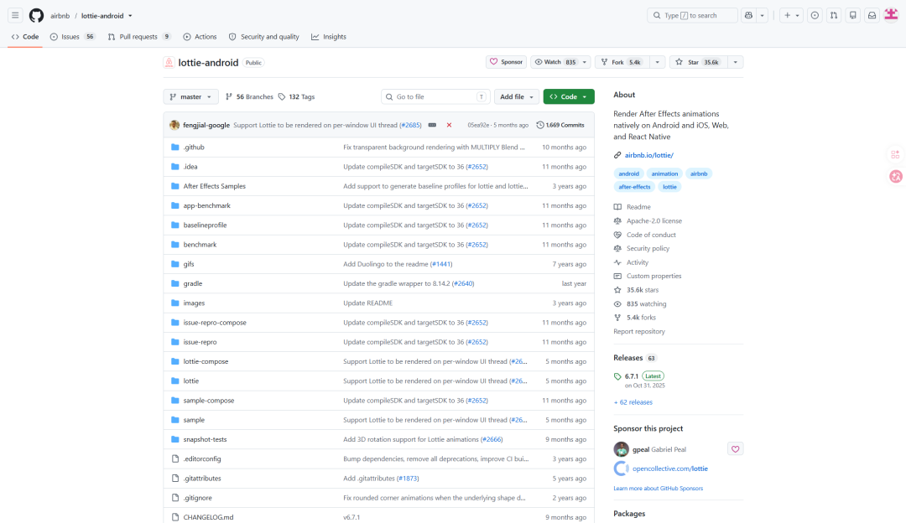
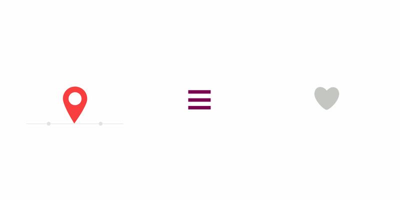
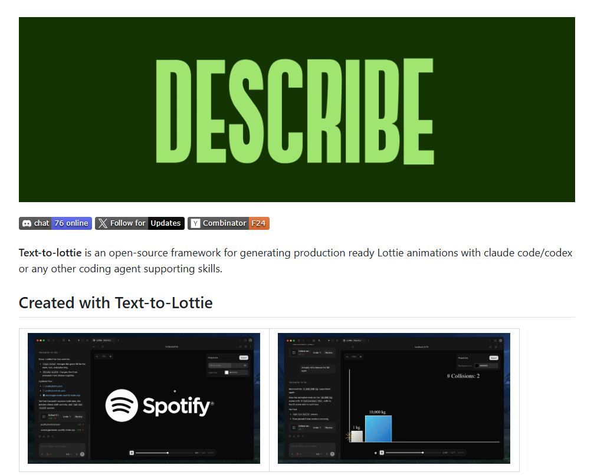
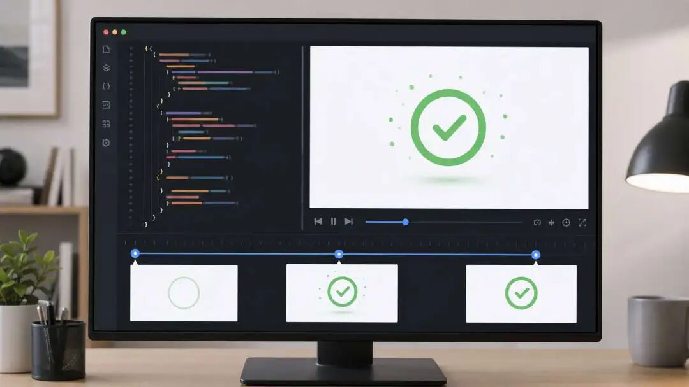
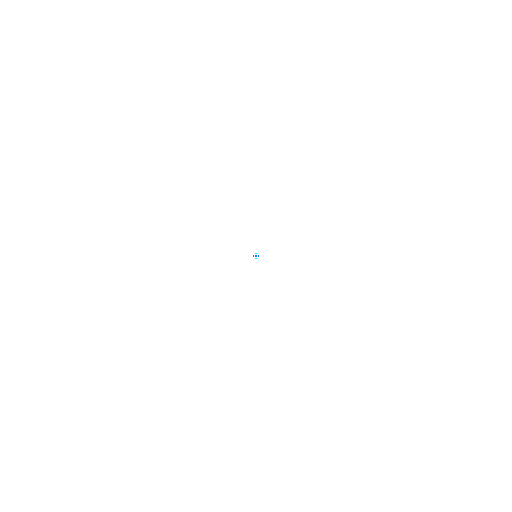

# Codex 使用 Text-to-Lottie 制作界面动效

> 难度 | 进阶
>
> 类型 | 社区生态与项目评测

Text-to-Lottie 是第三方 Skill。它让 Codex 根据文字要求创建或修改 Lottie 动画，并用预览项目检查运动、循环和透明背景。


## 先了解 Lottie 文件

Lottie 用 JSON 描述矢量图形和关键帧。它适合图标反馈、加载状态、按钮和空状态等轻量界面动效。照片级画面、复杂粒子和长时间视频不适合直接用 Lottie 承担。

Text-to-Lottie 也不是图像模型。它提供给 Agent 一套生成、预览和检查动画文件的工作流，最终质量仍取决于素材、约束和验收。





## 安装 Skill

项目仓库当前提供的安装命令如下。

```bash
npx skills add diffusionstudio/lottie
```

安装第三方 Skill 前先检查仓库、依赖和权限。完成后新建 Codex 任务，确认它能读取 Skill。项目需要 Node.js 或预览依赖时，按仓库 README 安装，不能假定所有环境已经具备。



## 第一次生成

先选一个边界清楚的状态反馈。成功勾选动画可以这样描述。

```text
使用 Text-to-Lottie 创建一个成功反馈动画。
画布为 256 × 256，背景透明。
蓝色圆环在 400 毫秒内绘制完成，随后绿色勾线在 300 毫秒内出现。
动画只播放一次，结束后停在完成状态。
不要添加文字、阴影和背景卡片。
生成 JSON 后启动预览，并检查首帧、末帧和画布边界。
```


动效提示词至少要交代素材、画布、运动、时长和循环。只写“做得高级一点”，Codex 无法知道应该改速度、缓动还是图形。

## 用素材约束结果

已有 SVG 或品牌图标时，把源文件交给 Codex，并要求保留路径与颜色。没有素材时先让它生成静态构图，确认轮廓后再加运动。这样比同时修改造型和动画更容易定位问题。




## 检查常见动效

加载动画需要无缝循环，成功反馈通常播放一次，通知铃铛应在短暂摆动后回到稳定位置。每种用途的停止条件不同，不能只确认文件能打开。




验收时检查首尾帧是否跳动，主体有没有超出画布，透明背景是否正确，速度在实际界面中是否合适。还要在目标播放器中测试。浏览器预览正常，不能证明 iOS、Android 或 Flutter 的播放器支持文件中的全部特性。


## 修改已有动画

修复已有 Lottie 时，把问题描述成可观察的现象。

```text
读取 success.json，保留现有图形和颜色。
修复循环接缝处的跳动，让最后一帧自然回到第一帧。
不要改变画布尺寸和图层名称。
修改后生成前后对比预览，并说明改动的关键帧。
```

把 JSON、素材和预览命令放在项目中，导出的演示 GIF 或视频单独保存。这样可以在 Git 中审查可编辑源文件，也能重新生成展示产物。

## 参考资料

- [Text-to-Lottie 项目仓库](https://github.com/diffusionstudio/lottie)
- [Codex Skills](https://developers.openai.com/codex/skills)
