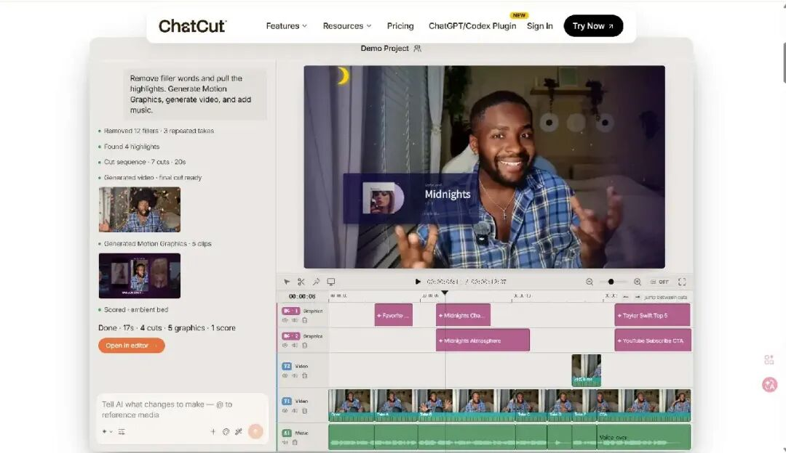
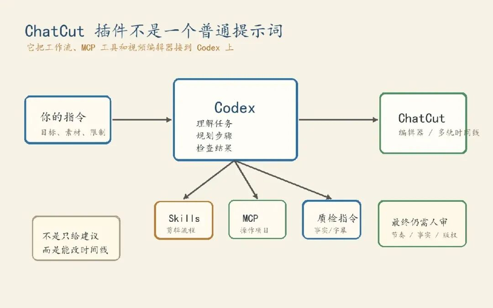
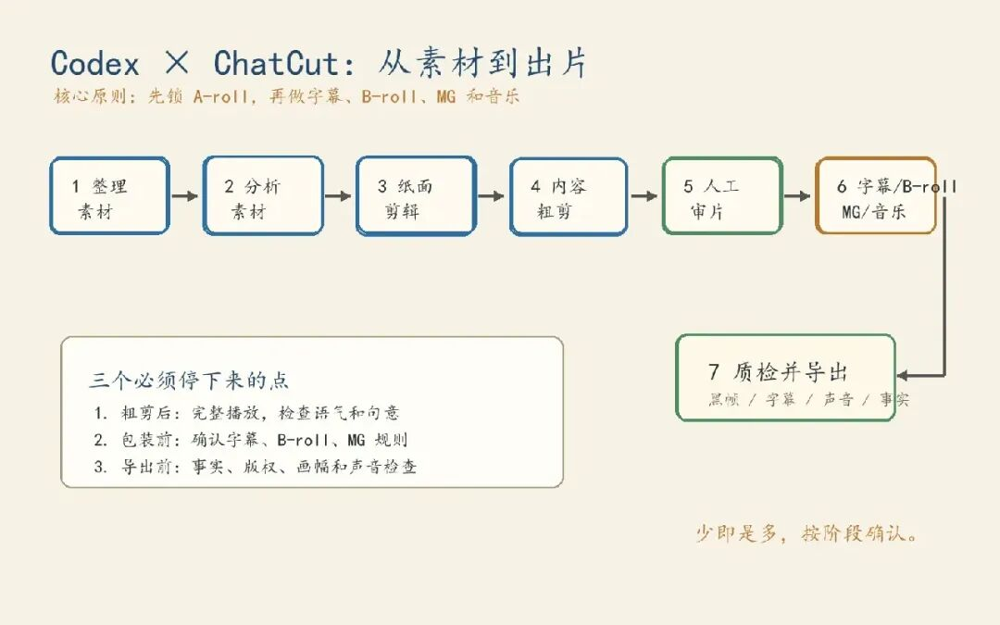
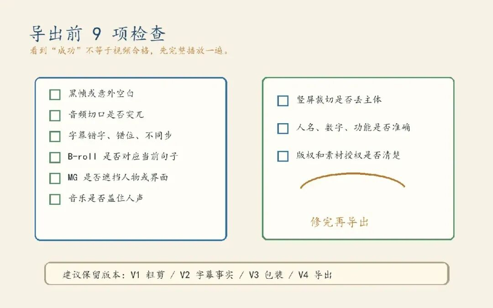

# Codex 连接 ChatCut 完成视频粗剪、字幕与导出

> 难度 | 进阶
>
> 类型 | 社区生态与项目评测

ChatCut 是第三方视频编辑服务。通过它提供的插件和 MCP 工具，Codex 可以分析素材、修改时间线、生成字幕并导出视频。账号、素材和编辑操作仍在 ChatCut 的权限范围内。




## 安装与登录

开始前需要 ChatCut 账号、支持插件的 Codex 客户端和可用的 MCP 登录。项目仓库会给出当前安装方式。安装第三方插件前先查看仓库内容、权限和数据处理说明。

可以先让 Codex 按官方仓库处理安装。

```text
阅读 ChatCut 官方 agent-plugin 仓库的安装说明。
先告诉我将添加哪些 Plugin 和 MCP 配置，需要哪些账号权限，不要立即安装。
我确认后再完成安装与登录，并报告可用工具，不要读取任何项目素材。
```

安装和 MCP 登录完成后新建一个 Codex 任务。旧任务通常不会动态加载刚加入的工具。新任务中先让 Codex 列出 ChatCut 工具，再创建空白测试项目。

## 先整理素材

正式剪辑前把原始视频、录屏、图片、音频、品牌素材和来源记录分开放置。文件名要能说明内容，避免全部使用相机生成的编号。


客户未公开素材、内部会议和未授权人物画面不应直接上传。库存素材、音乐和生成内容要保留来源与商用授权记录。

## 第一次只做粗剪

首次任务不要把字幕、音乐、动画和导出一起交给 Codex。先完成转写与内容粗剪。

```text
使用 ChatCut 新建测试项目并导入指定视频。
这是一段中文口播。
删除明确口误、失败重录和无意义重复，压缩超过 1.2 秒的无意义停顿。
保留完整句意、自然呼吸和原本语气。
不要添加字幕、音乐、动画或补充画面，也不要导出。
完成后给出删减清单，并停在时间线供我检查。
```



完整播放粗剪，检查语气有没有被截断，句意是否变化，停顿是否过密。确认内容后再进入下一阶段。

## 按阶段完成成片

稳定顺序是素材分析、纸面剪辑、内容粗剪、人工审片、画面包装、字幕与声音、完整质检、导出。后续元素依赖时间点，过早添加会增加返工。



粗剪锁定后再加录屏和 B-roll。每段画面要对应正在讲的内容，没有真实素材时先报告缺口。不要用无关库存画面，也不要让生成画面冒充真实产品界面。

字幕要基于最终时间线生成。核对人名、品牌名、数字和专有名词，并检查字幕安全区。音乐要低于人声，转场处不能突然中断。


## 导出前检查

工具返回成功，只能证明命令执行，不能证明视频合格。导出前让 Codex 检查时间线，再由人完整看一遍。



检查黑帧、空白、素材重叠、音频切口、字幕同步、画面遮挡和音乐音量。竖屏版本还要确认主体没有被裁掉。涉及人物、数字和产品能力的内容应回到来源逐项核对。

确认后再指定分辨率、帧率、编码和文件名。多个平台版本应分别检查构图和字幕安全区，不能只机械裁边。


## 适用范围与限制

口播清理、字幕、访谈切片和简单产品演示适合先交给 Codex 与 ChatCut 做初版。复杂叙事、精细关键帧、调色和声音设计仍需要人在专业编辑工具中判断。

云端处理可能涉及上传、转码和转写，成本也可能按不同生成能力分别计算。正式项目开始前先确认隐私条款、额度与导出限制。

## 参考资料

- [ChatCut 插件仓库](https://github.com/ChatCut-Inc/agent-plugin)
- [ChatCut 官网](https://chatcut.io/)
- [Codex Plugins](https://developers.openai.com/codex/plugins)
- [Codex MCP](https://developers.openai.com/codex/mcp)
