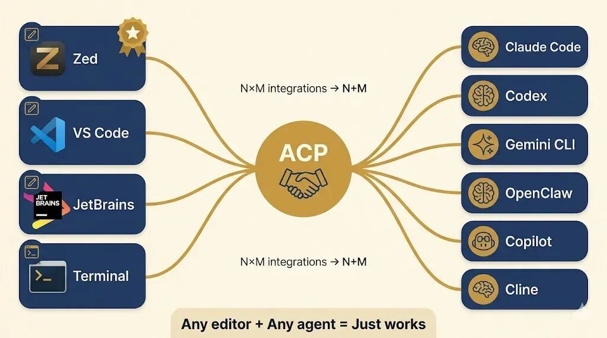
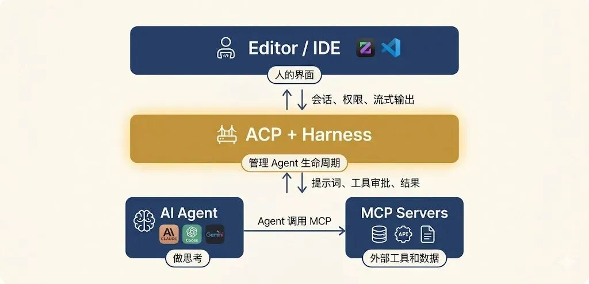

# Codex 接入 ACP：在兼容开发工具中复用编码代理能力

现在 AI 编程工具越来越多，但有一个问题一直没解决：它们之间不互通。

Claude Code 有自己的客户端，Codex 也有自己的 app，Cursor 的 Agent 只能在 Cursor
里用，每个工具都是封闭的，想把某个 Agent 放到另一个编辑器里用，或者让不同 Agent 协作处理同一个项目，做不到。

这个问题其实不新鲜，十几年前，编程语言工具也是同样的局面，每个编辑器都得自己做语法高亮、自动补全、错误检查，后来出了一个叫 LSP
的协议，把这层通信统一了，VS Code 能成功很大程度上就是因为这个。

这个问题听起来熟悉吗？

现在 AI 编程领域也有了类似的协议——Agent Client Protocol（ACP），让任何编辑器能接入任何 AI 编程 Agent。

目标很简单：让任何编辑器能用任何 AI 编程 Agent。

##  ACP 是什么

Agent Client Protocol 是一个标准化的通信协议，定义了代码编辑器和 AI 编程 Agent 之间如何对话。

简单说：它让任何支持 ACP 的编辑器都能用任何支持 ACP 的 Agent，不再是「Claude Code 只能在终端用」或「Cursor 只能用自己的
Agent」，可以在 Zed 里用 Claude Code，在 VS Code 里用 Gemini CLI，随便组合。

技术上它基于 JSON-RPC，支持两种运行方式：

** • 本地模式  ** ：Agent 作为编辑器的子进程运行，通过 stdio 通信

** • 远程模式  ** ：Agent 跑在云端，通过 HTTP/WebSocket 连接

和 MCP（Model Context Protocol）的关系是互补的：MCP 解决「Agent 怎么获取外部工具和数据」，ACP 解决「编辑器怎么和
Agent 对话」。

一个管 Agent 的输入，一个管 Agent 的输出。

##  Harness：Agent 的“容器”

这是 ACP 生态里一个很重要的概念。

如果说 ACP 是协议本身，那 Harness 就是“管理 Agent 生命周期的容器”。

类比一下：

•  ** Docker 是应用的容器  ** — 管理应用的启动、停止、网络、存储

•  ** Harness 是 Agent 的容器  ** — 管理 Agent 的启动、会话、权限、通信

具体来说，Harness 负责：

• 启动和停止 Agent 进程

• 管理多个并发会话（你可以同时跑多个任务）

• 处理权限控制（Agent 要执行命令、读写文件时的审批流）

• 管理会话的保存/恢复/关闭

比如在 OpenClaw 里，你可以这样启动一个 ACP harness：

    
    
    # OpenClaw 作为 ACP harness 运行  
    openclaw acp  
      
    # 指向远程 Gateway  
    openclaw acp --url wss://my-server:18789 --token-file ~/.openclaw/gateway.token  
      
    # 绑定到特定 agent 会话  
    openclaw acp --session agent:main:main  
    

编辑器只需要知道怎么跟 harness 说话，不需要知道后面是 Claude、Gemini 还是 DeepSeek，这层抽象让开发者可以自由组合编辑器和
Agent，而不用关心底层实现。

##  生态现状：30+ Agent 已接入

这不是纸上谈兵。截止现在，已经有 30 多个 Agent 实现了 ACP：

• Anthropic: Claude Code（通过 Zed 的 SDK adapter） • OpenAI: Codex CLI（通过 Zed 的
adapter） • Google: Gemini CLI • Cursor • GitHub Copilot（public preview） •
JetBrains: Junie • OpenClaw • Cline、Goose、OpenHands、OpenCode...

客户端（编辑器）方面，Zed 是最积极的推动者——它原生支持 ACP，可以接入任何 ACP Agent，VS Code 和 JetBrains 也在跟进。

这意味着什么？以前你选 Claude Code 就意味着只能在终端用，现在你可以在 Zed 里直接用它，享受编辑器的所有 UI 优势（diff
预览、文件树、内联显示），或者可以用 acpx 让两个 Agent 协作。

##  实操：在 Zed 里用 Claude Code

拿一个具体例子来说，假设想在 Zed 编辑器里用 Claude Code，以前完全不可能，现在只需要配置一下：

    
    
    // ~/.config/zed/settings.json  
    {  
      "agent_servers": {  
        "Claude Code": {  
          "type": "custom",  
          "command": "claude-agent-acp",  
          "args": [],  
          "env": {}  
        }  
      }  
    }  
    

或者想用 OpenClaw 的 agent：

    
    
    // Zed settings  
    {  
      "agent_servers": {  
        "OpenClaw ACP": {  
          "type": "custom",  
          "command": "openclaw",  
          "args": ["acp", "--session", "agent:main:main"],  
          "env": {}  
        }  
      }  
    }  
    

打开 Zed 的 Agent 面板，选择配置的 Agent，就能开始用了，体验和在终端里直接用 Claude Code 一样，但有了编辑器的 UI 加持。

##  进阶：让不同 Agent 协作

更有意思的是 agent 之间的协作，通过 acpx（ACP 的命令行客户端），可以让一个 Agent 调用另一个：

    
    
    # 让 Codex 通过 ACP 访问 OpenClaw agent 的上下文  
    acpx openclaw exec "总结一下当前项目的最新进展"  
      
    # 建立持久会话，多次交互  
    acpx openclaw sessions ensure --name codex-bridge  
    acpx openclaw -s codex-bridge "help me review this PR"  
    

这意味着可以创建一个 multi-agent 工作流：一个 Agent 擅长代码生成，另一个擅长代码审查，第三个负责测试，它们通过 ACP
标准接口通信，不需要任何自定义集成工作。

再比如 OpenClaw 里的 sessions_spawn 工具，可以直接以 ACP 模式启动一个子 agent，指定用哪个 harness，子
agent 完成任务后自动报告结果，这就是harness 管理 agent 生命周期的具体体现。

##  ACP vs MCP：别混淆

很多人容易把 ACP 和 MCP 混淆。

• MCP (Model Context Protocol) — 解决的是Agent 怎么获取外部能力，比如接数据库、调 API、读文档，Agent 是
MCP 的客户端。

• ACP (Agent Client Protocol) — 解决的是编辑器怎么和 Agent 对话，管理会话、权限、流式输出、工具调用审批，编辑器是
ACP 的客户端。

两者是配合关系：编辑器通过 ACP 跟 Agent 说话，Agent 通过 MCP 获取外部工具和数据，编辑器还可以把自己配置的 MCP server 传给
Agent，让 Agent 直接用。

** ACP 管「人怎么和 Agent 交互」，MCP 管「Agent 怎么和世界交互」。  **

##  写在最后

简单来说，ACP 做的事情就是把编辑器和 AI Agent 之间的对话方式统一了，以前每家都各做各的，现在有了一个共同的接口规范，Harness
则是这个体系里管 Agent 启停、会话和权限的那一层。

目前支持 ACP 的 Agent 已经超过 30 个，包括 Claude Code、Codex、Gemini CLI、Cursor、Copilot
这些主流工具，编辑器端 Zed 已经原生支持，VS Code 和 JetBrains 也在跟进，不过很多集成还在早期阶段，实际体验可能和成熟产品有差距。

> 官网：https://agentclientprotocol.com/
>
> 规范文档：https://agentclientprotocol.com/protocol/overview.md
>
> 支持 Agent 列表：https://agentclientprotocol.com/get-started/agents.md

## 七、总结

ACP 让 Codex 可以在支持该协议的开发工具中被调用，但实际能力取决于客户端和代理端的实现。配置完成后，先用一个只读任务验证连接，再逐步开放编辑、命令执行和网络权限。

参考资料：

- [Agent Client Protocol](https://agentclientprotocol.com/)

- [ACP 协议概览](https://agentclientprotocol.com/protocol/overview.md)
