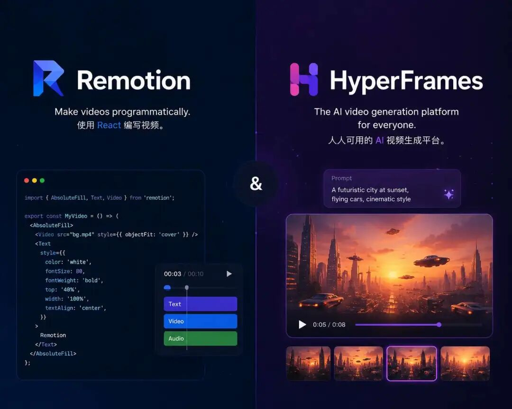
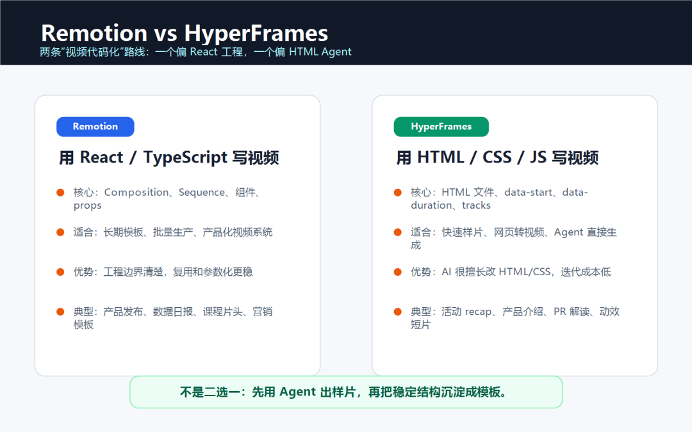
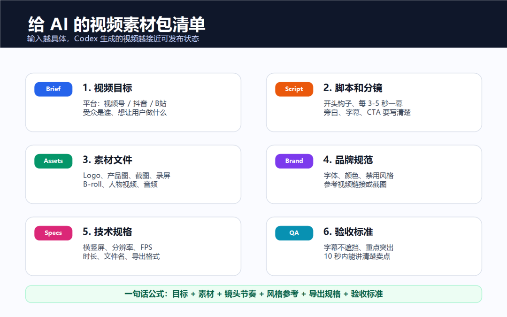
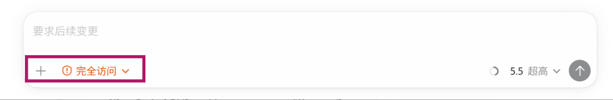
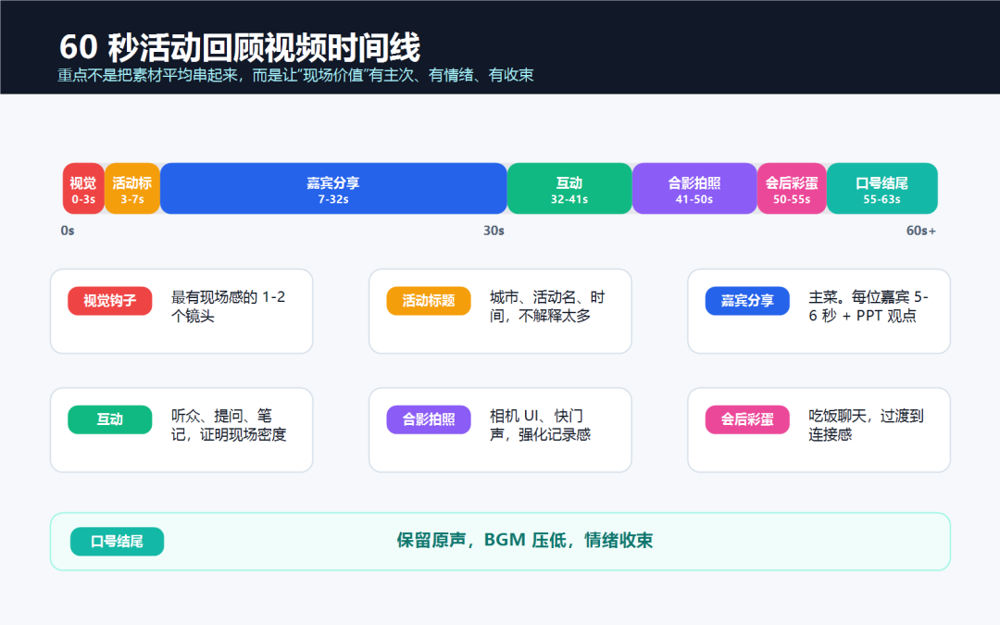
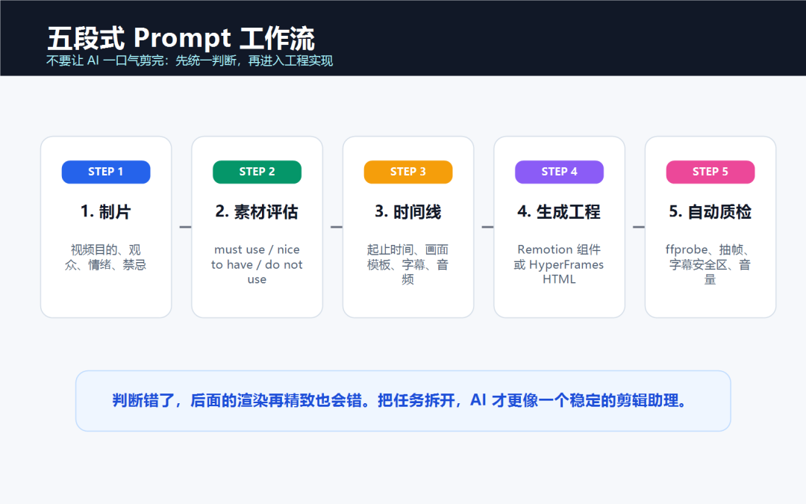

# Codex 使用 Remotion 和 HyperFrames 制作视频

Remotion 和 HyperFrames 都能把视频写成代码，Codex 可以读取脚本与素材，生成项目文件，启动预览并根据检查结果修改。它们是第三方工具，工作方式和适用场景不同。视频仍要经过人工审片，工具也不会自动解决素材版权、节奏和事实准确性。


*原稿中的成片示例，社交平台播放器界面保留用于说明竖屏视频结果。*

## 两套工具怎样选

Remotion 使用 React 组件和时间轴 API 生成视频。它适合长期维护的模板、数据驱动视频，以及需要复用组件的项目。

HyperFrames 使用 HTML、CSS、媒体文件和时间属性描述画面。它面向 Agent 工作流，适合快速制作样片、网页转视频和短篇动效。当前 npm 包要求 Node.js 22 或更高版本，许可证为 Apache-2.0。



*概念示意，两套工具分别采用 React 和 HTML 路线。*


*概念示意，代码、媒体素材、时间线和预览共同组成视频项目。*

| 需求 | 更合适的起点 |
|---|---|
| 快速制作一版 HTML 动效样片 | HyperFrames |
| 把网页、产品页或 PR 做成短视频 | HyperFrames |
| 长期维护固定栏目模板 | Remotion |
| 用数据批量生成同结构视频 | Remotion |
| 团队已有 React 工程经验 | Remotion |

这张表只用于选择起点。同一项目可以先用 HyperFrames 试视觉，再把稳定结构迁移到 Remotion。



*概念示意，工具选择取决于样片速度、技术栈和复用需求。*

## 先给 Codex 一份视频 Brief

Codex 需要可执行的输入。至少准备视频用途、比例、时长、脚本、素材目录、视觉规则和验收标准。可以把这些内容写进 `docs/video-brief.md`。

```markdown
# 视频 Brief

## 基本信息

- 平台和比例
- 分辨率、帧率和时长
- 目标观众与视频目的

## 素材

- 文件路径与用途
- 必须使用和禁止使用的素材
- 字体、图片、视频和音乐的授权状态

## 分镜

- 每一段的起止时间
- 画面、字幕、旁白和动效

## 验收

- 字幕不越界、不遮挡主视觉
- 图片和视频不拉伸
- 时长与导出规格正确
- 关键画面能够解释脚本内容
```


*概念示意，准备、实现、预览和渲染需要分开验收。*

素材文件要使用能说明内容的名字，并按场景或用途分组。`final-final-v3.mp4` 这类名称会增加 Codex 误用素材的概率。



*概念示意，视频目标、脚本、素材、视觉规则和技术规格应同时提供。*

## 用 HyperFrames 生成 HTML 视频

先检查 Node.js 和 FFmpeg。

```powershell
node -v
ffmpeg -version
```

HyperFrames 官方仓库提供 Agent Skills。安装前先检查仓库和权限，随后按当前文档执行。

```powershell
npx skills add heygen-com/hyperframes --all
npx hyperframes init my-video
cd my-video
npx hyperframes preview
```

HyperFrames 通过 `data-start`、`data-duration` 和 `data-track-index` 描述片段在时间线中的位置。项目还需要为画面根节点设置 `data-composition-id`、宽度和高度。动画必须可以按时间定位，不能依赖不可重复的随机数或真实时间。

让 Codex 开始实现时，可以使用下面的任务说明。

```text
读取 docs/video-brief.md 和 assets 目录。
先输出带时间码的分镜计划，确认后再写 HTML、CSS 和动画。
只使用现有素材，缺少文件时列出缺口。
预览后检查字幕安全区、文字溢出、素材比例和时长。
通过 lint、validate 与 inspect 后再渲染 MP4。
```

当前 HyperFrames CLI 提供的质量检查以本地 `--help` 为准。已安装版本支持时，可以依次运行下列命令。

```powershell
npx hyperframes lint
npx hyperframes validate
npx hyperframes inspect
npx hyperframes render
```

## 用 Remotion 维护 React 视频模板

Remotion 更适合把标题页、内容页、字幕和结尾页拆成组件。脚本与素材路径通过 props 或数据文件传入，同一套组件可以生成多条结构一致的视频。

新项目可以从官方脚手架开始。

```powershell
npx create-video@latest
npx remotion studio
```

先在 Studio 中确认 Composition、帧率、尺寸和时长。让 Codex 修改组件时，每次只处理一类问题，例如字幕位置、场景节奏或素材裁切。全部画面确认后再运行渲染命令。

```powershell
npx remotion render
```

实际项目可能需要入口文件、Composition ID 和输出路径。运行 `npx remotion render --help`，让 Codex 根据当前项目配置补齐参数。

## 权限和工作目录要收紧

Codex 需要读取素材、安装依赖、启动本地服务和写入输出目录。授权范围只覆盖当前视频项目，不要把无关目录、账号凭据和私人素材一并开放。



*实操界面，开始任务前确认 Codex 的项目访问范围。*

## 预览时检查关键帧

代码能运行只说明工程通过了最低门槛。审片时需要查看开头、转场前后、字幕最密集处和结尾。长视频还应抽取更多时间点，避免只看第一屏。

活动回顾类视频可以先画出时间线，明确开场、主体和收尾各占多少时间。



*概念示意，时间线先确定信息节奏，再进入工程实现。*

一轮提示只改一个问题，并要求 Codex 重新预览对应时间点。最终检查至少包含以下内容。

- 所有本地素材都存在，没有虚构路径。
- 字幕在手机安全区内，字体可以正常加载。
- 图片和视频保持原比例，转场没有空白帧。
- 音乐、字体、图片和视频素材具备所需授权。
- 输出分辨率、帧率、时长和文件名符合 Brief。



*概念示意，先完成判断和时间线，再生成工程并自动质检。*

## 使用限制

Remotion 的许可条件会随组织规模和用途变化，商业使用前应查看当前许可证页面。HyperFrames 当前使用 Apache-2.0，仍要单独检查项目引用的字体、音乐和媒体素材。

视频项目应该和 MP4 一起保留。后续更换标题、脚本或素材时，Codex 可以在原项目上修改并重新渲染，省去重新搭建时间线。

## 参考资料

- [Remotion 关于编码 Agent 的说明](https://www.remotion.dev/docs/ai/coding-agents)
- [Remotion 文档](https://www.remotion.dev/docs/)
- [Remotion License](https://www.remotion.dev/docs/license)
- [HyperFrames GitHub 仓库](https://github.com/heygen-com/hyperframes)
- [HyperFrames Quickstart](https://hyperframes.heygen.com/quickstart)
- [HyperFrames License](https://github.com/heygen-com/hyperframes/blob/main/LICENSE)
