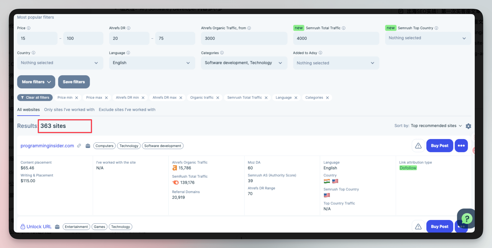
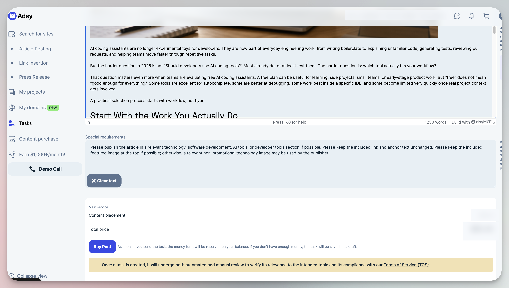
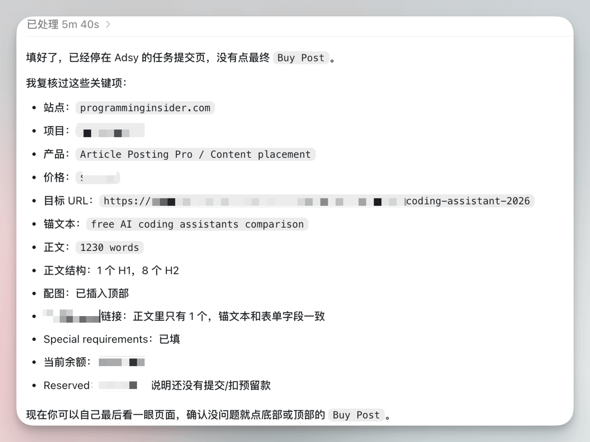
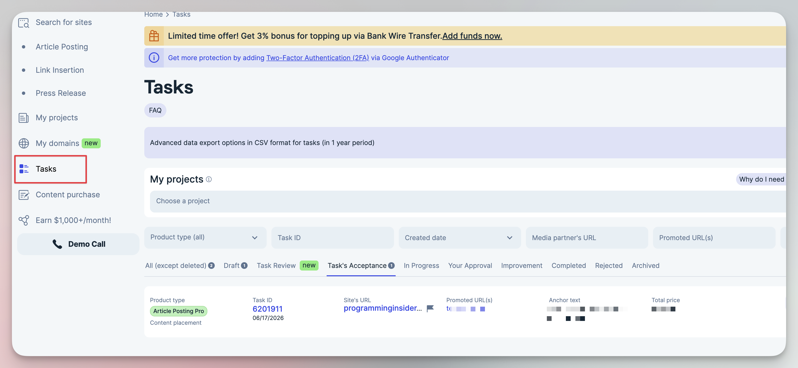

# Codex 协助客座文章外链实验

这篇记录一次由 Codex 协助完成的客座文章外链实验，重点是它怎样整理筛选条件、检查提交字段和复核发布结果。

之前我对客座文章这种外链方式只停留在概念上，知道它大概是找一个相关网站，发布一篇带链接的文章，用来给目标页面增加相关性和权重。

这次是第一次实际操作，Codex 帮我把流程跑了一遍。

平台怎么用，筛选条件怎么设，哪些网站看起来指标好但不值得买，文章该怎么写，提交前有哪些必填内容...

Codex 很适合做这种平台的实操，替我把大量细节先梳理清楚，替我操作。

## 先用小预算熟悉平台

这次选的是一个提供客座文章发布服务的平台，先用小预算熟悉流程。

第一次进入这类平台，最容易被一堆指标绕晕。价格、域名权重、自然流量、国家、语言、分类和链接属性都要看。

Codex 先给了我筛选条件。针对自己的网站情况，我们先把语言限定为英文，把分类限定在 Software development 和 Technology，再给价格设一个上限。

目标很明确，先把范围缩小到和自己的网站更相关、预算还能接受的网站，不追求找到全平台最强的网站。

**这一步里，人要做的是定边界。**

比如我知道这次是给 AI 工具站做外链，不想买太泛娱乐、金融、生活方式的站。Codex 做的是把这些边界翻译成平台上的筛选条件，再帮我解释每个指标代表什么。

## 看指标，也看这个站像不像真的相关

筛出来以后还有几百个网站，这时候平台的推荐排序就不够用了。

Codex 帮我做了一轮筛选。它会看每个站的价格、流量、域名指标和链接属性，也会继续搜索这个站有没有开发工具和软件开发相关内容。

这个过程里，我学到一个很实用的判断方法。

**一个站不能只看指标，还要看它平时发什么内容。如果一个站满屏都是 crypto、loan、casino、trading 这类高商业化内容，即使 DR 看起来很高，也要谨慎。**

它可能更像一个卖链接的内容农场。

这一步里，人要判断业务价值。Codex 可以帮我把 900 多个候选缩成几个优先级，但最后为什么选一个站，还是要回到项目目标上。我们的网站是 AI 工具目录和工具决策站，不应该为了一个便宜链接去买完全不相关的网站。

## 文章不是随便写一篇就行

确定网站以后，下一步是准备 guest post。

这次的承接页是一篇 Codex 相关的开发者教程，所以客座文章也围绕开发者如何选择 Codex 这类编码助手来写。

Codex 帮我写了一篇英文文章，主题是从真实工作流出发判断编码助手是否适合自己，并把重点落到 Codex 的使用场景。

我不想让这篇文章看起来像硬塞链接，所以锚文本直接描述承接页内容，并把 Codex 放在正文语境里自然出现。

文章写完后，Codex 又帮我检查了几个细节。

目标 URL 要和正文里的链接一致，锚文本要和平台字段一致，正文要满足平台要求的最低字数，Special requirements 要写清楚，希望发布在 technology、software development、AI tools 或 developer tools 相关栏目里。

Codex 的作用很具体。它会写文章，也会做提交前检查。很多新手第一次买客座文章时，大方向可能已经想清楚了，最后容易栽在这些小字段上。

URL 填首页还是承接页，锚文本有没有和正文一致，图片位置是不是放错了，浏览器翻译插件有没有把中文残留混进正文。

我最后让 Codex 把提交页逐项复核了一遍。

这次文章还加了一张配图。图是为了让文章看起来更完整，也减少发布方随便配一张不相关图的概率。

配图这件事其实也有一套小流程。

先判断是否需要配图，再生成一张和文章主题一致的图，然后上传到图床，最后把图片地址插到文章里。

提交前我又让 Codex 检查了一次正文。最后它通过浏览器把源码里的正文清理了一遍，确认没有明显问题后，才建议我提交订单。

## 人负责判断，AI 负责执行和检查

人和 AI 应该怎么分工。

人负责判断目标。为什么要买这条外链，预算是多少，能接受什么风险，什么类型的网站和我们的产品相关，自己心里要有一个判断。

AI 适合做陪跑。它可以帮我读平台、解释字段、设计筛选条件、初筛候选网站、检查内容相关性、写文章、生成配图、上传图床、复核提交字段，还能控制浏览器帮我把一些重复操作走完。

在这个过程中，AI 更像一个执行力很强的同事，会把平台里那些零碎、细节、容易漏的步骤整理出来，然后一项项过。

有 AI 辅助能降低上手成本，也能减少因为不熟平台而犯的低级错误。

最后，客座文章有没有效果，不能看提交完了就结束，而是要等文章发布后继续跟踪。后面还要记录发布 URL、是否 Dofollow、是否收录，以及 Codex 承接页的曝光、点击和平均排名有没有变化。

提交成功后，钱会先进入 Reserved，不是立刻最终完成。

任务会出现在平台的任务列表里，这个页面后面就是验收入口，等文章发布后，还要从这里回来看发布 URL 和任务状态。

## 发布后还要做一次验收

这件事还没有真正结束。等对方发布文章以后，我还要做一次验收。

第一步是在平台里拿到发布 URL，打开页面确认它能正常访问。页面要返回 200，文章内容不能变成拼接稿，标题、配图、段落结构也要基本正常。然后检查 Codex 相关承接页的链接是否还在，锚文本和目标地址是否正确。

第二步是看链接属性。平台里显示的是 Dofollow，但最终还是要以发布页实际 HTML 为准。需要检查链接有没有被改成 nofollow、sponsored，或者被跳转链接包了一层。如果链接被删了、锚文本被改了、目标页被改错了，就要回到平台任务里沟通修改。

第三步是看这篇文章是否有基本的收录可能。可以先看页面是不是 noindex，再过几天搜索文章标题或使用 site 查询，看它有没有被搜索引擎发现。这个阶段不要急着看排名，因为外链从发布到被发现，再到可能影响目标页，通常需要时间。

4 到 8 周后，再看 Codex 承接页的数据。重点是比较曝光、查询词和平均排名的变化。

如果数据完全没变化，也不代表这条外链一定没用，但至少说明它不是短期明显有效的动作。如果发布页质量一般、没有收录、没有带来任何相关查询变化，后续就不应该继续批量买同类站。反过来，如果发布页正常收录，目标页开始出现更多相关查询，这条实验就值得记录下来，后面可以用类似方法继续找更相关的网站。

这次实验也说明，Codex 可以把外链筛选、提交检查和后续验收串起来，但发布后的数据仍然需要人工持续观察。
