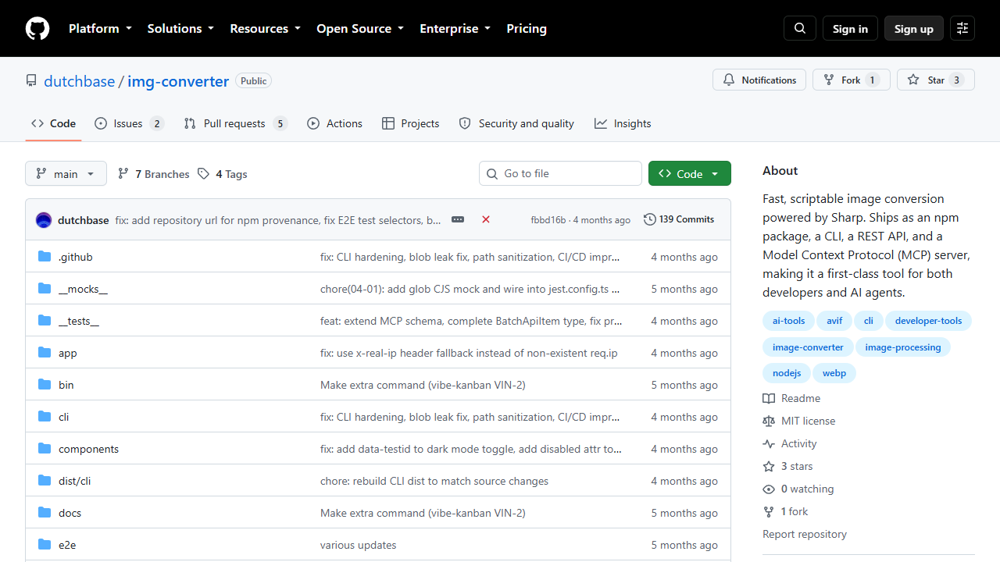
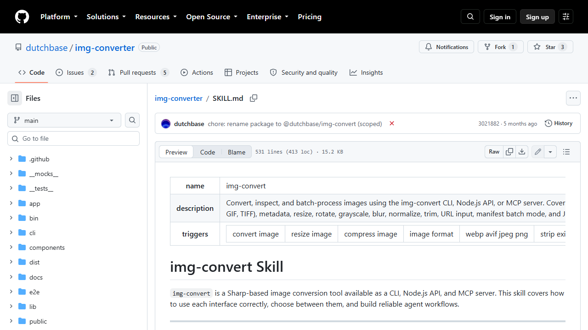
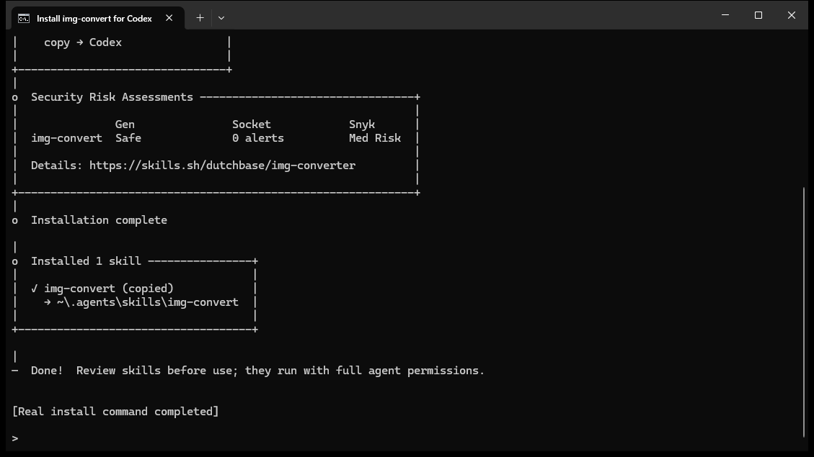
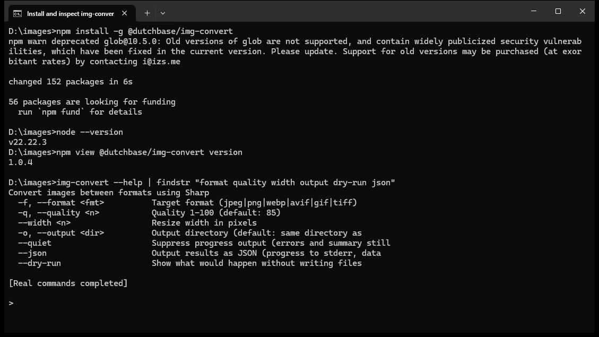
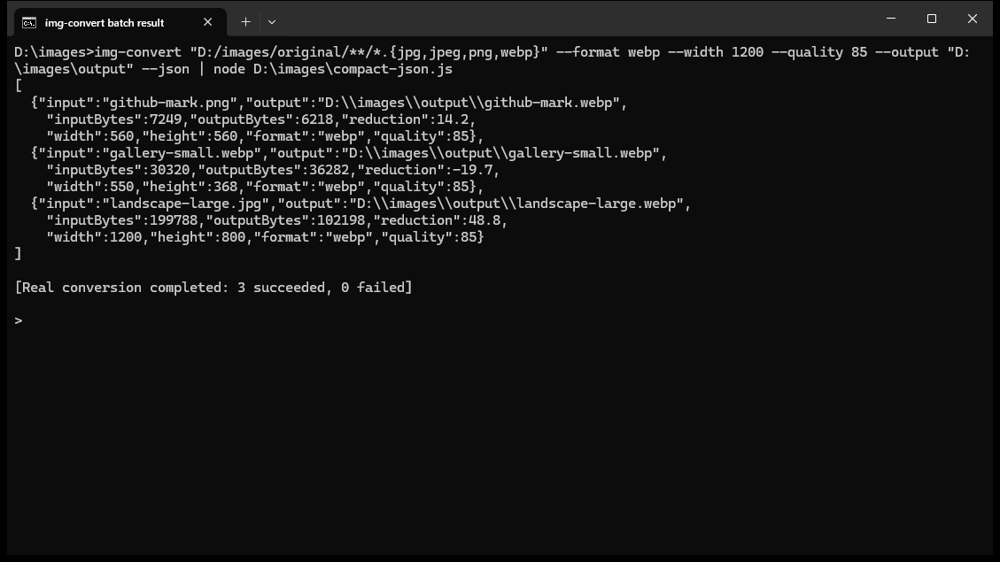
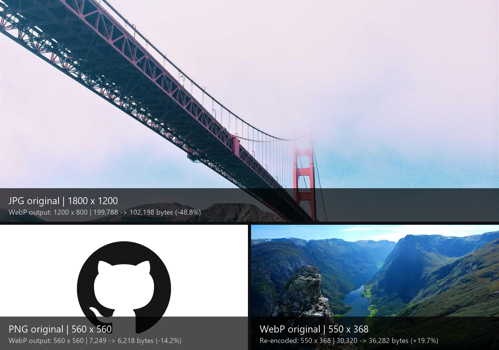

# 用开源 img-convert Skill 批量压缩图片

整理文章配图时，我经常重复做几件事。限制图片宽度，转成 WebP，控制文件大小，最后确认原图没有被覆盖。这个流程已经有人做成了开源工具和 Skill，没必要从零写一套。

这篇实战使用 [dutchbase/img-converter](https://github.com/dutchbase/img-converter) 提供的 `img-convert` Skill。目标是把指定文件夹中的图片统一限制在 1200px 宽，转成质量 85 的 WebP，并把结果放进新目录。

> 测试环境为 Windows 11 24H2（26100.4652）、Codex Desktop 26.810.7004.0、Codex CLI 0.147.0、Node.js 22.22.3、skills 1.5.22 和 img-convert 1.0.4，2026-08-17 核验。

> 开源项目、Skill 与 CLI 安装、dry-run、三图批量转换和原图/输出目录对比均已于 2026-08-17 实测并截图。

## 一、先看这个开源 Skill 能做什么

`img-convert` 基于 Sharp，仓库使用 MIT 许可证。项目同时提供命令行工具、Node.js API、MCP 服务和一份现成的 `SKILL.md`。这篇只使用最简单的组合，让 Codex 按 Skill 中的规则判断，再调用 CLI 处理本地图片。

它支持 JPEG、PNG、WebP、AVIF、GIF 和 TIFF 输出，也能调整尺寸、压缩质量、旋转、裁边和读取图片信息。批量任务既可以传入 glob 路径，也可以使用 JSON 清单。



安装前可以先让 `skills` 命令读取仓库，确认其中确实有 `img-convert`。

```powershell
npx -y skills add https://github.com/dutchbase/img-converter --list
```

命令应显示一个名为 `img-convert` 的 Skill。不要只凭第三方介绍页安装，仓库中的 [SKILL.md](https://github.com/dutchbase/img-converter/blob/main/SKILL.md) 才是实际内容。




## 二、安装 Skill 和命令行工具

先把 Skill 安装到 Codex 的全局技能目录。

```powershell
npx -y skills add https://github.com/dutchbase/img-converter `
  --skill img-convert `
  --agent codex `
  --global `
  --yes
```

Skill 只负责告诉 Codex 怎样使用工具，并不会自动安装 `img-convert` 命令。还要安装仓库发布的 npm 包。

```powershell
npm install -g @dutchbase/img-convert
```

本次安装成功，但 npm 同时提示其依赖的 `glob@10.5.0` 已弃用。这个警告不影响本文测试。在生产目录或自动化流水线使用前，应重新检查包版本、依赖审计结果和仓库更新情况，先用可恢复的图片副本测试。

这个工具要求 Node.js 18 或更高版本。安装完成后检查命令是否可用。

```powershell
node --version
img-convert --help
img-convert info --help
img-convert batch --help
```





## 三、把处理规则说清楚

这次使用下面这组参数。

| 项目 | 设置 |
| --- | --- |
| 输入 | 指定目录中的 JPG、JPEG、PNG 和 WebP |
| 输出目录 | 新建 `output` 目录 |
| 最大宽度 | 1200px |
| 输出格式 | WebP |
| 图片质量 | 85 |
| 原文件 | 保留，不覆盖、不删除 |

`img-convert` 默认保持宽高比，也默认禁止放大小图。宽度超过 1200px 的图片会等比缩小，小于 1200px 的图片保持原尺寸。

输出目录必须和原图目录分开。这样即使命令参数写错，原文件也还在。

## 四、先预演，不急着写文件

假设原图位于 `D:\images\original`，先运行 `--dry-run` 查看将要处理的文件。

```powershell
img-convert "D:/images/original/**/*.{jpg,jpeg,png,webp}" `
  --format webp `
  --width 1200 `
  --quality 85 `
  --output "D:\images\output" `
  --dry-run `
  --json
```

这里把 glob 路径放在引号中，让 `img-convert` 自己展开文件列表。Windows 下的 glob 要使用正斜杠 `/`，反斜杠会被当成转义符，可能导致一张图片都找不到。预演后要核对文件数量和输出目录，还要检查两个不同格式的同名文件会不会写成同一个 `.webp`。


## 五、确认后再批量转换

预演没有问题，就去掉 `--dry-run`。

```powershell
img-convert "D:/images/original/**/*.{jpg,jpeg,png,webp}" `
  --format webp `
  --width 1200 `
  --quality 85 `
  --output "D:\images\output" `
  --json
```

`--json` 会返回每张图片的输入大小、输出大小、压缩比例、尺寸和保存路径。文章后面可以直接根据这些结果统计总共节省了多少空间，不需要手工逐张计算。



截图中用 `compact-json.js` 只调整真实 JSON 的换行，字段和值没有改动。三张图片全部转换成功，失败数为 0。

如果不同图片需要不同尺寸或格式，可以让 Codex 先生成 JSON 清单，再运行下面的命令。

```powershell
img-convert batch jobs.json --json
```

简单的统一转换用 glob 就够了，不必先做清单。

## 六、直接让 Codex 调用 Skill

安装并重启 Codex 后，可以这样说。

```text
使用 img-convert Skill，先检查 D:\images\original 中会被处理的 JPG、JPEG、PNG 和 WebP 图片。
把宽度限制为 1200px，保持比例，不放大小图，统一转成质量 85 的 WebP，输出到 D:\images\output。
保留所有原文件。先 dry-run 并汇报文件数量和命名冲突，确认没有问题后再执行，最后给出处理成功数、失败数和总压缩比例。
```

这段要求把检查、预演、执行和汇报写在了一起。Skill 还会提醒 Codex 先读取陌生图片的信息，尤其注意透明通道和动画图片。

## 七、用三张公开图片验证

测试集包含一张 1800×1200 JPG、一张 560×560 PNG 和一张 550×368 WebP。大图被等比缩到 1200×800；两张小图仍保持原尺寸，说明设置 `--width 1200` 不会把小图放大。

结果也说明“统一转 WebP”不等于每张都会更小。JPG 减少 48.8%，PNG 减少 14.2%，但原本已经压缩过的 WebP 重新编码后反而增大 19.7%。批量任务结束后必须检查负压缩率，不能只看成功数量。

## 八、记录批量处理结果

| 项目 | 处理前 | 处理后 |
| --- | --- | --- |
| 图片数量 | 3 | 3 |
| 总文件大小 | 237,357 字节 | 144,698 字节 |
| 最大宽度 | 1800px | 1200px |
| 文件格式 | JPG/PNG/WebP | WebP |
| 失败数量 | - | 0 |

总大小减少 92,659 字节，整体压缩率约 39.0%。原图目录没有被覆盖，三个 WebP 都写入独立的 `output` 目录。

下图直接使用三张公开测试原图拼接，标签列出对应的输出尺寸和文件大小变化。



## 九、最后检查这些情况

- 原图数量、名称和内容没有变化
- 输出图片都位于单独目录
- 横图和竖图保持原始比例
- 小于 1200px 的图片没有被放大
- 透明区域没有意外变黑
- 动画图片没有在不知情的情况下只保留第一帧
- 同名输入不会静默覆盖同一个 WebP 文件
- 失败文件及原因已经单独列出

## 十、项目链接

- GitHub [dutchbase/img-converter](https://github.com/dutchbase/img-converter)
- Skill 源文件 [SKILL.md](https://github.com/dutchbase/img-converter/blob/main/SKILL.md)
- npm 包 [`@dutchbase/img-convert`](https://www.npmjs.com/package/@dutchbase/img-convert)
- 许可证 [MIT License](https://github.com/dutchbase/img-converter/blob/main/LICENSE)
