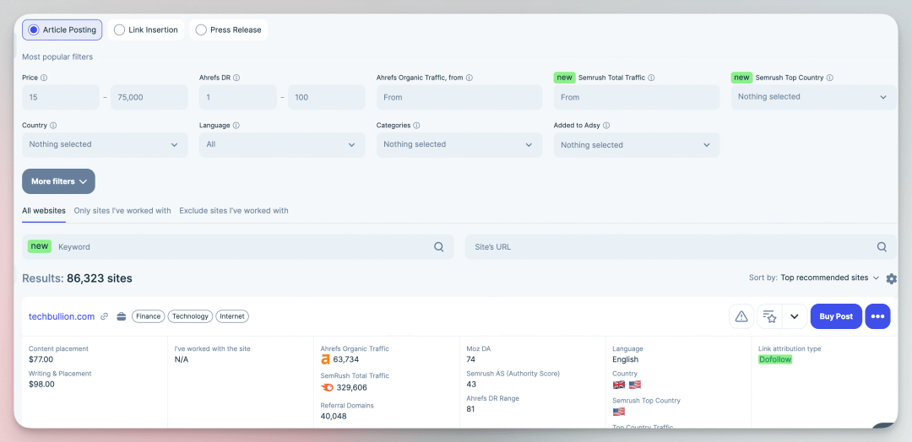
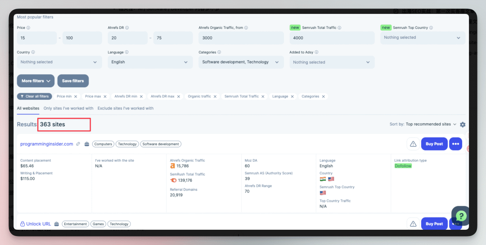
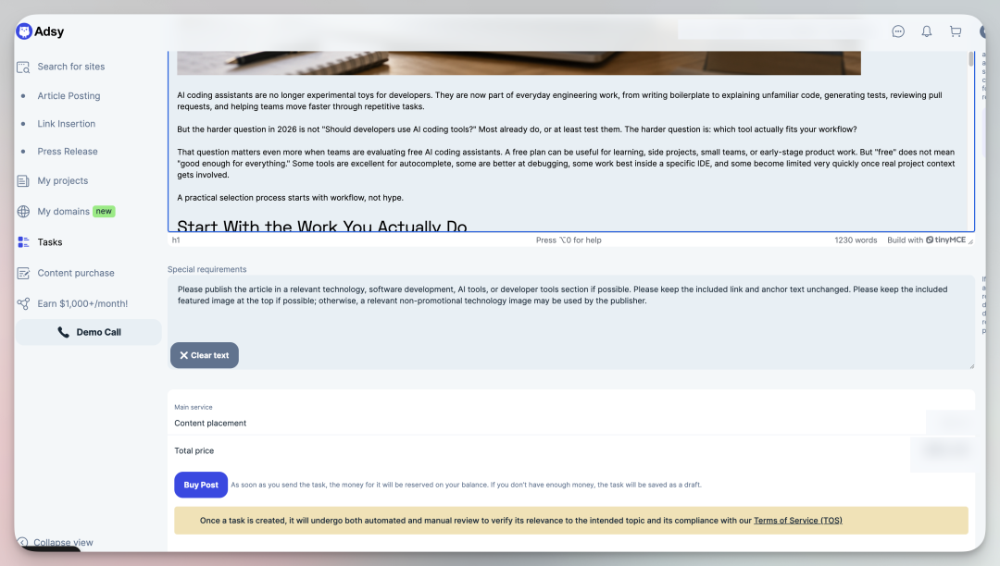
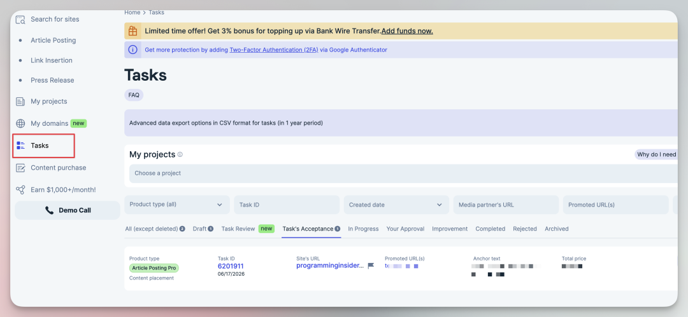

# Codex 协助出海 SEO：第一次购买客座文章的核验流程

去阅读**

** 设置星标 学习更多AI出海知识  **

继续给网站做 SEO 外链实验。

之前我对客座文章这种外链方式只停留在概念上，知道它大概是找一个相关网站，发布一篇带链接的文章，用来给目标页面增加相关性和权重。

现在属于新手实际操作一遍，这个过程中 codex 起到了很大的作用！

平台怎么用，筛选条件怎么设，哪些网站看起来指标好但不值得买，文章该怎么写，提交前有哪些必填内容...

Codex 很适合做这种平台的实操，替我把大量细节先梳理清楚，替我操作。

##  先用小预算熟悉平台

这次选的平台是 Adsy，一个可以买客座文章和内容发布的平台。这次只是想先用一笔小钱熟悉流程。

第一次进入这类平台，最容易被一堆指标绕晕。价格、DR、DA、Ahrefs Organic Traffic、Semrush Total
Traffic、国家、语言、分类、Dofollow。

Codex 先给了我筛选条件。针对自己的网站情况，我们先把语言限定为英文，把分类限定在 Software development 和
Technology，再给价格设一个上限。

目标很明确，先把范围缩小到和自己的网站更相关、预算还能接受的网站，不追求找到全平台最强的网站。

** 这一步里，人要做的是定边界。  **

比如我知道这次是给 AI 工具站做外链，不想买太泛娱乐、金融、生活方式的站。Codex 做的是把这些边界翻译成平台上的筛选条件，再帮我解释每个指标代表什么。

##  看指标，也看这个站像不像真的相关

筛出来以后还有几百个网站，这时候平台的推荐排序就不够用了。

Codex 帮我做了一轮人工筛选。它会看每个站的价格、流量、DR、DA、Dofollow，也会继续去 Google 搜这个站有没有 AI
tools、developer tools、software development 相关内容。

这个过程里，我学到一个很实用的判断方法。

** 一个站不能只看指标，还要看它平时发什么内容。如果一个站满屏都是 crypto、loan、casino、trading 这类高商业化内容，即使 DR
看起来很高，也要谨慎。  **

它可能更像一个卖链接的内容农场。

这一步里，人要判断业务价值。Codex 可以帮我把 900 多个候选缩成几个优先级，但最后为什么选一个站，还是要回到项目目标上。我们的网站是 AI
工具目录和工具决策站，不应该为了一个便宜链接去买完全不相关的网站。

##  文章不是随便写一篇就行

确定网站以后，下一步是准备 guest post。

这次我们的承接页是一篇关于免费 AI coding assistant 的文章，所以客座文章也围绕开发者如何选择免费 AI 编码助手来写。

Codex 帮我写了一篇英文文章，主题是从真实工作流出发，判断 AI coding assistant 是否适合自己。

我不想让这篇文章看起来像硬塞链接，所以锚文本没有写成很生硬的品牌词，而是用了 free AI coding assistants
comparison。它和承接页主题一致，也能自然出现在文章里。

文章写完后，Codex 又帮我检查了几个细节。

目标 URL 要和正文里的链接一致，锚文本要和平台字段一致，正文要满足平台要求的最低字数，Special requirements 要写清楚，希望发布在
technology、software development、AI tools 或 developer tools 相关栏目里。

** 这里我觉得 AI 的价值很明显。它不只是写文章，还会帮我做提交前检查。  **
很多新手第一次买客座文章时，大方向可能已经想清楚了，最后反而容易栽在这些小字段上。

URL 填首页还是承接页，锚文本有没有和正文一致，图片位置是不是放错了，浏览器翻译插件有没有把中文残留混进正文。

Adsy 客座文章下单前的内容与要求确认

我最后让 Codex 把提交页逐项复核了一遍。

Codex 对 Adsy 客座文章下单信息做提交前复核

这次文章还加了一张配图。图是为了让文章看起来更完整，也减少发布方随便配一张不相关图的概率。

配图这件事其实也有一套小流程。

先判断是否需要配图，再生成一张和文章主题一致的图，然后上传到图床，最后把图片地址插到文章里。

我们现在自己做 AI 出海产品，也在用 HiAPI 这类聚合 API 来处理图像生成和模型调用，所以这类流程后面完全可以串进内部内容生产里。

提交前我又让 Codex 检查了一次正文。最后它通过浏览器操作把源码里的正文清理了一遍，完全没问题了，才建议我去点 Buy。

##  人负责判断，AI 负责执行和检查

人和 AI 应该怎么分工。

人负责判断目标。为什么要买这条外链，预算是多少，能接受什么风险，什么类型的网站和我们的产品相关，自己心里要有一个判断。

AI
适合做陪跑。它可以帮我读平台、解释字段、设计筛选条件、初筛候选网站、检查内容相关性、写文章、生成配图、上传图床、复核提交字段，还能控制浏览器帮我把一些重复操作走完。

在这个过程中，AI 更像一个执行力很强的同事，会把平台里那些零碎、细节、容易漏的步骤整理出来，然后一项项过。

有 AI 辅助能降低上手成本，也能减少因为不熟平台而犯的低级错误。

最后，客座文章有没有效果，不能看提交完了就结束，而是要等文章发布后继续跟踪。后面还要记录发布 URL、是否 Dofollow、是否收录、目标页在 GSC
里的 impressions、clicks、average position 有没有变化。

提交成功后，钱会先进入 Reserved，不是立刻最终完成。

任务会出现在 Adsy 的 Tasks 里，这个页面后面就是验收入口，等文章发布后，还要从这里回来看发布 URL 和任务状态。

Adsy 购买成功后在 Tasks 页面查看任务状态

SEO 里很多动作都不是做完就结束。买一篇文章只是开始，后面还要继续看数据反馈。**

** 想了解更多可以加我  vx: 257735  聊。  **

[ 出海部署踩坑：Supabase 连接池被打满,迁 Pro 的正确姿势

[ 牛逼，Claude 5 真来了！

[ Codex 保姆级入门：从安装、权限到第一次让 AI 真正替你干活

[ 太牛逼，Codex 这波更新！可以放弃小龙虾和爱马仕了！

[ 想让 Claude Code 彻底完成一个任务，试试 /goal

[ Codex 这次跑进了 Chrome，AI 编码 Agent 的战场变了

[ Claude Code 装上这个插件，我不用再当中间人了

[ Mac mini 走起！手机随时随地AI编程，太爽了

[ Google Stitch 2.0 太牛了！UI 丑的问题有救了

[ 我们出海社区终于有自己的网站了！

** [ 从海外公司注册到 Stripe 收款，跑通了出海收付款全流程（实操分享）

**

预览时标签不可点

阅读

知道了

****

取消  允许

****

取消  允许

****

取消  允许

__
